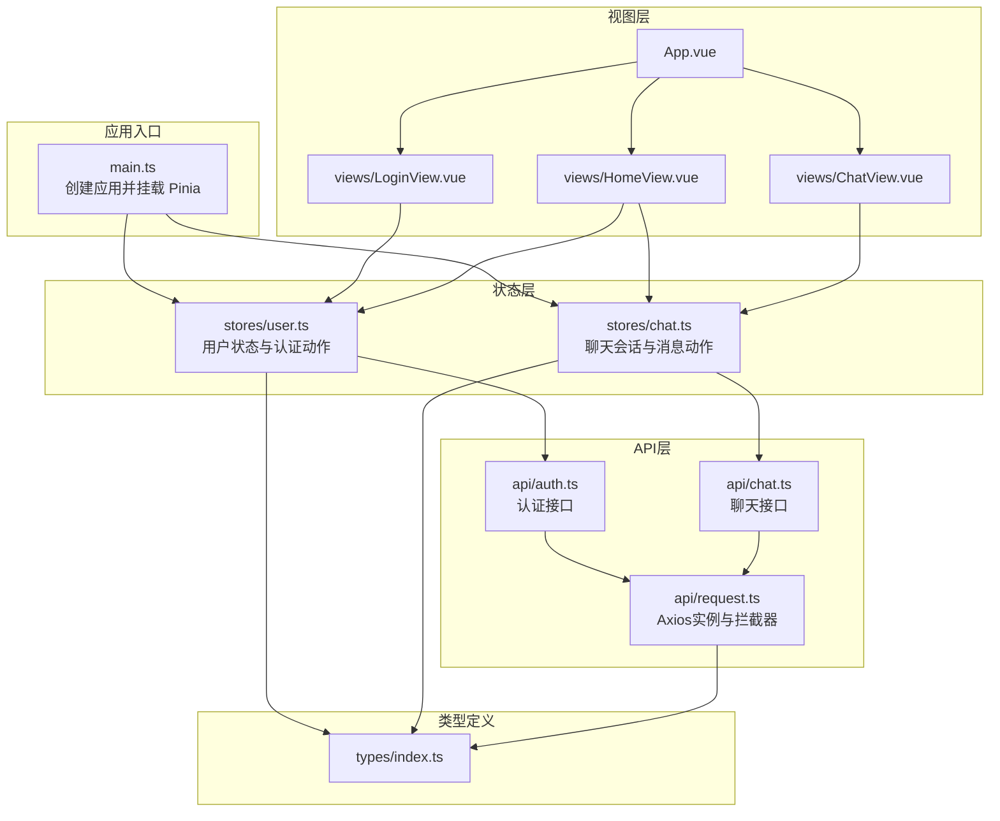
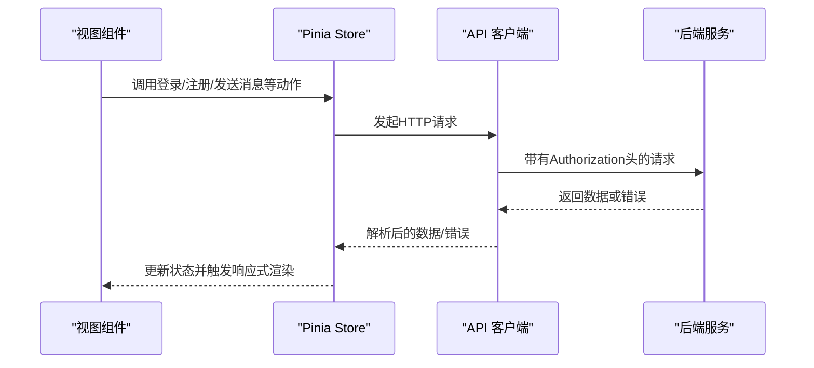
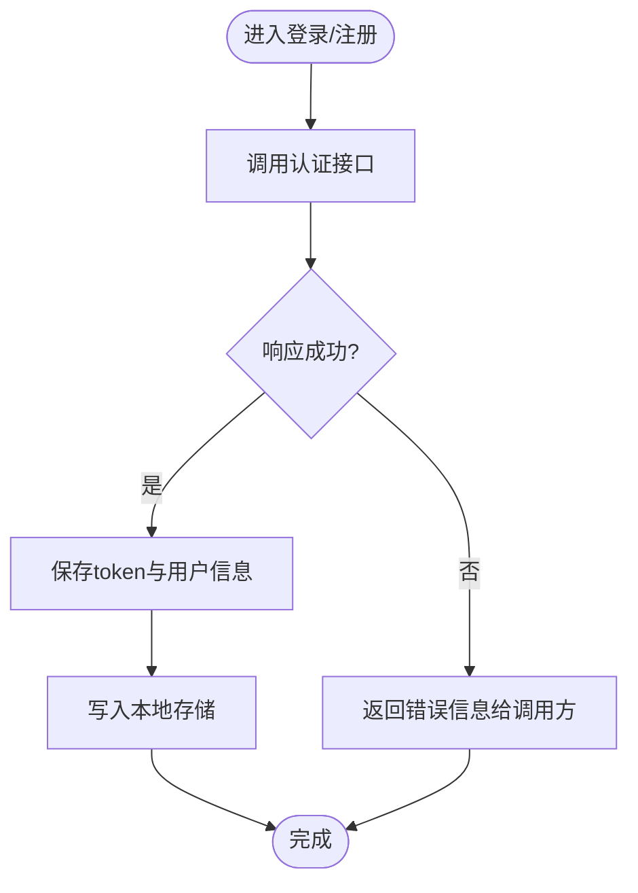
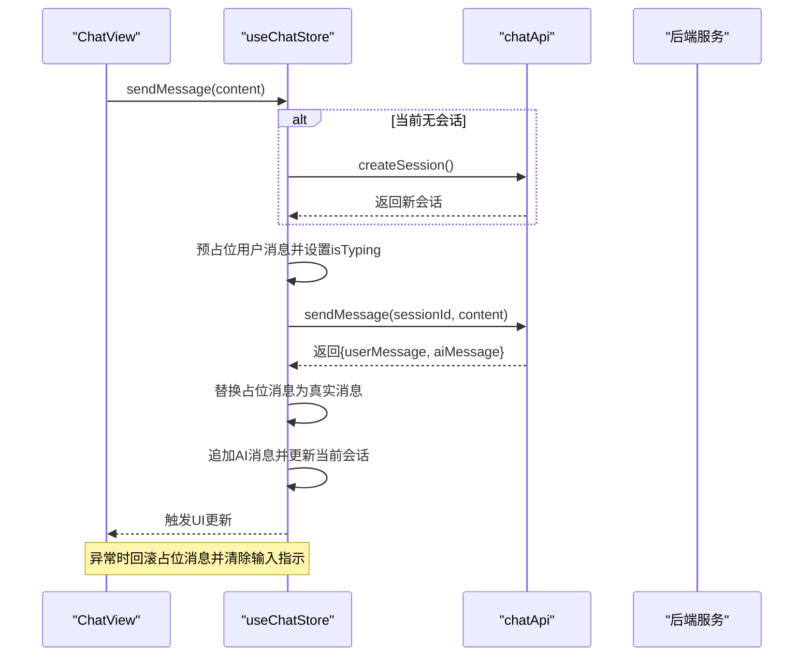
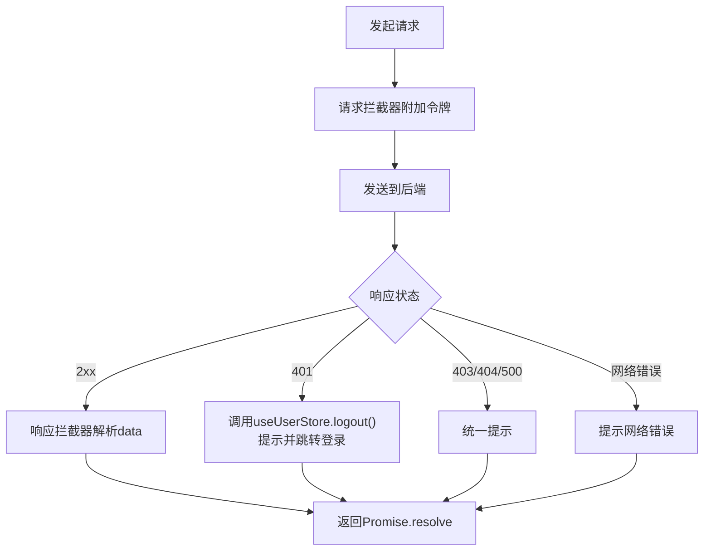
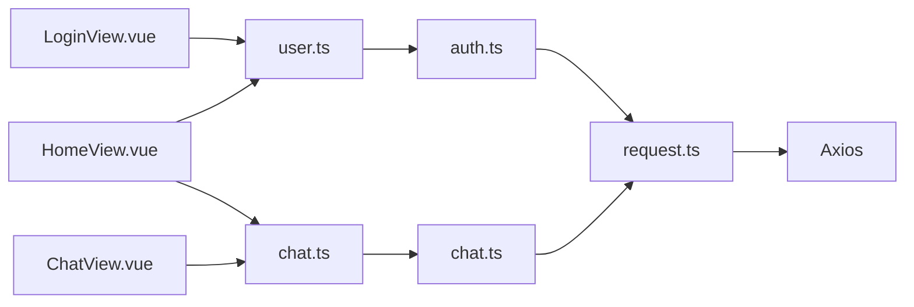

# 状态管理

<cite>
**本文引用的文件**
- [frontend/src/stores/user.ts](file://frontend/src/stores/user.ts)
- [frontend/src/stores/chat.ts](file://frontend/src/stores/chat.ts)
- [frontend/src/api/auth.ts](file://frontend/src/api/auth.ts)
- [frontend/src/api/chat.ts](file://frontend/src/api/chat.ts)
- [frontend/src/api/request.ts](file://frontend/src/api/request.ts)
- [frontend/src/main.ts](file://frontend/src/main.ts)
- [frontend/src/types/index.ts](file://frontend/src/types/index.ts)
- [frontend/src/views/LoginView.vue](file://frontend/src/views/LoginView.vue)
- [frontend/src/views/ChatView.vue](file://frontend/src/views/ChatView.vue)
- [frontend/src/views/HomeView.vue](file://frontend/src/views/HomeView.vue)
- [frontend/src/App.vue](file://frontend/src/App.vue)
</cite>

## 目录
1. [简介](#简介)
2. [项目结构](#项目结构)
3. [核心组件](#核心组件)
4. [架构总览](#架构总览)
5. [详细组件分析](#详细组件分析)
6. [依赖关系分析](#依赖关系分析)
7. [性能考量](#性能考量)
8. [故障排查指南](#故障排查指南)
9. [结论](#结论)
10. [附录](#附录)

## 简介
本文件围绕 MindMates 前端的状态管理进行系统性梳理，重点聚焦于 Pinia 在“用户”和“聊天”两大模块中的实际应用。文档从架构设计、数据流、处理逻辑、集成点、错误处理到最佳实践展开，帮助开发者理解如何在组件中通过 useStore() 注入状态并实现响应式更新，同时给出持久化策略、调试技巧与性能优化建议。

## 项目结构
前端采用 Vue 3 + Pinia 架构，状态集中在 stores 目录下，API 层通过独立模块封装，类型定义统一在 types 中，视图层通过组合式 API 使用 store 并驱动 UI 响应。

图表来源
- [frontend/src/main.ts](file://frontend/src/main.ts#L1-L23)
- [frontend/src/stores/user.ts](file://frontend/src/stores/user.ts#L1-L69)
- [frontend/src/stores/chat.ts](file://frontend/src/stores/chat.ts#L1-L140)
- [frontend/src/api/request.ts](file://frontend/src/api/request.ts#L1-L65)
- [frontend/src/api/auth.ts](file://frontend/src/api/auth.ts#L1-L25)
- [frontend/src/api/chat.ts](file://frontend/src/api/chat.ts#L1-L31)
- [frontend/src/types/index.ts](file://frontend/src/types/index.ts#L1-L67)
- [frontend/src/views/LoginView.vue](file://frontend/src/views/LoginView.vue#L1-L205)
- [frontend/src/views/HomeView.vue](file://frontend/src/views/HomeView.vue#L1-L378)
- [frontend/src/views/ChatView.vue](file://frontend/src/views/ChatView.vue#L1-L412)
- [frontend/src/App.vue](file://frontend/src/App.vue#L1-L18)

章节来源
- [frontend/src/main.ts](file://frontend/src/main.ts#L1-L23)

## 核心组件
- 用户状态模块（user）
  - 状态：用户对象、令牌、登录态、用户名计算属性
  - 动作：登录、注册、获取资料、登出
  - 计算属性：是否登录、用户名显示
  - 持久化：本地存储令牌；初始化时尝试拉取资料
- 聊天状态模块（chat）
  - 状态：会话列表、当前会话、消息列表、加载与输入指示
  - 动作：获取会话、创建会话、加载会话、发送消息、删除会话、清空当前会话
  - 计算属性：按更新时间排序的会话列表
  - 错误处理：加载/创建/发送/删除均包含 try/catch，并在异常时回滚或抛出
- API 客户端（request）
  - 统一封装 Axios 实例，设置基础配置与拦截器
  - 请求拦截：携带 Bearer 令牌
  - 响应拦截：集中处理 401、403、404、500 等错误码，统一提示与登出
- 类型定义（types）
  - 用户、会话、消息、认证响应等核心类型

章节来源
- [frontend/src/stores/user.ts](file://frontend/src/stores/user.ts#L1-L69)
- [frontend/src/stores/chat.ts](file://frontend/src/stores/chat.ts#L1-L140)
- [frontend/src/api/request.ts](file://frontend/src/api/request.ts#L1-L65)
- [frontend/src/types/index.ts](file://frontend/src/types/index.ts#L1-L67)

## 架构总览
Pinia Store 作为单一事实来源，视图层通过 useStore() 注入状态，API 层通过 request 封装与后端交互。认证拦截器确保每次请求携带令牌，响应拦截器统一处理鉴权失效与业务错误。

图表来源
- [frontend/src/views/LoginView.vue](file://frontend/src/views/LoginView.vue#L1-L205)
- [frontend/src/views/ChatView.vue](file://frontend/src/views/ChatView.vue#L1-L412)
- [frontend/src/stores/user.ts](file://frontend/src/stores/user.ts#L1-L69)
- [frontend/src/stores/chat.ts](file://frontend/src/stores/chat.ts#L1-L140)
- [frontend/src/api/request.ts](file://frontend/src/api/request.ts#L1-L65)

## 详细组件分析

### 用户状态模块（user）
- 设计要点
  - 使用 ref 存储用户与令牌，computed 表达登录态与用户名
  - 登录/注册成功后写入本地存储令牌，并同步到状态
  - 初始化时若存在令牌则拉取用户资料；失败时自动登出
- 关键动作
  - login(username, password)：调用认证接口，成功保存 token 与 user，并持久化
  - register(username, password, nickname?)：注册后同上
  - fetchProfile()：在有 token 时拉取用户资料；失败触发登出
  - logout()：清理用户与令牌，移除本地存储
- 计算属性
  - isLoggedIn：基于 token 是否存在
  - userName：优先显示昵称，否则用户名，否则默认值
- 与 API 的协作
  - 通过 authApi.login/register/getProfile 与后端交互
  - request 拦截器自动附加 Authorization 头
- 与视图的协作
  - LoginView 通过 useUserStore 调用 login 并跳转首页
  - HomeView 展示 userName 并提供登出入口
- 错误处理
  - login/register 捕获异常并返回 {success, message}，便于 UI 提示
  - fetchProfile 失败时调用 logout，避免不一致状态

图表来源
- [frontend/src/stores/user.ts](file://frontend/src/stores/user.ts#L1-L69)
- [frontend/src/api/auth.ts](file://frontend/src/api/auth.ts#L1-L25)
- [frontend/src/api/request.ts](file://frontend/src/api/request.ts#L1-L65)

章节来源
- [frontend/src/stores/user.ts](file://frontend/src/stores/user.ts#L1-L69)
- [frontend/src/api/auth.ts](file://frontend/src/api/auth.ts#L1-L25)
- [frontend/src/api/request.ts](file://frontend/src/api/request.ts#L1-L65)
- [frontend/src/views/LoginView.vue](file://frontend/src/views/LoginView.vue#L1-L205)
- [frontend/src/views/HomeView.vue](file://frontend/src/views/HomeView.vue#L1-L378)

### 聊天状态模块（chat）
- 设计要点
  - 使用 ref 维护会话、当前会话、消息列表、加载与输入指示
  - computed 对会话按 updatedAt 倒序排序
  - 发送消息采用“预占位+替换”的方式提升交互体验
- 关键动作
  - fetchSessions()：拉取会话列表
  - createSession()：创建新会话并置为当前会话
  - loadSession(sessionId)：并发加载会话与消息，finally 清理加载态
  - sendMessage(content)：预占位用户消息，显示“正在输入”，成功后替换占位并追加 AI 回复，失败回滚并隐藏输入指示
  - deleteSession(sessionId)：删除会话并清理当前会话与消息
  - clearCurrentSession()：清空当前会话与消息
- 与 API 的协作
  - 通过 chatApi.getSessions/getSession/createSession/deleteSession/getMessages/sendMessage 与后端交互
- 与视图的协作
  - HomeView 首屏加载会话列表，展示最近会话
  - ChatView 监听消息数量变化自动滚动，支持键盘快捷键发送，路由参数驱动会话加载
- 错误处理
  - 所有异步动作均 try/catch，失败时打印日志并抛出，由调用方决定 UI 提示
  - sendMessage 失败时移除临时占位消息，避免脏数据

图表来源
- [frontend/src/stores/chat.ts](file://frontend/src/stores/chat.ts#L1-L140)
- [frontend/src/api/chat.ts](file://frontend/src/api/chat.ts#L1-L31)
- [frontend/src/views/ChatView.vue](file://frontend/src/views/ChatView.vue#L1-L412)

章节来源
- [frontend/src/stores/chat.ts](file://frontend/src/stores/chat.ts#L1-L140)
- [frontend/src/api/chat.ts](file://frontend/src/api/chat.ts#L1-L31)
- [frontend/src/views/HomeView.vue](file://frontend/src/views/HomeView.vue#L1-L378)
- [frontend/src/views/ChatView.vue](file://frontend/src/views/ChatView.vue#L1-L412)

### API 客户端与拦截器
- Axios 实例
  - 基础 URL、超时、JSON 头
- 请求拦截器
  - 若用户已登录，自动在 Authorization 头添加 Bearer 令牌
- 响应拦截器
  - 成功：透传 data
  - 失败：
    - 401：触发用户登出、全局提示、跳转登录页
    - 403/404/500：统一提示
    - 其他：根据后端 message 或默认提示
  - 统一 reject 错误，便于调用方捕获

图表来源
- [frontend/src/api/request.ts](file://frontend/src/api/request.ts#L1-L65)
- [frontend/src/stores/user.ts](file://frontend/src/stores/user.ts#L1-L69)

章节来源
- [frontend/src/api/request.ts](file://frontend/src/api/request.ts#L1-L65)
- [frontend/src/stores/user.ts](file://frontend/src/stores/user.ts#L1-L69)

### 类型定义与模块划分
- 类型覆盖
  - 用户、登录/注册请求、认证响应、会话、消息、发送响应、通用响应体、危机资源
- 模块划分原则
  - user：围绕认证与用户资料，职责单一
  - chat：围绕会话与消息，职责单一
  - api：围绕 HTTP 接口，职责单一
  - request：围绕 Axios 配置与拦截器，职责单一
- 避免状态冗余
  - 会话列表与当前会话保持一致更新，消息列表与当前会话绑定
  - 令牌与用户信息同步，避免重复请求
- 响应式更新
  - 组件通过 useStore() 注入，直接读取 store 的 ref/computed，无需手动订阅

章节来源
- [frontend/src/types/index.ts](file://frontend/src/types/index.ts#L1-L67)
- [frontend/src/stores/user.ts](file://frontend/src/stores/user.ts#L1-L69)
- [frontend/src/stores/chat.ts](file://frontend/src/stores/chat.ts#L1-L140)

## 依赖关系分析
- 组件依赖
  - LoginView -> useUserStore -> authApi -> request
  - HomeView -> useUserStore + useChatStore
  - ChatView -> useChatStore -> chatApi -> request
- 状态依赖
  - chat 依赖 user 的 token（通过 request 拦截器）
  - user 依赖 localStorage（持久化 token）
- 可能的循环依赖
  - request 依赖 useUserStore 以读取 token，属于单向依赖，不会形成循环
- 外部依赖
  - Vue 3 + Pinia + Element Plus + Axios

图表来源
- [frontend/src/views/LoginView.vue](file://frontend/src/views/LoginView.vue#L1-L205)
- [frontend/src/views/HomeView.vue](file://frontend/src/views/HomeView.vue#L1-L378)
- [frontend/src/views/ChatView.vue](file://frontend/src/views/ChatView.vue#L1-L412)
- [frontend/src/stores/user.ts](file://frontend/src/stores/user.ts#L1-L69)
- [frontend/src/stores/chat.ts](file://frontend/src/stores/chat.ts#L1-L140)
- [frontend/src/api/auth.ts](file://frontend/src/api/auth.ts#L1-L25)
- [frontend/src/api/chat.ts](file://frontend/src/api/chat.ts#L1-L31)
- [frontend/src/api/request.ts](file://frontend/src/api/request.ts#L1-L65)

章节来源
- [frontend/src/views/LoginView.vue](file://frontend/src/views/LoginView.vue#L1-L205)
- [frontend/src/views/HomeView.vue](file://frontend/src/views/HomeView.vue#L1-L378)
- [frontend/src/views/ChatView.vue](file://frontend/src/views/ChatView.vue#L1-L412)
- [frontend/src/stores/user.ts](file://frontend/src/stores/user.ts#L1-L69)
- [frontend/src/stores/chat.ts](file://frontend/src/stores/chat.ts#L1-L140)
- [frontend/src/api/request.ts](file://frontend/src/api/request.ts#L1-L65)

## 性能考量
- 并发优化
  - loadSession 内部使用 Promise.all 并发拉取会话与消息，减少等待时间
- 交互体验
  - sendMessage 采用“预占位+替换”策略，配合 isTyping 提升即时反馈
- 渲染优化
  - computed 对会话列表排序，避免在模板中重复计算
- 网络与错误
  - request 设置超时，统一错误提示，减少重复错误弹窗
- 建议
  - 对高频读取的计算属性可考虑缓存结果（如按 sessionId 缓存消息列表）
  - 对长列表可考虑虚拟滚动（当前项目未实现，但具备扩展空间）

[本节为通用指导，无需列出章节来源]

## 故障排查指南
- 登录/注册失败
  - 检查返回的错误消息字段，确认后端返回结构与类型定义一致
  - 确认 request 拦截器是否正确附加 Authorization 头
- 401 未授权
  - 响应拦截器会触发登出并跳转登录页，检查 token 是否过期或被撤销
- 发送消息失败
  - 查看控制台错误日志；sendMessage 失败会回滚临时占位消息
- 会话加载失败
  - loadSession 已包含 try/catch 与 finally 清理加载态，确认 sessionId 是否有效
- 资料拉取失败
  - fetchProfile 失败会自动登出，避免出现半登录状态

章节来源
- [frontend/src/stores/user.ts](file://frontend/src/stores/user.ts#L1-L69)
- [frontend/src/stores/chat.ts](file://frontend/src/stores/chat.ts#L1-L140)
- [frontend/src/api/request.ts](file://frontend/src/api/request.ts#L1-L65)

## 结论
本项目通过 Pinia 将用户与聊天两大领域状态清晰拆分，配合统一的 API 客户端与拦截器，实现了简洁、可维护且具备良好用户体验的状态管理方案。登录态持久化、并发加载、占位消息替换等细节提升了交互质量；响应拦截器统一处理错误，降低了调用方的心智负担。建议在后续迭代中继续坚持“单一职责”原则，逐步引入更完善的调试与性能监控手段。

[本节为总结性内容，无需列出章节来源]

## 附录

### 在组件中使用 Pinia 的最佳实践
- 注入与使用
  - 在 setup 中通过 useUserStore/useChatStore 获取状态与动作
  - 直接读取 ref/computed，无需手动订阅
- 响应式更新
  - 仅在模板中直接使用 store 的响应式数据，避免在逻辑中手动 set
- 错误处理
  - 在动作内部捕获错误并返回可读信息，由视图层统一提示
- 数据一致性
  - 通过 actions 同步更新多个相关状态，避免跨组件分散更新导致的竞态
- 调试技巧
  - 使用浏览器 Vue DevTools 观察 store 状态变化
  - 在关键动作前后打点日志，定位异步流程问题
- 性能监控
  - 对高频动作增加节流/防抖
  - 对长列表使用懒加载或虚拟滚动（视需求而定）

[本节为通用指导，无需列出章节来源]