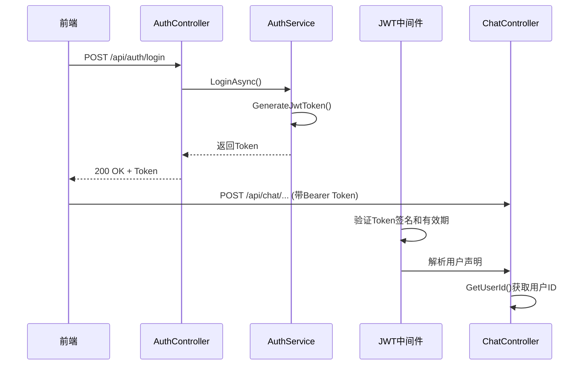
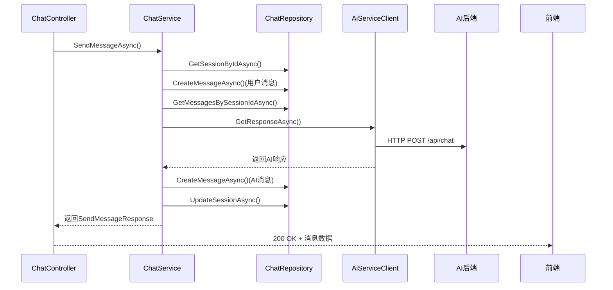
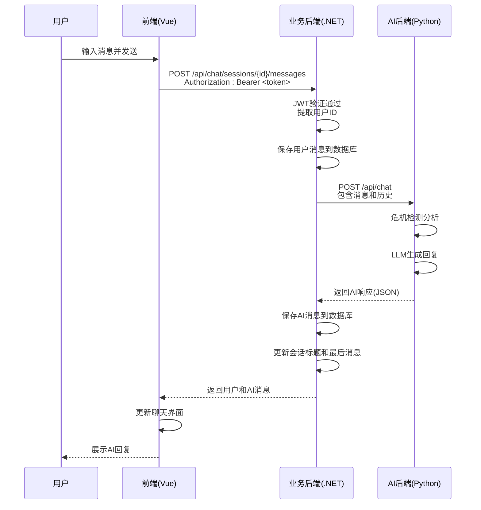

# 层间数据流

<cite>
**本文档引用的文件**  
- [chat.ts](file://frontend/src/api/chat.ts)
- [ChatController.cs](file://backend-business/MindMates.Api/Controllers/ChatController.cs)
- [ChatService.cs](file://backend-business/MindMates.Infrastructure/Services/ChatService.cs)
- [AiServiceClient.cs](file://backend-business/MindMates.Infrastructure/Services/AiServiceClient.cs)
- [IAiService.cs](file://backend-business/MindMates.Domain/Interfaces/IAiService.cs)
- [AuthController.cs](file://backend-business/MindMates.Api/Controllers/AuthController.cs)
- [AuthService.cs](file://backend-business/MindMates.Infrastructure/Services/AuthService.cs)
- [Program.cs](file://backend-business/MindMates.Api/Program.cs)
- [main.py](file://backend-ai/main.py)
- [chat_service.py](file://backend-ai/app/services/chat_service.py)
- [crisis_detector.py](file://backend-ai/app/crisis_detector.py)
- [llm.py](file://backend-ai/app/llm.py)
</cite>

## 目录
1. [引言](#引言)
2. [整体数据流概述](#整体数据流概述)
3. [前端请求发起](#前端请求发起)
4. [JWT身份验证机制](#jwt身份验证机制)
5. [业务后端处理流程](#业务后端处理流程)
6. [AI后端处理流程](#ai后端处理流程)
7. [端到端序列图](#端到端序列图)
8. [异常处理与降级机制](#异常处理与降级机制)
9. [调试与性能分析建议](#调试与性能分析建议)

## 引言
本文档旨在全面描述从用户操作到AI响应的完整层间数据流。以用户发送消息为例，详细说明数据如何在前端、业务后端和AI后端之间流动，重点阐述各层之间的交互机制、数据转换过程以及JWT身份验证的传递与验证。为全栈开发者提供端到端的数据追踪能力，便于系统调试与性能分析。

## 整体数据流概述
系统采用分层架构，数据流遵循以下路径：用户在前端界面输入消息 → 前端通过HTTP请求发送至业务后端 → 业务后端验证JWT令牌并处理业务逻辑 → 调用AI服务客户端向AI后端发起异步请求 → AI后端执行危机检测、调用LLM生成回复 → 结果逐层返回至前端展示。整个过程中，JWT令牌在HTTP请求头中传递，确保身份验证的一致性。

## 前端请求发起
当用户在聊天界面发送消息时，前端Vue应用通过`chat.ts`中的API函数发起HTTP POST请求。请求包含用户输入内容和会话ID，同时自动在请求头中添加JWT令牌。该请求目标为业务后端的`/api/chat/sessions/{sessionId}/messages`端点。

**Section sources**
- [chat.ts](file://frontend/src/api/chat.ts)

## JWT身份验证机制
系统采用JWT（JSON Web Token）进行身份验证。用户登录成功后，`AuthController`生成包含用户ID和用户名的JWT令牌。后续所有请求均需在Authorization头中携带该令牌。业务后端通过`Program.cs`配置的JWT中间件自动验证令牌有效性，并将用户身份信息注入请求上下文，供各控制器通过`User`对象访问。

**Diagram sources**
- [AuthController.cs](file://backend-business/MindMates.Api/Controllers/AuthController.cs#L20-L46)
- [AuthService.cs](file://backend-business/MindMates.Infrastructure/Services/AuthService.cs#L98-L120)
- [Program.cs](file://backend-business/MindMates.Api/Program.cs#L48-L63)

## 业务后端处理流程
`ChatController`接收到消息请求后，首先通过`GetUserId()`方法从JWT令牌中提取用户ID，确保用户有权访问指定会话。随后调用`ChatService`的`SendMessageAsync`方法处理业务逻辑：保存用户消息到数据库、获取聊天历史、调用AI服务、保存AI响应并更新会话元数据。

**Diagram sources**
- [ChatController.cs](file://backend-business/MindMates.Api/Controllers/ChatController.cs#L82-L95)
- [ChatService.cs](file://backend-business/MindMates.Infrastructure/Services/ChatService.cs#L70-L124)
- [ChatRepository.cs](file://backend-business/MindMates.Infrastructure/Repositories/ChatRepository.cs)

**Section sources**
- [ChatController.cs](file://backend-business/MindMates.Api/Controllers/ChatController.cs#L82-L95)
- [ChatService.cs](file://backend-business/MindMates.Infrastructure/Services/ChatService.cs#L70-L124)

## AI后端处理流程
AI后端的`main.py`暴露`/api/chat`端点，接收来自业务后端的请求。`chat_service.py`中的服务首先调用`crisis_detector.py`进行危机检测，判断用户是否处于心理危机状态。随后调用`llm.py`中的大语言模型生成回复内容。整个过程考虑聊天历史上下文，确保对话连贯性。处理结果以结构化JSON格式返回，包含回复内容、意图识别和危机状态标记。

**Section sources**
- [main.py](file://backend-ai/main.py)
- [chat_service.py](file://backend-ai/app/services/chat_service.py)
- [crisis_detector.py](file://backend-ai/app/crisis_detector.py)
- [llm.py](file://backend-ai/app/llm.py)

## 端到端序列图
以下序列图展示了从用户发送消息到收到AI响应的完整端到端数据流，包括各层之间的调用关系和数据传递。

**Diagram sources**
- [chat.ts](file://frontend/src/api/chat.ts)
- [ChatController.cs](file://backend-business/MindMates.Api/Controllers/ChatController.cs)
- [ChatService.cs](file://backend-business/MindMates.Infrastructure/Services/ChatService.cs)
- [AiServiceClient.cs](file://backend-business/MindMates.Infrastructure/Services/AiServiceClient.cs)
- [main.py](file://backend-ai/main.py)

## 异常处理与降级机制
系统在各层均实现了完善的异常处理机制。当AI服务不可用时，`AiServiceClient`提供降级响应，包含心理援助热线信息。数据库操作异常通过`KeyNotFoundException`等特定异常类型返回404状态码。JWT验证失败返回401状态码。所有异常均被记录，便于问题追踪和系统监控。

**Section sources**
- [AiServiceClient.cs](file://backend-business/MindMates.Infrastructure/Services/AiServiceClient.cs#L39-L47)
- [ChatService.cs](file://backend-business/MindMates.Infrastructure/Services/ChatService.cs#L28-L31)
- [ChatController.cs](file://backend-business/MindMates.Api/Controllers/ChatController.cs#L91-L94)

## 调试与性能分析建议
为便于调试，建议在各层关键节点添加日志记录，包括请求ID、处理时间和性能指标。使用Swagger UI可方便地测试API端点。对于性能分析，重点关注数据库查询优化、AI服务响应时间和JWT验证开销。建议实现分布式追踪，将同一请求在各服务间的处理过程关联起来，形成完整的调用链路视图。