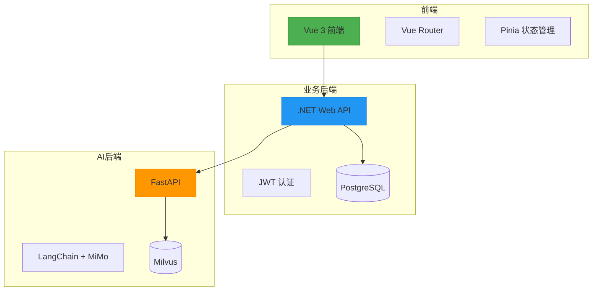

# 开发者入门指南

<cite>
**本文档中引用的文件**  
- [README.md](file://README.md)
- [frontend\package.json](file://frontend/package.json)
- [backend-business\MindMates.Api\appsettings.json](file://backend-business/MindMates.Api/appsettings.json)
- [backend-ai\.env.example](file://backend-ai/.env.example)
- [backend-ai\requirements.txt](file://backend-ai/requirements.txt)
- [start-frontend.bat](file://start-frontend.bat)
- [start-backend-business.bat](file://start-backend-business.bat)
- [start-backend-ai.bat](file://start-backend-ai.bat)
- [backend-business\MindMates.Api\Program.cs](file://backend-business/MindMates.Api/Program.cs)
- [backend-ai\main.py](file://backend-ai/main.py)
- [backend-business\MindMates.Infrastructure\Data\AppDbContext.cs](file://backend-business/MindMates.Infrastructure/Data/AppDbContext.cs)
</cite>

## 目录
1. [简介](#简介)
2. [环境准备](#环境准备)
3. [前端项目配置与运行](#前端项目配置与运行)
4. [业务后端配置与运行](#业务后端配置与运行)
5. [AI后端配置与运行](#ai后端配置与运行)
6. [数据库配置与迁移](#数据库配置与迁移)
7. [启动脚本说明](#启动脚本说明)
8. [常见问题与解决方案](#常见问题与解决方案)
9. [系统架构概览](#系统架构概览)
10. [附录](#附录)

## 简介

MindMates 是一个心理健康AI伴侣平台，采用混合架构设计，包含Vue 3前端、.NET 10业务后端和Python FastAPI AI后端。本指南旨在帮助新开发者在30分钟内完成本地开发环境的搭建并成功运行系统。

系统采用Clean Architecture分层设计，前端通过API与业务后端通信，业务后端再调用AI后端进行智能对话处理。所有服务通过Docker容器或本地脚本启动，支持跨平台开发。

**本文档来源**
- [README.md](file://README.md#L1-L185)

## 环境准备

### 必需软件安装

在开始之前，请确保已安装以下软件：

| 组件 | 版本要求 | 安装说明 |
|------|----------|----------|
| Node.js | 20+ | 从官网下载LTS版本，安装时勾选"自动安装必要工具" |
| .NET SDK | 10 | 下载.NET 10 SDK，安装后通过`dotnet --version`验证 |
| Python | 3.13+ | 安装时勾选"Add to PATH"，验证使用`python --version` |
| PostgreSQL | 17 | 建议使用Docker运行或安装PostgreSQL 17，记住用户名密码 |
| Redis | 7 (可选) | 用于缓存，开发环境可选 |

### 环境变量验证

安装完成后，打开命令行验证环境变量：

```bash
node --version
npm --version
dotnet --version
python --version
```

**本文档来源**
- [README.md](file://README.md#L15-L19)

## 前端项目配置与运行

### 依赖安装

前端项目位于`frontend/`目录，使用Vue 3 + TypeScript + Vite构建。

```bash
cd frontend
npm install
```

`package.json`文件中定义了项目依赖，包括Vue 3.5+、Pinia状态管理、Element Plus UI组件库和Tailwind CSS。

### 环境配置

创建`.env`文件，配置API地址：

```env
VITE_API_URL=http://localhost:5000
VITE_AI_API_URL=http://localhost:8000
```

这些配置使前端能够正确连接到本地运行的业务后端和AI后端服务。

### 运行前端

启动开发服务器：

```bash
npm run dev
```

前端服务将运行在`http://localhost:5173`，支持热重载。

**Section sources**
- [frontend\package.json](file://frontend/package.json#L1-L35)
- [README.md](file://README.md#L37-L39)

## 业务后端配置与运行

### 项目结构

业务后端位于`backend-business/`目录，采用Clean Architecture分层：
- `MindMates.Api`：API接口层
- `MindMates.Application`：应用服务层
- `MindMates.Domain`：领域模型层
- `MindMates.Infrastructure`：基础设施层

### 依赖安装

```bash
cd backend-business/MindMates.Api
dotnet restore
```

### 配置文件

`appsettings.json`包含数据库连接和JWT配置：

```json
{
  "ConnectionStrings": {
    "DefaultConnection": "Host=localhost;Port=5432;Database=mindmates;Username=postgres;Password=postgres"
  },
  "Jwt": {
    "Secret": "MindMates-Super-Secret-Key-For-JWT-Token-Generation-2024"
  },
  "AiService": {
    "Url": "http://localhost:8000"
  },
  "Kestrel": {
    "Endpoints": {
      "Http": {
        "Url": "http://localhost:5000"
      }
    }
  }
}
```

### 运行服务

```bash
dotnet run
```

服务将启动在`http://localhost:5000`，包含Swagger文档界面。

**Section sources**
- [backend-business\MindMates.Api\appsettings.json](file://backend-business/MindMates.Api/appsettings.json#L1-L28)
- [backend-business\MindMates.Api\Program.cs](file://backend-business/MindMates.Api/Program.cs#L1-L95)
- [README.md](file://README.md#L44-L46)

## AI后端配置与运行

### 虚拟环境创建

AI后端位于`backend-ai/`目录，使用Python虚拟环境隔离依赖：

```bash
cd backend-ai
python -m venv .venv
.venv\Scripts\activate
```

### 依赖安装

```bash
pip install -r requirements.txt
```

`requirements.txt`包含FastAPI、LangChain、MiMo集成等核心依赖。

### 环境配置

复制`.env.example`为`.env`，配置MiMo API：

```env
MIMO_API_KEY=your_mimo_api_key_here
MIMO_API_BASE=https://api.xiaomimimo.com/v1
DEBUG=true
LOG_LEVEL=INFO
```

### 运行服务

```bash
python -m uvicorn main:app --host 0.0.0.0 --port 8000 --reload
```

服务将启动在`http://localhost:8000`，提供AI对话接口。

**Section sources**
- [backend-ai\requirements.txt](file://backend-ai/requirements.txt#L1-L28)
- [backend-ai\.env.example](file://backend-ai/.env.example#L1-L14)
- [backend-ai\main.py](file://backend-ai/main.py#L1-L100)
- [README.md](file://README.md#L51-L55)

## 数据库配置与迁移

### PostgreSQL设置

确保PostgreSQL服务正在运行，连接字符串在`appsettings.json`中定义：

```
Host=localhost;Port=5432;Database=mindmates;Username=postgres;Password=postgres
```

### EF Core迁移

业务后端使用Entity Framework Core进行数据库迁移：

```bash
cd backend-business/MindMates.Api
dotnet ef migrations add InitialCreate
dotnet ef database update
```

`AppDbContext.cs`定义了用户、聊天会话和消息的实体关系：

```csharp
public class AppDbContext : DbContext
{
    public DbSet<User> Users => Set<User>();
    public DbSet<ChatSession> ChatSessions => Set<ChatSession>();
    public DbSet<ChatMessage> ChatMessages => Set<ChatMessage>();
}
```

数据模型包含级联删除配置，确保数据完整性。

**Section sources**
- [backend-business\MindMates.Infrastructure\Data\AppDbContext.cs](file://backend-business/MindMates.Infrastructure/Data/AppDbContext.cs#L1-L59)
- [backend-business\MindMates.Api\appsettings.json](file://backend-business/MindMates.Api/appsettings.json#L9-L11)

## 启动脚本说明

### 脚本执行顺序

为确保服务正常运行，建议按以下顺序启动：

1. **数据库服务**：确保PostgreSQL正在运行
2. **AI后端**：`start-backend-ai.bat`
3. **业务后端**：`start-backend-business.bat`
4. **前端**：`start-frontend.bat`

### 批处理脚本分析

#### 前端启动脚本

```bat
@echo off
cd frontend
call npm install
call npm run dev
```

**Section sources**
- [start-frontend.bat](file://start-frontend.bat#L1-L15)

#### 业务后端启动脚本

```bat
@echo off
cd backend-business\MindMates.Api
call dotnet restore
call dotnet run
```

**Section sources**
- [start-backend-business.bat](file://start-backend-business.bat#L1-L15)

#### AI后端启动脚本

```bat
@echo off
cd backend-ai
if not exist ".venv" (python -m venv .venv)
call .venv\Scripts\activate.bat
pip install -r requirements.txt
python -m uvicorn main:app --host 0.0.0.0 --port 8000 --reload
```

**Section sources**
- [start-backend-ai.bat](file://start-backend-ai.bat#L1-L24)

### 一键启动

```bash
.\start-all.bat
```

该脚本会依次调用三个服务的启动脚本。

## 常见问题与解决方案

### 端口冲突

**问题**：端口5000/5173/8000已被占用  
**解决方案**：
- 使用`netstat -ano | findstr :端口号`查找占用进程
- 在任务管理器中结束对应进程
- 或修改配置文件中的端口号

### 依赖缺失

**问题**：npm/dotnet/pip安装失败  
**解决方案**：
- 检查网络连接和代理设置
- 清理缓存后重试
- 前端：`npm cache clean --force`
- .NET：`dotnet nuget locals all --clear`
- Python：`pip cache purge`

### 环境变量未设置

**问题**：MiMo API密钥缺失  
**解决方案**：
- 确保`.env`文件存在且配置正确
- 检查文件路径是否正确
- 重启服务使环境变量生效

### 数据库连接失败

**问题**：无法连接PostgreSQL  
**解决方案**：
- 确认PostgreSQL服务正在运行
- 检查`appsettings.json`中的连接字符串
- 验证用户名密码是否正确
- 确保数据库"mindmates"已创建

### JWT认证错误

**问题**：API返回401未授权  
**解决方案**：
- 检查`appsettings.json`中的JWT密钥
- 确保前端发送正确的Authorization头
- 清除浏览器本地存储后重新登录

## 系统架构概览



**Diagram sources**
- [README.md](file://README.md#L5-L9)
- [backend-business\MindMates.Api\Program.cs](file://backend-business/MindMates.Api/Program.cs#L7-L94)

## 附录

### API端点参考

| 类别 | 端点 | 方法 | 描述 |
|------|------|------|------|
| 认证 | /api/auth/login | POST | 用户登录 |
| 认证 | /api/auth/register | POST | 用户注册 |
| 认证 | /api/auth/profile | GET | 获取用户信息 |
| 聊天 | /api/chat/sessions | GET | 获取会话列表 |
| 聊天 | /api/chat/sessions/{id}/messages | POST | 发送消息 |
| AI | /api/chat | POST | AI对话接口 |
| 健康 | /health | GET | 健康检查 |

### 技术栈详情

| 层级 | 技术 | 版本 |
|------|------|------|
| 前端框架 | Vue | 3.5+ |
| 状态管理 | Pinia | 2.3+ |
| UI组件 | Element Plus | 2.9+ |
| CSS框架 | Tailwind CSS | 3.4+ |
| 移动运行时 | Capacitor | 7.0+ |
| 业务后端 | .NET | 10 |
| ORM | Entity Framework Core | 10 |
| AI后端 | FastAPI | 0.115+ |
| LLM集成 | LangChain | 0.3+ |
| AI模型 | Xiaomi MiMo-V2-Flash | - |
| 数据库 | PostgreSQL | 17 |
| 向量数据库 | Milvus | 2.4+ |

### 心理健康提示

> 如果您正在经历严重的心理困扰，请及时寻求专业帮助。
> 
> **全国心理援助热线: 400-161-9995**

**Section sources**
- [README.md](file://README.md#L176-L181)