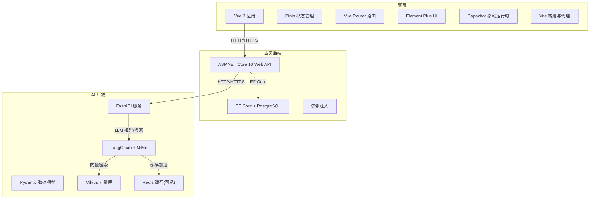
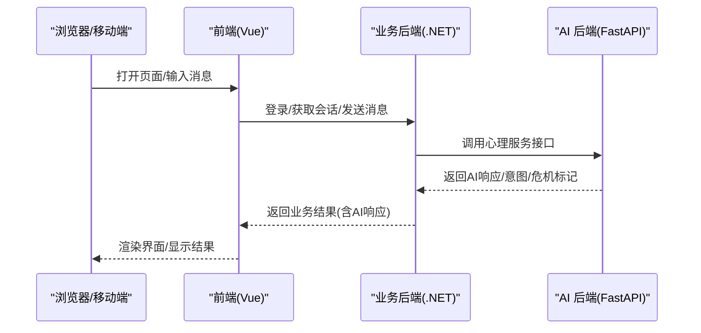
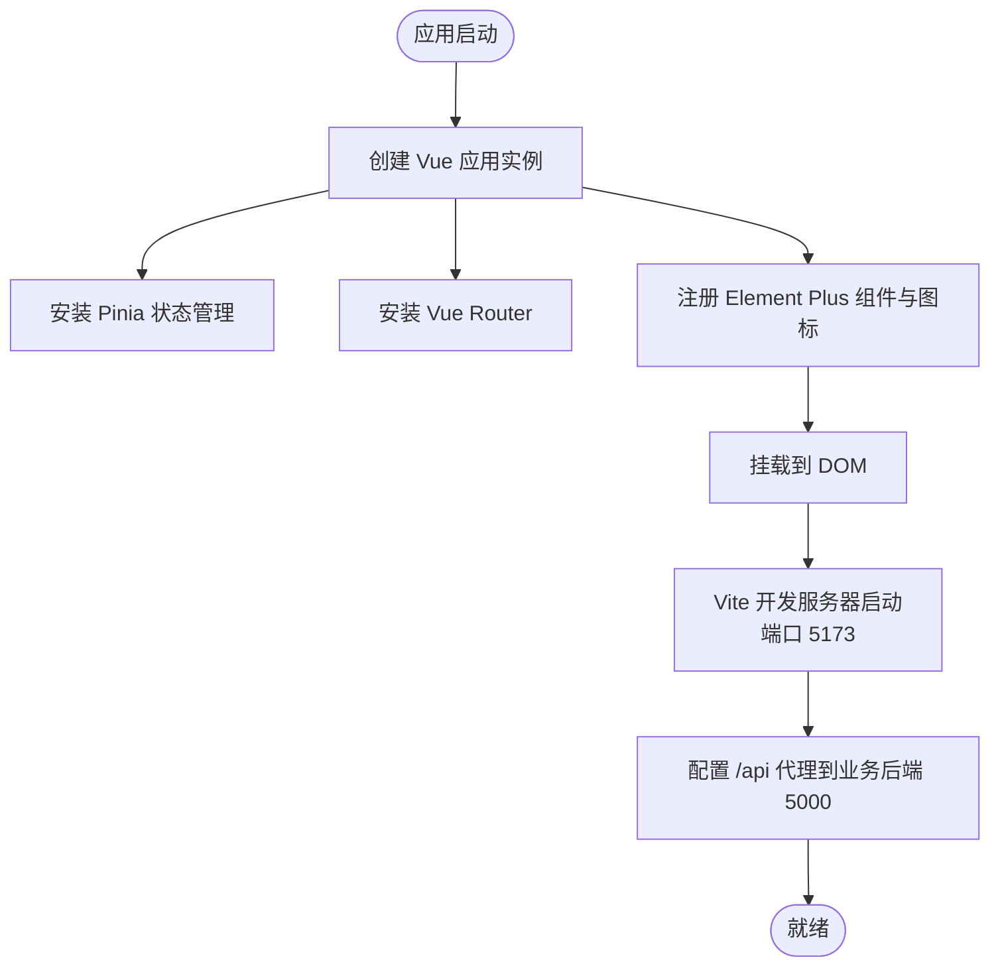
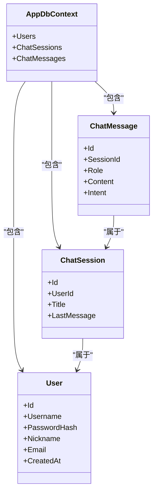
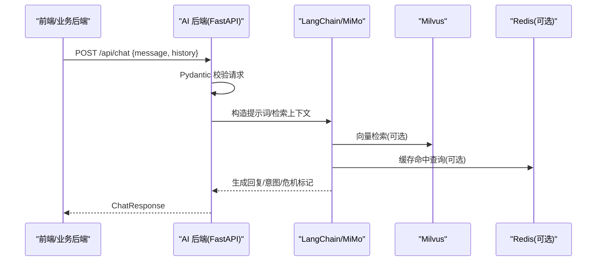
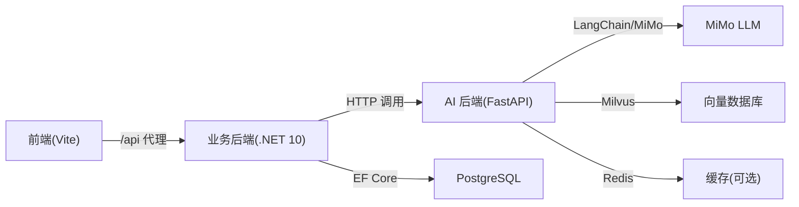

# 技术栈

<cite>
**本文引用的文件**
- [README.md](file://README.md)
- [frontend/package.json](file://frontend/package.json)
- [frontend/vite.config.ts](file://frontend/vite.config.ts)
- [frontend/src/main.ts](file://frontend/src/main.ts)
- [backend-business/MindMates.Api/MindMates.Api.csproj](file://backend-business/MindMates.Api/MindMates.Api.csproj)
- [backend-business/MindMates.Api/Program.cs](file://backend-business/MindMates.Api/Program.cs)
- [backend-business/MindMates.Api/appsettings.json](file://backend-business/MindMates.Api/appsettings.json)
- [backend-business/MindMates.Application/DTOs/AuthDtos.cs](file://backend-business/MindMates.Application/DTOs/AuthDtos.cs)
- [backend-business/MindMates.Infrastructure/DependencyInjection.cs](file://backend-business/MindMates.Infrastructure/DependencyInjection.cs)
- [backend-business/MindMates.Infrastructure/Data/AppDbContext.cs](file://backend-business/MindMates.Infrastructure/Data/AppDbContext.cs)
- [backend-ai/requirements.txt](file://backend-ai/requirements.txt)
- [backend-ai/main.py](file://backend-ai/main.py)
- [backend-ai/app/models.py](file://backend-ai/app/models.py)
- [backend-ai/.env.example](file://backend-ai/.env.example)
</cite>

## 目录
1. [引言](#引言)
2. [项目结构](#项目结构)
3. [核心组件](#核心组件)
4. [架构总览](#架构总览)
5. [详细组件分析](#详细组件分析)
6. [依赖关系分析](#依赖关系分析)
7. [性能考虑](#性能考虑)
8. [故障排查指南](#故障排查指南)
9. [结论](#结论)
10. [附录](#附录)

## 引言
本文件系统化梳理 MindMates 项目的三层技术栈：前端（Vue 3 + TypeScript + Vite + Pinia + Vue Router + Element Plus + Capacitor）、业务后端（ASP.NET Core 10 + EF Core + PostgreSQL）、AI 后端（FastAPI + Pydantic + LangChain + MiMo）。文档不仅给出各技术的版本信息与选择理由，还解释它们在系统中的角色、兼容性与协作方式，帮助开发者快速理解并搭建开发环境。

## 项目结构
项目采用分层清晰的混合架构：
- 前端：Vue 3 应用，使用 Vite 构建、TypeScript 类型约束、Pinia 状态管理、Vue Router 路由、Element Plus UI 组件库，并通过 Capacitor 支持移动端。
- 业务后端：.NET 10 Web API，采用 Clean Architecture 分层（Api/Application/Domain/Infrastructure），使用 EF Core 进行数据访问，PostgreSQL 作为持久化存储。
- AI 后端：Python FastAPI 服务，使用 Pydantic 进行数据校验，LangChain 集成 MiMo LLM，提供心理咨询服务与健康检查。

图表来源
- [frontend/vite.config.ts](file://frontend/vite.config.ts#L1-L37)
- [backend-business/MindMates.Api/Program.cs](file://backend-business/MindMates.Api/Program.cs#L1-L95)
- [backend-business/MindMates.Infrastructure/DependencyInjection.cs](file://backend-business/MindMates.Infrastructure/DependencyInjection.cs#L1-L34)
- [backend-business/MindMates.Infrastructure/Data/AppDbContext.cs](file://backend-business/MindMates.Infrastructure/Data/AppDbContext.cs#L1-L59)
- [backend-ai/main.py](file://backend-ai/main.py#L1-L100)
- [backend-ai/requirements.txt](file://backend-ai/requirements.txt#L1-L28)

章节来源
- [README.md](file://README.md#L58-L90)
- [frontend/package.json](file://frontend/package.json#L1-L35)
- [backend-business/MindMates.Api/MindMates.Api.csproj](file://backend-business/MindMates.Api/MindMates.Api.csproj#L1-L24)
- [backend-ai/requirements.txt](file://backend-ai/requirements.txt#L1-L28)

## 核心组件
- 前端技术栈
  - Vue 3：构建响应式用户界面，提供组件化开发体验。
  - TypeScript：静态类型约束，提升代码质量与可维护性。
  - Vite：快速构建工具与开发服务器，内置热更新与模块联邦能力。
  - Pinia：轻量状态管理，替代 Vuex，API 更简洁。
  - Vue Router：单页路由管理，支持嵌套路由与导航守卫。
  - Element Plus：桌面与移动端 UI 组件库，提供丰富的交互组件。
  - Capacitor：跨平台移动运行时，支持 iOS/Android 原生能力。
- 业务后端技术栈
  - ASP.NET Core 10：高性能 Web 框架，支持中间件管线、依赖注入与 Swagger 文档。
  - Entity Framework Core：对象关系映射，提供数据库迁移与查询能力。
  - PostgreSQL：企业级关系数据库，支持 JSONB、全文检索等特性。
- AI 后端技术栈
  - FastAPI：现代、高性能异步 Web 框架，自动生成 OpenAPI 文档。
  - Pydantic：数据验证与序列化，确保请求/响应结构一致。
  - LangChain：链式调用 LLM，支持检索增强生成（RAG）与多模态处理。
  - MiMo LLM：小米生态的推理模型，提供心理咨询服务。
  - Milvus：向量数据库，支撑 RAG 的语义检索。
  - Redis：可选缓存，加速重复查询与会话上下文。

章节来源
- [README.md](file://README.md#L159-L175)
- [frontend/package.json](file://frontend/package.json#L11-L33)
- [backend-business/MindMates.Api/MindMates.Api.csproj](file://backend-business/MindMates.Api/MindMates.Api.csproj#L1-L24)
- [backend-ai/requirements.txt](file://backend-ai/requirements.txt#L1-L28)

## 架构总览
MindMates 采用“前端 + 业务后端 + AI 后端”的三层架构：
- 前端通过 HTTP 请求与业务后端交互，业务后端再调用 AI 后端完成心理咨询服务。
- 业务后端负责用户认证、会话与消息持久化，AI 后端负责对话、意图识别与危机检测。
- 数据流从浏览器到业务后端再到 AI 后端，最终返回给前端展示。

图表来源
- [frontend/vite.config.ts](file://frontend/vite.config.ts#L27-L35)
- [backend-business/MindMates.Api/appsettings.json](file://backend-business/MindMates.Api/appsettings.json#L17-L26)
- [backend-ai/main.py](file://backend-ai/main.py#L48-L79)

## 详细组件分析

### 前端组件分析
- 应用入口与插件
  - 应用入口创建 Vue 实例，挂载 Pinia 与路由，注册 Element Plus 图标。
  - Vite 配置启用自动导入与组件解析，设置开发服务器端口与 API 代理。
- 状态管理与路由
  - Pinia 提供全局状态，Vue Router 管理页面导航。
- UI 组件库
  - Element Plus 提供统一的 UI 组件体系，结合自动导入减少样板代码。
- 移动端支持
  - Capacitor 提供跨平台能力，便于打包为 iOS/Android 应用。

图表来源
- [frontend/src/main.ts](file://frontend/src/main.ts#L1-L23)
- [frontend/vite.config.ts](file://frontend/vite.config.ts#L1-L37)

章节来源
- [frontend/src/main.ts](file://frontend/src/main.ts#L1-L23)
- [frontend/vite.config.ts](file://frontend/vite.config.ts#L1-L37)
- [frontend/package.json](file://frontend/package.json#L11-L33)

### 业务后端组件分析
- 项目与目标框架
  - 使用 .NET 10 SDK，启用预览语言版本，面向未来特性。
- 中间件与安全
  - 启用 Swagger/OpenAPI，添加 JWT Bearer 认证，配置 CORS 允许前端与业务后端域名。
- 数据访问与依赖注入
  - 使用 EF Core 连接 PostgreSQL，注册仓储与服务，注入 HttpClient 以调用 AI 后端。
- 数据模型
  - 定义用户、会话、消息实体，配置主键、唯一索引与外键关系。

图表来源
- [backend-business/MindMates.Infrastructure/Data/AppDbContext.cs](file://backend-business/MindMates.Infrastructure/Data/AppDbContext.cs#L1-L59)

章节来源
- [backend-business/MindMates.Api/MindMates.Api.csproj](file://backend-business/MindMates.Api/MindMates.Api.csproj#L1-L24)
- [backend-business/MindMates.Api/Program.cs](file://backend-business/MindMates.Api/Program.cs#L1-L95)
- [backend-business/MindMates.Infrastructure/DependencyInjection.cs](file://backend-business/MindMates.Infrastructure/DependencyInjection.cs#L1-L34)
- [backend-business/MindMates.Infrastructure/Data/AppDbContext.cs](file://backend-business/MindMates.Infrastructure/Data/AppDbContext.cs#L1-L59)
- [backend-business/MindMates.Application/DTOs/AuthDtos.cs](file://backend-business/MindMates.Application/DTOs/AuthDtos.cs#L1-L20)

### AI 后端组件分析
- 应用生命周期与中间件
  - 使用 lifespan 管理启动/关闭流程，按调试模式决定是否暴露文档路由。
  - 添加 CORS，允许前端与业务后端访问。
- 接口定义
  - 健康检查与心理对话接口，使用 Pydantic 模型进行请求/响应校验。
- 依赖与配置
  - 通过 requirements.txt 明确 FastAPI、Uvicorn、Pydantic、LangChain 生态、Milvus、Redis 等依赖。
  - .env.example 提供 MiMo API、向量库与 Redis 的配置示例。

图表来源
- [backend-ai/main.py](file://backend-ai/main.py#L1-L100)
- [backend-ai/app/models.py](file://backend-ai/app/models.py#L1-L28)
- [backend-ai/requirements.txt](file://backend-ai/requirements.txt#L1-L28)
- [backend-ai/.env.example](file://backend-ai/.env.example#L1-L14)

章节来源
- [backend-ai/main.py](file://backend-ai/main.py#L1-L100)
- [backend-ai/app/models.py](file://backend-ai/app/models.py#L1-L28)
- [backend-ai/requirements.txt](file://backend-ai/requirements.txt#L1-L28)
- [backend-ai/.env.example](file://backend-ai/.env.example#L1-L14)

## 依赖关系分析
- 前端到业务后端
  - Vite 代理将 /api 请求转发至业务后端 5000 端口，前端通过环境变量配置 API 地址。
- 业务后端到 AI 后端
  - 通过 HttpClient 调用 AI 后端 /api/chat 接口，AI 后端提供健康检查与心理对话服务。
- 数据层
  - 业务后端使用 EF Core 连接 PostgreSQL，定义用户、会话、消息实体及关系。
- AI 后端生态
  - FastAPI + Pydantic + LangChain + MiMo + Milvus + Redis，形成完整的心理服务链路。

图表来源
- [frontend/vite.config.ts](file://frontend/vite.config.ts#L27-L35)
- [backend-business/MindMates.Api/appsettings.json](file://backend-business/MindMates.Api/appsettings.json#L17-L26)
- [backend-business/MindMates.Infrastructure/DependencyInjection.cs](file://backend-business/MindMates.Infrastructure/DependencyInjection.cs#L1-L34)
- [backend-ai/requirements.txt](file://backend-ai/requirements.txt#L1-L28)

章节来源
- [frontend/vite.config.ts](file://frontend/vite.config.ts#L27-L35)
- [backend-business/MindMates.Api/appsettings.json](file://backend-business/MindMates.Api/appsettings.json#L17-L26)
- [backend-business/MindMates.Infrastructure/DependencyInjection.cs](file://backend-business/MindMates.Infrastructure/DependencyInjection.cs#L1-L34)
- [backend-ai/requirements.txt](file://backend-ai/requirements.txt#L1-L28)

## 性能考虑
- 前端
  - Vite 的快速冷启动与热更新提升开发效率；生产构建开启 Tree Shaking 与压缩，减少包体积。
  - Element Plus 按需引入与自动导入减少冗余代码。
- 业务后端
  - ASP.NET Core 10 的高性能 Kestrel 与中间件管线；EF Core 查询优化与连接池配置。
  - JWT 认证避免频繁数据库查询，提升鉴权性能。
- AI 后端
  - FastAPI 的异步模型与 Uvicorn 生产级 ASGI 服务器；LangChain 的链式调用与缓存可显著降低延迟。
  - Milvus 向量化检索与 Redis 缓存配合，缩短响应时间。

## 故障排查指南
- 前端无法访问后端 API
  - 检查 Vite 代理配置是否指向业务后端地址与端口。
  - 确认环境变量中 API 地址正确。
- 业务后端无法连接数据库
  - 检查连接字符串与 PostgreSQL 服务状态；确认 EF Core 迁移已执行。
- AI 后端服务异常
  - 查看健康检查端点；确认 MiMo API Key 与基础地址、Milvus 与 Redis 可连通。
- 跨域问题
  - 确认业务后端与 AI 后端的 CORS 配置允许前端与业务后端域名访问。

章节来源
- [frontend/vite.config.ts](file://frontend/vite.config.ts#L27-L35)
- [backend-business/MindMates.Api/appsettings.json](file://backend-business/MindMates.Api/appsettings.json#L9-L16)
- [backend-ai/main.py](file://backend-ai/main.py#L38-L45)

## 结论
MindMates 的技术栈围绕“响应式前端 + 清晰分层的业务后端 + 高性能 AI 后端”展开，三者职责明确、边界清晰。前端通过 Vite 与 Element Plus 快速交付体验；业务后端以 Clean Architecture 保证可维护性；AI 后端借助 FastAPI 与 LangChain 提供高质量心理服务。版本与依赖均已在各工程文件中明确，开发者可据此快速搭建与扩展。

## 附录
- 版本与兼容性要点
  - 前端：Vue 3、TypeScript、Vite、Pinia、Vue Router、Element Plus、Capacitor。
  - 业务后端：.NET 10、EF Core、PostgreSQL。
  - AI 后端：FastAPI、Pydantic、LangChain、MiMo、Milvus、Redis。
- 启动与配置
  - 前端：Vite 开发服务器端口 5173，代理 /api 到业务后端 5000。
  - 业务后端：Kestrel 监听 5000，Swagger 文档可用，JWT 配置于 appsettings。
  - AI 后端：FastAPI 监听 8000，健康检查 /health，调试模式下开放文档路由。

章节来源
- [README.md](file://README.md#L15-L20)
- [README.md](file://README.md#L35-L57)
- [README.md](file://README.md#L91-L118)
- [frontend/vite.config.ts](file://frontend/vite.config.ts#L27-L35)
- [backend-business/MindMates.Api/appsettings.json](file://backend-business/MindMates.Api/appsettings.json#L17-L26)
- [backend-ai/main.py](file://backend-ai/main.py#L48-L52)