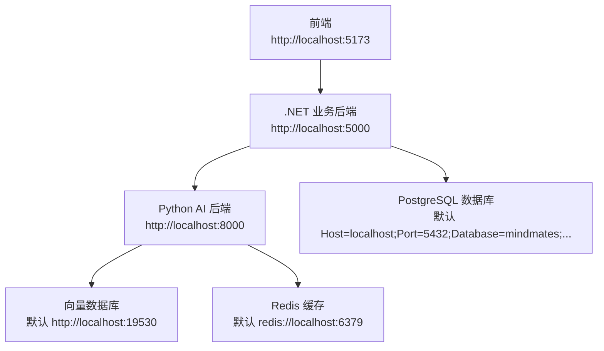
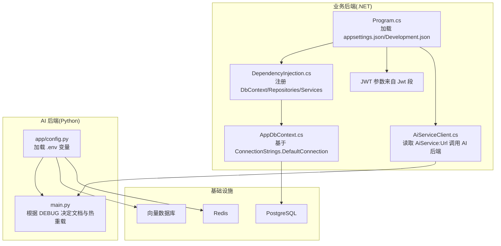
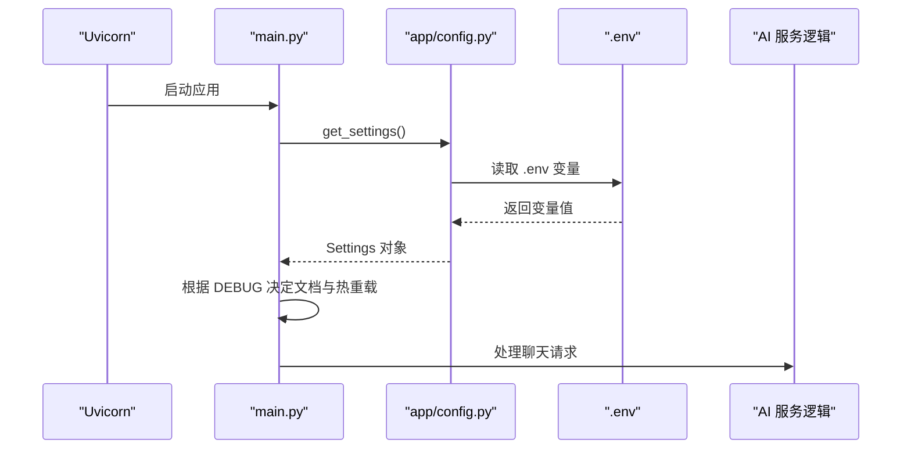
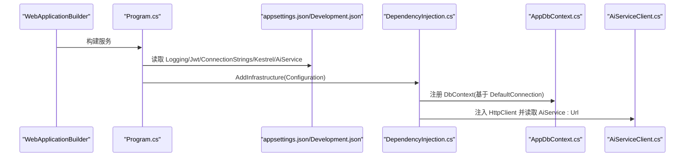
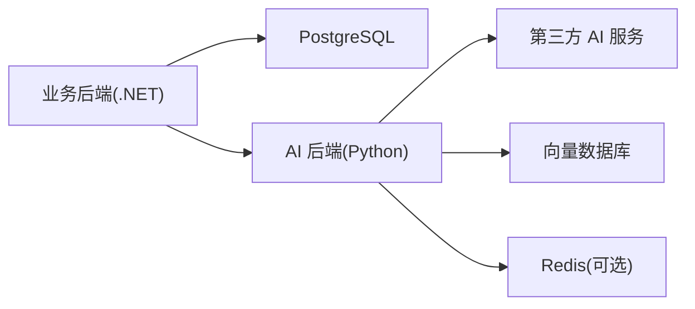

# 环境配置

<cite>
**本文引用的文件**
- [backend-ai/.env.example](file://backend-ai/.env.example)
- [backend-ai/app/config.py](file://backend-ai/app/config.py)
- [backend-ai/main.py](file://backend-ai/main.py)
- [backend-business/MindMates.Api/appsettings.json](file://backend-business/MindMates.Api/appsettings.json)
- [backend-business/MindMates.Api/appsettings.Development.json](file://backend-business/MindMates.Api/appsettings.Development.json)
- [backend-business/MindMates.Api/Program.cs](file://backend-business/MindMates.Api/Program.cs)
- [backend-business/MindMates.Infrastructure/DependencyInjection.cs](file://backend-business/MindMates.Infrastructure/DependencyInjection.cs)
- [backend-business/MindMates.Infrastructure/Data/AppDbContext.cs](file://backend-business/MindMates.Infrastructure/Data/AppDbContext.cs)
- [backend-business/MindMates.Infrastructure/Services/AiServiceClient.cs](file://backend-business/MindMates.Infrastructure/Services/AiServiceClient.cs)
- [start-all.bat](file://start-all.bat)
- [start-backend-ai.bat](file://start-backend-ai.bat)
- [start-backend-business.bat](file://start-backend-business.bat)
</cite>

## 目录
1. [简介](#简介)
2. [项目结构与环境概览](#项目结构与环境概览)
3. [核心组件与配置要点](#核心组件与配置要点)
4. [架构总览](#架构总览)
5. [详细组件分析](#详细组件分析)
6. [依赖关系分析](#依赖关系分析)
7. [性能与可用性考虑](#性能与可用性考虑)
8. [故障排查指南](#故障排查指南)
9. [结论](#结论)
10. [附录：环境差异与最佳实践](#附录环境差异与最佳实践)

## 简介
本文件旨在为开发者提供一套完整且可操作的环境配置指南，覆盖开发、测试与生产三类环境。内容聚焦以下方面：
- backend-ai/.env.example 中 AI 服务所需的关键变量及其作用，并说明如何创建实际的 .env 文件。
- backend-business 的 appsettings.json 与 appsettings.Development.json 配置结构，包括数据库连接字符串、JWT 认证参数与日志级别设置。
- 不同环境下的配置差异与切换策略。
- 敏感信息的安全存储建议（如使用密钥管理服务），帮助避免因配置错误导致的服务启动失败或安全漏洞。

## 项目结构与环境概览
MindMates 采用前后端分离架构：
- 前端：位于 frontend/，通过本地开发服务器运行于 http://localhost:5173。
- 业务后端（.NET）：位于 backend-business/MindMates.Api，监听 http://localhost:5000。
- AI 后端（Python/FastAPI）：位于 backend-ai，监听 http://localhost:8000。

启动脚本提供了统一入口，便于一次性启动所有服务。

图表来源
- [start-all.bat](file://start-all.bat#L1-L27)
- [backend-business/MindMates.Api/appsettings.json](file://backend-business/MindMates.Api/appsettings.json#L1-L28)
- [backend-ai/main.py](file://backend-ai/main.py#L80-L100)
- [backend-ai/app/config.py](file://backend-ai/app/config.py#L1-L30)

章节来源
- [start-all.bat](file://start-all.bat#L1-L27)
- [start-backend-ai.bat](file://start-backend-ai.bat#L1-L24)
- [start-backend-business.bat](file://start-backend-business.bat#L1-L15)

## 核心组件与配置要点
本节从“变量/配置项—作用—环境差异”的角度梳理关键要素。

- backend-ai 环境变量（.env）
  - 关键变量
    - MIMO_API_KEY：用于访问第三方 AI 服务的密钥。
    - MIMO_API_BASE：第三方 AI 服务的基础地址。
    - VECTOR_DB_URI：向量数据库连接地址。
    - REDIS_URL：可选的 Redis 连接地址。
    - DEBUG：控制调试模式与文档开关。
    - LOG_LEVEL：日志级别。
  - 作用
    - 为 AI 服务提供外部接口凭证与基础设施连接信息。
    - 控制 FastAPI 应用在调试模式下的行为（如禁用文档）。
  - 如何创建 .env
    - 复制 .env.example 并填入真实值；确保 DEBUG 与 LOG_LEVEL 符合当前环境需求。
    - 若使用本地向量数据库与 Redis，请确认对应服务已启动并可达。

- backend-business 配置（appsettings.json 与 appsettings.Development.json）
  - 关键配置段
    - Logging：日志级别，包含默认与特定命名空间的日志等级。
    - AllowedHosts：允许的主机头，生产环境建议更严格。
    - ConnectionStrings.DefaultConnection：数据库连接字符串（PostgreSQL）。
    - Jwt：JWT 密钥、签发者与受众。
    - AiService.Url：指向 AI 后端的地址。
    - Kestrel.Endpoints.Http.Url：业务后端监听地址。
  - 作用
    - 定义 .NET 应用的日志策略、认证参数、数据库连接与对外暴露的端口。
    - 作为业务后端与 AI 后端之间的调用目标地址。
  - 开发与生产差异
    - appsettings.Development.json 会覆盖默认日志级别，便于开发调试。
    - 生产环境应收紧 AllowedHosts、替换默认 JWT 密钥与数据库凭据，并调整日志级别。

章节来源
- [backend-ai/.env.example](file://backend-ai/.env.example#L1-L14)
- [backend-ai/app/config.py](file://backend-ai/app/config.py#L1-L30)
- [backend-ai/main.py](file://backend-ai/main.py#L28-L45)
- [backend-business/MindMates.Api/appsettings.json](file://backend-business/MindMates.Api/appsettings.json#L1-L28)
- [backend-business/MindMates.Api/appsettings.Development.json](file://backend-business/MindMates.Api/appsettings.Development.json#L1-L10)

## 架构总览
下图展示了各组件间的关系与数据流，重点标注了配置如何影响运行时行为。

图表来源
- [backend-business/MindMates.Api/Program.cs](file://backend-business/MindMates.Api/Program.cs#L1-L95)
- [backend-business/MindMates.Infrastructure/DependencyInjection.cs](file://backend-business/MindMates.Infrastructure/DependencyInjection.cs#L1-L34)
- [backend-business/MindMates.Infrastructure/Data/AppDbContext.cs](file://backend-business/MindMates.Infrastructure/Data/AppDbContext.cs#L1-L59)
- [backend-business/MindMates.Infrastructure/Services/AiServiceClient.cs](file://backend-business/MindMates.Infrastructure/Services/AiServiceClient.cs#L1-L52)
- [backend-ai/app/config.py](file://backend-ai/app/config.py#L1-L30)
- [backend-ai/main.py](file://backend-ai/main.py#L28-L45)

## 详细组件分析

### backend-ai 环境变量与应用加载
- 加载机制
  - 通过 Pydantic Settings 从 .env 文件加载变量，默认文件名为 .env。
  - 在调试模式下，FastAPI 文档端点启用；否则禁用。
- 关键变量与用途
  - MIMO_*：第三方 AI 服务凭证与基础地址。
  - VECTOR_DB_URI：向量数据库连接。
  - REDIS_URL：可选缓存。
  - DEBUG/LOG_LEVEL：控制调试与日志输出。
- 创建 .env 的步骤
  - 复制 .env.example 并填写真实值。
  - 确保与本地/远程服务可达性一致。
  - 生产环境务必关闭 DEBUG，避免暴露文档端点。

图表来源
- [backend-ai/app/config.py](file://backend-ai/app/config.py#L1-L30)
- [backend-ai/main.py](file://backend-ai/main.py#L14-L36)

章节来源
- [backend-ai/.env.example](file://backend-ai/.env.example#L1-L14)
- [backend-ai/app/config.py](file://backend-ai/app/config.py#L1-L30)
- [backend-ai/main.py](file://backend-ai/main.py#L28-L45)

### backend-business 配置与依赖注入
- 配置加载
  - Program.cs 读取 appsettings.json 与 appsettings.Development.json（开发环境自动生效）。
  - 日志、JWT、数据库连接字符串、Kestrel 端点均来自配置文件。
- 依赖注入
  - 使用 AddDbContext 基于 ConnectionStrings.DefaultConnection 注册数据库上下文。
  - 注册仓储与服务层接口实现。
  - 通过 AddHttpClient 注入 AiServiceClient，其读取 AiService:Url 作为上游 AI 服务地址。

图表来源
- [backend-business/MindMates.Api/Program.cs](file://backend-business/MindMates.Api/Program.cs#L1-L95)
- [backend-business/MindMates.Api/appsettings.json](file://backend-business/MindMates.Api/appsettings.json#L1-L28)
- [backend-business/MindMates.Api/appsettings.Development.json](file://backend-business/MindMates.Api/appsettings.Development.json#L1-L10)
- [backend-business/MindMates.Infrastructure/DependencyInjection.cs](file://backend-business/MindMates.Infrastructure/DependencyInjection.cs#L1-L34)
- [backend-business/MindMates.Infrastructure/Data/AppDbContext.cs](file://backend-business/MindMates.Infrastructure/Data/AppDbContext.cs#L1-L59)
- [backend-business/MindMates.Infrastructure/Services/AiServiceClient.cs](file://backend-business/MindMates.Infrastructure/Services/AiServiceClient.cs#L1-L52)

章节来源
- [backend-business/MindMates.Api/Program.cs](file://backend-business/MindMates.Api/Program.cs#L1-L95)
- [backend-business/MindMates.Api/appsettings.json](file://backend-business/MindMates.Api/appsettings.json#L1-L28)
- [backend-business/MindMates.Api/appsettings.Development.json](file://backend-business/MindMates.Api/appsettings.Development.json#L1-L10)
- [backend-business/MindMates.Infrastructure/DependencyInjection.cs](file://backend-business/MindMates.Infrastructure/DependencyInjection.cs#L1-L34)
- [backend-business/MindMates.Infrastructure/Data/AppDbContext.cs](file://backend-business/MindMates.Infrastructure/Data/AppDbContext.cs#L1-L59)
- [backend-business/MindMates.Infrastructure/Services/AiServiceClient.cs](file://backend-business/MindMates.Infrastructure/Services/AiServiceClient.cs#L1-L52)

### JWT 认证参数与安全注意事项
- 参数来源
  - Jwt:Secret、Jwt:Issuer、Jwt:Audience 来自 appsettings.json。
- 验证策略
  - Program.cs 中配置 JwtBearer，要求验证签发者、受众、过期时间与签名密钥。
- 安全建议
  - 生产环境必须使用强随机密钥，避免硬编码默认值。
  - 限制 AllowedHosts，避免跨站请求伪造风险。
  - 在 CI/CD 中通过密钥管理服务注入敏感配置，而非提交至版本库。

章节来源
- [backend-business/MindMates.Api/appsettings.json](file://backend-business/MindMates.Api/appsettings.json#L10-L16)
- [backend-business/MindMates.Api/Program.cs](file://backend-business/MindMates.Api/Program.cs#L48-L64)

### 数据库连接与实体模型
- 连接字符串
  - 默认连接字符串指向本地 PostgreSQL 实例，包含主机、端口、数据库名与凭据。
- 实体映射
  - 用户、会话、消息等实体定义了主键、索引与外键约束，确保数据一致性。
- 依赖注入
  - 通过 AddDbContext 注册 AppDbContext，供仓储层使用。

章节来源
- [backend-business/MindMates.Api/appsettings.json](file://backend-business/MindMates.Api/appsettings.json#L9-L11)
- [backend-business/MindMates.Infrastructure/DependencyInjection.cs](file://backend-business/MindMates.Infrastructure/DependencyInjection.cs#L14-L20)
- [backend-business/MindMates.Infrastructure/Data/AppDbContext.cs](file://backend-business/MindMates.Infrastructure/Data/AppDbContext.cs#L1-L59)

### AI 服务客户端与上游调用
- 地址来源
  - AiService:Url 来自 appsettings.json，作为 HttpClient 的基础地址。
- 调用流程
  - 将消息与历史记录封装为请求体，POST 到 AI 后端的 /api/chat。
  - 成功时解析响应，失败时返回降级提示。
- 网络连通性
  - 确保 AI 后端已在相同网络内可达（例如 Docker 网络或宿主机端口映射）。

章节来源
- [backend-business/MindMates.Infrastructure/Services/AiServiceClient.cs](file://backend-business/MindMates.Infrastructure/Services/AiServiceClient.cs#L1-L52)
- [backend-business/MindMates.Api/appsettings.json](file://backend-business/MindMates.Api/appsettings.json#L17-L19)
- [backend-ai/main.py](file://backend-ai/main.py#L54-L79)

## 依赖关系分析
- 组件耦合
  - .NET 业务后端对数据库与 AI 后端存在直接依赖；AI 后端对第三方服务与向量数据库存在直接依赖。
- 配置耦合
  - 业务后端的 AiService:Url 必须与 AI 后端监听地址一致。
  - JWT 参数需与前端/客户端约定一致。
- 外部依赖
  - PostgreSQL、向量数据库、Redis（可选）需在相应环境中可用。

图表来源
- [backend-business/MindMates.Api/appsettings.json](file://backend-business/MindMates.Api/appsettings.json#L9-L26)
- [backend-business/MindMates.Infrastructure/Services/AiServiceClient.cs](file://backend-business/MindMates.Infrastructure/Services/AiServiceClient.cs#L1-L52)
- [backend-ai/app/config.py](file://backend-ai/app/config.py#L1-L30)

章节来源
- [backend-business/MindMates.Api/appsettings.json](file://backend-business/MindMates.Api/appsettings.json#L1-L28)
- [backend-business/MindMates.Infrastructure/Services/AiServiceClient.cs](file://backend-business/MindMates.Infrastructure/Services/AiServiceClient.cs#L1-L52)
- [backend-ai/app/config.py](file://backend-ai/app/config.py#L1-L30)

## 性能与可用性考虑
- 日志级别
  - 开发环境可提高日志级别以便定位问题；生产环境建议降低到 Information 或更高，避免磁盘与性能压力。
- 端点与文档
  - DEBUG 为真时启用文档端点，生产环境应关闭以减少攻击面。
- 缓存与向量检索
  - 合理配置 Redis 与向量数据库连接，确保查询延迟可控。
- 健壮性
  - AI 服务不可用时的降级提示有助于提升用户体验与系统稳定性。

章节来源
- [backend-ai/main.py](file://backend-ai/main.py#L28-L45)
- [backend-business/MindMates.Api/appsettings.json](file://backend-business/MindMates.Api/appsettings.json#L1-L28)
- [backend-business/MindMates.Infrastructure/Services/AiServiceClient.cs](file://backend-business/MindMates.Infrastructure/Services/AiServiceClient.cs#L1-L52)

## 故障排查指南
- 启动失败
  - 检查 .env 是否存在且变量完整；确认 DEBUG 与 LOG_LEVEL 设置是否符合预期。
  - 检查 appsettings.json 与 appsettings.Development.json 是否存在语法错误。
- 数据库连接失败
  - 确认 ConnectionStrings.DefaultConnection 的主机、端口、数据库名与凭据正确。
  - 确认 PostgreSQL 已启动并允许来自容器/主机的连接。
- JWT 认证失败
  - 确认 Jwt:Secret、Jwt:Issuer、Jwt:Audience 与客户端一致。
  - 确认前端携带的 Bearer Token 来自受信任的签发方。
- AI 服务调用异常
  - 确认 AiService:Url 与 AI 后端监听地址一致。
  - 检查 AI 后端是否正常运行，网络连通性是否良好。
- CORS 问题
  - 确认业务后端允许的来源与前端地址一致；开发环境与生产环境的来源列表可能不同。

章节来源
- [backend-ai/.env.example](file://backend-ai/.env.example#L1-L14)
- [backend-ai/app/config.py](file://backend-ai/app/config.py#L1-L30)
- [backend-business/MindMates.Api/appsettings.json](file://backend-business/MindMates.Api/appsettings.json#L1-L28)
- [backend-business/MindMates.Api/Program.cs](file://backend-business/MindMates.Api/Program.cs#L48-L75)
- [backend-business/MindMates.Infrastructure/Services/AiServiceClient.cs](file://backend-business/MindMates.Infrastructure/Services/AiServiceClient.cs#L1-L52)

## 结论
- 正确的环境配置是系统稳定运行与安全合规的前提。
- 建议在开发、测试、生产三类环境中分别维护独立的配置文件与变量集，避免混用默认值。
- 敏感信息必须通过密钥管理服务注入，严禁提交至版本库。
- 通过合理的日志级别、CORS 策略与健康检查，可显著提升系统的可观测性与安全性。

## 附录：环境差异与最佳实践
- 环境差异对照
  - 开发环境
    - appsettings.Development.json 提高日志级别，便于调试。
    - DEBUG 为真时启用文档端点。
    - 允许的来源包含本地前端地址。
  - 测试/生产环境
    - 关闭文档端点，降低攻击面。
    - 使用强随机 JWT 密钥与严格的 AllowedHosts。
    - 将数据库凭据与第三方服务密钥替换为安全的凭据。
- 最佳实践
  - 使用密钥管理服务（如云厂商的密钥管理或本地密钥管理工具）注入敏感配置。
  - 通过环境变量或配置中心分发非敏感配置，避免硬编码。
  - 对外暴露的端点与文档仅在开发阶段启用，生产阶段严格限制。
  - 定期轮换 JWT 密钥与数据库凭据，建立审计与回滚机制。

章节来源
- [backend-business/MindMates.Api/appsettings.Development.json](file://backend-business/MindMates.Api/appsettings.Development.json#L1-L10)
- [backend-ai/main.py](file://backend-ai/main.py#L28-L45)
- [backend-business/MindMates.Api/Program.cs](file://backend-business/MindMates.Api/Program.cs#L66-L75)
- [backend-business/MindMates.Api/appsettings.json](file://backend-business/MindMates.Api/appsettings.json#L1-L28)