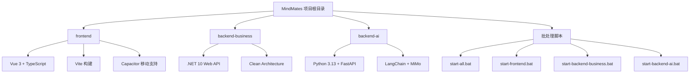
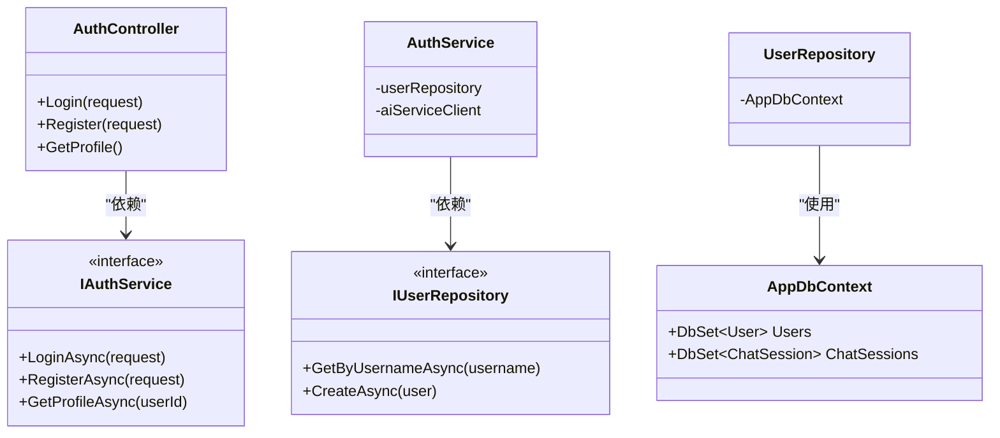
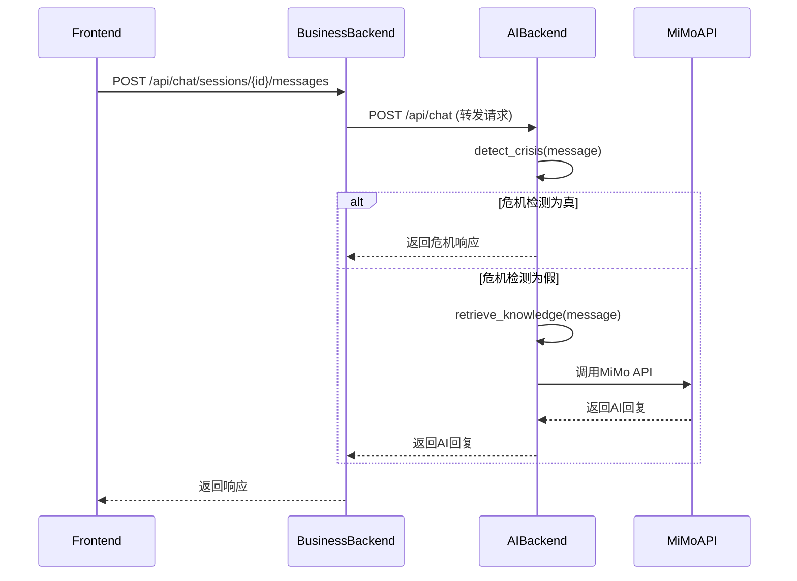

# 目录结构详解

<cite>
**本文档中引用的文件**  
- [README.md](file://README.md)
- [start-all.bat](file://start-all.bat)
- [start-frontend.bat](file://start-frontend.bat)
- [start-backend-business.bat](file://start-backend-business.bat)
- [start-backend-ai.bat](file://start-backend-ai.bat)
- [frontend\package.json](file://frontend/package.json)
- [frontend\src\views\HomeView.vue](file://frontend/src/views/HomeView.vue)
- [frontend\src\stores\user.ts](file://frontend/src/stores/user.ts)
- [frontend\src\api\auth.ts](file://frontend/src/api/auth.ts)
- [backend-business\MindMates.Api\Program.cs](file://backend-business/MindMates.Api/Program.cs)
- [backend-business\MindMates.Api\appsettings.json](file://backend-business/MindMates.Api/appsettings.json)
- [backend-business\MindMates.Api\Controllers\AuthController.cs](file://backend-business/MindMates.Api/Controllers/AuthController.cs)
- [backend-business\MindMates.Application\DTOs\AuthDtos.cs](file://backend-business/MindMates.Application/DTOs/AuthDtos.cs)
- [backend-business\MindMates.Domain\Entities\User.cs](file://backend-business/MindMates.Domain/Entities/User.cs)
- [backend-business\MindMates.Infrastructure\Data\AppDbContext.cs](file://backend-business/MindMates.Infrastructure/Data/AppDbContext.cs)
- [backend-business\MindMates.Infrastructure\Repositories\UserRepository.cs](file://backend-business/MindMates.Infrastructure/Repositories/UserRepository.cs)
- [backend-ai\main.py](file://backend-ai/main.py)
- [backend-ai\app\models.py](file://backend-ai/app/models.py)
- [backend-ai\app\services\chat_service.py](file://backend-ai/app/services/chat_service.py)
- [backend-ai\app\llm.py](file://backend-ai/app/llm.py)
- [backend-ai\app\crisis_detector.py](file://backend-ai/app/crisis_detector.py)
</cite>

## 目录结构详解

MindMates 项目采用清晰的三层架构设计，分为前端（frontend）、业务后端（backend-business）和AI后端（backend-ai），每个部分职责分明，便于维护和扩展。项目根目录还包含多个批处理脚本，用于快速启动整个系统或各个子系统。

**Diagram sources**
- [README.md](file://README.md)

## 前端结构分析

前端项目位于 `frontend/` 目录下，采用 Vue 3 + TypeScript + Vite 技术栈，结合 Capacitor 实现跨平台移动应用支持。其内部结构遵循现代前端最佳实践，模块化程度高。

`src/` 目录是前端源码的核心，其组织逻辑如下：
- `api/`：封装与后端通信的 API 接口，统一管理所有网络请求。
- `router/`：定义应用的路由规则，实现页面导航。
- `stores/`：使用 Pinia 管理全局状态，如用户信息和聊天会话。
- `styles/`：存放全局 CSS 样式文件。
- `types/`：定义 TypeScript 类型接口。
- `views/`：包含所有页面级 Vue 组件，每个 `.vue` 文件对应一个应用视图。

例如，`HomeView.vue` 是应用的首页组件，负责展示欢迎信息、快捷入口和最近对话列表，是用户登录后的主界面。

**Section sources**
- [frontend\package.json](file://frontend/package.json)
- [frontend\src\views\HomeView.vue](file://frontend/src/views/HomeView.vue)
- [frontend\src\stores\user.ts](file://frontend/src/stores/user.ts)
- [frontend\src\api\auth.ts](file://frontend/src/api/auth.ts)

## 业务后端结构分析

业务后端位于 `backend-business/` 目录下，采用 .NET 10 Web API 和 Clean Architecture（整洁架构）设计模式。该架构将代码分为四个清晰的层次，实现了高内聚、低耦合。

### API 层 (MindMates.Api)
作为系统的入口，负责处理 HTTP 请求和响应。`Program.cs` 配置了 Web 应用的基本服务，包括 JWT 认证、CORS 跨域策略和 Swagger 文档。`Controllers` 目录下的控制器（如 `AuthController.cs`）定义了具体的 API 端点。

### 应用层 (MindMates.Application)
定义业务逻辑的接口和数据传输对象（DTO）。`DTOs` 目录中的 `AuthDtos.cs` 文件定义了认证相关的请求和响应模型，如 `LoginRequest` 和 `AuthResponse`，实现了前后端的数据契约。

### 领域层 (MindMates.Domain)
包含核心业务实体和接口。`Entities` 目录下的 `User.cs` 定义了用户实体，是系统的核心数据模型。`Interfaces` 目录定义了仓储和AI服务的接口，确保高层模块不依赖于低层实现。

### 基础设施层 (MindMates.Infrastructure)
负责具体的技术实现，如数据库访问和外部服务调用。`Data` 目录中的 `AppDbContext.cs` 是 Entity Framework Core 的数据库上下文，管理与 PostgreSQL 的连接。`Repositories` 目录实现了领域层定义的接口，如 `UserRepository.cs` 提供了对用户数据的 CRUD 操作。

**Diagram sources**
- [backend-business\MindMates.Api\Controllers\AuthController.cs](file://backend-business/MindMates.Api/Controllers/AuthController.cs)
- [backend-business\MindMates.Application\Services\IAuthService.cs](file://backend-business/MindMates.Application/Services/IAuthService.cs)
- [backend-business\MindMates.Infrastructure\Repositories\UserRepository.cs](file://backend-business/MindMates.Infrastructure/Repositories/UserRepository.cs)
- [backend-business\MindMates.Infrastructure\Data\AppDbContext.cs](file://backend-business/MindMates.Infrastructure/Data/AppDbContext.cs)

**Section sources**
- [backend-business\MindMates.Api\Program.cs](file://backend-business/MindMates.Api/Program.cs)
- [backend-business\MindMates.Api\appsettings.json](file://backend-business/MindMates.Api/appsettings.json)
- [backend-business\MindMates.Api\Controllers\AuthController.cs](file://backend-business/MindMates.Api/Controllers/AuthController.cs)
- [backend-business\MindMates.Application\DTOs\AuthDtos.cs](file://backend-business/MindMates.Application/DTOs/AuthDtos.cs)
- [backend-business\MindMates.Domain\Entities\User.cs](file://backend-business/MindMates.Domain/Entities/User.cs)
- [backend-business\MindMates.Infrastructure\Data\AppDbContext.cs](file://backend-business/MindMates.Infrastructure/Data/AppDbContext.cs)
- [backend-business\MindMates.Infrastructure\Repositories\UserRepository.cs](file://backend-business/MindMates.Infrastructure/Repositories/UserRepository.cs)

## AI后端结构分析

AI后端位于 `backend-ai/` 目录下，采用 Python 3.13 + FastAPI 构建，专注于提供智能化的心理咨询服务。其结构以模块化方式组织，核心功能包括大语言模型集成、危机检测和检索增强生成（RAG）。

`app/` 目录是AI服务的核心：
- `main.py`：FastAPI 应用的入口文件，定义了 `/api/chat` 等核心端点。
- `models.py`：使用 Pydantic 定义 API 的请求和响应数据模型，如 `ChatRequest` 和 `ChatResponse`。
- `services/chat_service.py`：聊天服务的主逻辑，协调 LLM 和危机检测模块。
- `llm.py`：集成小米 MiMo 大语言模型，负责生成心理咨询回复。
- `crisis_detector.py`：危机检测模块，通过关键词和正则表达式识别用户的自杀或自残倾向，并触发紧急响应。
- `rag.py`：实现检索增强生成，为 LLM 提供专业的心理学知识支持。

该后端通过 `requirements.txt` 管理依赖，并通过 `.env` 文件配置 API 密钥等敏感信息。

**Diagram sources**
- [backend-ai\main.py](file://backend-ai/main.py)
- [backend-ai\app\services\chat_service.py](file://backend-ai/app/services/chat_service.py)
- [backend-ai\app\crisis_detector.py](file://backend-ai/app/crisis_detector.py)
- [backend-ai\app\llm.py](file://backend-ai/app/llm.py)

**Section sources**
- [backend-ai\main.py](file://backend-ai/main.py)
- [backend-ai\app\models.py](file://backend-ai/app/models.py)
- [backend-ai\app\services\chat_service.py](file://backend-ai/app/services/chat_service.py)
- [backend-ai\app\llm.py](file://backend-ai/app/llm.py)
- [backend-ai\app\crisis_detector.py](file://backend-ai/app/crisis_detector.py)

## 批处理脚本分析

项目根目录下的批处理脚本是开发和部署的便捷入口，简化了服务的启动流程。

- `start-all.bat`：一键启动所有服务。它会分别调用前端、业务后端和AI后端的启动脚本，并在独立的命令行窗口中运行，方便开发者监控日志。脚本还设置了服务的访问地址（前端:5173, 业务后端:5000, AI后端:8000）。

- `start-frontend.bat`：进入 `frontend` 目录并执行 `npm run dev`，启动 Vue 开发服务器。

- `start-backend-business.bat`：进入 `backend-business/MindMates.Api` 目录并执行 `dotnet run`，启动 .NET Web API。

- `start-backend-ai.bat`：进入 `backend-ai` 目录，激活 Python 虚拟环境，安装依赖，并通过 `fastapi dev main.py` 启动 FastAPI 服务。

这些脚本极大地降低了新开发者搭建环境的复杂度，确保了开发环境的一致性。

**Section sources**
- [start-all.bat](file://start-all.bat)
- [start-frontend.bat](file://start-frontend.bat)
- [start-backend-business.bat](file://start-backend-business.bat)
- [start-backend-ai.bat](file://start-backend-ai.bat)