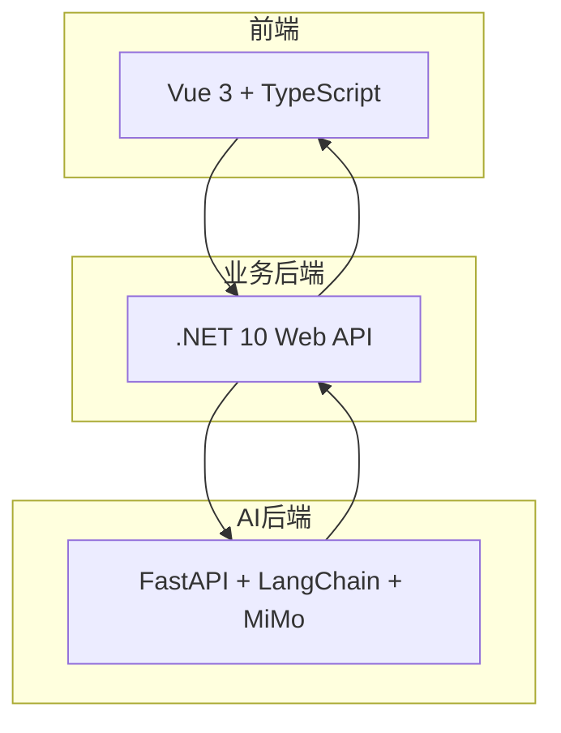
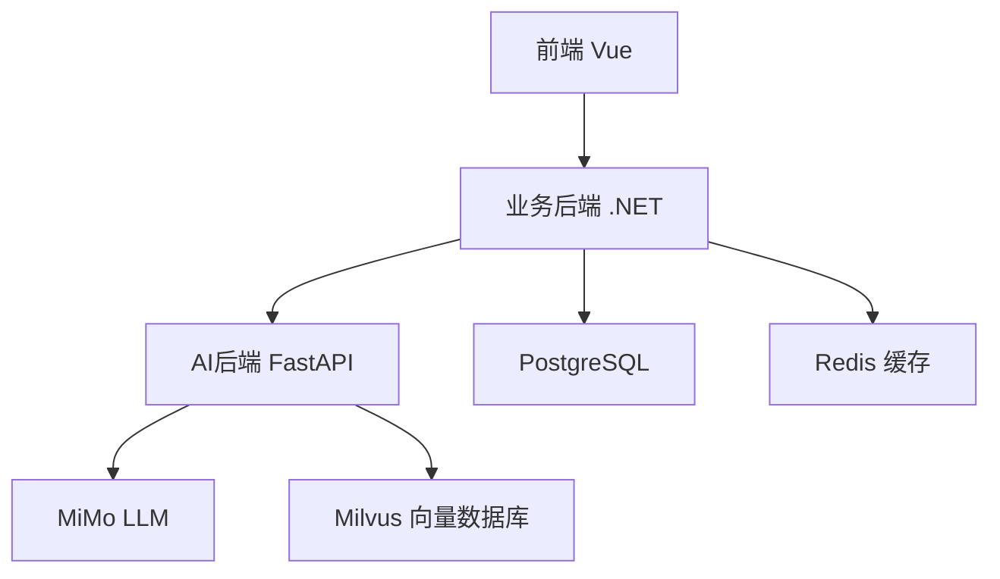
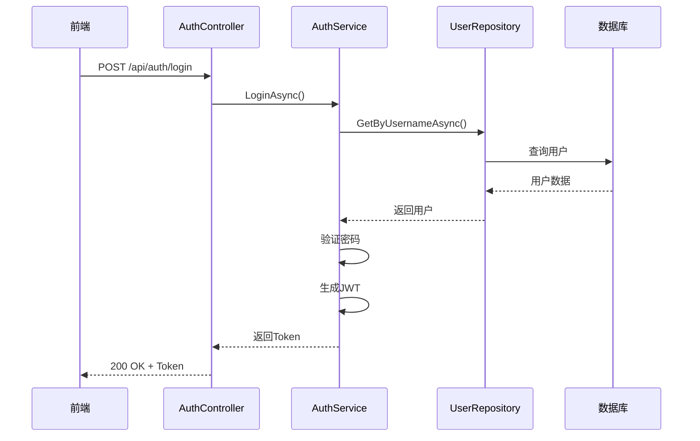
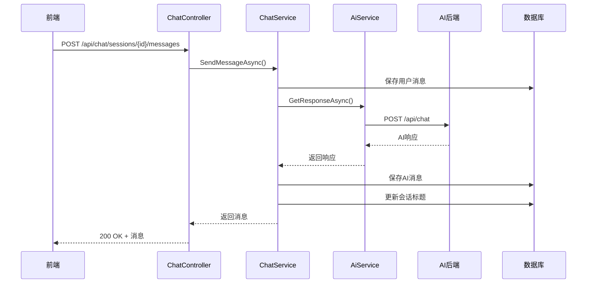
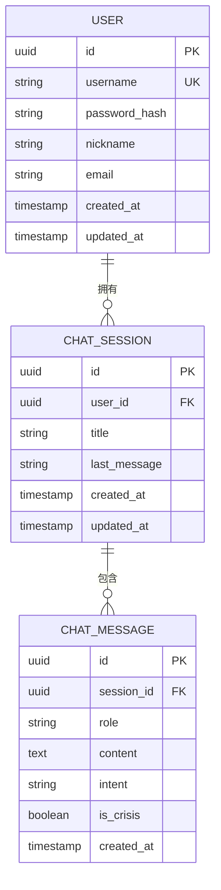
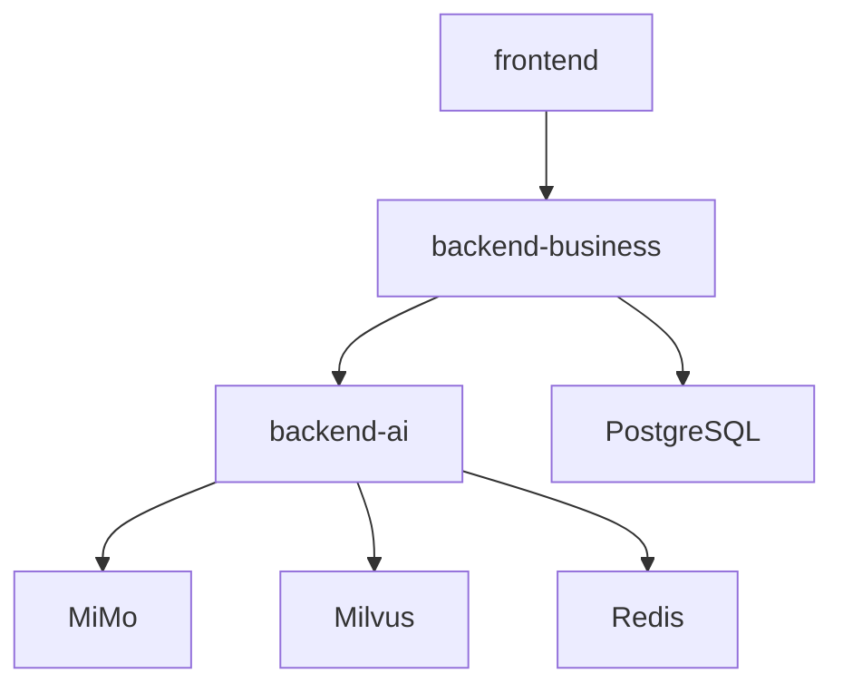

# 系统概述

<cite>
**本文档中引用的文件**  
- [README.md](file://README.md)
- [main.py](file://backend-ai/main.py)
- [Program.cs](file://backend-business/MindMates.Api/Program.cs)
- [AuthController.cs](file://backend-business/MindMates.Api/Controllers/AuthController.cs)
- [ChatController.cs](file://backend-business/MindMates.Api/Controllers/ChatController.cs)
- [AuthService.cs](file://backend-business/MindMates.Infrastructure/Services/AuthService.cs)
- [ChatService.cs](file://backend-business/MindMates.Infrastructure/Services/ChatService.cs)
- [AppDbContext.cs](file://backend-business/MindMates.Infrastructure/Data/AppDbContext.cs)
- [User.cs](file://backend-business/MindMates.Domain/Entities/User.cs)
- [ChatSession.cs](file://backend-business/MindMates.Domain/Entities/ChatSession.cs)
- [frontend\package.json](file://frontend/package.json)
</cite>

## 目录
1. [简介](#简介)
2. [项目结构](#项目结构)
3. [核心组件](#核心组件)
4. [架构概览](#架构概览)
5. [详细组件分析](#详细组件分析)
6. [依赖分析](#依赖分析)
7. [性能考虑](#性能考虑)
8. [故障排除指南](#故障排除指南)
9. [结论](#结论)

## 简介

MindMates 是一个心理健康AI伴侣平台，旨在通过AI技术为用户提供心理支持、危机检测与响应、用户认证和聊天历史管理。该系统采用混合架构设计，前端使用 Vue 3 + TypeScript，业务后端基于 .NET 10 Web API 实现 Clean Architecture，AI后端则采用 Python 3.13 + FastAPI + LangChain + MiMo 技术栈。系统支持移动端跨平台部署（通过 Capacitor），并具备实时对话、多会话管理、JWT 认证等核心功能。

本系统的目标是为用户提供一个安全、私密且富有同理心的心理健康支持环境，同时在检测到用户处于心理危机状态时，及时提供紧急求助资源和心理援助热线推荐。

**Section sources**
- [README.md](file://README.md#L1-L185)

## 项目结构

MindMates 项目采用分层架构，分为前端、业务后端和AI后端三个主要部分：

- **frontend/**：Vue 3 前端应用，使用 Vite 构建，支持 TypeScript 和 Tailwind CSS 样式。
- **backend-business/**：.NET 10 业务后端，采用 Clean Architecture 分为 API 层、应用层、领域层和基础设施层。
- **backend-ai/**：Python FastAPI AI 后端，负责 AI 对话、危机检测和 RAG 检索服务。

**Diagram sources**
- [README.md](file://README.md#L59-L89)

**Section sources**
- [README.md](file://README.md#L59-L89)

## 核心组件

系统的核心组件包括用户认证、心理咨询对话、危机检测和移动端支持。用户通过前端注册/登录后，JWT Token 用于身份验证。聊天功能通过业务后端协调，调用AI后端获取响应，并将对话历史持久化到数据库。危机检测模块自动分析用户输入，识别潜在风险并提供紧急资源。

**Section sources**
- [README.md](file://README.md#L119-L139)

## 架构概览

MindMates 采用 Clean Architecture 和分层架构设计，确保关注点分离和可维护性。前端通过 HTTP 请求与业务后端通信，业务后端再调用 AI 后端进行自然语言处理。数据库使用 PostgreSQL 存储用户和聊天数据，向量数据库 Milvus 支持 RAG 功能。

**Diagram sources**
- [README.md](file://README.md#L160-L175)
- [AppDbContext.cs](file://backend-business/MindMates.Infrastructure/Data/AppDbContext.cs#L12-L14)

**Section sources**
- [README.md](file://README.md#L160-L175)

## 详细组件分析

### 用户认证分析

用户认证通过 JWT 实现，包含注册、登录、个人资料管理和密码修改功能。认证控制器（AuthController）处理 HTTP 请求，调用 AuthService 进行业务逻辑处理，最终通过 UserRepository 与数据库交互。

**Diagram sources**
- [AuthController.cs](file://backend-business/MindMates.Api/Controllers/AuthController.cs#L20-L46)
- [AuthService.cs](file://backend-business/MindMates.Infrastructure/Services/AuthService.cs#L24-L34)
- [UserRepository.cs](file://backend-business/MindMates.Infrastructure/Repositories/UserRepository.cs#L22-L26)

**Section sources**
- [AuthController.cs](file://backend-business/MindMates.Api/Controllers/AuthController.cs#L1-L110)
- [AuthService.cs](file://backend-business/MindMates.Infrastructure/Services/AuthService.cs#L1-L131)

### 聊天功能分析

聊天功能支持创建会话、发送消息、获取历史记录。ChatController 接收前端请求，通过 ChatService 调用 AI 后端获取响应，并将用户和AI消息持久化。

**Diagram sources**
- [ChatController.cs](file://backend-business/MindMates.Api/Controllers/ChatController.cs#L82-L95)
- [ChatService.cs](file://backend-business/MindMates.Infrastructure/Services/ChatService.cs#L70-L124)
- [main.py](file://backend-ai/main.py#L54-L78)

**Section sources**
- [ChatController.cs](file://backend-business/MindMates.Api/Controllers/ChatController.cs#L1-L107)
- [ChatService.cs](file://backend-business/MindMates.Infrastructure/Services/ChatService.cs#L1-L146)

### 数据模型分析

系统核心数据模型包括用户（User）、聊天会话（ChatSession）和聊天消息（ChatMessage），通过 Entity Framework Core 映射到 PostgreSQL 数据库。

**Diagram sources**
- [User.cs](file://backend-business/MindMates.Domain/Entities/User.cs#L1-L17)
- [ChatSession.cs](file://backend-business/MindMates.Domain/Entities/ChatSession.cs#L1-L32)
- [AppDbContext.cs](file://backend-business/MindMates.Infrastructure/Data/AppDbContext.cs#L16-L58)

**Section sources**
- [User.cs](file://backend-business/MindMates.Domain/Entities/User.cs#L1-L17)
- [ChatSession.cs](file://backend-business/MindMates.Domain/Entities/ChatSession.cs#L1-L32)

## 依赖分析

系统依赖关系清晰，前端依赖业务后端API，业务后端依赖AI后端服务和数据库。AI后端依赖MiMo LLM和向量数据库Milvus。

**Diagram sources**
- [README.md](file://README.md#L160-L175)
- [package.json](file://frontend/package.json#L11-L20)

**Section sources**
- [README.md](file://README.md#L160-L175)
- [package.json](file://frontend/package.json#L1-L35)

## 性能考虑

系统通过以下方式优化性能：
- 使用 Redis 缓存频繁访问的数据
- 数据库查询使用索引（如用户名唯一索引）
- AI 响应通过 RAG 技术提高相关性
- 前端使用 Pinia 状态管理减少重复请求

虽然未在代码中直接体现，但 README 中提到 Redis 为可选组件，可用于提升系统响应速度。

**Section sources**
- [README.md](file://README.md#L19-L20)

## 故障排除指南

常见问题及解决方案：
- **服务无法启动**：检查环境变量配置，确保数据库和AI服务可达
- **JWT 认证失败**：验证 JWT 密钥配置是否正确
- **AI 响应超时**：检查 MiMo API 密钥和网络连接
- **CORS 错误**：确认前端端口在后端 CORS 配置中已允许

**Section sources**
- [Program.cs](file://backend-business/MindMates.Api/Program.cs#L66-L75)
- [main.py](file://backend-ai/main.py#L38-L45)

## 结论

MindMates 系统通过前端、业务后端和AI后端的协同工作，构建了一个功能完整、架构清晰的心理健康AI伴侣平台。系统采用现代技术栈和 Clean Architecture 设计，具备良好的可扩展性和可维护性。通过 JWT 认证、对话历史管理、危机检测等核心功能，为用户提供安全、智能的心理支持服务。