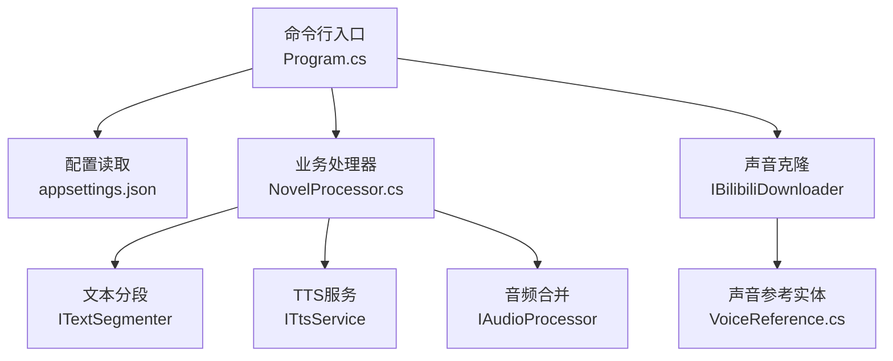
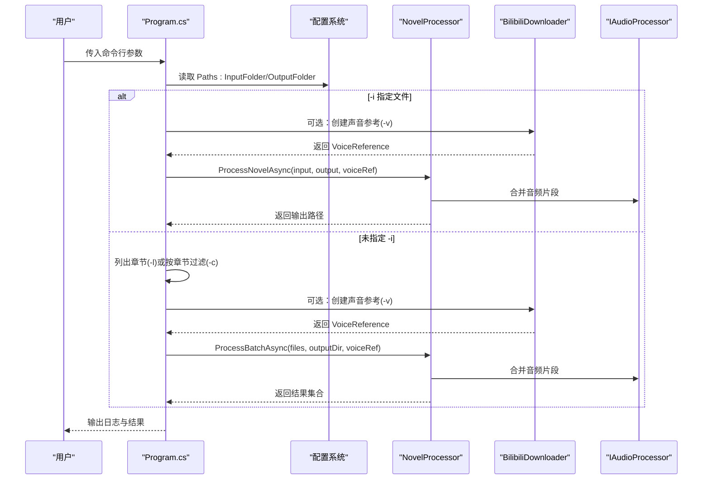
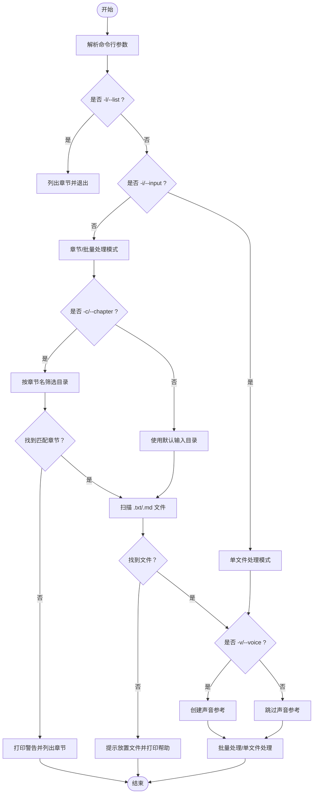
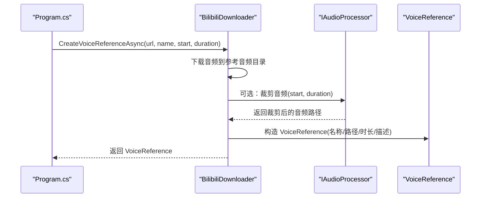
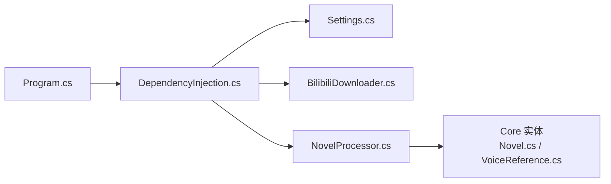

# 命令行接口

<cite>
**本文引用的文件**
- [Program.cs](file://src/App/Program.cs)
- [appsettings.json](file://src/App/appsettings.json)
- [DependencyInjection.cs](file://src/Infrastructure/DependencyInjection.cs)
- [Settings.cs](file://src/Infrastructure/Configuration/Settings.cs)
- [BilibiliDownloader.cs](file://src/Infrastructure/Services/BilibiliDownloader.cs)
- [NovelProcessor.cs](file://src/App/Services/NovelProcessor.cs)
- [VoiceReference.cs](file://src/Core/Entities/VoiceReference.cs)
- [Novel.cs](file://src/Core/Entities/Novel.cs)
</cite>

## 目录
1. [简介](#简介)
2. [项目结构](#项目结构)
3. [核心组件](#核心组件)
4. [架构总览](#架构总览)
5. [详细组件分析](#详细组件分析)
6. [依赖关系分析](#依赖关系分析)
7. [性能考虑](#性能考虑)
8. [故障排查指南](#故障排查指南)
9. [结论](#结论)
10. [附录](#附录)

## 简介
本文件为 NovelTTS 命令行工具的完整使用参考手册。围绕 Program.cs 中的参数解析逻辑，系统性说明所有命令行选项的功能、参数类型与使用场景，并结合 appsettings.json 的默认配置，解释命令行参数如何覆盖默认设置。同时提供丰富的使用示例，包括批量处理、章节过滤、声音克隆与单文件处理；并通过 -l/--list 参数帮助用户快速发现可用章节。

## 项目结构
命令行入口位于应用层 Program.cs，负责：
- 解析命令行参数
- 读取 appsettings.json 默认配置
- 决定单文件或批量处理流程
- 触发声音克隆（可选）
- 调用业务处理器完成 TTS 流程

图表来源
- [Program.cs](file://src/App/Program.cs#L58-L208)
- [appsettings.json](file://src/App/appsettings.json#L1-L24)
- [NovelProcessor.cs](file://src/App/Services/NovelProcessor.cs#L1-L189)
- [BilibiliDownloader.cs](file://src/Infrastructure/Services/BilibiliDownloader.cs#L1-L90)
- [VoiceReference.cs](file://src/Core/Entities/VoiceReference.cs#L1-L43)

章节来源
- [Program.cs](file://src/App/Program.cs#L58-L208)
- [appsettings.json](file://src/App/appsettings.json#L1-L24)

## 核心组件
- 命令行参数解析：在运行时循环遍历参数数组，识别短/长选项并提取后续值。
- 配置系统：通过 ConfigurationBuilder 加载 appsettings.json 以及环境变量，映射到 Settings 类型。
- 业务处理：NovelProcessor 编排“读取-分段-生成-合并”全流程。
- 声音克隆：可选地从 Bilibili 视频创建声音参考，用于 TTS 声音风格迁移。

章节来源
- [Program.cs](file://src/App/Program.cs#L58-L208)
- [DependencyInjection.cs](file://src/Infrastructure/DependencyInjection.cs#L1-L33)
- [Settings.cs](file://src/Infrastructure/Configuration/Settings.cs#L1-L65)
- [NovelProcessor.cs](file://src/App/Services/NovelProcessor.cs#L1-L189)

## 架构总览
下面的序列图展示命令行触发一次典型处理的调用链路，涵盖单文件与批量两种模式，以及声音克隆的可选路径。

图表来源
- [Program.cs](file://src/App/Program.cs#L58-L208)
- [BilibiliDownloader.cs](file://src/Infrastructure/Services/BilibiliDownloader.cs#L49-L90)
- [NovelProcessor.cs](file://src/App/Services/NovelProcessor.cs#L14-L149)

## 详细组件分析

### 命令行选项与行为
- -i, --input <路径>
  - 功能：指定要处理的单个小说文件（支持 .txt 或 .md）。
  - 参数类型：字符串（文件路径）。
  - 使用场景：精确控制输入文件，适合单文件处理或调试。
  - 行为要点：若提供 -i，则跳过章节扫描与批量处理，直接进入单文件处理流程；若未提供 -i，则根据 -c 或默认策略选择目录并批量处理。
  - 与配置交互：仅覆盖当前执行的输入文件路径，不影响默认输入/输出目录。

- -o, --output <路径>
  - 功能：指定输出音频文件路径（建议 .mp3）。
  - 参数类型：字符串（文件路径）。
  - 使用场景：自定义输出位置与文件名，便于归档或重命名。
  - 行为要点：当 -i 未提供时，会将批量处理中每个文件逐一输出到输出目录并自动追加 .mp3 扩展名；当 -i 提供时，可显式指定输出文件路径。
  - 与配置交互：仅覆盖当前执行的输出文件路径，不影响默认输出目录。

- -c, --chapter <名称>
  - 功能：按章节名称（模糊匹配）筛选要处理的章节目录。
  - 参数类型：字符串（章节名称片段）。
  - 使用场景：在大型文库中快速定位目标章节，避免全量扫描。
  - 行为要点：若无匹配章节，会打印警告并列出所有可用章节；匹配到多个章节时，优先使用第一个匹配项。
  - 与配置交互：仅影响搜索起始目录，不改变默认输入/输出目录。

- -l, --list
  - 功能：列出所有可用章节及其包含的文件数量。
  - 参数类型：无参数。
  - 使用场景：首次使用或需要确认目录结构时，快速发现可处理的章节。
  - 行为要点：打印格式化列表，包含小说名、章节名与文件计数；随后退出程序。
  - 与配置交互：使用默认输入目录，不受 -i/-o/-c/-v 影响。

- -v, --voice <URL>
  - 功能：从 Bilibili 视频创建声音参考，用于声音克隆。
  - 参数类型：字符串（Bilibili 视频 URL）。
  - 使用场景：希望将特定声音风格迁移到 TTS 输出中。
  - 行为要点：内部会下载音频并可按起止时间裁剪，生成 VoiceReference；随后在 TTS 生成阶段使用该参考。
  - 与配置交互：使用默认输入/输出目录与参考音频目录（由 PathSettings 控制），可通过 appsettings.json 调整。

- -h, --help
  - 功能：打印帮助信息与常用示例。
  - 参数类型：无参数。
  - 使用场景：初次使用或需要快速查看参数说明时。

章节来源
- [Program.cs](file://src/App/Program.cs#L70-L100)
- [Program.cs](file://src/App/Program.cs#L102-L107)
- [Program.cs](file://src/App/Program.cs#L210-L245)

### 参数解析流程与分支

图表来源
- [Program.cs](file://src/App/Program.cs#L70-L146)
- [Program.cs](file://src/App/Program.cs#L247-L271)

### 声音克隆工作流

图表来源
- [Program.cs](file://src/App/Program.cs#L147-L159)
- [BilibiliDownloader.cs](file://src/Infrastructure/Services/BilibiliDownloader.cs#L49-L90)
- [VoiceReference.cs](file://src/Core/Entities/VoiceReference.cs#L1-L43)

### 配置与默认值
- 默认输入/输出目录
  - 默认输入目录：由配置键 Paths:InputFolder 决定，默认值见 appsettings.json。
  - 默认输出目录：由配置键 Paths:OutputFolder 决定，默认值见 appsettings.json。
- 声音参考与临时目录
  - 参考音频目录：由配置键 Paths:ReferenceAudioFolder 决定，默认值见 appsettings.json。
  - 临时目录：由配置键 Paths:TempFolder 决定，默认值见 appsettings.json。
- 命令行覆盖规则
  - -i/--input 仅覆盖本次执行的输入文件路径。
  - -o/--output 仅覆盖本次执行的输出文件路径。
  - -c/--chapter 仅影响搜索起始目录，不改变默认输入/输出目录。
  - -l/--list 与 -h/--help 不改变任何配置。
  - -v/--voice 仅影响声音参考创建与 TTS 使用，不改变默认输入/输出目录。

章节来源
- [appsettings.json](file://src/App/appsettings.json#L1-L24)
- [Settings.cs](file://src/Infrastructure/Configuration/Settings.cs#L41-L65)
- [Program.cs](file://src/App/Program.cs#L63-L68)

## 依赖关系分析
- Program.cs 依赖配置系统与业务处理器；可选依赖声音克隆服务。
- 依赖注入将配置绑定到强类型 Settings，再注入到各服务。
- 声音克隆服务依赖音频处理服务与路径配置。

图表来源
- [Program.cs](file://src/App/Program.cs#L58-L70)
- [DependencyInjection.cs](file://src/Infrastructure/DependencyInjection.cs#L1-L33)
- [Settings.cs](file://src/Infrastructure/Configuration/Settings.cs#L1-L65)
- [BilibiliDownloader.cs](file://src/Infrastructure/Services/BilibiliDownloader.cs#L1-L90)
- [NovelProcessor.cs](file://src/App/Services/NovelProcessor.cs#L1-L189)
- [Novel.cs](file://src/Core/Entities/Novel.cs#L1-L80)
- [VoiceReference.cs](file://src/Core/Entities/VoiceReference.cs#L1-L43)

## 性能考虑
- 批量处理时，进度报告按文件序号推进，建议合理规划章节划分以减少单次处理时间。
- 声音克隆涉及网络下载与音频裁剪，建议在稳定的网络环境下执行，并适当调整裁剪时长以平衡质量与速度。
- 日志输出采用 Serilog 控制台输出，便于实时监控处理进度与异常。

## 故障排查指南
- 未找到任何小说文件
  - 现象：提示未在输入目录找到 .txt 或 .md 文件。
  - 排查：确认文件扩展名是否为 .txt 或 .md；检查 -c 过滤条件是否正确；使用 -l 查看章节结构。
  - 参考
    - [Program.cs](file://src/App/Program.cs#L137-L142)

- 章节过滤无匹配
  - 现象：打印警告并列出所有可用章节。
  - 排查：使用 -l 获取准确章节名；尝试更短或更通用的章节名片段。
  - 参考
    - [Program.cs](file://src/App/Program.cs#L119-L125)
    - [Program.cs](file://src/App/Program.cs#L247-L271)

- 声音克隆失败
  - 现象：Bilibili URL 无效或网络异常导致下载失败。
  - 排查：确认 URL 是否为有效的 Bilibili 视频链接；检查网络连通性；必要时配置 Cookie 以获取更高清音频。
  - 参考
    - [BilibiliDownloader.cs](file://src/Infrastructure/Services/BilibiliDownloader.cs#L1-L90)
    - [appsettings.json](file://src/App/appsettings.json#L7-L9)

- 输出文件未生成
  - 现象：单文件模式下未生成 .mp3。
  - 排查：确认 -o 输出路径存在且可写；检查 -i 指向的输入文件是否存在；查看日志中最终输出路径。
  - 参考
    - [Program.cs](file://src/App/Program.cs#L176-L207)
    - [NovelProcessor.cs](file://src/App/Services/NovelProcessor.cs#L14-L101)

## 结论
命令行接口提供了灵活而直观的操作方式：通过 -l 快速发现章节，通过 -c 精确筛选，通过 -i 单文件处理，通过 -v 进行声音克隆，通过 -o 自定义输出。配合 appsettings.json 的默认配置，用户可以在不同场景下高效完成从文本到音频的自动化转换。

## 附录

### 使用示例与最佳实践
- 列出所有章节
  - 用途：了解目录结构，确认章节名。
  - 示例：命令行传入 -l。
  - 参考
    - [Program.cs](file://src/App/Program.cs#L210-L245)
    - [Program.cs](file://src/App/Program.cs#L247-L271)

- 按章节过滤处理
  - 用途：只处理特定章节，避免全量扫描。
  - 示例：命令行传入 -c “第一章”，或 -c “第X章”等。
  - 参考
    - [Program.cs](file://src/App/Program.cs#L112-L129)

- 单文件处理
  - 用途：调试或小范围验证。
  - 示例：命令行传入 -i ./novel.txt -o ./novel.mp3。
  - 参考
    - [Program.cs](file://src/App/Program.cs#L176-L207)

- 批量处理（默认）
  - 用途：处理输入目录下的全部 .txt/.md 文件。
  - 示例：命令行不带 -i，可选 -c 过滤章节。
  - 参考
    - [Program.cs](file://src/App/Program.cs#L131-L174)

- 声音克隆（可选）
  - 用途：将特定声音风格迁移到 TTS 输出。
  - 示例：命令行传入 -v https://www.bilibili.com/video/BVxxxxxx。
  - 参考
    - [Program.cs](file://src/App/Program.cs#L147-L159)
    - [BilibiliDownloader.cs](file://src/Infrastructure/Services/BilibiliDownloader.cs#L49-L90)

- 配置覆盖与默认值
  - 用途：修改默认输入/输出目录、参考音频目录与临时目录。
  - 示例：编辑 appsettings.json 中 Paths:InputFolder/OutputFolder/ReferenceAudioFolder/TempFolder。
  - 参考
    - [appsettings.json](file://src/App/appsettings.json#L10-L15)
    - [Settings.cs](file://src/Infrastructure/Configuration/Settings.cs#L41-L65)