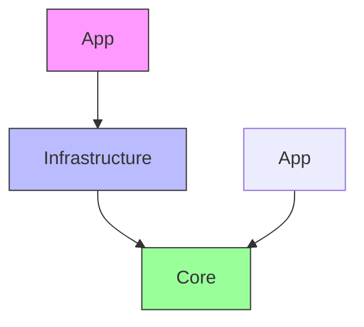

# 开发指南

<cite>
**本文档中引用的文件**  
- [NovelTTSApp.sln](file://NovelTTSApp.sln)
- [NovelTTSApp.Core.csproj](file://src/Core/NovelTTSApp.Core.csproj)
- [NovelTTSApp.Infrastructure.csproj](file://src/Infrastructure/NovelTTSApp.Infrastructure.csproj)
- [NovelTTSApp.App.csproj](file://src/App/NovelTTSApp.App.csproj)
- [Program.cs](file://src/App/Program.cs)
- [DependencyInjection.cs](file://src/Infrastructure/DependencyInjection.cs)
- [INovelProcessor.cs](file://src/Core/Interfaces/INovelProcessor.cs)
- [NovelProcessor.cs](file://src/App/Services/NovelProcessor.cs)
</cite>

## 目录
1. [项目启动](#项目启动)
2. [项目结构与依赖关系](#项目结构与依赖关系)
3. [遵循清洁架构添加新功能](#遵循清洁架构添加新功能)
4. [代码风格与最佳实践](#代码风格与最佳实践)
5. [贡献路径](#贡献路径)

## 项目启动

要开始开发，请使用 Visual Studio 或 VS Code 打开解决方案文件 `NovelTTSApp.sln`。该文件位于项目根目录下，是整个解决方案的入口点。

在 Visual Studio 中，选择“文件”>“打开”>“项目/解决方案”，然后导航到 `` 并选择 `NovelTTSApp.sln`。在 VS Code 中，可以通过命令行运行 `code .`（在项目根目录下）来加载整个项目。

打开后，您将看到三个主要项目：`Core`、`Infrastructure` 和 `App`，它们构成了清洁架构的三个层次。

**Section sources**
- [NovelTTSApp.sln](file://NovelTTSApp.sln)

## 项目结构与依赖关系

本项目采用清洁架构（Clean Architecture），分为三层：`Core`（核心层）、`Infrastructure`（基础设施层）和 `App`（应用层）。各层之间的依赖关系为单向向下，即上层依赖下层，但下层不依赖上层。



**Diagram sources**
- [NovelTTSApp.sln](file://NovelTTSApp.sln)
- [NovelTTSApp.Core.csproj](file://src/Core/NovelTTSApp.Core.csproj)
- [NovelTTSApp.Infrastructure.csproj](file://src/Infrastructure/NovelTTSApp.Infrastructure.csproj)
- [NovelTTSApp.App.csproj](file://src/App/NovelTTSApp.App.csproj)

### 核心层 (Core)
位于 `src/Core`，包含领域实体和接口定义，是业务逻辑的核心，不依赖任何外部框架或库。

- **Entities**: 定义了 `Novel`、`AudioSegment`、`VoiceReference` 等核心数据模型。
- **Interfaces**: 定义了 `INovelReader`、`ITextSegmenter`、`ITtsService` 等接口，规定了服务契约。

### 基础设施层 (Infrastructure)
位于 `src/Infrastructure`，实现了 `Core` 层定义的接口，依赖外部服务如 HTTP 客户端、文件系统等。

- **Services**: 包含 `NovelReader`、`TextSegmenter`、`ZhipuTtsService` 等具体实现。
- **Configuration**: 包含 `AISettings`、`PathSettings` 等配置类。
- **DependencyInjection.cs**: 注册所有基础设施服务。

### 应用层 (App)
位于 `src/App`，是应用程序的入口，负责依赖注入、配置加载和主流程编排。

- **Program.cs**: 主程序入口，配置服务并启动应用。
- **Services/NovelProcessor.cs**: 实现 `INovelProcessor`，协调各服务完成小说到有声书的转换。

**Section sources**
- [NovelTTSApp.Core.csproj](file://src/Core/NovelTTSApp.Core.csproj)
- [NovelTTSApp.Infrastructure.csproj](file://src/Infrastructure/NovelTTSApp.Infrastructure.csproj)
- [NovelTTSApp.App.csproj](file://src/App/NovelTTSApp.App.csproj)

## 遵循清洁架构添加新功能

当需要添加新功能时，应遵循清洁架构原则，从核心层开始，逐层向下实现。

### 步骤 1：在 Core 层定义接口
首先在 `src/Core/Interfaces` 中定义新的接口。例如，若要添加语音分析功能：

```csharp
public interface IVoiceAnalyzer
{
    Task<VoiceAnalysisResult> AnalyzeAsync(VoiceReference voiceReference, CancellationToken cancellationToken = default);
}
```

### 步骤 2：在 Infrastructure 层实现接口
在 `src/Infrastructure/Services` 中创建实现类，并在 `DependencyInjection.cs` 中注册服务。

```csharp
public class VoiceAnalyzer : IVoiceAnalyzer
{
    // 实现逻辑
}
```

并在 `DependencyInjection.cs` 中添加：
```csharp
services.AddScoped<IVoiceAnalyzer, VoiceAnalyzer>();
```

### 步骤 3：在 App 层使用服务
在 `App` 层的服务中注入新服务并使用。例如在 `NovelProcessor` 的构造函数中添加 `IVoiceAnalyzer analyzer` 参数，并在处理流程中调用。

这种分层方式确保了核心业务逻辑的独立性和可测试性，同时便于替换具体实现。

**Section sources**
- [INovelProcessor.cs](file://src/Core/Interfaces/INovelProcessor.cs)
- [DependencyInjection.cs](file://src/Infrastructure/DependencyInjection.cs)
- [NovelProcessor.cs](file://src/App/Services/NovelProcessor.cs)

## 代码风格与最佳实践

### 全局 using (GlobalUsings)
项目使用了全局 using 特性，在每个项目的 `GlobalUsings.cs` 文件中定义了常用的命名空间，避免在每个文件中重复引入。

### 异步编程
所有 I/O 操作均使用 `async/await` 模式，确保非阻塞执行。关键方法签名均包含 `CancellationToken` 参数以支持取消操作。

### 依赖注入
通过 `IServiceCollection` 注册服务，优先使用 `AddScoped` 以控制服务生命周期。`Program.cs` 负责构建服务提供者并启动应用。

### 错误处理
使用结构化日志（Serilog）记录错误，并在关键流程中使用 `try-catch` 捕获异常，确保程序健壮性。

**Section sources**
- [Program.cs](file://src/App/Program.cs)
- [GlobalUsings.cs](file://src/App/GlobalUsings.cs)
- [AudioProcessor.cs](file://src/Infrastructure/Services/AudioProcessor.cs)

## 贡献路径

1. **环境准备**：安装 .NET 10.0 SDK。
2. **克隆项目**：`git clone https://github.com/your-repo/NovelTTSApp.git`
3. **配置 API Key**：编辑 `src/App/appsettings.json` 中的 `AI:ApiKey`。
4. **打开解决方案**：使用 Visual Studio 或 VS Code 打开 `NovelTTSApp.sln`。
5. **添加功能**：遵循清洁架构原则，在 `Core` 定义接口，在 `Infrastructure` 实现，在 `App` 使用。
6. **测试**：运行 `dotnet run --project src/App` 测试功能。
7. **提交代码**：提交 PR 并等待审查。

通过以上步骤，您可以顺利参与到项目开发中，共同打造高质量的有声书生成工具。

**Section sources**
- [README.md](file://README.md)
- [Program.cs](file://src/App/Program.cs)
- [appsettings.json](file://src/App/appsettings.json)