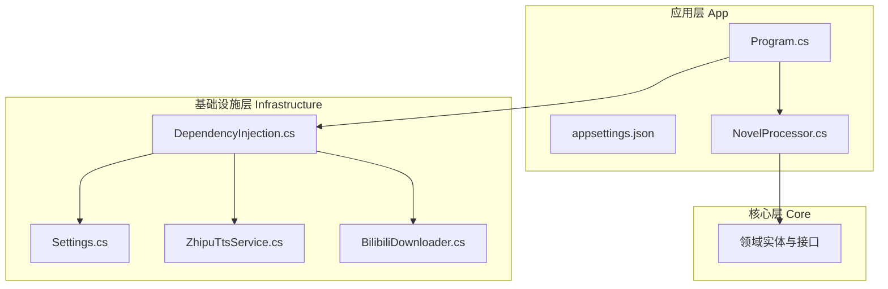
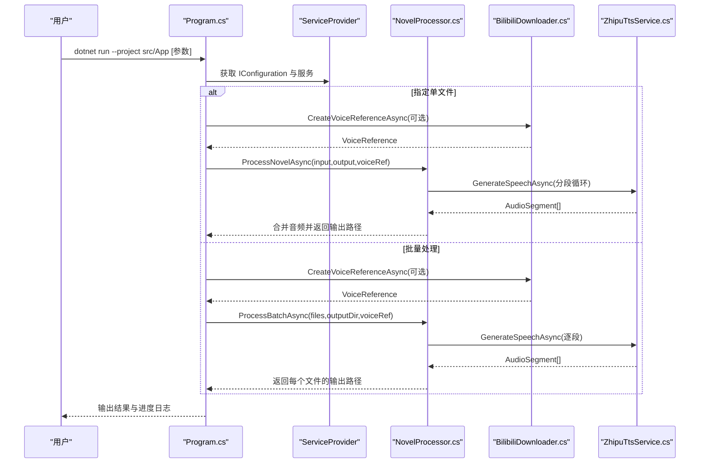
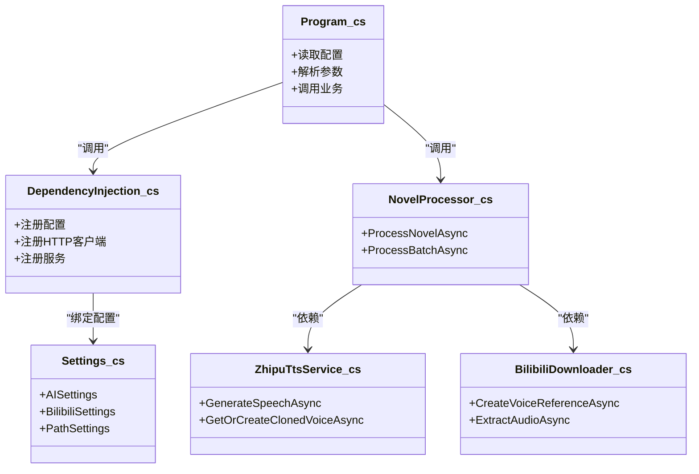

# 快速开始

<cite>
**本文引用的文件**
- [README.md](file://README.md)
- [Program.cs](file://src/App/Program.cs)
- [appsettings.json](file://src/App/appsettings.json)
- [Settings.cs](file://src/Infrastructure/Configuration/Settings.cs)
- [DependencyInjection.cs](file://src/Infrastructure/DependencyInjection.cs)
- [ZhipuTtsService.cs](file://src/Infrastructure/Services/ZhipuTtsService.cs)
- [BilibiliDownloader.cs](file://src/Infrastructure/Services/BilibiliDownloader.cs)
- [NovelProcessor.cs](file://src/App/Services/NovelProcessor.cs)
</cite>

## 目录
1. [简介](#简介)
2. [项目结构](#项目结构)
3. [核心组件](#核心组件)
4. [架构总览](#架构总览)
5. [详细组件分析](#详细组件分析)
6. [依赖关系分析](#依赖关系分析)
7. [性能注意事项](#性能注意事项)
8. [故障排查指南](#故障排查指南)
9. [结论](#结论)
10. [附录](#附录)

## 简介
本指南面向首次接触 NovelTTSApp 的用户，带你从零完成本地环境部署与运行，涵盖：
- 环境要求与安装
- 仓库克隆与项目构建
- 首次运行与常用命令行参数
- 配置文件 appsettings.json 的结构与关键项说明
- 通过 Program.cs 读取配置与命令行参数的工作流程
- 多个实用命令行示例（按章节处理、声音克隆、单文件处理）

## 项目结构
项目采用 Clean Architecture 分层组织，核心目录与职责如下：
- src/Core：领域实体与接口定义
- src/Infrastructure：基础设施层（具体实现、配置绑定、依赖注入）
- src/App：应用层（主程序入口 Program.cs、配置文件 appsettings.json、业务编排 NovelProcessor.cs）

图表来源
- [Program.cs](file://src/App/Program.cs#L1-L291)
- [DependencyInjection.cs](file://src/Infrastructure/DependencyInjection.cs#L1-L33)
- [Settings.cs](file://src/Infrastructure/Configuration/Settings.cs#L1-L66)
- [ZhipuTtsService.cs](file://src/Infrastructure/Services/ZhipuTtsService.cs#L1-L391)
- [BilibiliDownloader.cs](file://src/Infrastructure/Services/BilibiliDownloader.cs#L1-L176)
- [NovelProcessor.cs](file://src/App/Services/NovelProcessor.cs#L1-L189)

章节来源
- [README.md](file://README.md#L31-L115)

## 核心组件
- 程序入口与配置加载：Program.cs 负责构建配置、注册服务、解析命令行参数，并驱动业务流程。
- 配置绑定：Infrastructure 层通过 Settings.cs 定义配置模型，DependencyInjection.cs 将 IConfiguration 绑定到强类型对象。
- AI 服务与声音克隆：ZhipuTtsService.cs 负责调用智谱 GLM-TTS 与 GLM-TTS-Clone；BilibiliDownloader.cs 负责从 Bilibili 提取参考音频并裁剪。
- 业务编排：NovelProcessor.cs 将“读取文本—分段—TTS 生成—音频合并”串联为完整流程。

章节来源
- [Program.cs](file://src/App/Program.cs#L1-L291)
- [Settings.cs](file://src/Infrastructure/Configuration/Settings.cs#L1-L66)
- [DependencyInjection.cs](file://src/Infrastructure/DependencyInjection.cs#L1-L33)
- [ZhipuTtsService.cs](file://src/Infrastructure/Services/ZhipuTtsService.cs#L1-L391)
- [BilibiliDownloader.cs](file://src/Infrastructure/Services/BilibiliDownloader.cs#L1-L176)
- [NovelProcessor.cs](file://src/App/Services/NovelProcessor.cs#L1-L189)

## 架构总览
下面的序列图展示了从启动到生成有声书的关键调用链，映射到实际代码文件：

图表来源
- [Program.cs](file://src/App/Program.cs#L58-L208)
- [NovelProcessor.cs](file://src/App/Services/NovelProcessor.cs#L1-L189)
- [BilibiliDownloader.cs](file://src/Infrastructure/Services/BilibiliDownloader.cs#L49-L90)
- [ZhipuTtsService.cs](file://src/Infrastructure/Services/ZhipuTtsService.cs#L35-L188)

## 详细组件分析

### 配置文件 appsettings.json 结构与设置要点
- AI 服务端点、API 密钥与模型 ID
  - 位置：AI 节点
  - 作用：指定智谱 API 的访问地址、鉴权令牌与使用的模型
  - 设置建议：将 Endpoint 与 ApiKey 修改为你的实际值；ModelId 保持为 GLM-4-Voice
- Bilibili Cookie（可选）
  - 位置：Bilibili 节点
  - 作用：用于提升 Bilibili 下载音频的质量（如获取更高清晰度）
- 数据路径
  - 位置：Paths 节点
  - 关键项：
    - InputFolder：小说文本输入目录
    - OutputFolder：生成的有声书输出目录
    - ReferenceAudioFolder：声音克隆参考音频存放目录
    - TempFolder：临时音频片段目录
  - 设置建议：确保这些目录存在且可读写；若使用相对路径，注意与工作目录的关系

章节来源
- [appsettings.json](file://src/App/appsettings.json#L1-L24)
- [Settings.cs](file://src/Infrastructure/Configuration/Settings.cs#L1-L66)

### Program.cs 如何读取配置与命令行参数
- 配置加载
  - 通过 ConfigurationBuilder 加载 appsettings.json，并支持环境变量覆盖
  - 通过 DependencyInjection 将强类型配置绑定到服务容器
- 服务注册
  - 注册日志、基础设施服务（TTS、B站下载、文本分段、音频处理）
  - 注册应用层业务服务（INovelProcessor）
- 命令行参数解析
  - 支持的参数：
    - -i/--input：指定输入小说文件路径
    - -o/--output：指定输出音频文件路径
    - -c/--chapter：按章节关键词过滤（模糊匹配）
    - -l/--list：列出可用章节
    - -v/--voice：提供 Bilibili 视频 URL 以进行声音克隆
    - -h/--help：打印帮助
- 执行逻辑
  - 若未指定 -i，则根据 -c 或默认输入目录批量处理；否则处理单个文件
  - 若提供了 -v，则先从 Bilibili 下载并裁剪参考音频，再进行声音克隆

章节来源
- [Program.cs](file://src/App/Program.cs#L1-L291)
- [DependencyInjection.cs](file://src/Infrastructure/DependencyInjection.cs#L1-L33)

### 声音克隆与 TTS 工作流
- 声音克隆流程（由 BilibiliDownloader 与 ZhipuTtsService 协作完成）
  - 从 Bilibili 提取音频并裁剪为参考片段
  - 将参考音频上传至智谱 API 获取 file_id
  - 调用 voice/clone 创建音色，得到 voice_id
  - 使用该 voice_id 调用 GLM-TTS 生成克隆语音
- TTS 生成
  - 对每一段文本调用 GLM-TTS 接口生成音频
  - 将生成的音频片段合并为最终 MP3

章节来源
- [BilibiliDownloader.cs](file://src/Infrastructure/Services/BilibiliDownloader.cs#L49-L90)
- [ZhipuTtsService.cs](file://src/Infrastructure/Services/ZhipuTtsService.cs#L144-L259)

### 常用命令行示例
以下示例均在项目根目录执行，确保 .NET 10 SDK 已安装并可用。

- 构建项目
  - 命令：dotnet build -c Release
- 运行程序
  - 命令：dotnet run --project src/App
- 列出可用章节
  - 命令：dotnet run --project src/App -- -l
- 按章节过滤处理
  - 命令：dotnet run --project src/App -- -c "第一章"
- 使用 Bilibili 视频进行声音克隆
  - 命令：dotnet run --project src/App -- -c "第一章" -v https://www.bilibili.com/video/BV1xxxxxxxx
- 处理单个文件并指定输出
  - 命令：dotnet run --project src/App -- -i ./mynovel.txt -o ./mynovel.mp3

章节来源
- [README.md](file://README.md#L118-L147)
- [Program.cs](file://src/App/Program.cs#L210-L245)

## 依赖关系分析
- 配置绑定关系
  - IConfiguration 通过 DependencyInjection.cs 绑定到 AISettings、BilibiliSettings、PathSettings
- 服务依赖关系
  - Program.cs 依赖 NovelProcessor.cs
  - NovelProcessor.cs 依赖 INovelReader、ITextSegmenter、ITtsService、IAudioProcessor
  - ZhipuTtsService.cs 依赖 HttpClient、AISettings、PathSettings
  - BilibiliDownloader.cs 依赖 HttpClient、IAudioProcessor、BilibiliSettings、PathSettings

图表来源
- [Program.cs](file://src/App/Program.cs#L1-L291)
- [DependencyInjection.cs](file://src/Infrastructure/DependencyInjection.cs#L1-L33)
- [Settings.cs](file://src/Infrastructure/Configuration/Settings.cs#L1-L66)
- [ZhipuTtsService.cs](file://src/Infrastructure/Services/ZhipuTtsService.cs#L1-L391)
- [BilibiliDownloader.cs](file://src/Infrastructure/Services/BilibiliDownloader.cs#L1-L176)
- [NovelProcessor.cs](file://src/App/Services/NovelProcessor.cs#L1-L189)

## 性能注意事项
- 文本分段长度：较长的分段会减少 API 调用次数但可能增加单次生成耗时；较短分段更易控制但会增加调用次数。可在业务层适当调整分段策略。
- 并发与重试：TTS 服务内置重试策略，合理设置网络超时与并发度可提升稳定性。
- 临时文件管理：生成的音频片段保存在 TempFolder，完成后自动清理；请确保磁盘空间充足。
- 声音克隆：首次克隆会产生额外的上传与克隆请求，后续会缓存 voice_id，减少重复开销。

## 故障排查指南
- 无法找到输入文件或章节
  - 现象：提示未找到 .txt 或 .md 文件，或章节匹配不到
  - 处理：确认 InputFolder 中存在对应小说与章节目录；使用 -l 列出可用章节；使用 -c 提供包含关键词的章节名
- API 密钥无效或网络异常
  - 现象：TTS 请求失败或返回错误
  - 处理：检查 appsettings.json 中 AI:ApiKey 是否正确；确认网络连通性；必要时开启代理
- Bilibili 下载失败
  - 现象：提取音频失败或返回空 URL
  - 处理：确认提供的视频 URL 正确；若需要更高音质，可在 appsettings.json 中填写 Bilibili:Cookie；检查 Referer 与 User-Agent 是否符合要求
- 输出目录无权限或不存在
  - 现象：无法生成输出文件
  - 处理：确保 OutputFolder 存在且具有写权限；必要时手动创建目录

章节来源
- [Program.cs](file://src/App/Program.cs#L109-L174)
- [ZhipuTtsService.cs](file://src/Infrastructure/Services/ZhipuTtsService.cs#L144-L188)
- [BilibiliDownloader.cs](file://src/Infrastructure/Services/BilibiliDownloader.cs#L92-L139)

## 结论
通过本指南，你已经完成了 NovelTTSApp 的环境准备、配置修改、项目构建与首次运行，并掌握了常用命令行参数与声音克隆流程。建议在正式使用前：
- 在 appsettings.json 中完善 AI 服务端点与 API 密钥
- 准备好数据目录（输入、输出、参考音频、临时文件夹）
- 使用 -l 列出章节核对输入结构
- 针对网络与存储环境进行优化

## 附录

### 从零到成功：完整入门步骤
- 环境要求
  - 安装 .NET 10.0 SDK 或更高版本
  - 准备智谱 AI API Key
- 克隆仓库
  - git clone 仓库地址
  - cd NovelTTSApp
- 配置 appsettings.json
  - 填写 AI:Endpoint、AI:ApiKey、AI:ModelId
  - 配置 Paths:InputFolder、Paths:OutputFolder、Paths:ReferenceAudioFolder、Paths:TempFolder
- 构建项目
  - dotnet build -c Release
- 运行程序
  - dotnet run --project src/App
- 常用示例
  - 列出章节：dotnet run --project src/App -- -l
  - 按章节处理：dotnet run --project src/App -- -c "第一章"
  - 声音克隆：dotnet run --project src/App -- -c "第一章" -v https://www.bilibili.com/video/BV1xxxxxxxx
  - 单文件处理：dotnet run --project src/App -- -i ./mynovel.txt -o ./mynovel.mp3

章节来源
- [README.md](file://README.md#L72-L147)
- [appsettings.json](file://src/App/appsettings.json#L1-L24)
- [Program.cs](file://src/App/Program.cs#L210-L245)