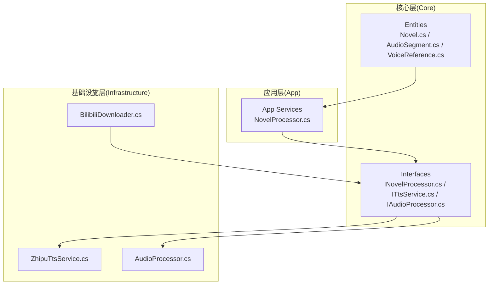
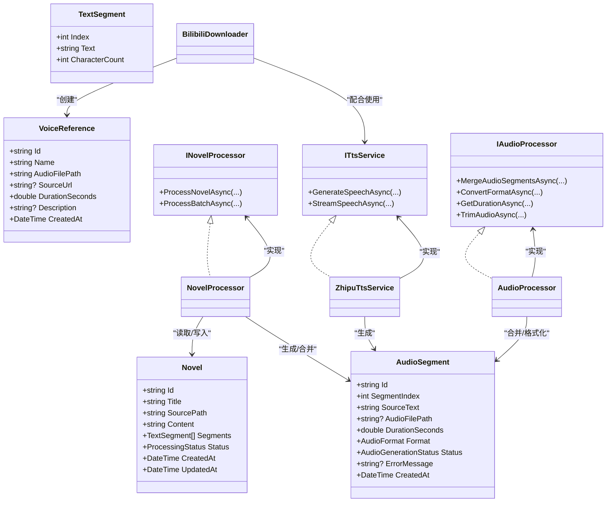
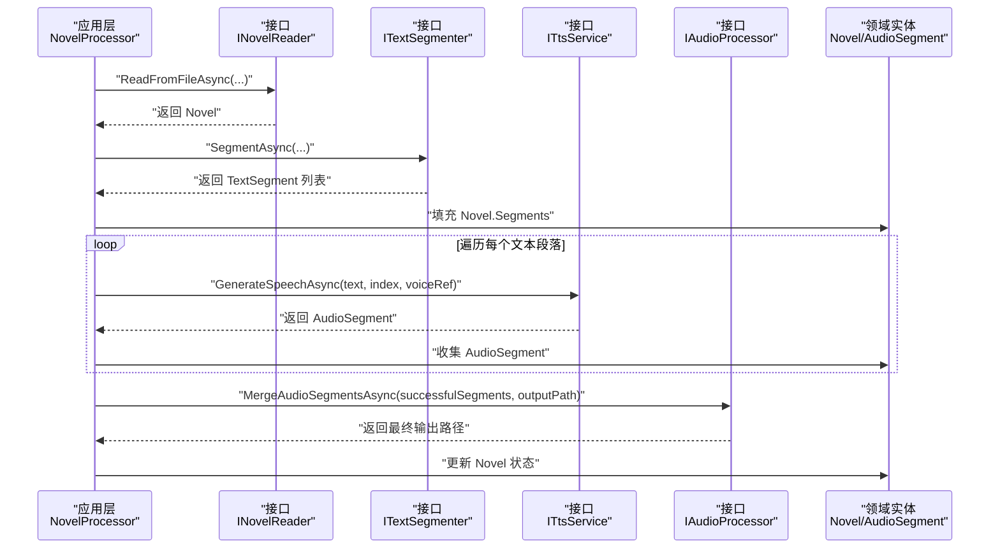
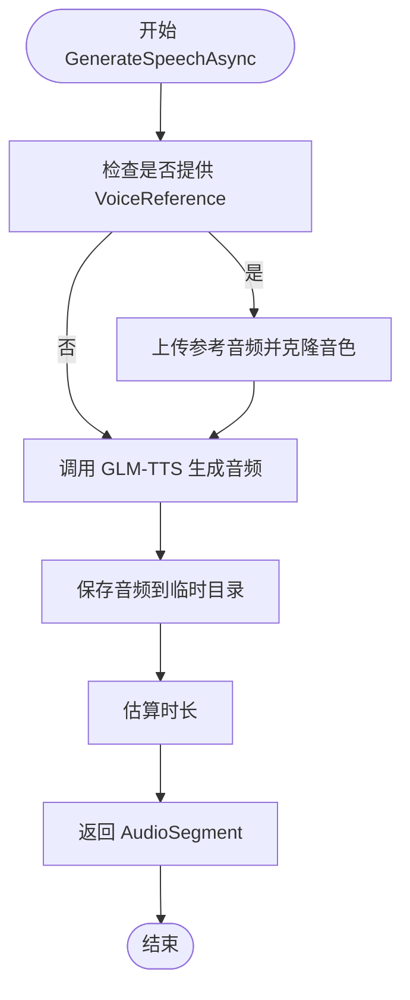
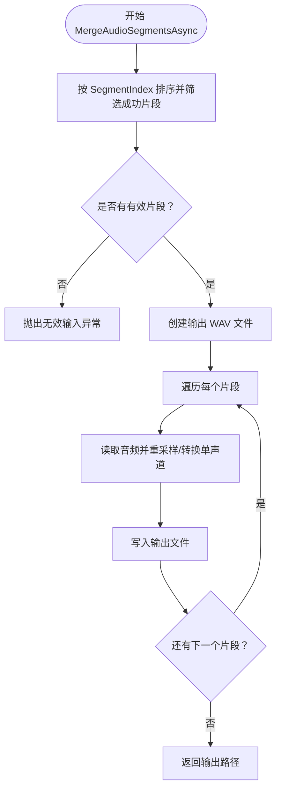
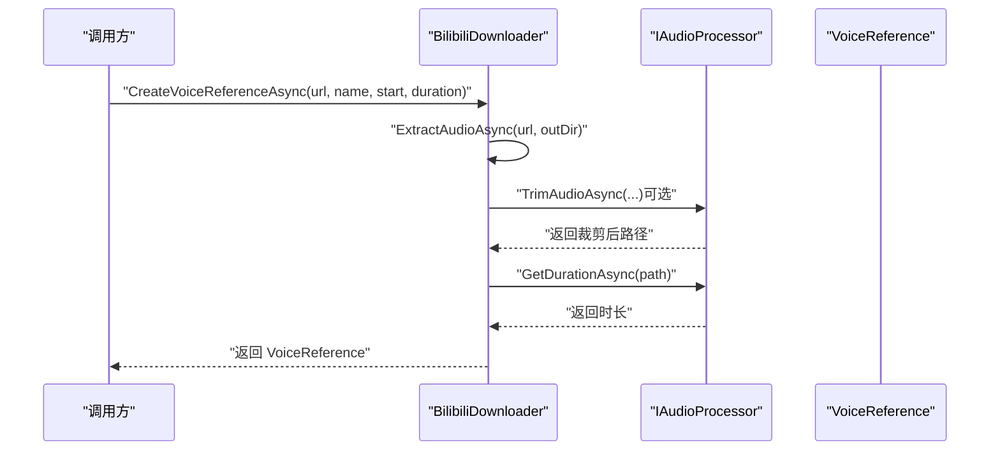

# 数据模型

<cite>
**本文引用的文件**
- [src/Core/Entities/Novel.cs](file://src/Core/Entities/Novel.cs)
- [src/Core/Entities/AudioSegment.cs](file://src/Core/Entities/AudioSegment.cs)
- [src/Core/Entities/VoiceReference.cs](file://src/Core/Entities/VoiceReference.cs)
- [src/Core/Interfaces/INovelProcessor.cs](file://src/Core/Interfaces/INovelProcessor.cs)
- [src/Core/Interfaces/ITtsService.cs](file://src/Core/Interfaces/ITtsService.cs)
- [src/Core/Interfaces/IAudioProcessor.cs](file://src/Core/Interfaces/IAudioProcessor.cs)
- [src/App/Services/NovelProcessor.cs](file://src/App/Services/NovelProcessor.cs)
- [src/Infrastructure/Services/ZhipuTtsService.cs](file://src/Infrastructure/Services/ZhipuTtsService.cs)
- [src/Infrastructure/Services/AudioProcessor.cs](file://src/Infrastructure/Services/AudioProcessor.cs)
- [src/Infrastructure/Services/BilibiliDownloader.cs](file://src/Infrastructure/Services/BilibiliDownloader.cs)
- [README.md](file://README.md)
</cite>

## 目录
1. [简介](#简介)
2. [项目结构](#项目结构)
3. [核心实体](#核心实体)
4. [架构总览](#架构总览)
5. [组件详解](#组件详解)
6. [依赖关系分析](#依赖关系分析)
7. [性能考量](#性能考量)
8. [故障排查指南](#故障排查指南)
9. [结论](#结论)

## 简介
本文件聚焦于应用的领域模型，系统性梳理三个核心实体：Novel（小说）、AudioSegment（音频片段）、VoiceReference（声音参考），并说明它们在服务间的流转方式与职责边界。通过清晰的数据结构视图与交互序列，帮助开发者快速理解数据如何在 Clean Architecture 分层中传递与演进。

## 项目结构
- 核心层（Core）定义领域实体与接口，保持与基础设施解耦。
- 基础设施层（Infrastructure）提供具体实现（TTS、音频处理、B站下载等）。
- 应用层（App）负责业务编排与进度报告。

图表来源
- [src/Core/Entities/Novel.cs](file://src/Core/Entities/Novel.cs#L1-L80)
- [src/Core/Entities/AudioSegment.cs](file://src/Core/Entities/AudioSegment.cs#L1-L74)
- [src/Core/Entities/VoiceReference.cs](file://src/Core/Entities/VoiceReference.cs#L1-L43)
- [src/Core/Interfaces/INovelProcessor.cs](file://src/Core/Interfaces/INovelProcessor.cs#L1-L59)
- [src/Core/Interfaces/ITtsService.cs](file://src/Core/Interfaces/ITtsService.cs#L1-L25)
- [src/Core/Interfaces/IAudioProcessor.cs](file://src/Core/Interfaces/IAudioProcessor.cs#L1-L39)
- [src/App/Services/NovelProcessor.cs](file://src/App/Services/NovelProcessor.cs#L1-L189)
- [src/Infrastructure/Services/ZhipuTtsService.cs](file://src/Infrastructure/Services/ZhipuTtsService.cs#L1-L391)
- [src/Infrastructure/Services/AudioProcessor.cs](file://src/Infrastructure/Services/AudioProcessor.cs#L1-L231)
- [src/Infrastructure/Services/BilibiliDownloader.cs](file://src/Infrastructure/Services/BilibiliDownloader.cs#L1-L176)

章节来源
- [README.md](file://README.md#L31-L70)

## 核心实体
本节对三个领域实体进行逐项说明，包括字段语义、默认值、约束与典型用途。

- Novel（小说）
  - 标识与元数据：唯一标识、创建与更新时间。
  - 内容与分段：标题、源路径、正文文本、文本段落集合。
  - 状态：处理状态枚举，用于跟踪整体流程。
  - 文本段落 TextSegment：包含索引与文本，字符数派生属性。
  - 处理状态 ProcessingStatus：Pending/Processing/Completed/Failed。

- AudioSegment（音频片段）
  - 标识与元数据：唯一标识、创建时间。
  - 关联与来源：对应文本段落索引、原始文本。
  - 存储与时长：音频文件路径、时长（秒）、默认格式为 MP3。
  - 状态与错误：生成状态枚举（Pending/Generating/Completed/Failed）、错误消息。
  - 音频格式与生成状态：枚举类型，便于统一管理。

- VoiceReference（声音参考）
  - 标识与元数据：唯一标识、创建时间。
  - 名称与来源：声音名称/角色名、来源URL（如B站视频链接）。
  - 音频与描述：参考音频文件路径、时长（秒）、描述信息。

章节来源
- [src/Core/Entities/Novel.cs](file://src/Core/Entities/Novel.cs#L1-L80)
- [src/Core/Entities/AudioSegment.cs](file://src/Core/Entities/AudioSegment.cs#L1-L74)
- [src/Core/Entities/VoiceReference.cs](file://src/Core/Entities/VoiceReference.cs#L1-L43)

## 架构总览
领域模型在 Clean Architecture 中的定位：
- Core 层仅包含实体与接口，不依赖任何外部框架。
- App 层编排业务流程，调用 Core 接口。
- Infrastructure 层实现接口，对接第三方服务（TTS、音频处理、B站下载）。

图表来源
- [src/Core/Entities/Novel.cs](file://src/Core/Entities/Novel.cs#L1-L80)
- [src/Core/Entities/AudioSegment.cs](file://src/Core/Entities/AudioSegment.cs#L1-L74)
- [src/Core/Entities/VoiceReference.cs](file://src/Core/Entities/VoiceReference.cs#L1-L43)
- [src/Core/Interfaces/INovelProcessor.cs](file://src/Core/Interfaces/INovelProcessor.cs#L1-L59)
- [src/Core/Interfaces/ITtsService.cs](file://src/Core/Interfaces/ITtsService.cs#L1-L25)
- [src/Core/Interfaces/IAudioProcessor.cs](file://src/Core/Interfaces/IAudioProcessor.cs#L1-L39)
- [src/App/Services/NovelProcessor.cs](file://src/App/Services/NovelProcessor.cs#L1-L189)
- [src/Infrastructure/Services/ZhipuTtsService.cs](file://src/Infrastructure/Services/ZhipuTtsService.cs#L1-L391)
- [src/Infrastructure/Services/AudioProcessor.cs](file://src/Infrastructure/Services/AudioProcessor.cs#L1-L231)
- [src/Infrastructure/Services/BilibiliDownloader.cs](file://src/Infrastructure/Services/BilibiliDownloader.cs#L1-L176)

## 组件详解

### Novel 实体
- 字段与语义
  - 标题、源路径、正文、分段列表、状态、时间戳。
  - 文本段落包含索引与文本，字符数由文本长度派生。
  - 处理状态枚举用于流程控制。
- 典型用途
  - 作为业务流程的输入载体，承载待转语音的文本。
  - 在分段后被替换为 AudioSegment 列表，驱动后续 TTS 与合并。

章节来源
- [src/Core/Entities/Novel.cs](file://src/Core/Entities/Novel.cs#L1-L80)

### AudioSegment 实体
- 字段与语义
  - 关联文本段落索引，便于回溯原文。
  - 音频文件路径、时长、默认格式为 MP3。
  - 生成状态与错误信息，便于失败重试与诊断。
- 典型用途
  - 作为 TTS 服务的输出载体，参与合并与导出。
  - 与 Novel 的 TextSegment 一一对应，形成“文本→音频”的映射。

章节来源
- [src/Core/Entities/AudioSegment.cs](file://src/Core/Entities/AudioSegment.cs#L1-L74)

### VoiceReference 实体
- 字段与语义
  - 声音名称/角色名、参考音频路径、来源URL、时长、描述、创建时间。
- 典型用途
  - 作为声音克隆的输入，驱动 TTS 服务的音色复刻。
  - 由 Bilibili 下载器创建，经下载与裁剪后进入流程。

章节来源
- [src/Core/Entities/VoiceReference.cs](file://src/Core/Entities/VoiceReference.cs#L1-L43)

### 服务间数据流与编排

#### 应用层编排（NovelProcessor）
- 读取小说文件，生成文本分段，填充 Novel.Segments。
- 逐段调用 TTS 服务生成 AudioSegment，记录状态与错误。
- 合并成功片段，清理临时文件，更新 Novel 状态。

图表来源
- [src/App/Services/NovelProcessor.cs](file://src/App/Services/NovelProcessor.cs#L1-L189)
- [src/Core/Interfaces/INovelProcessor.cs](file://src/Core/Interfaces/INovelProcessor.cs#L1-L59)
- [src/Core/Interfaces/ITtsService.cs](file://src/Core/Interfaces/ITtsService.cs#L1-L25)
- [src/Core/Interfaces/IAudioProcessor.cs](file://src/Core/Interfaces/IAudioProcessor.cs#L1-L39)
- [src/Core/Entities/Novel.cs](file://src/Core/Entities/Novel.cs#L1-L80)
- [src/Core/Entities/AudioSegment.cs](file://src/Core/Entities/AudioSegment.cs#L1-L74)

章节来源
- [src/App/Services/NovelProcessor.cs](file://src/App/Services/NovelProcessor.cs#L1-L189)

#### TTS 服务（ZhipuTtsService）
- 生成语音：根据文本与可选的 VoiceReference，调用智谱 API，保存音频到临时目录，估算时长，返回 AudioSegment。
- 流式生成：按行解析流式响应，持续产出 PCM 数据块。
- 声音克隆：上传参考音频获取 file_id，调用 voice/clone 获取 voice_id，缓存以避免重复克隆。

图表来源
- [src/Infrastructure/Services/ZhipuTtsService.cs](file://src/Infrastructure/Services/ZhipuTtsService.cs#L1-L391)
- [src/Core/Entities/AudioSegment.cs](file://src/Core/Entities/AudioSegment.cs#L1-L74)

章节来源
- [src/Infrastructure/Services/ZhipuTtsService.cs](file://src/Infrastructure/Services/ZhipuTtsService.cs#L1-L391)

#### 音频处理（AudioProcessor）
- 合并：按 SegmentIndex 排序，逐段读取并重采样/转换单声道，写入目标 WAV 文件。
- 转换：当前实现支持 WAV；MP3 需要额外库，否则抛出不支持异常。
- 截取：基于字节位置计算起止，输出裁剪后的音频文件。

图表来源
- [src/Infrastructure/Services/AudioProcessor.cs](file://src/Infrastructure/Services/AudioProcessor.cs#L1-L231)
- [src/Core/Entities/AudioSegment.cs](file://src/Core/Entities/AudioSegment.cs#L1-L74)

章节来源
- [src/Infrastructure/Services/AudioProcessor.cs](file://src/Infrastructure/Services/AudioProcessor.cs#L1-L231)

#### 声音参考创建（BilibiliDownloader）
- 从 B 站视频提取音频，下载为 m4a。
- 可选裁剪指定时间段为 10 秒左右的参考音频。
- 读取音频时长，封装为 VoiceReference 返回。

图表来源
- [src/Infrastructure/Services/BilibiliDownloader.cs](file://src/Infrastructure/Services/BilibiliDownloader.cs#L1-L176)
- [src/Core/Entities/VoiceReference.cs](file://src/Core/Entities/VoiceReference.cs#L1-L43)

章节来源
- [src/Infrastructure/Services/BilibiliDownloader.cs](file://src/Infrastructure/Services/BilibiliDownloader.cs#L1-L176)

## 依赖关系分析
- 耦合与内聚
  - Core 层实体与接口低耦合，便于测试与替换实现。
  - App 层通过接口依赖注入，集中编排业务流程。
  - Infrastructure 层实现接口，与第三方服务（HTTP、NAudio）耦合，但对 Core 透明。
- 外部依赖
  - HTTP 客户端用于调用智谱 API 与 B站接口。
  - NAudio 用于音频读写、重采样与合并。
- 循环依赖
  - 未发现循环依赖；接口位于 Core，实现位于 Infrastructure，App 仅依赖接口。

图表来源
- [src/Core/Interfaces/INovelProcessor.cs](file://src/Core/Interfaces/INovelProcessor.cs#L1-L59)
- [src/Core/Interfaces/ITtsService.cs](file://src/Core/Interfaces/ITtsService.cs#L1-L25)
- [src/Core/Interfaces/IAudioProcessor.cs](file://src/Core/Interfaces/IAudioProcessor.cs#L1-L39)
- [src/App/Services/NovelProcessor.cs](file://src/App/Services/NovelProcessor.cs#L1-L189)
- [src/Infrastructure/Services/ZhipuTtsService.cs](file://src/Infrastructure/Services/ZhipuTtsService.cs#L1-L391)
- [src/Infrastructure/Services/AudioProcessor.cs](file://src/Infrastructure/Services/AudioProcessor.cs#L1-L231)
- [src/Infrastructure/Services/BilibiliDownloader.cs](file://src/Infrastructure/Services/BilibiliDownloader.cs#L1-L176)

章节来源
- [src/Core/Interfaces/INovelProcessor.cs](file://src/Core/Interfaces/INovelProcessor.cs#L1-L59)
- [src/Core/Interfaces/ITtsService.cs](file://src/Core/Interfaces/ITtsService.cs#L1-L25)
- [src/Core/Interfaces/IAudioProcessor.cs](file://src/Core/Interfaces/IAudioProcessor.cs#L1-L39)
- [src/App/Services/NovelProcessor.cs](file://src/App/Services/NovelProcessor.cs#L1-L189)
- [src/Infrastructure/Services/ZhipuTtsService.cs](file://src/Infrastructure/Services/ZhipuTtsService.cs#L1-L391)
- [src/Infrastructure/Services/AudioProcessor.cs](file://src/Infrastructure/Services/AudioProcessor.cs#L1-L231)
- [src/Infrastructure/Services/BilibiliDownloader.cs](file://src/Infrastructure/Services/BilibiliDownloader.cs#L1-L176)

## 性能考量
- 文本分段
  - 合理设置分段长度，平衡 TTS 调用次数与单次生成时长。
- 音频合并
  - 合并前先排序并过滤失败片段，减少无效 IO。
  - 重采样与转换单声道会增加 CPU 开销，建议批量处理时并行度可控。
- TTS 生成
  - 使用弹性重试策略降低网络波动影响。
  - 流式生成可用于实时播放，但需注意内存与带宽占用。
- 声音克隆
  - 缓存 voice_id，避免重复克隆导致的额外开销。
  - 参考音频时长建议控制在 10 秒左右，兼顾质量与成本。

## 故障排查指南
- TTS 失败
  - 检查网络与鉴权配置，查看 AudioSegment.ErrorMessage。
  - 若多次失败，考虑调整重试策略或更换参考音频。
- 音频合并失败
  - 确认临时音频文件存在且可读。
  - 检查目标输出目录权限与磁盘空间。
- B站下载失败
  - 校验视频 URL 是否为合法 BV 号。
  - 检查 Cookie 设置与网络访问权限。
- 进度与状态
  - 使用 ProcessingProgress 跟踪阶段与百分比，结合日志定位问题节点。

章节来源
- [src/App/Services/NovelProcessor.cs](file://src/App/Services/NovelProcessor.cs#L1-L189)
- [src/Infrastructure/Services/ZhipuTtsService.cs](file://src/Infrastructure/Services/ZhipuTtsService.cs#L1-L391)
- [src/Infrastructure/Services/AudioProcessor.cs](file://src/Infrastructure/Services/AudioProcessor.cs#L1-L231)
- [src/Infrastructure/Services/BilibiliDownloader.cs](file://src/Infrastructure/Services/BilibiliDownloader.cs#L1-L176)

## 结论
本文从 Clean Architecture 视角梳理了 Novel、AudioSegment、VoiceReference 三大领域实体及其在服务间的流转方式。通过明确的数据结构与职责边界，开发者可以更高效地扩展与维护 TTS 有声书生成能力，同时确保代码的可测试性与可演进性。