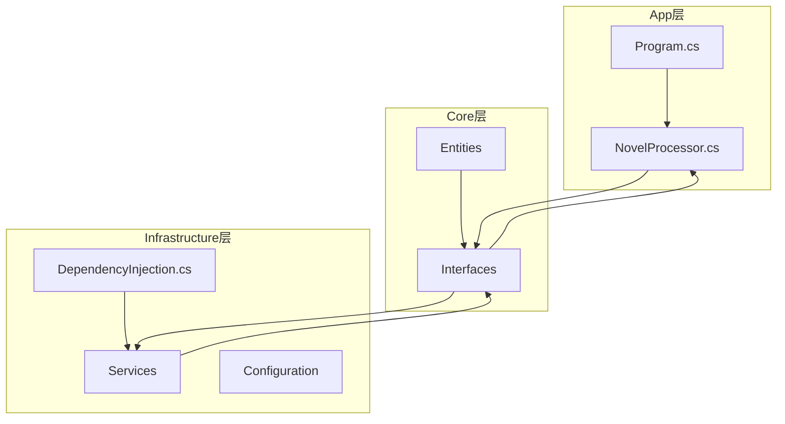
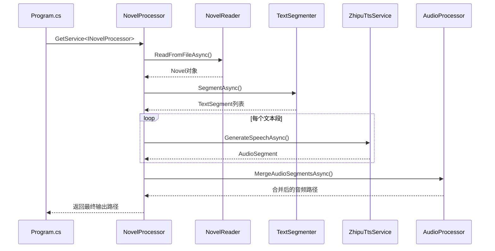

# 架构设计

<cite>
**本文档中引用的文件**  
- [Program.cs](file://src/App/Program.cs)
- [DependencyInjection.cs](file://src/Infrastructure/DependencyInjection.cs)
- [INovelProcessor.cs](file://src/Core/Interfaces/INovelProcessor.cs)
- [NovelProcessor.cs](file://src/App/Services/NovelProcessor.cs)
- [ZhipuTtsService.cs](file://src/Infrastructure/Services/ZhipuTtsService.cs)
- [NovelReader.cs](file://src/Infrastructure/Services/NovelReader.cs)
- [TextSegmenter.cs](file://src/Infrastructure/Services/TextSegmenter.cs)
- [AudioProcessor.cs](file://src/Infrastructure/Services/AudioProcessor.cs)
- [BilibiliDownloader.cs](file://src/Infrastructure/Services/BilibiliDownloader.cs)
- [Novel.cs](file://src/Core/Entities/Novel.cs)
- [AudioSegment.cs](file://src/Core/Entities/AudioSegment.cs)
- [VoiceReference.cs](file://src/Core/Entities/VoiceReference.cs)
- [Settings.cs](file://src/Infrastructure/Configuration/Settings.cs)
- [appsettings.json](file://src/App/appsettings.json)
</cite>

## 目录
1. [简介](#简介)
2. [项目结构](#项目结构)
3. [核心层（Core）](#核心层core)
4. [基础设施层（Infrastructure）](#基础设施层infrastructure)
5. [应用层（App）](#应用层app)
6. [依赖注入配置](#依赖注入配置)
7. [接口驱动设计](#接口驱动设计)
8. [架构优势](#架构优势)
9. [组件交互流程](#组件交互流程)
10. [结论](#结论)

## 简介
本架构设计文档详细阐述了 NovelTTSApp 项目所采用的清洁架构（Clean Architecture）实现。该架构通过分层设计将业务逻辑、数据访问和应用入口清晰分离，提升了代码的可测试性、可维护性和可扩展性。文档重点分析 Core、Infrastructure 和 App 三层的职责划分，解释依赖注入机制，并说明接口驱动设计如何促进松耦合与模块化开发。

## 项目结构
项目采用典型的清洁架构分层模式，包含三个主要层次：Core（核心层）、Infrastructure（基础设施层）和 App（应用层）。这种结构确保了核心业务逻辑不依赖于外部框架或具体实现，从而提高了系统的灵活性和可维护性。



**Diagram sources**
- [README.md](file://README.md#L31-L68)

## 核心层（Core）
核心层定义了系统的领域实体和接口，是整个应用程序的业务核心。它不依赖任何外部库或具体实现，确保了业务逻辑的纯粹性和独立性。

### 实体定义
核心层包含多个关键实体，用于表示系统中的主要数据结构：

- **Novel**：表示待处理的小说文本，包含标题、内容、段落列表和处理状态。
- **AudioSegment**：表示由TTS生成的音频片段，包含源文本、文件路径、时长和生成状态。
- **VoiceReference**：表示用于声音克隆的参考音频，包含音频文件路径、名称和来源信息。

这些实体通过属性和枚举（如 `ProcessingStatus`、`AudioGenerationStatus`）封装了业务数据和状态，为上层服务提供了统一的数据模型。

**Section sources**
- [Novel.cs](file://src/Core/Entities/Novel.cs#L1-L80)
- [AudioSegment.cs](file://src/Core/Entities/AudioSegment.cs#L1-L74)
- [VoiceReference.cs](file://src/Core/Entities/VoiceReference.cs#L1-L43)

### 接口定义
核心层定义了所有关键服务的接口，确立了系统的行为契约：

- `INovelProcessor`：主业务流程编排接口，负责小说到有声书的整体处理。
- `INovelReader`：小说读取接口，支持从文件或URL加载文本。
- `ITextSegmenter`：文本分段接口，将长文本分割为适合TTS处理的片段。
- `ITtsService`：文本转语音服务接口，定义语音生成方法。
- `IAudioProcessor`：音频处理接口，支持音频合并、格式转换等操作。
- `IBilibiliDownloader`：Bilibili音频下载接口，用于提取参考音频。

这些接口作为抽象边界，使得应用层可以基于抽象编程，而不关心具体实现细节。

**Section sources**
- [INovelProcessor.cs](file://src/Core/Interfaces/INovelProcessor.cs#L1-L59)
- [IAudioProcessor.cs](file://src/Core/Interfaces/IAudioProcessor.cs)
- [IBilibiliDownloader.cs](file://src/Core/Interfaces/IBilibiliDownloader.cs)
- [INovelReader.cs](file://src/Core/Interfaces/INovelReader.cs)
- [ITextSegmenter.cs](file://src/Core/Interfaces/ITextSegmenter.cs)
- [ITtsService.cs](file://src/Core/Interfaces/ITtsService.cs)

## 基础设施层（Infrastructure）
基础设施层提供了核心层接口的具体实现，封装了与外部系统（如API、文件系统、网络请求）的交互细节。

### 服务实现
该层实现了所有核心接口，具体包括：

- **ZhipuTtsService**：基于智谱AI的TTS服务实现，调用GLM-TTS API生成语音，并支持音色克隆功能。
- **NovelReader**：实现小说读取功能，支持从本地文件或网页URL加载文本内容。
- **TextSegmenter**：实现智能文本分段，使用正则表达式进行段落和句子分割。
- **AudioProcessor**：基于NAudio库的音频处理实现，支持音频合并、格式转换和裁剪。
- **BilibiliDownloader**：从Bilibili视频中提取音频并创建声音参考。

这些实现类通过构造函数注入所需依赖（如 `HttpClient`、`ILogger`、配置选项），遵循依赖倒置原则。

**Section sources**
- [ZhipuTtsService.cs](file://src/Infrastructure/Services/ZhipuTtsService.cs#L1-L391)
- [NovelReader.cs](file://src/Infrastructure/Services/NovelReader.cs#L1-L104)
- [TextSegmenter.cs](file://src/Infrastructure/Services/TextSegmenter.cs#L1-L128)
- [AudioProcessor.cs](file://src/Infrastructure/Services/AudioProcessor.cs#L1-L231)
- [BilibiliDownloader.cs](file://src/Infrastructure/Services/BilibiliDownloader.cs#L1-L176)

### 配置管理
`Settings.cs` 文件定义了多个配置类（`AISettings`、`BilibiliSettings`、`PathSettings`），用于从 `appsettings.json` 中读取配置信息。这些配置通过依赖注入系统注入到服务中，确保配置管理的集中化和类型安全性。

**Section sources**
- [Settings.cs](file://src/Infrastructure/Configuration/Settings.cs#L1-L66)

## 应用层（App）
应用层是应用程序的入口点，负责协调各服务并执行主业务流程。

### 主程序入口
`Program.cs` 是应用的启动文件，负责以下任务：
- 配置Serilog日志系统
- 构建配置系统并加载 `appsettings.json`
- 创建服务集合并注册依赖
- 调用 `AddInfrastructureServices` 注册基础设施服务
- 注册应用层服务（如 `INovelProcessor`）
- 构建服务提供者并运行主应用逻辑

该文件通过依赖注入容器获取 `INovelProcessor` 实例，并根据命令行参数决定处理单个文件还是批量处理。

**Section sources**
- [Program.cs](file://src/App/Program.cs#L1-L291)

### 业务流程编排
`NovelProcessor.cs` 实现了 `INovelProcessor` 接口，负责整个小说转有声书的流程编排，包括：
1. 读取小说文本
2. 智能文本分段
3. 调用TTS服务生成音频片段
4. 合并音频片段为完整有声书
5. 清理临时文件

该类通过构造函数注入所有依赖服务（`INovelReader`、`ITextSegmenter`、`ITtsService`、`IAudioProcessor`），体现了控制反转原则。

**Section sources**
- [NovelProcessor.cs](file://src/App/Services/NovelProcessor.cs#L1-L189)

## 依赖注入配置
依赖注入是清洁架构的关键支撑机制，它通过 `DependencyInjection.cs` 文件中的扩展方法进行配置。

### 服务注册
`AddInfrastructureServices` 方法在 `DependencyInjection.cs` 中定义，负责注册所有基础设施层服务：

```csharp
public static IServiceCollection AddInfrastructureServices(
    this IServiceCollection services,
    IConfiguration configuration)
{
    // 注册配置
    services.Configure<AISettings>(configuration.GetSection(AISettings.SectionName));
    services.Configure<BilibiliSettings>(configuration.GetSection(BilibiliSettings.SectionName));
    services.Configure<PathSettings>(configuration.GetSection(PathSettings.SectionName));
    services.AddSingleton<IConfiguration>(configuration);

    // 注册HttpClient
    services.AddHttpClient<INovelReader, NovelReader>();
    services.AddHttpClient<ITtsService, ZhipuTtsService>();
    services.AddHttpClient<IBilibiliDownloader, BilibiliDownloader>();

    // 注册服务
    services.AddScoped<ITextSegmenter, TextSegmenter>();
    services.AddScoped<IAudioProcessor, AudioProcessor>();

    return services;
}
```

该方法将配置、HTTP客户端和具体服务实现注册到DI容器中，确保它们可以在运行时被正确解析和注入。

**Section sources**
- [DependencyInjection.cs](file://src/Infrastructure/DependencyInjection.cs#L1-L33)

## 接口驱动设计
本项目采用接口驱动设计，通过 `INovelProcessor` 与 `NovelProcessor` 的分离实现了松耦合。

### 抽象与实现分离
所有核心服务都遵循“接口+实现”模式。例如：
- `INovelProcessor` 定义了 `ProcessNovelAsync` 和 `ProcessBatchAsync` 方法
- `NovelProcessor` 提供具体实现
- `Program.cs` 通过 `IServiceProvider.GetRequiredService<INovelProcessor>()` 获取实例

这种设计使得可以轻松替换实现（如使用不同的TTS服务），而无需修改调用代码。

### 优势分析
接口驱动设计带来了以下优势：
- **可测试性**：可以通过模拟（Mock）接口来测试业务逻辑，无需依赖真实服务。
- **可维护性**：修改或替换实现不会影响调用方代码。
- **可扩展性**：可以添加新的实现类以支持不同功能，而无需修改现有代码。

**Section sources**
- [INovelProcessor.cs](file://src/Core/Interfaces/INovelProcessor.cs#L1-L59)
- [NovelProcessor.cs](file://src/App/Services/NovelProcessor.cs#L1-L189)

## 架构优势
清洁架构的实现为本项目带来了显著的技术优势。

### 可测试性
由于所有服务都通过接口定义且依赖通过构造函数注入，可以轻松编写单元测试。例如，`NovelProcessor` 的测试可以使用模拟的 `ITtsService` 来验证其行为，而无需实际调用AI API。

### 可维护性
分层结构和接口抽象使得代码更易于理解和维护。当需要修改TTS服务实现时，只需更新 `ZhipuTtsService` 类或创建新实现，而无需修改业务流程代码。

### 可扩展性
系统可以轻松扩展以支持新的输入源（如其他视频平台）、新的TTS引擎或新的音频格式。只需实现相应接口并注册到DI容器即可。

## 组件交互流程
以下是小说转有声书的主要组件交互流程：



**Diagram sources**
- [Program.cs](file://src/App/Program.cs#L58-L208)
- [NovelProcessor.cs](file://src/App/Services/NovelProcessor.cs#L14-L89)
- [ZhipuTtsService.cs](file://src/Infrastructure/Services/ZhipuTtsService.cs#L35-L81)
- [AudioProcessor.cs](file://src/Infrastructure/Services/AudioProcessor.cs#L13-L107)

## 结论
NovelTTSApp 通过清洁架构实现了高度模块化和可维护的系统设计。Core层定义了稳定的业务核心，Infrastructure层封装了外部依赖，App层协调业务流程。依赖注入和接口驱动设计确保了组件间的松耦合，为系统的可测试性、可维护性和可扩展性奠定了坚实基础。该架构为开发者提供了清晰的代码组织蓝图，便于理解和扩展功能。