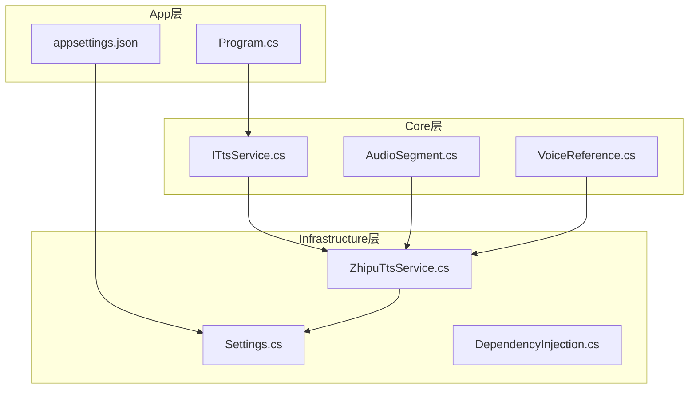
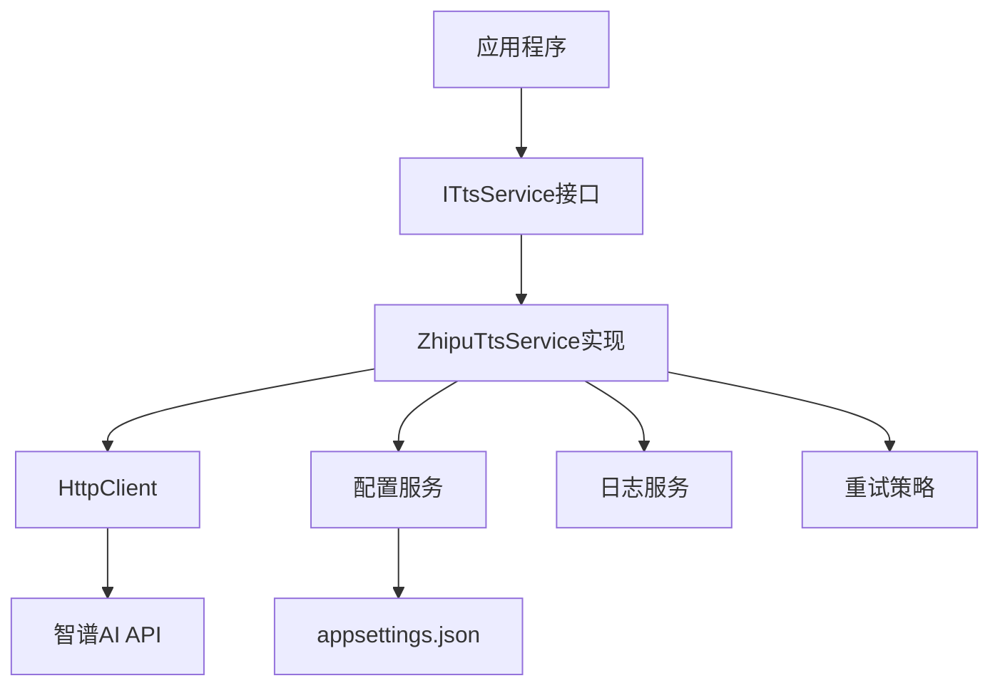
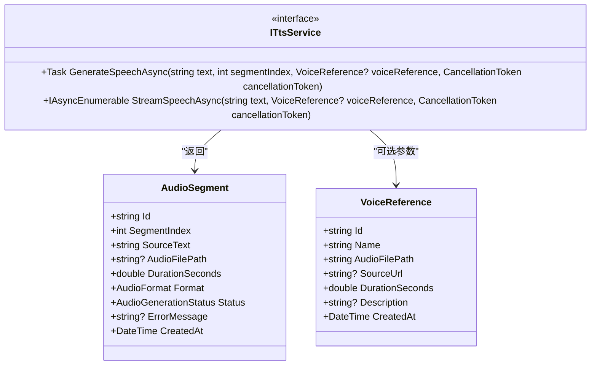
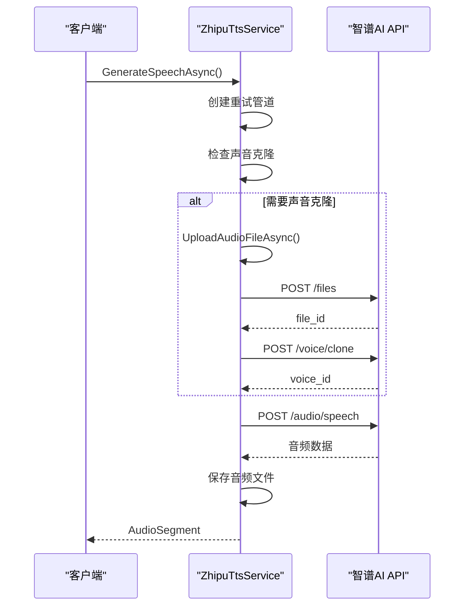
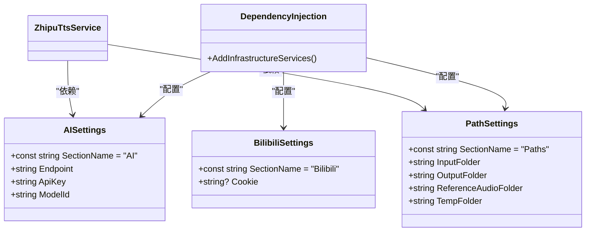
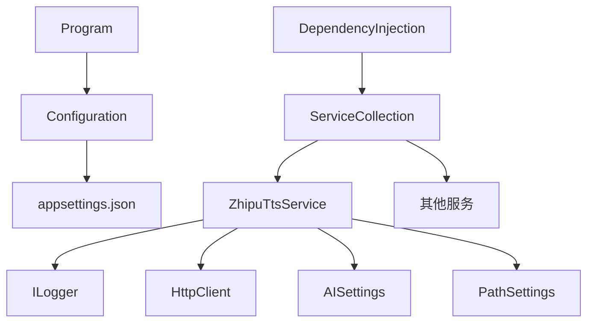

# AI语音合成

<cite>
**本文档引用的文件**   
- [ITtsService.cs](file://src/Core/Interfaces/ITtsService.cs)
- [ZhipuTtsService.cs](file://src/Infrastructure/Services/ZhipuTtsService.cs)
- [appsettings.json](file://src/App/appsettings.json)
- [Settings.cs](file://src/Infrastructure/Configuration/Settings.cs)
- [AudioSegment.cs](file://src/Core/Entities/AudioSegment.cs)
- [VoiceReference.cs](file://src/Core/Entities/VoiceReference.cs)
- [DependencyInjection.cs](file://src/Infrastructure/DependencyInjection.cs)
- [Program.cs](file://src/App/Program.cs)
</cite>

## 目录
1. [简介](#简介)
2. [项目结构](#项目结构)
3. [核心组件](#核心组件)
4. [架构概述](#架构概述)
5. [详细组件分析](#详细组件分析)
6. [依赖分析](#依赖分析)
7. [性能考虑](#性能考虑)
8. [故障排除指南](#故障排除指南)
9. [结论](#结论)

## 简介
本文档全面介绍基于智谱GLM-TTS的语音合成功能。重点说明ITtsService接口的设计原则与ZhipuTtsService的具体实现，包括如何通过HTTP客户端调用智谱AI API进行文本到语音的转换。文档详细描述了请求构造、身份验证（API Key）、模型参数（model_id）配置及流式响应处理机制。结合appsettings.json中的AI配置项，说明端点、密钥等设置的加载方式。同时提供调用示例代码，并分析错误处理、响应延迟和音频质量控制等关键问题。

## 项目结构
本项目采用分层架构设计，主要分为App、Core和Infrastructure三个层次。App层包含应用程序入口和配置文件；Core层定义了核心接口和实体；Infrastructure层实现了具体的服务和配置。这种分层结构确保了代码的可维护性和可扩展性。

**图示来源**
- [Program.cs](file://src/App/Program.cs#L1-L291)
- [ITtsService.cs](file://src/Core/Interfaces/ITtsService.cs#L1-L25)
- [ZhipuTtsService.cs](file://src/Infrastructure/Services/ZhipuTtsService.cs#L1-L391)
- [Settings.cs](file://src/Infrastructure/Configuration/Settings.cs#L1-L66)

**本节来源**
- [Program.cs](file://src/App/Program.cs#L1-L291)
- [project_structure](#project_structure)

## 核心组件

ITtsService接口定义了文本转语音服务的核心功能，包括同步生成和流式生成两种模式。ZhipuTtsService类实现了该接口，通过调用智谱AI的GLM-TTS API提供语音合成功能。系统还包含AudioSegment实体用于管理音频片段，以及VoiceReference实体用于声音克隆参考。

**本节来源**
- [ITtsService.cs](file://src/Core/Interfaces/ITtsService.cs#L1-L25)
- [ZhipuTtsService.cs](file://src/Infrastructure/Services/ZhipuTtsService.cs#L1-L391)
- [AudioSegment.cs](file://src/Core/Entities/AudioSegment.cs#L1-L74)
- [VoiceReference.cs](file://src/Core/Entities/VoiceReference.cs#L1-L43)

## 架构概述

系统采用依赖注入模式，通过配置文件加载AI服务参数，并使用HttpClient进行API调用。整体架构包括配置管理、HTTP客户端、日志记录和重试机制等关键组件。

**图示来源**
- [ZhipuTtsService.cs](file://src/Infrastructure/Services/ZhipuTtsService.cs#L8-L12)
- [DependencyInjection.cs](file://src/Infrastructure/DependencyInjection.cs#L22-L24)
- [Settings.cs](file://src/Infrastructure/Configuration/Settings.cs#L6-L24)

## 详细组件分析

### ITtsService接口分析
ITtsService接口定义了文本转语音服务的契约，包含两个主要方法：GenerateSpeechAsync用于同步生成音频，StreamSpeechAsync用于流式生成音频。

**图示来源**
- [ITtsService.cs](file://src/Core/Interfaces/ITtsService.cs#L6-L25)
- [AudioSegment.cs](file://src/Core/Entities/AudioSegment.cs#L6-L74)
- [VoiceReference.cs](file://src/Core/Entities/VoiceReference.cs#L6-L43)

### ZhipuTtsService实现分析
ZhipuTtsService类实现了ITtsService接口，通过调用智谱AI的API提供语音合成功能。实现中包含了重试策略、声音克隆、文件上传等复杂逻辑。

**图示来源**
- [ZhipuTtsService.cs](file://src/Infrastructure/Services/ZhipuTtsService.cs#L35-L81)
- [ZhipuTtsService.cs](file://src/Infrastructure/Services/ZhipuTtsService.cs#L144-L259)
- [ZhipuTtsService.cs](file://src/Infrastructure/Services/ZhipuTtsService.cs#L264-L278)

### 配置管理分析
系统通过AISettings类管理AI服务配置，包括端点、API密钥和模型ID等参数。配置通过依赖注入方式注入到服务中。

**图示来源**
- [Settings.cs](file://src/Infrastructure/Configuration/Settings.cs#L6-L65)
- [DependencyInjection.cs](file://src/Infrastructure/DependencyInjection.cs#L16-L18)

**本节来源**
- [ITtsService.cs](file://src/Core/Interfaces/ITtsService.cs#L1-L25)
- [ZhipuTtsService.cs](file://src/Infrastructure/Services/ZhipuTtsService.cs#L1-L391)
- [appsettings.json](file://src/App/appsettings.json#L1-L24)
- [Settings.cs](file://src/Infrastructure/Configuration/Settings.cs#L1-L66)

## 依赖分析

系统依赖关系清晰，各组件之间耦合度低。通过依赖注入容器管理服务生命周期和依赖关系。

**图示来源**
- [ZhipuTtsService.cs](file://src/Infrastructure/Services/ZhipuTtsService.cs#L8-L12)
- [DependencyInjection.cs](file://src/Infrastructure/DependencyInjection.cs#L22-L24)
- [Program.cs](file://src/App/Program.cs#L38-L43)

**本节来源**
- [ZhipuTtsService.cs](file://src/Infrastructure/Services/ZhipuTtsService.cs#L1-L391)
- [DependencyInjection.cs](file://src/Infrastructure/DependencyInjection.cs#L1-L33)
- [Program.cs](file://src/App/Program.cs#L1-L291)

## 性能考虑
系统在性能方面做了多项优化：
1. 使用Polly库实现重试策略，处理网络不稳定情况
2. 缓存已克隆的声音ID，避免重复克隆
3. 使用流式处理减少内存占用
4. 异步编程模型提高并发性能

对于大量文本处理，建议使用分段处理策略，将长文本分割为多个小段落分别生成语音，然后合并结果。这样可以降低单次请求的复杂度，提高成功率。

## 故障排除指南
常见问题及解决方案：

1. **API调用失败**：检查appsettings.json中的API密钥是否正确，确保网络连接正常
2. **声音克隆失败**：确认参考音频文件存在且格式正确，检查音频文件大小是否符合要求
3. **响应延迟高**：考虑文本长度是否过长，建议将文本分割为500字符左右的段落
4. **音频质量不佳**：尝试调整语速、音量等参数，或使用不同的声音模型

**本节来源**
- [ZhipuTtsService.cs](file://src/Infrastructure/Services/ZhipuTtsService.cs#L73-L78)
- [ZhipuTtsService.cs](file://src/Infrastructure/Services/ZhipuTtsService.cs#L178-L183)
- [ZhipuTtsService.cs](file://src/Infrastructure/Services/ZhipuTtsService.cs#L239-L244)

## 结论
基于智谱GLM-TTS的语音合成系统提供了完整的文本转语音解决方案。通过清晰的接口设计和模块化实现，系统具有良好的可扩展性和可维护性。结合配置管理和依赖注入，使得系统易于部署和配置。未来可以考虑增加更多声音模型支持、优化音频编码格式以及增强错误处理机制。