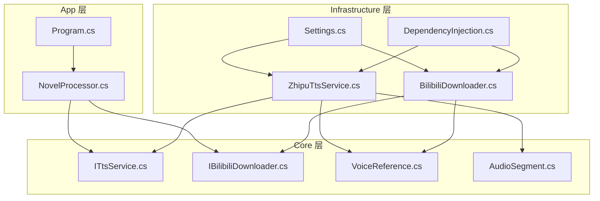
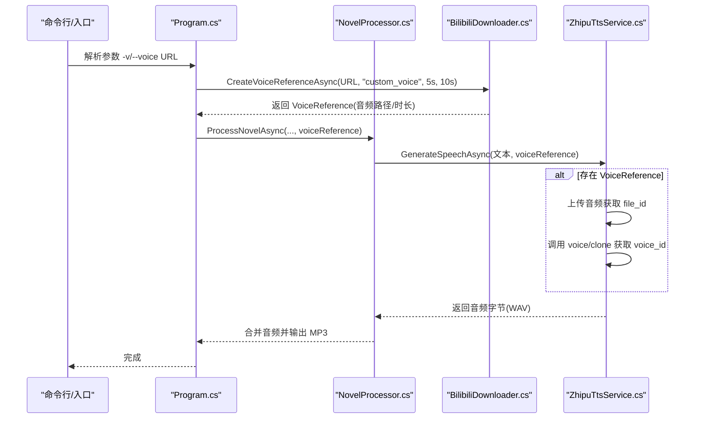
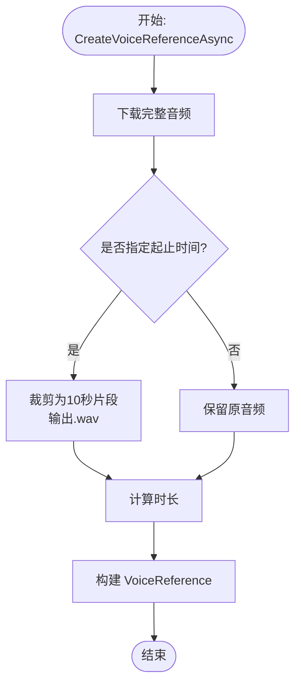
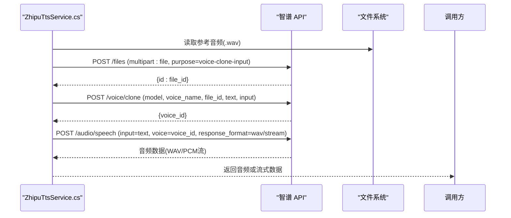
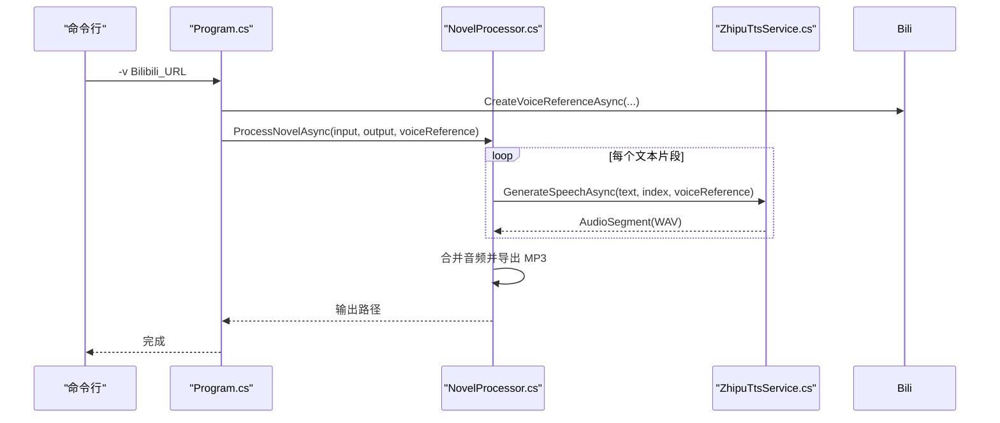
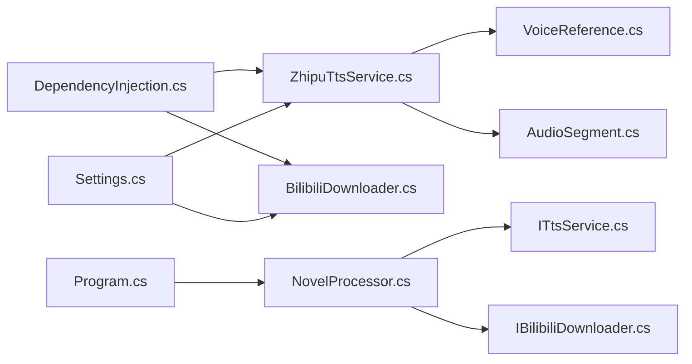

# 声音克隆

<cite>
**本文引用的文件**
- [README.md](file://README.md)
- [Agent&Chat.md](file://docs/Agent&Chat.md)
- [Program.cs](file://src/App/Program.cs)
- [NovelProcessor.cs](file://src/App/Services/NovelProcessor.cs)
- [BilibiliDownloader.cs](file://src/Infrastructure/Services/BilibiliDownloader.cs)
- [ZhipuTtsService.cs](file://src/Infrastructure/Services/ZhipuTtsService.cs)
- [IBilibiliDownloader.cs](file://src/Core/Interfaces/IBilibiliDownloader.cs)
- [ITtsService.cs](file://src/Core/Interfaces/ITtsService.cs)
- [VoiceReference.cs](file://src/Core/Entities/VoiceReference.cs)
- [AudioSegment.cs](file://src/Core/Entities/AudioSegment.cs)
- [Settings.cs](file://src/Infrastructure/Configuration/Settings.cs)
- [DependencyInjection.cs](file://src/Infrastructure/DependencyInjection.cs)
</cite>

## 目录
1. [简介](#简介)
2. [项目结构](#项目结构)
3. [核心组件](#核心组件)
4. [架构总览](#架构总览)
5. [详细组件分析](#详细组件分析)
6. [依赖关系分析](#依赖关系分析)
7. [性能与可靠性](#性能与可靠性)
8. [故障排查指南](#故障排查指南)
9. [结论](#结论)
10. [附录](#附录)

## 简介
本文件围绕“声音克隆”能力，系统梳理从 Bilibili 视频提取参考音频、上传至智谱 AI 获取 file_id、调用 voice/clone 接口创建音色并获得 voice_id，最终在 TTS 请求中使用该 voice_id 生成克隆语音的完整四步流程。结合 README.md 与 Agent&Chat.md 中的业务流程图，说明各服务间的协作关系，并提供 HttpClient 调用、音频上传格式要求、错误重试策略与常见失败原因的指导。

## 项目结构
项目采用 Clean Architecture 分层：
- Core 层：领域实体与接口（如 ITtsService、IBilibiliDownloader、VoiceReference、AudioSegment）
- Infrastructure 层：具体实现（如 ZhipuTtsService、BilibiliDownloader、配置 Settings、DI 扩展）
- App 层：应用入口与业务编排（如 Program、NovelProcessor）

图表来源
- [Program.cs](file://src/App/Program.cs#L148-L192)
- [NovelProcessor.cs](file://src/App/Services/NovelProcessor.cs#L14-L62)
- [ZhipuTtsService.cs](file://src/Infrastructure/Services/ZhipuTtsService.cs#L1-L120)
- [BilibiliDownloader.cs](file://src/Infrastructure/Services/BilibiliDownloader.cs#L1-L90)
- [Settings.cs](file://src/Infrastructure/Configuration/Settings.cs#L1-L66)
- [DependencyInjection.cs](file://src/Infrastructure/DependencyInjection.cs#L1-L33)

章节来源
- [README.md](file://README.md#L31-L68)
- [DependencyInjection.cs](file://src/Infrastructure/DependencyInjection.cs#L1-L33)

## 核心组件
- 声音参考实体：封装参考音频路径、来源 URL、时长等元数据，供 TTS 服务使用。
- 音频片段实体：承载每个文本片段的生成结果（文件路径、时长、状态、错误信息）。
- 文本转语音接口：定义同步生成与流式生成两种能力，支持传入 VoiceReference。
- Bilibili 下载器接口与实现：负责从 B 站提取音频、按起止时间裁剪、生成 VoiceReference。
- 智谱 TTS 服务：封装上传文件、音色克隆、TTS 生成与流式输出，内置重试策略。

章节来源
- [VoiceReference.cs](file://src/Core/Entities/VoiceReference.cs#L1-L43)
- [AudioSegment.cs](file://src/Core/Entities/AudioSegment.cs#L1-L74)
- [ITtsService.cs](file://src/Core/Interfaces/ITtsService.cs#L1-L25)
- [IBilibiliDownloader.cs](file://src/Core/Interfaces/IBilibiliDownloader.cs#L1-L26)
- [BilibiliDownloader.cs](file://src/Infrastructure/Services/BilibiliDownloader.cs#L1-L90)
- [ZhipuTtsService.cs](file://src/Infrastructure/Services/ZhipuTtsService.cs#L1-L120)

## 架构总览
声音克隆的端到端流程如下：
1) 从 Bilibili 下载并提取参考音频（10 秒片段），生成 VoiceReference
2) 上传参考音频至智谱 API 获取 file_id（purpose: voice-clone-input）
3) 调用 voice/clone 接口创建音色并获得 voice_id
4) 在 TTS 请求中使用 voice_id 生成克隆语音

图表来源
- [Program.cs](file://src/App/Program.cs#L148-L192)
- [NovelProcessor.cs](file://src/App/Services/NovelProcessor.cs#L14-L62)
- [BilibiliDownloader.cs](file://src/Infrastructure/Services/BilibiliDownloader.cs#L49-L90)
- [ZhipuTtsService.cs](file://src/Infrastructure/Services/ZhipuTtsService.cs#L144-L259)

章节来源
- [README.md](file://README.md#L151-L163)
- [Program.cs](file://src/App/Program.cs#L148-L192)
- [NovelProcessor.cs](file://src/App/Services/NovelProcessor.cs#L14-L62)

## 详细组件分析

### BilibiliDownloader：参考音频提取与裁剪
职责
- 从 Bilibili URL 提取 BV 号，查询视频信息与可用音频流，下载最高质量音频
- 可选按起止时间裁剪为 10 秒片段，生成 VoiceReference

关键点
- 使用 HttpClient 发送带 Referer/User-Agent 的请求，必要时携带 Cookie
- 支持按起止时间裁剪，返回 WAV 文件路径
- 生成 VoiceReference，包含名称、音频路径、来源 URL、时长

图表来源
- [BilibiliDownloader.cs](file://src/Infrastructure/Services/BilibiliDownloader.cs#L49-L90)

章节来源
- [BilibiliDownloader.cs](file://src/Infrastructure/Services/BilibiliDownloader.cs#L1-L176)
- [IBilibiliDownloader.cs](file://src/Core/Interfaces/IBilibiliDownloader.cs#L1-L26)

### ZhipuTtsService：音色克隆与 TTS 生成
职责
- 生成音频：支持同步生成（返回 WAV 字节）与流式生成（实时输出 PCM）
- 音色克隆：上传参考音频获取 file_id，调用 voice/clone 获取 voice_id，并缓存
- 重试策略：使用 Polly 对网络异常与超时进行指数退避重试

关键点
- 上传音频：multipart/form-data，Content-Type 为 audio/wav，字段 file 与 purpose=voice-clone-input
- 克隆音色：voice/clone 请求包含 model、voice_name、file_id、text、input
- TTS 请求：audio/speech，voice 字段使用 voice_id 或默认 female
- 流式输出：audio/speech 设置 stream=true，按行读取 data: JSON，解析 choices.delta.content(Base64)

图表来源
- [ZhipuTtsService.cs](file://src/Infrastructure/Services/ZhipuTtsService.cs#L213-L293)
- [ZhipuTtsService.cs](file://src/Infrastructure/Services/ZhipuTtsService.cs#L232-L259)
- [ZhipuTtsService.cs](file://src/Infrastructure/Services/ZhipuTtsService.cs#L144-L188)
- [ZhipuTtsService.cs](file://src/Infrastructure/Services/ZhipuTtsService.cs#L83-L142)

章节来源
- [ZhipuTtsService.cs](file://src/Infrastructure/Services/ZhipuTtsService.cs#L1-L391)
- [ITtsService.cs](file://src/Core/Interfaces/ITtsService.cs#L1-L25)

### 应用入口与业务编排：Program 与 NovelProcessor
职责
- Program：解析命令行参数，按需创建 VoiceReference，调用 NovelProcessor 执行批处理或单文件处理
- NovelProcessor：读取小说、分段、逐段调用 TTS 生成音频、合并音频并清理临时文件

图表来源
- [Program.cs](file://src/App/Program.cs#L148-L192)
- [NovelProcessor.cs](file://src/App/Services/NovelProcessor.cs#L14-L62)
- [ZhipuTtsService.cs](file://src/Infrastructure/Services/ZhipuTtsService.cs#L144-L188)

章节来源
- [Program.cs](file://src/App/Program.cs#L148-L192)
- [NovelProcessor.cs](file://src/App/Services/NovelProcessor.cs#L14-L62)

## 依赖关系分析
- 依赖注入：通过 AddHttpClient 注册 ITtsService、IBilibiliDownloader、INovelReader 等，便于在各层间解耦
- 配置：AISettings、BilibiliSettings、PathSettings 通过 IOptions 注入，集中管理端点、密钥与路径
- 组件耦合：App 层仅依赖 Core 接口；Infrastructure 层实现接口；Core 层不依赖具体实现，符合 Clean Architecture

图表来源
- [DependencyInjection.cs](file://src/Infrastructure/DependencyInjection.cs#L1-L33)
- [Settings.cs](file://src/Infrastructure/Configuration/Settings.cs#L1-L66)
- [Program.cs](file://src/App/Program.cs#L148-L192)
- [NovelProcessor.cs](file://src/App/Services/NovelProcessor.cs#L14-L62)

章节来源
- [DependencyInjection.cs](file://src/Infrastructure/DependencyInjection.cs#L1-L33)
- [Settings.cs](file://src/Infrastructure/Configuration/Settings.cs#L1-L66)

## 性能与可靠性
- 重试策略：使用 Polly 的指数退避重试，处理 HttpRequestException 与 TaskCanceledException，避免瞬时网络波动导致失败
- 并发与进度：NovelProcessor 逐段生成音频，支持取消令牌；流式 TTS 可边生成边输出，降低等待时间
- 缓存：ZhipuTtsService 缓存 voice_id，避免重复克隆
- I/O：使用异步文件读写与流式复制，减少阻塞

章节来源
- [ZhipuTtsService.cs](file://src/Infrastructure/Services/ZhipuTtsService.cs#L21-L33)
- [ZhipuTtsService.cs](file://src/Infrastructure/Services/ZhipuTtsService.cs#L144-L188)
- [NovelProcessor.cs](file://src/App/Services/NovelProcessor.cs#L14-L62)

## 故障排查指南
常见失败原因
- 音频质量不足：参考音频过短、背景噪音大、说话者与目标不一致，导致克隆效果差或无法克隆
- API 配额限制：智谱 API 的调用次数或并发受限，出现 429/402 等错误
- 网络不稳定：DNS 解析失败、连接超时、TLS 握手异常
- 文件格式不符：上传音频需为 WAV（Content-Type: audio/wav），且 purpose=voice-clone-input
- B 站访问限制：部分视频无高清音频流、Cookie 缺失导致无法获取音频流

排查步骤
- 检查 appsettings.json 的 AI 端点与 API Key 是否正确
- 确认参考音频时长与清晰度，建议使用 10 秒内清晰的人声片段
- 观察日志中 HTTP 状态码与错误消息，定位失败阶段（上传/克隆/TTS）
- 若出现配额限制，适当降低并发或等待配额恢复
- 如 B 站下载失败，确认 URL 正确、Cookie 配置有效

章节来源
- [README.md](file://README.md#L79-L104)
- [ZhipuTtsService.cs](file://src/Infrastructure/Services/ZhipuTtsService.cs#L261-L293)
- [BilibiliDownloader.cs](file://src/Infrastructure/Services/BilibiliDownloader.cs#L140-L168)

## 结论
本项目通过 Clean Architecture 将“声音克隆”的四个关键环节（下载参考音频、上传获取 file_id、克隆音色、TTS 生成）清晰拆分并实现：
- Program 与 NovelProcessor 负责业务编排与进度控制
- BilibiliDownloader 负责素材获取与裁剪
- ZhipuTtsService 负责与智谱 API 的交互、音色克隆与音频生成，并内置重试与缓存

该设计既保证了可维护性，又提供了良好的扩展空间（例如更换 TTS 供应商、替换下载器实现）。

## 附录

### 四步流程要点与最佳实践
- 下载与裁剪：使用 5~15 秒内清晰的人声片段，避免静音或环境噪声
- 上传格式：multipart/form-data，file 字段为 WAV，purpose=voice-clone-input
- 克隆接口：voice/clone 需要 file_id、voice_name、text、input；成功后缓存 voice_id
- TTS 请求：audio/speech 的 voice 字段使用 voice_id；若为空则回退到默认音色
- 错误重试：对网络异常与超时进行指数退避重试，避免瞬时失败影响整体

章节来源
- [README.md](file://README.md#L151-L163)
- [BilibiliDownloader.cs](file://src/Infrastructure/Services/BilibiliDownloader.cs#L49-L90)
- [ZhipuTtsService.cs](file://src/Infrastructure/Services/ZhipuTtsService.cs#L213-L293)
- [ZhipuTtsService.cs](file://src/Infrastructure/Services/ZhipuTtsService.cs#L144-L188)