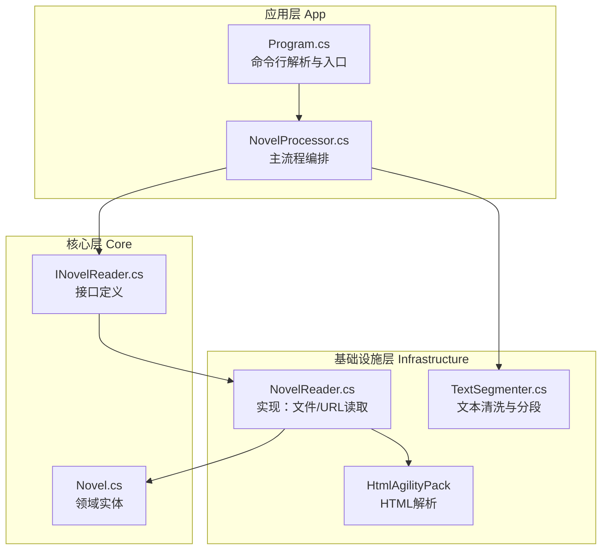
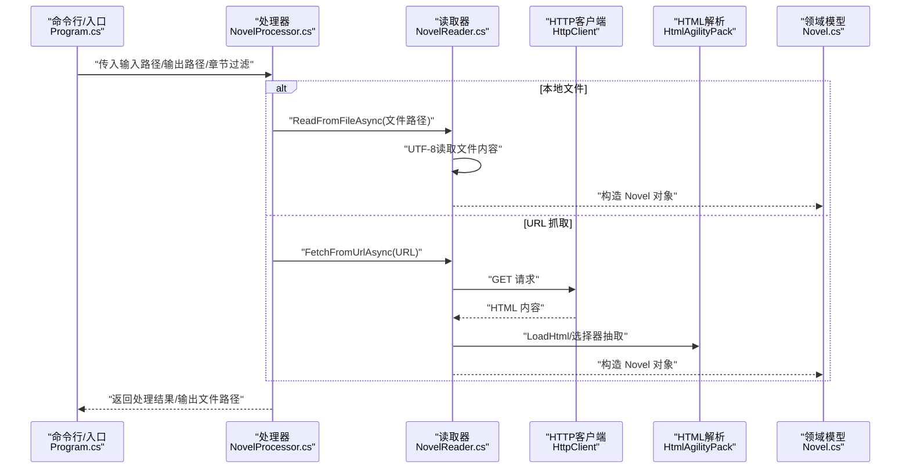
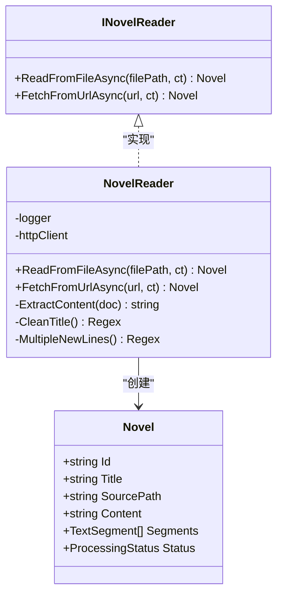
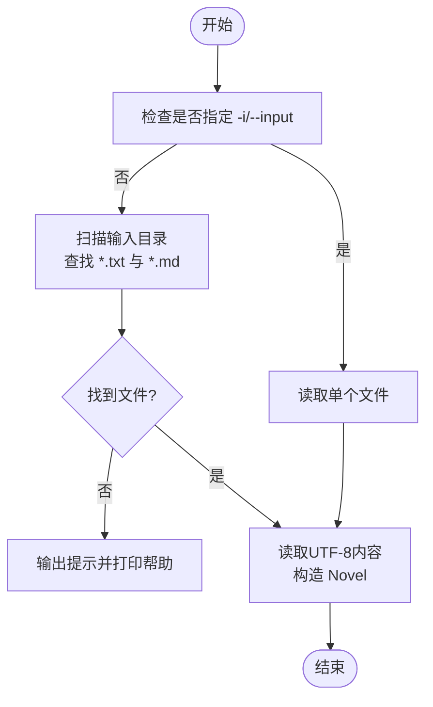
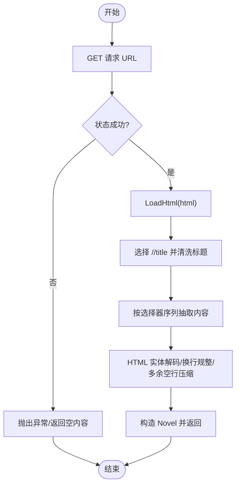
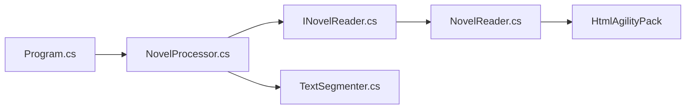

# 小说文本读取

<cite>
**本文引用的文件**
- [README.md](file://README.md)
- [INovelReader.cs](file://src/Core/Interfaces/INovelReader.cs)
- [NovelReader.cs](file://src/Infrastructure/Services/NovelReader.cs)
- [Novel.cs](file://src/Core/Entities/Novel.cs)
- [Program.cs](file://src/App/Program.cs)
- [NovelProcessor.cs](file://src/App/Services/NovelProcessor.cs)
- [TextSegmenter.cs](file://src/Infrastructure/Services/TextSegmenter.cs)
- [NovelTTSApp.Infrastructure.csproj](file://src/Infrastructure/NovelTTSApp.Infrastructure.csproj)
- [GlobalUsings.cs](file://src/Infrastructure/GlobalUsings.cs)
</cite>

## 目录
1. [简介](#简介)
2. [项目结构](#项目结构)
3. [核心组件](#核心组件)
4. [架构总览](#架构总览)
5. [详细组件分析](#详细组件分析)
6. [依赖关系分析](#依赖关系分析)
7. [性能考量](#性能考量)
8. [故障排查指南](#故障排查指南)
9. [结论](#结论)
10. [附录](#附录)

## 简介
本节聚焦 NovelTTSApp 的“小说文本读取”能力，涵盖：
- 本地 .txt 与 .md 文件读取
- 通过 HtmlAgilityPack 从 URL 抓取网页内容
- INovelReader 接口契约与 NovelReader 实现
- 异步读取、字符编码处理与 HTML 清洗逻辑
- 命令行参数与文件路径解析、网络请求处理
- 常见问题（编码错误、网络超时）的定位与解决思路

## 项目结构
小说文本读取位于基础设施层（Infrastructure），通过接口隔离与实现解耦，应用层（App）仅依赖接口进行编排。

图表来源
- [Program.cs](file://src/App/Program.cs#L70-L207)
- [NovelProcessor.cs](file://src/App/Services/NovelProcessor.cs#L13-L33)
- [INovelReader.cs](file://src/Core/Interfaces/INovelReader.cs#L6-L17)
- [NovelReader.cs](file://src/Infrastructure/Services/NovelReader.cs#L11-L64)
- [TextSegmenter.cs](file://src/Infrastructure/Services/TextSegmenter.cs#L35-L127)
- [NovelTTSApp.Infrastructure.csproj](file://src/Infrastructure/NovelTTSApp.Infrastructure.csproj#L1-L21)

章节来源
- [README.md](file://README.md#L188-L191)
- [Program.cs](file://src/App/Program.cs#L70-L207)
- [INovelReader.cs](file://src/Core/Interfaces/INovelReader.cs#L6-L17)
- [NovelReader.cs](file://src/Infrastructure/Services/NovelReader.cs#L11-L64)
- [TextSegmenter.cs](file://src/Infrastructure/Services/TextSegmenter.cs#L35-L127)
- [NovelTTSApp.Infrastructure.csproj](file://src/Infrastructure/NovelTTSApp.Infrastructure.csproj#L1-L21)

## 核心组件
- INovelReader 接口：定义从文件与 URL 读取小说的异步契约，返回 Novel 实体。
- NovelReader 实现：负责本地文件 UTF-8 读取与远程 HTML 抓取、标题清洗、内容抽取与 HTML 清洗。
- Novel 实体：承载标题、源路径、内容等字段，供后续分段与 TTS 使用。
- 应用入口 Program：解析命令行参数，决定批量处理或单文件处理，并调用处理器。
- 文本清洗 TextSegmenter：在读取后对内容进行进一步清洗与分段。

章节来源
- [INovelReader.cs](file://src/Core/Interfaces/INovelReader.cs#L6-L17)
- [NovelReader.cs](file://src/Infrastructure/Services/NovelReader.cs#L11-L64)
- [Novel.cs](file://src/Core/Entities/Novel.cs#L6-L47)
- [Program.cs](file://src/App/Program.cs#L70-L207)
- [TextSegmenter.cs](file://src/Infrastructure/Services/TextSegmenter.cs#L35-L127)

## 架构总览
小说读取的端到端流程如下：

图表来源
- [Program.cs](file://src/App/Program.cs#L175-L207)
- [NovelProcessor.cs](file://src/App/Services/NovelProcessor.cs#L13-L33)
- [NovelReader.cs](file://src/Infrastructure/Services/NovelReader.cs#L11-L64)
- [Novel.cs](file://src/Core/Entities/Novel.cs#L6-L47)

## 详细组件分析

### INovelReader 接口与 NovelReader 实现
- 接口职责
  - ReadFromFileAsync：从本地路径读取小说文本，返回 Novel。
  - FetchFromUrlAsync：从 URL 抓取网页内容，返回 Novel。
- 实现要点
  - 本地读取：使用 UTF-8 编码读取文件内容，设置标题为文件名（不含扩展名），记录源路径为文件路径。
  - URL 抓取：发送 HTTP GET 请求，确保成功状态，加载 HTML，抽取标题与正文，进行 HTML 清洗与换行规整，返回 Novel。
  - 标题清洗：移除标题中多余的空白、连字符、下划线及后缀部分。
  - 内容抽取：按常见选择器顺序尝试匹配，优先选取正文容器节点；若未命中则回退到 body 文本。
  - HTML 清洗：对内联换行标签进行换行规范化，使用 HTML 解码还原实体，去除多余空行。

图表来源
- [INovelReader.cs](file://src/Core/Interfaces/INovelReader.cs#L6-L17)
- [NovelReader.cs](file://src/Infrastructure/Services/NovelReader.cs#L11-L103)
- [Novel.cs](file://src/Core/Entities/Novel.cs#L6-L47)

章节来源
- [INovelReader.cs](file://src/Core/Interfaces/INovelReader.cs#L6-L17)
- [NovelReader.cs](file://src/Infrastructure/Services/NovelReader.cs#L11-L64)
- [NovelReader.cs](file://src/Infrastructure/Services/NovelReader.cs#L66-L96)
- [NovelReader.cs](file://src/Infrastructure/Services/NovelReader.cs#L98-L103)
- [Novel.cs](file://src/Core/Entities/Novel.cs#L6-L47)

### 本地文件读取（.txt 与 .md）
- 文件发现与筛选
  - 应用层在指定搜索路径下查找 .txt 与 .md 文件，按路径排序后处理。
- 读取与建模
  - 使用 UTF-8 编码读取文件内容，标题取自文件名（不含扩展名），源路径为文件绝对路径，内容直接存入 Novel。
- 命令行参数
  - -i/--input 指定单个文件；未指定时按章节过滤或默认扫描输入目录。

图表来源
- [Program.cs](file://src/App/Program.cs#L131-L143)
- [Program.cs](file://src/App/Program.cs#L175-L207)
- [NovelReader.cs](file://src/Infrastructure/Services/NovelReader.cs#L11-L32)

章节来源
- [Program.cs](file://src/App/Program.cs#L131-L143)
- [Program.cs](file://src/App/Program.cs#L175-L207)
- [NovelReader.cs](file://src/Infrastructure/Services/NovelReader.cs#L11-L32)

### URL 抓取与 HTML 清洗
- 网络请求
  - 使用 HttpClient 发送 GET 请求，确保状态成功后读取响应内容。
- HTML 解析与内容抽取
  - 使用 HtmlDocument 加载 HTML，先尝试常见选择器（如 id/content、class/content、article、章节容器等），命中即抽取内联文本并进行清洗。
  - 若均未命中，回退到 body 文本。
- 标题与内容清洗
  - 标题：移除空白、连字符、下划线及后缀，保留核心标题。
  - 内容：HTML 实体解码、换行规范化、多余空行压缩、HTML 标签清理。

图表来源
- [NovelReader.cs](file://src/Infrastructure/Services/NovelReader.cs#L35-L64)
- [NovelReader.cs](file://src/Infrastructure/Services/NovelReader.cs#L66-L96)
- [NovelReader.cs](file://src/Infrastructure/Services/NovelReader.cs#L98-L103)

章节来源
- [NovelReader.cs](file://src/Infrastructure/Services/NovelReader.cs#L35-L64)
- [NovelReader.cs](file://src/Infrastructure/Services/NovelReader.cs#L66-L96)
- [NovelReader.cs](file://src/Infrastructure/Services/NovelReader.cs#L98-L103)

### 字符编码处理
- 本地文件读取
  - 使用 UTF-8 编码读取，避免非 UTF-8 文件导致的乱码。
- URL 抓取
  - 读取响应字符串后，直接进行 HTML 解析与清洗；若目标站点实际编码非 UTF-8，建议在读取后根据响应头或内容特征进行转码（当前实现未显式处理响应编码）。

章节来源
- [NovelReader.cs](file://src/Infrastructure/Services/NovelReader.cs#L11-L32)
- [NovelReader.cs](file://src/Infrastructure/Services/NovelReader.cs#L35-L64)

### 文本清洗与分段（与读取衔接）
- 清洗策略
  - 移除 HTML 标签、多余空格与空行、特殊字符，保证 TTS 输入质量。
- 分段策略
  - 按句子边界切分长段落，控制每段最大长度，避免单次 TTS 输入过长。

章节来源
- [TextSegmenter.cs](file://src/Infrastructure/Services/TextSegmenter.cs#L35-L127)

## 依赖关系分析
- 外部库
  - HtmlAgilityPack：用于 HTML 解析与节点选择。
  - Microsoft.Extensions.Http：提供 HttpClient 的 DI 注册与配置。
- 内部依赖
  - INovelReader 作为接口被应用层依赖，NovelReader 作为实现注入。
  - TextSegmenter 在处理器中被调用，承接读取后的文本清洗与分段。

图表来源
- [Program.cs](file://src/App/Program.cs#L70-L207)
- [NovelProcessor.cs](file://src/App/Services/NovelProcessor.cs#L13-L33)
- [INovelReader.cs](file://src/Core/Interfaces/INovelReader.cs#L6-L17)
- [NovelReader.cs](file://src/Infrastructure/Services/NovelReader.cs#L11-L64)
- [TextSegmenter.cs](file://src/Infrastructure/Services/TextSegmenter.cs#L35-L127)

章节来源
- [NovelTTSApp.Infrastructure.csproj](file://src/Infrastructure/NovelTTSApp.Infrastructure.csproj#L1-L21)
- [GlobalUsings.cs](file://src/Infrastructure/GlobalUsings.cs#L1-L26)

## 性能考量
- I/O 与网络
  - 本地文件读取为同步磁盘 I/O，建议批量处理时按序读取，避免并发竞争。
  - URL 抓取受网络延迟与服务器限流影响，建议增加超时与重试策略（当前实现未内置重试）。
- HTML 解析
  - HtmlAgilityPack 解析开销与页面大小成正比，建议对大页面进行选择器优化与缓存。
- 文本清洗
  - 正则替换与字符串拼接可能产生中间对象，建议在高频场景下复用正则实例或减少重复操作。

[本节为通用指导，无需列出具体文件来源]

## 故障排查指南
- 编码错误
  - 现象：中文乱码或特殊字符异常。
  - 排查：确认本地文件是否为 UTF-8；若非 UTF-8，需在读取后按响应头或内容特征进行转码。
  - 参考位置：本地读取使用 UTF-8；URL 抓取未显式处理响应编码。
- 网络超时/连接失败
  - 现象：FetchFromUrlAsync 抛出异常或长时间无响应。
  - 排查：检查网络连通性、目标站点可达性、代理设置；为 HttpClient 配置超时与重试。
  - 参考位置：网络请求与状态校验。
- 选择器未命中导致内容为空
  - 现象：抽取内容为空或过短。
  - 排查：确认目标站点结构是否发生变化；可在实现中增加更多选择器或回退策略。
- 文件不存在
  - 现象：ReadFromFileAsync 抛出文件未找到异常。
  - 排查：确认输入路径正确且文件存在；检查工作目录与相对路径解析。

章节来源
- [NovelReader.cs](file://src/Infrastructure/Services/NovelReader.cs#L11-L32)
- [NovelReader.cs](file://src/Infrastructure/Services/NovelReader.cs#L35-L64)
- [NovelReader.cs](file://src/Infrastructure/Services/NovelReader.cs#L66-L96)

## 结论
NovelTTSApp 的小说文本读取模块以 INovelReader 为契约，NovelReader 为实现，既支持本地 .txt/.md 文件的 UTF-8 读取，也支持基于 HtmlAgilityPack 的 URL 抓取与 HTML 清洗。应用层通过命令行参数灵活指定输入源，结合处理器完成后续分段与 TTS 流程。针对编码与网络稳定性问题，建议在现有实现基础上补充响应编码识别与重试机制，以提升鲁棒性。

[本节为总结性内容，无需列出具体文件来源]

## 附录

### 命令行参数与使用示例
- 参数
  - -i/--input：指定单个小说文件路径（.txt/.md）
  - -o/--output：指定输出音频文件路径（.mp3）
  - -c/--chapter：按章节关键词过滤
  - -l/--list：列出可用章节
  - -v/--voice：用于声音克隆的 Bilibili 视频 URL（可选）
  - -h/--help：显示帮助
- 示例
  - 单文件处理：指定 -i 与 -o
  - 带声音克隆：指定 -i 与 -v
  - 指定章节：使用 -c 过滤

章节来源
- [README.md](file://README.md#L118-L148)
- [Program.cs](file://src/App/Program.cs#L210-L245)