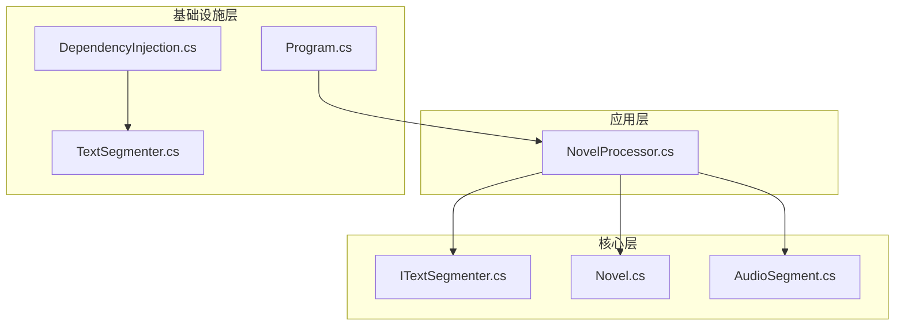
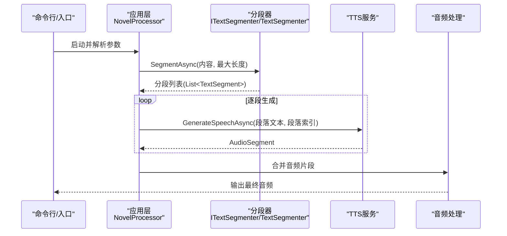
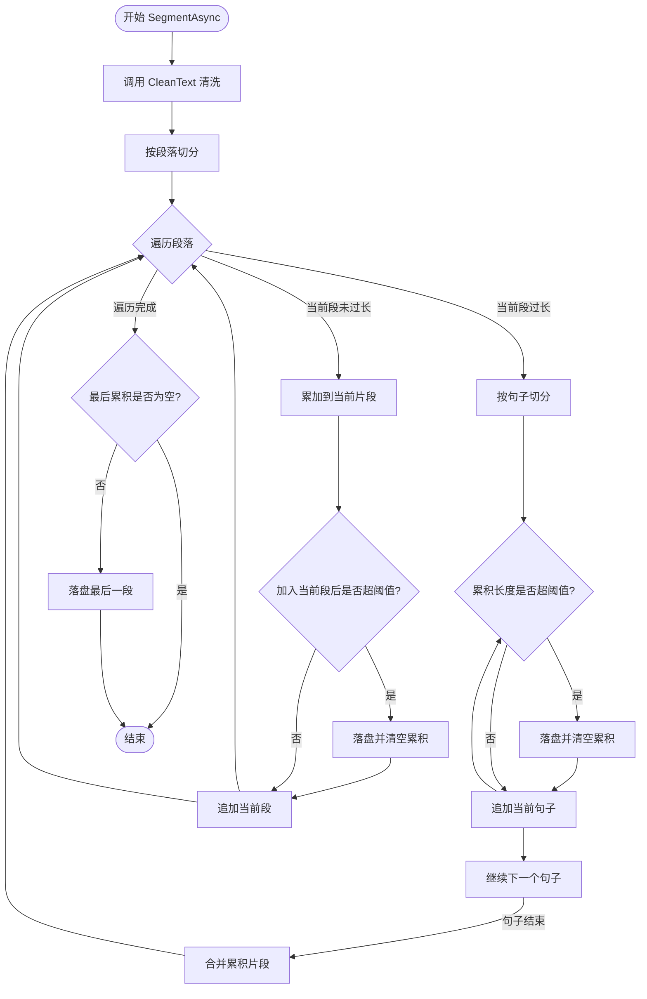
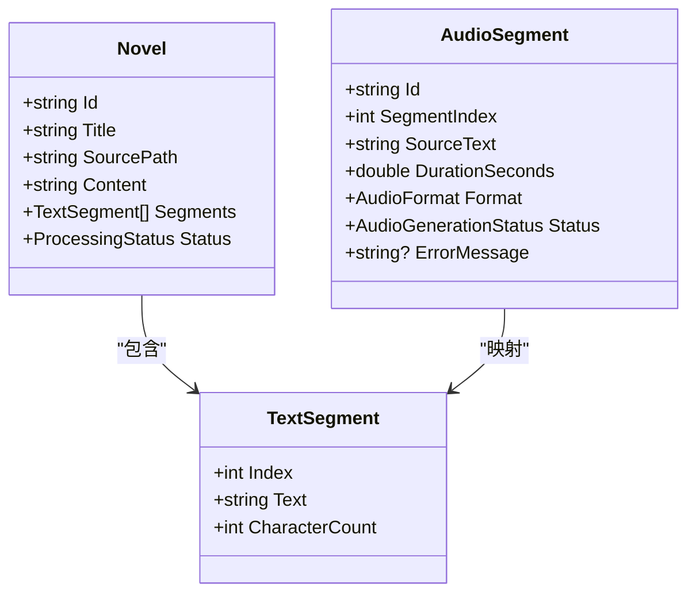
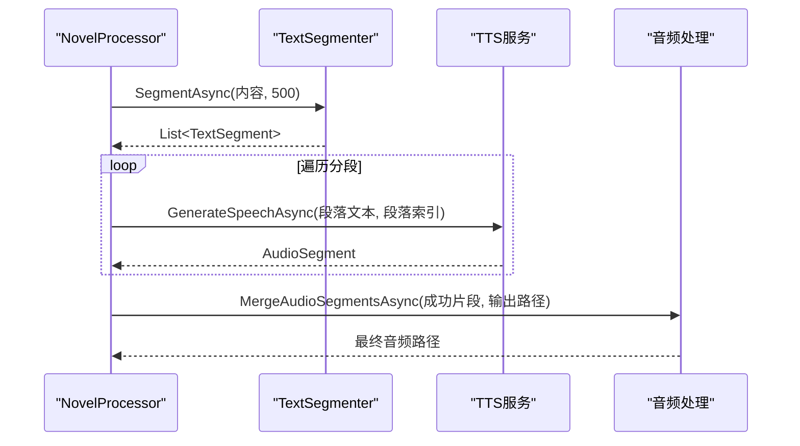
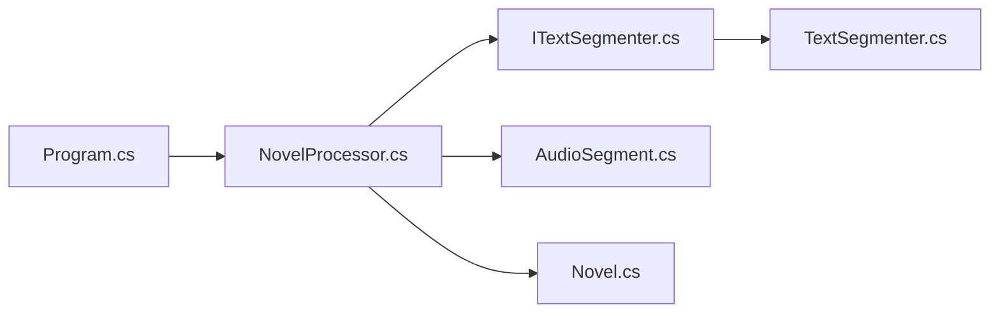

# 智能文本分段

<cite>
**本文引用的文件**
- [ITextSegmenter.cs](file://src/Core/Interfaces/ITextSegmenter.cs)
- [TextSegmenter.cs](file://src/Infrastructure/Services/TextSegmenter.cs)
- [Novel.cs](file://src/Core/Entities/Novel.cs)
- [AudioSegment.cs](file://src/Core/Entities/AudioSegment.cs)
- [NovelProcessor.cs](file://src/App/Services/NovelProcessor.cs)
- [DependencyInjection.cs](file://src/Infrastructure/DependencyInjection.cs)
- [Program.cs](file://src/App/Program.cs)
- [README.md](file://README.md)
</cite>

## 目录
1. [简介](#简介)
2. [项目结构](#项目结构)
3. [核心组件](#核心组件)
4. [架构总览](#架构总览)
5. [详细组件分析](#详细组件分析)
6. [依赖关系分析](#依赖关系分析)
7. [性能考量](#性能考量)
8. [故障排查指南](#故障排查指南)
9. [结论](#结论)
10. [附录](#附录)

## 简介
本文件围绕“智能文本分段”模块的设计与实现展开，重点说明：
- ITextSegmenter 接口如何定义文本分割契约；
- TextSegmenter 类如何基于语义规则（段落换行、句号等）将长篇小说内容切分为适合 TTS 处理的合理片段；
- 分段算法对特殊标点、对话文本和章节标题的处理策略；
- 正则表达式的应用与边界条件判断；
- 配置项说明（如最大片段长度限制）；
- 分段粒度对语音合成质量的影响及优化建议。

## 项目结构
该模块位于基础设施层（Infrastructure），通过接口隔离与依赖注入在应用层编排调用。核心文件包括：
- 接口定义：ITextSegmenter.cs
- 实现：TextSegmenter.cs
- 领域实体：TextSegment、AudioSegment、Novel
- 应用编排：NovelProcessor.cs
- 依赖注入：DependencyInjection.cs
- 程序入口与命令行参数：Program.cs
- 项目说明：README.md

图表来源
- [DependencyInjection.cs](file://src/Infrastructure/DependencyInjection.cs#L1-L33)
- [TextSegmenter.cs](file://src/Infrastructure/Services/TextSegmenter.cs#L1-L128)
- [ITextSegmenter.cs](file://src/Core/Interfaces/ITextSegmenter.cs#L1-L18)
- [Novel.cs](file://src/Core/Entities/Novel.cs#L1-L80)
- [AudioSegment.cs](file://src/Core/Entities/AudioSegment.cs#L1-L74)
- [NovelProcessor.cs](file://src/App/Services/NovelProcessor.cs#L1-L189)
- [Program.cs](file://src/App/Program.cs#L1-L291)

章节来源
- [README.md](file://README.md#L31-L70)
- [DependencyInjection.cs](file://src/Infrastructure/DependencyInjection.cs#L1-L33)

## 核心组件
- ITextSegmenter：定义文本分段与清洗的契约，提供 SegmentAsync 与 CleanText 两个关键方法。
- TextSegmenter：具体实现，负责按段落与句子进行切分，并在超过阈值时进行强制拆分；同时执行文本清洗。
- TextSegment：分段实体，包含索引与文本内容。
- AudioSegment：音频片段实体，用于承载 TTS 生成结果。
- Novel：小说实体，包含内容与分段集合。
- NovelProcessor：应用编排，负责读取小说、调用分段器、逐段生成音频并合并输出。

章节来源
- [ITextSegmenter.cs](file://src/Core/Interfaces/ITextSegmenter.cs#L1-L18)
- [TextSegmenter.cs](file://src/Infrastructure/Services/TextSegmenter.cs#L1-L128)
- [Novel.cs](file://src/Core/Entities/Novel.cs#L1-L80)
- [AudioSegment.cs](file://src/Core/Entities/AudioSegment.cs#L1-L74)
- [NovelProcessor.cs](file://src/App/Services/NovelProcessor.cs#L1-L189)

## 架构总览
文本分段在整体流程中处于“文本处理”阶段，紧邻“素材获取”与“AI 生成”之间。应用层通过依赖注入获取 ITextSegmenter 实例，调用 SegmentAsync 并传入最大片段长度阈值，随后进入 TTS 生成与后期合成。

图表来源
- [Program.cs](file://src/App/Program.cs#L1-L291)
- [NovelProcessor.cs](file://src/App/Services/NovelProcessor.cs#L1-L189)
- [TextSegmenter.cs](file://src/Infrastructure/Services/TextSegmenter.cs#L1-L128)

## 详细组件分析

### ITextSegmenter 接口与契约
- 方法职责
  - SegmentAsync：将长文本按语义与长度约束切分为多个 TextSegment。
  - CleanText：对输入文本进行清洗，去除 HTML 标签、多余空白、特殊字符等，提升 TTS 质量。
- 参数与返回
  - maxSegmentLength：最大片段长度，默认 500。
  - CancellationToken：支持取消。
  - 返回：Task<List<TextSegment>>。
- 设计要点
  - 契约明确、职责单一，便于替换实现与测试。
  - 与应用层解耦，通过依赖注入注入具体实现。

章节来源
- [ITextSegmenter.cs](file://src/Core/Interfaces/ITextSegmenter.cs#L1-L18)

### TextSegmenter 实现与分段算法
- 文本清洗（CleanText）
  - 移除 HTML 标签，规范化空白（多空格、多换行），移除可能影响 TTS 的特殊字符。
  - 作用：减少噪音、避免 TTS 在异常字符处卡顿或错误。
- 分段策略
  - 首先按段落（双换行）切分，再按句子（中文句号、英文句号、问号、感叹号等）进一步切分。
  - 当单段长度超过阈值时，优先按句子拆分，确保语义完整性。
  - 当累计长度接近阈值时，提前落盘形成片段，避免超长。
- 边界条件
  - 空输入返回空结果。
  - 单句超长时强制拆分，防止阻塞后续流程。
  - 支持取消令牌，保证长时间任务可中断。
- 正则表达式应用
  - 段落切分：识别连续的段落边界。
  - 句子切分：识别中文与英文的句末标点后的空白。
  - HTML 标签移除、多余空白归一化、特殊字符剔除。
- 性能与复杂度
  - 时间复杂度近似 O(N)，N 为清洗后文本长度；空间复杂度 O(N) 存储分段。
  - 通过 StringBuilder 累积与一次性落盘，降低字符串拼接开销。

图表来源
- [TextSegmenter.cs](file://src/Infrastructure/Services/TextSegmenter.cs#L1-L128)

章节来源
- [TextSegmenter.cs](file://src/Infrastructure/Services/TextSegmenter.cs#L1-L128)

### TextSegment 与 AudioSegment 实体
- TextSegment
  - Index：段落索引，用于与音频片段一一对应。
  - Text：段落文本。
  - CharacterCount：字符数，便于统计与监控。
- AudioSegment
  - SegmentIndex：与 TextSegment.Index 对应。
  - SourceText：原始文本，便于溯源与调试。
  - AudioFilePath、DurationSeconds、Format、Status、ErrorMessage：音频生成与合并所需的状态信息。

图表来源
- [Novel.cs](file://src/Core/Entities/Novel.cs#L1-L80)
- [AudioSegment.cs](file://src/Core/Entities/AudioSegment.cs#L1-L74)

章节来源
- [Novel.cs](file://src/Core/Entities/Novel.cs#L1-L80)
- [AudioSegment.cs](file://src/Core/Entities/AudioSegment.cs#L1-L74)

### 应用编排与调用链
- 依赖注入
  - 在基础设施层注册 ITextSegmenter 到 TextSegmenter 的映射。
- 应用层调用
  - NovelProcessor 在“分段文本”阶段调用 SegmentAsync，并将结果写回 Novel.Segments。
  - 随后逐段调用 TTS 服务生成音频片段，最后合并输出。

图表来源
- [DependencyInjection.cs](file://src/Infrastructure/DependencyInjection.cs#L1-L33)
- [NovelProcessor.cs](file://src/App/Services/NovelProcessor.cs#L1-L189)
- [TextSegmenter.cs](file://src/Infrastructure/Services/TextSegmenter.cs#L1-L128)

章节来源
- [DependencyInjection.cs](file://src/Infrastructure/DependencyInjection.cs#L1-L33)
- [NovelProcessor.cs](file://src/App/Services/NovelProcessor.cs#L1-L189)

## 依赖关系分析
- 接口与实现
  - ITextSegmenter 是核心契约，TextSegmenter 是唯一实现，保持了良好的可替换性。
- 应用层依赖
  - NovelProcessor 依赖 ITextSegmenter，通过构造函数注入，遵循依赖倒置原则。
- 配置与运行
  - Program.cs 通过命令行参数控制输入输出、章节过滤与声音克隆，最终委托给 NovelProcessor 执行完整流程。

图表来源
- [Program.cs](file://src/App/Program.cs#L1-L291)
- [NovelProcessor.cs](file://src/App/Services/NovelProcessor.cs#L1-L189)
- [ITextSegmenter.cs](file://src/Core/Interfaces/ITextSegmenter.cs#L1-L18)
- [TextSegmenter.cs](file://src/Infrastructure/Services/TextSegmenter.cs#L1-L128)
- [AudioSegment.cs](file://src/Core/Entities/AudioSegment.cs#L1-L74)
- [Novel.cs](file://src/Core/Entities/Novel.cs#L1-L80)

章节来源
- [Program.cs](file://src/App/Program.cs#L1-L291)
- [DependencyInjection.cs](file://src/Infrastructure/DependencyInjection.cs#L1-L33)

## 性能考量
- 正则表达式
  - 使用 [GeneratedRegex] 生成的正则对象，避免重复编译开销，提高匹配效率。
- 字符串拼接
  - 使用 StringBuilder 累积文本，减少中间字符串对象创建。
- 分段粒度
  - 过短片段会增加 TTS 调用次数与合并成本；过长片段可能导致模型上下文不足或生成延迟。
  - 默认阈值 500 字符在大多数场景下平衡了质量与性能，可根据目标模型能力与网络状况调整。
- 取消与日志
  - 支持取消令牌，避免长时间任务无法中断；日志记录分段数量与耗时，便于性能分析。

章节来源
- [TextSegmenter.cs](file://src/Infrastructure/Services/TextSegmenter.cs#L1-L128)
- [NovelProcessor.cs](file://src/App/Services/NovelProcessor.cs#L1-L189)

## 故障排查指南
- 分段结果异常
  - 检查 CleanText 是否移除了必要的标点或保留了影响 TTS 的字符。
  - 确认段落与句子正则是否符合预期文本格式。
- 超长段落导致生成失败
  - 提高 maxSegmentLength 或检查是否存在异常长的单句。
- 取消无效
  - 确保在调用链中传递 CancellationToken，并在 UI 层触发取消。
- 日志定位
  - 关注分段开始与结束的日志，确认分段数量与阈值设置是否合理。

章节来源
- [TextSegmenter.cs](file://src/Infrastructure/Services/TextSegmenter.cs#L1-L128)
- [NovelProcessor.cs](file://src/App/Services/NovelProcessor.cs#L1-L189)

## 结论
智能文本分段模块通过清晰的接口契约与稳健的实现，实现了面向 TTS 的高质量文本切分。其基于段落与句子的语义规则、正则表达式与阈值控制，兼顾了语音合成的质量与性能。配合应用层的编排与依赖注入，形成了可扩展、可维护的处理流水线。

## 附录

### 配置选项说明
- 最大片段长度（SegmentAsync 的 maxSegmentLength）
  - 默认值：500
  - 影响：决定每段文本的最大字符数，直接影响 TTS 生成数量与合并成本。
  - 建议：根据目标模型上下文长度与网络延迟调整；过小增加调用次数，过大可能影响稳定性。
- 文本清洗规则
  - 移除 HTML 标签、归一化空白、剔除特殊字符，减少 TTS 异常。
- 运行参数（命令行）
  - -i/--input：指定输入小说文件
  - -o/--output：指定输出音频文件
  - -c/--chapter：按章节关键词筛选
  - -v/--voice：基于 Bilibili 视频创建声音克隆
  - -l/--list：列出可用章节
  - -h/--help：显示帮助

章节来源
- [ITextSegmenter.cs](file://src/Core/Interfaces/ITextSegmenter.cs#L1-L18)
- [TextSegmenter.cs](file://src/Infrastructure/Services/TextSegmenter.cs#L1-L128)
- [Program.cs](file://src/App/Program.cs#L1-L291)