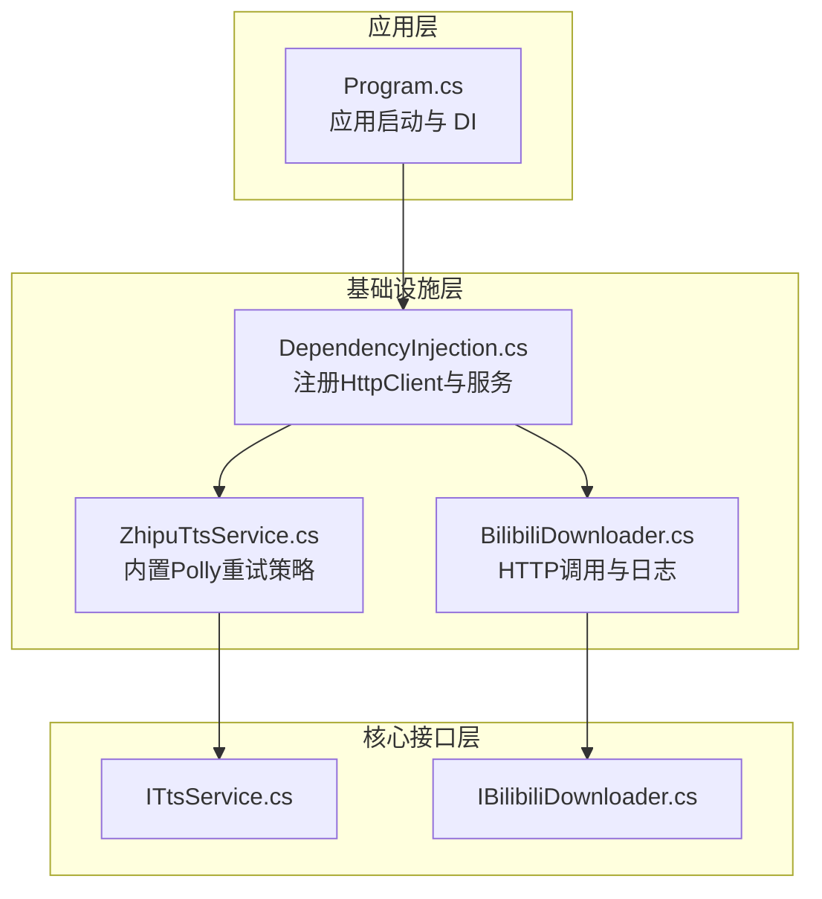
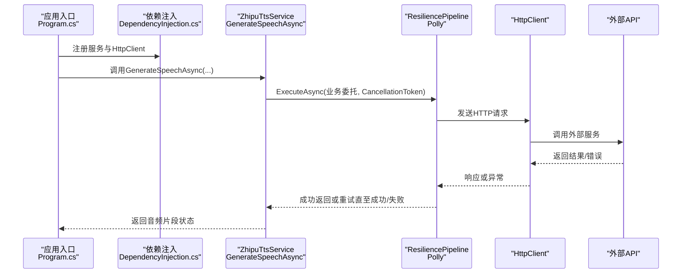
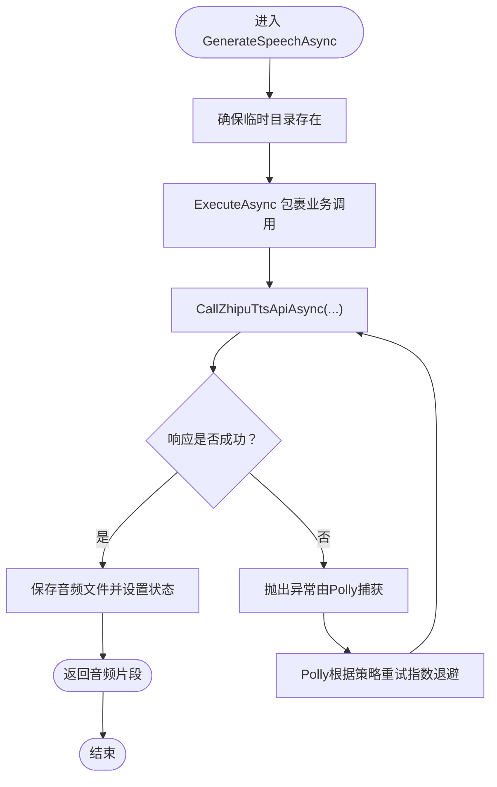
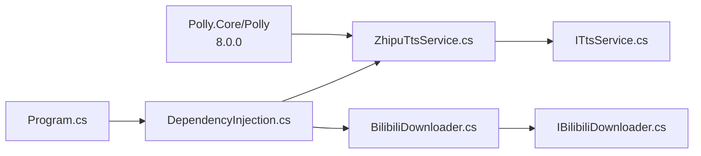

# 智能重试机制

<cite>
**本文引用的文件**
- [ZhipuTtsService.cs](file://src/Infrastructure/Services/ZhipuTtsService.cs)
- [BilibiliDownloader.cs](file://src/Infrastructure/Services/BilibiliDownloader.cs)
- [ITtsService.cs](file://src/Core/Interfaces/ITtsService.cs)
- [IBilibiliDownloader.cs](file://src/Core/Interfaces/IBilibiliDownloader.cs)
- [DependencyInjection.cs](file://src/Infrastructure/DependencyInjection.cs)
- [Program.cs](file://src/App/Program.cs)
- [AudioSegment.cs](file://src/Core/Entities/AudioSegment.cs)
- [VoiceReference.cs](file://src/Core/Entities/VoiceReference.cs)
- [NovelTTSApp.App.deps.json](file://src/App/bin/Release/net10.0/NovelTTSApp.App.deps.json)
</cite>

## 目录
1. [简介](#简介)
2. [项目结构](#项目结构)
3. [核心组件](#核心组件)
4. [架构总览](#架构总览)
5. [详细组件分析](#详细组件分析)
6. [依赖关系分析](#依赖关系分析)
7. [性能考量](#性能考量)
8. [故障排查指南](#故障排查指南)
9. [结论](#结论)
10. [附录](#附录)

## 简介
本文件围绕基于 Polly 的智能重试机制展开，重点说明在 ZhipuTtsService 和 BilibiliDownloader 中如何配置重试策略，包括重试次数、退避算法（指数退避）以及异常类型过滤（如 HttpRequestException、TaskCanceledException），并展示如何将 Polly 策略集成到异步方法调用中，确保在网络波动或 API 限流时自动恢复。同时提供 Policy.Wrap 与 ExecuteAsync 的使用思路与最佳实践，以及重试日志记录与监控指标的集成建议，帮助用户诊断稳定性问题。

## 项目结构
- 核心接口位于 Core 层，定义了 TTS 与 Bilibili 下载能力的契约。
- 基础设施层实现具体服务，其中 ZhipuTtsService 内置了 Polly 重试策略；BilibiliDownloader 当前未显式使用 Polly，但具备完善的日志与错误处理基础，便于后续扩展。
- 应用入口通过依赖注入注册 HttpClient 与服务，形成清晰的分层与解耦。

图表来源
- [Program.cs](file://src/App/Program.cs#L1-L120)
- [DependencyInjection.cs](file://src/Infrastructure/DependencyInjection.cs#L1-L33)
- [ZhipuTtsService.cs](file://src/Infrastructure/Services/ZhipuTtsService.cs#L1-L120)
- [BilibiliDownloader.cs](file://src/Infrastructure/Services/BilibiliDownloader.cs#L1-L120)
- [ITtsService.cs](file://src/Core/Interfaces/ITtsService.cs#L1-L25)
- [IBilibiliDownloader.cs](file://src/Core/Interfaces/IBilibiliDownloader.cs#L1-L26)

章节来源
- [Program.cs](file://src/App/Program.cs#L1-L120)
- [DependencyInjection.cs](file://src/Infrastructure/DependencyInjection.cs#L1-L33)

## 核心组件
- ZhipuTtsService：在构造函数中构建 ResiliencePipeline，配置最大重试次数、初始延迟、退避类型与异常过滤条件；在 GenerateSpeechAsync 中通过 ExecuteAsync 包裹实际调用，实现自动重试与指数退避。
- BilibiliDownloader：当前未显式使用 Polly，但所有 HTTP 调用均使用 HttpClient 发送请求并统一抛出异常，具备良好的可扩展性，可在后续引入 Polly 策略以增强稳定性。
- 接口层：ITtsService、IBilibiliDownloader 提供稳定的对外契约，便于替换实现与测试。

章节来源
- [ZhipuTtsService.cs](file://src/Infrastructure/Services/ZhipuTtsService.cs#L1-L120)
- [BilibiliDownloader.cs](file://src/Infrastructure/Services/BilibiliDownloader.cs#L1-L120)
- [ITtsService.cs](file://src/Core/Interfaces/ITtsService.cs#L1-L25)
- [IBilibiliDownloader.cs](file://src/Core/Interfaces/IBilibiliDownloader.cs#L1-L26)

## 架构总览
Polly 重试策略通过 ResiliencePipelineBuilder 在 ZhipuTtsService 中集中配置，随后在 ExecuteAsync 中包裹业务调用，形成“策略-执行”的解耦设计。应用层通过依赖注入注册 HttpClient 与服务，保证各组件可按需注入与替换。

图表来源
- [Program.cs](file://src/App/Program.cs#L1-L120)
- [DependencyInjection.cs](file://src/Infrastructure/DependencyInjection.cs#L1-L33)
- [ZhipuTtsService.cs](file://src/Infrastructure/Services/ZhipuTtsService.cs#L34-L81)

## 详细组件分析

### ZhipuTtsService 的 Polly 重试策略
- 策略构建位置：在类成员处通过 ResiliencePipelineBuilder.AddRetry 配置重试参数。
- 关键配置要点：
  - 最大重试次数：3 次
  - 初始延迟：2 秒
  - 退避类型：指数退避
  - 异常过滤：仅对 HttpRequestException、TaskCanceledException 进行重试
- 执行流程：在 GenerateSpeechAsync 中，使用 _resiliencePipeline.ExecuteAsync 包裹 CallZhipuTtsApiAsync，实现自动重试与指数退避。
- 日志记录：在成功与失败分支均记录详细日志，便于定位问题与统计重试次数。

图表来源
- [ZhipuTtsService.cs](file://src/Infrastructure/Services/ZhipuTtsService.cs#L34-L81)
- [ZhipuTtsService.cs](file://src/Infrastructure/Services/ZhipuTtsService.cs#L144-L188)

章节来源
- [ZhipuTtsService.cs](file://src/Infrastructure/Services/ZhipuTtsService.cs#L21-L32)
- [ZhipuTtsService.cs](file://src/Infrastructure/Services/ZhipuTtsService.cs#L34-L81)
- [ZhipuTtsService.cs](file://src/Infrastructure/Services/ZhipuTtsService.cs#L144-L188)

### BilibiliDownloader 的现状与扩展建议
- 现状：当前未显式使用 Polly，但所有 HTTP 请求均通过 HttpClient 发送并统一抛出异常，具备良好的可扩展性。
- 扩展建议：可在类内构建 ResiliencePipeline 并在关键 HTTP 调用处使用 ExecuteAsync 包裹，结合指数退避与异常过滤，提升网络波动与限流场景下的稳定性。
- 日志记录：已具备完善的日志输出，便于后续接入重试统计与监控。

章节来源
- [BilibiliDownloader.cs](file://src/Infrastructure/Services/BilibiliDownloader.cs#L1-L176)

### 依赖注入与 HttpClient 注册
- 应用入口通过 AddInfrastructureServices 注册配置与服务，并使用 AddHttpClient 为 ITtsService、IBilibiliDownloader 注册 HttpClient。
- 该模式使服务可直接注入 HttpClient，便于在服务内部使用 Polly 或其他策略。

章节来源
- [DependencyInjection.cs](file://src/Infrastructure/DependencyInjection.cs#L1-L33)
- [Program.cs](file://src/App/Program.cs#L1-L120)

## 依赖关系分析
- 外部依赖：项目包含 Polly.Core 与 Polly（版本 8.0.0），满足 ResiliencePipelineBuilder 与 RetryStrategyOptions 的使用需求。
- 内部依赖：ZhipuTtsService 依赖 ILogger、HttpClient、IOptions<AISettings>、IOptions<PathSettings>；BilibiliDownloader 依赖 ILogger、HttpClient、IAudioProcessor、IOptions<BilibiliSettings>、IOptions<PathSettings>。

图表来源
- [NovelTTSApp.App.deps.json](file://src/App/bin/Release/net10.0/NovelTTSApp.App.deps.json#L363-L412)
- [DependencyInjection.cs](file://src/Infrastructure/DependencyInjection.cs#L1-L33)
- [ZhipuTtsService.cs](file://src/Infrastructure/Services/ZhipuTtsService.cs#L1-L120)
- [BilibiliDownloader.cs](file://src/Infrastructure/Services/BilibiliDownloader.cs#L1-L120)
- [ITtsService.cs](file://src/Core/Interfaces/ITtsService.cs#L1-L25)
- [IBilibiliDownloader.cs](file://src/Core/Interfaces/IBilibiliDownloader.cs#L1-L26)

章节来源
- [NovelTTSApp.App.deps.json](file://src/App/bin/Release/net10.0/NovelTTSApp.App.deps.json#L363-L412)
- [DependencyInjection.cs](file://src/Infrastructure/DependencyInjection.cs#L1-L33)

## 性能考量
- 指数退避有助于缓解瞬时网络抖动与服务端限流压力，但需注意累计等待时间与超时设置相匹配，避免整体任务耗时过长。
- 重试次数与初始延迟应结合外部 API 的 SLA 与可用性进行权衡，避免在高失败率场景下放大负载。
- 对于流式下载（如 BilibiliDownloader 的音频流），建议在读取阶段增加超时与取消令牌控制，防止长时间阻塞。

## 故障排查指南
- 观察日志：ZhipuTtsService 在成功与失败分支均记录详细日志，可据此判断是否触发了重试、重试次数与最终结果。
- 异常类型：当前策略仅对 HttpRequestException、TaskCanceledException 进行重试，若出现其他异常（如网络超时、DNS 解析失败等），请确认是否需要扩展 ShouldHandle 条件。
- 状态追踪：AudioSegment 的状态字段（Completed/Failed）与错误消息可用于批量处理后的汇总与重试策略调整。
- 监控指标建议：
  - 计数：每次 ExecuteAsync 的调用次数、重试次数、失败次数
  - 分布：重试延迟分布、平均响应时间、失败原因分布
  - 指标来源：可通过日志聚合工具（如 Serilog + 控制台/文件/远程收集）或应用监控系统（如 Prometheus + Grafana）采集

章节来源
- [ZhipuTtsService.cs](file://src/Infrastructure/Services/ZhipuTtsService.cs#L34-L81)
- [AudioSegment.cs](file://src/Core/Entities/AudioSegment.cs#L1-L74)

## 结论
- ZhipuTtsService 已完整实现基于 Polly 的智能重试，采用指数退避与异常过滤，显著提升了网络波动与限流场景下的稳定性。
- BilibiliDownloader 当前未使用 Polly，但具备良好的日志与错误处理基础，建议在后续迭代中引入重试策略以进一步增强鲁棒性。
- 通过依赖注入注册 HttpClient 与服务，配合日志与状态追踪，可有效支撑重试策略的落地与运维监控。

## 附录

### Polly 策略配置与使用要点
- 配置位置：在服务构造函数中集中构建 ResiliencePipeline，确保策略复用与一致性。
- 执行方式：使用 ExecuteAsync 包裹业务委托，传入 CancellationToken，以便支持取消与超时控制。
- 异常过滤：仅对可重试的异常（如网络异常、超时）进行重试，避免对不可重试异常（如参数错误）重复尝试。
- 退避策略：指数退避可随重试次数递增延迟，缓解外部服务压力；必要时可引入抖动以避免“惊群效应”。

章节来源
- [ZhipuTtsService.cs](file://src/Infrastructure/Services/ZhipuTtsService.cs#L21-L32)
- [ZhipuTtsService.cs](file://src/Infrastructure/Services/ZhipuTtsService.cs#L55-L58)

### 代码示例路径（不展示具体代码）
- Polly 策略构建与使用：参见 [ZhipuTtsService.cs](file://src/Infrastructure/Services/ZhipuTtsService.cs#L21-L32) 与 [ZhipuTtsService.cs](file://src/Infrastructure/Services/ZhipuTtsService.cs#L55-L58)
- 依赖注入注册 HttpClient 与服务：参见 [DependencyInjection.cs](file://src/Infrastructure/DependencyInjection.cs#L1-L33)
- 应用入口调用链路：参见 [Program.cs](file://src/App/Program.cs#L1-L120)