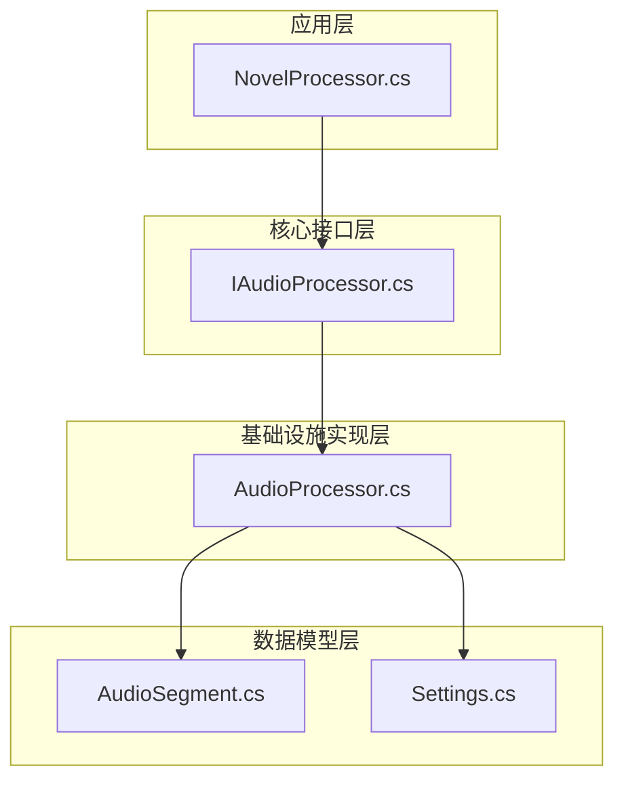
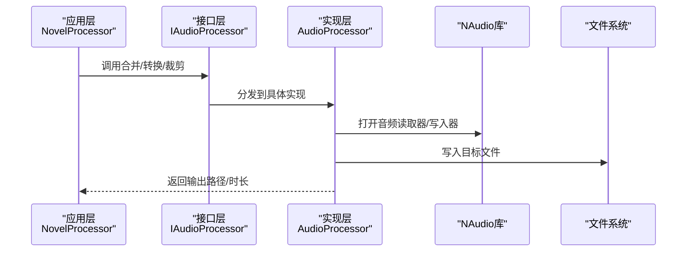
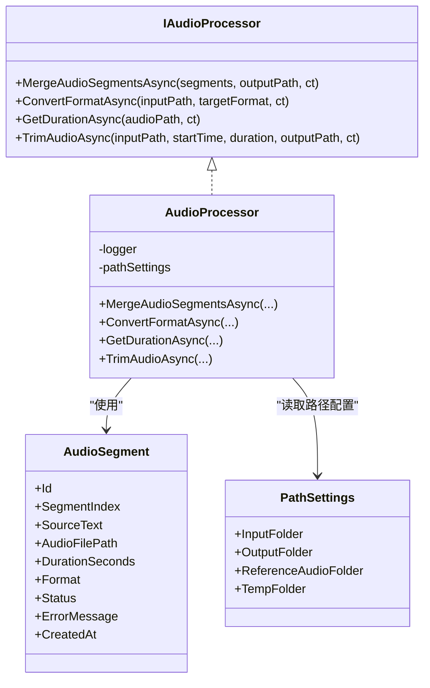
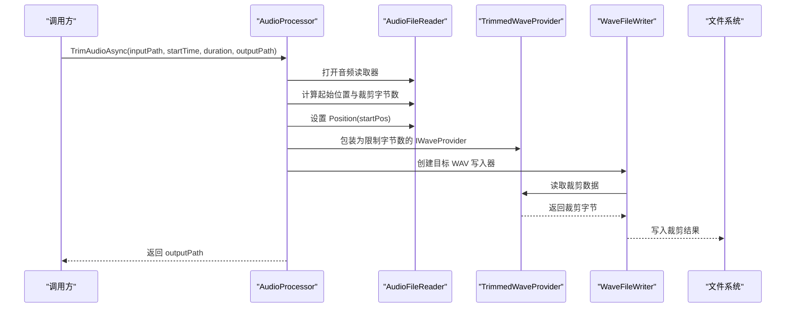
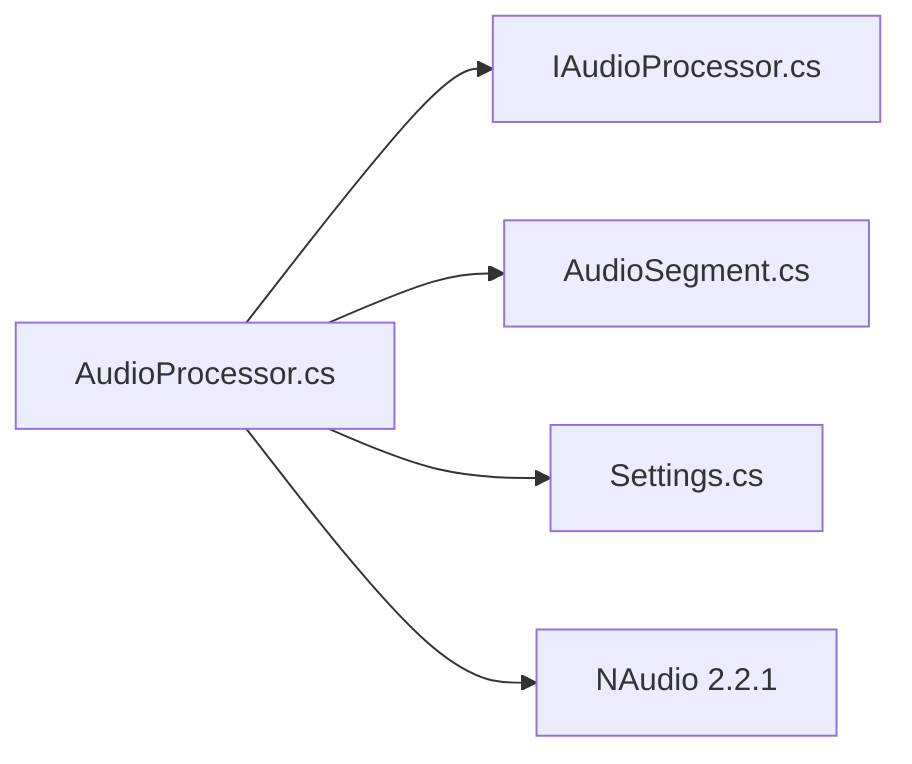

# 音频处理

<cite>
**本文引用的文件**
- [IAudioProcessor.cs](file://src/Core/Interfaces/IAudioProcessor.cs)
- [AudioProcessor.cs](file://src/Infrastructure/Services/AudioProcessor.cs)
- [AudioSegment.cs](file://src/Core/Entities/AudioSegment.cs)
- [Settings.cs](file://src/Infrastructure/Configuration/Settings.cs)
- [NovelProcessor.cs](file://src/App/Services/NovelProcessor.cs)
- [deps.json](file://src/App/bin/Release/net10.0/NovelTTSApp.App.deps.json)
</cite>

## 目录
1. [简介](#简介)
2. [项目结构](#项目结构)
3. [核心组件](#核心组件)
4. [架构总览](#架构总览)
5. [详细组件分析](#详细组件分析)
6. [依赖关系分析](#依赖关系分析)
7. [性能考量](#性能考量)
8. [故障排查指南](#故障排查指南)
9. [结论](#结论)
10. [附录](#附录)

## 简介
本文件系统性阐述音频处理模块的功能与实现，重点围绕 IAudioProcessor 接口定义的操作集，以及 AudioProcessor 类如何基于 NAudio 库完成音频片段合并、格式转换（如 WAV 与 MP3 的互转）、时长查询与裁剪等任务。文档还覆盖了处理流程中的临时文件管理策略、内存使用优化、并发处理机制，并结合代码路径给出音频流拼接逻辑与输出编码配置的说明。最后讨论大文件场景下的性能瓶颈与通过分块与异步 I/O 提升效率的方法。

## 项目结构
音频处理相关代码主要分布在以下位置：
- 接口层：Core 层定义 IAudioProcessor，统一对外能力边界
- 实现层：Infrastructure 层提供基于 NAudio 的具体实现 AudioProcessor
- 数据模型：Core 层定义 AudioSegment、AudioFormat、AudioGenerationStatus 等实体与枚举
- 配置层：Infrastructure 层提供 PathSettings，包含输入、输出、参考音频与临时文件目录
- 应用编排：App 层的 NovelProcessor 在业务流程中调用音频处理能力，并负责临时文件清理

图表来源
- [IAudioProcessor.cs](file://src/Core/Interfaces/IAudioProcessor.cs#L1-L38)
- [AudioProcessor.cs](file://src/Infrastructure/Services/AudioProcessor.cs#L1-L230)
- [AudioSegment.cs](file://src/Core/Entities/AudioSegment.cs#L1-L74)
- [Settings.cs](file://src/Infrastructure/Configuration/Settings.cs#L41-L66)
- [NovelProcessor.cs](file://src/App/Services/NovelProcessor.cs#L160-L189)

章节来源
- [IAudioProcessor.cs](file://src/Core/Interfaces/IAudioProcessor.cs#L1-L38)
- [AudioProcessor.cs](file://src/Infrastructure/Services/AudioProcessor.cs#L1-L230)
- [AudioSegment.cs](file://src/Core/Entities/AudioSegment.cs#L1-L74)
- [Settings.cs](file://src/Infrastructure/Configuration/Settings.cs#L41-L66)
- [NovelProcessor.cs](file://src/App/Services/NovelProcessor.cs#L160-L189)

## 核心组件
- IAudioProcessor 接口：定义合并音频片段、格式转换、获取时长、裁剪音频等异步操作，返回输出路径或时长
- AudioProcessor 实现：基于 NAudio 的具体实现，负责读取音频、重采样、通道转换、写入目标格式、裁剪与异常处理
- AudioSegment 实体：承载单个音频片段的元数据（索引、路径、格式、状态等），作为合并输入的载体
- PathSettings 配置：提供输入、输出、参考音频与临时文件目录，支撑临时文件管理策略
- NovelProcessor 编排：在业务流程中调用合并与裁剪，并在完成后清理临时文件

章节来源
- [IAudioProcessor.cs](file://src/Core/Interfaces/IAudioProcessor.cs#L1-L38)
- [AudioProcessor.cs](file://src/Infrastructure/Services/AudioProcessor.cs#L1-L230)
- [AudioSegment.cs](file://src/Core/Entities/AudioSegment.cs#L1-L74)
- [Settings.cs](file://src/Infrastructure/Configuration/Settings.cs#L41-L66)
- [NovelProcessor.cs](file://src/App/Services/NovelProcessor.cs#L160-L189)

## 架构总览
音频处理采用“接口抽象 + 具体实现 + 数据模型 + 配置”的分层设计。应用层通过 IAudioProcessor 抽象调用，实现层使用 NAudio 完成底层音频读写与变换；数据模型承载音频片段元信息；配置层提供路径设置，支撑临时文件管理。

图表来源
- [IAudioProcessor.cs](file://src/Core/Interfaces/IAudioProcessor.cs#L1-L38)
- [AudioProcessor.cs](file://src/Infrastructure/Services/AudioProcessor.cs#L1-L230)
- [NovelProcessor.cs](file://src/App/Services/NovelProcessor.cs#L160-L189)

## 详细组件分析

### IAudioProcessor 接口定义
- 合并音频片段：按 SegmentIndex 排序后依次写入，返回最终输出路径
- 格式转换：支持 WAV 与 MP3（MP3 需要额外库，当前实现对非 MP3 的 MP3 转换抛出不支持异常）
- 获取时长：返回音频总秒数
- 裁剪音频：按起始时间和时长截取，返回裁剪后的输出路径

章节来源
- [IAudioProcessor.cs](file://src/Core/Interfaces/IAudioProcessor.cs#L1-L38)

### AudioProcessor 实现与 NAudio 集成
- 合并音频片段
  - 输入过滤：仅处理状态为已完成且路径有效的片段，并按 SegmentIndex 升序排列
  - 输出策略：当前实现统一输出为 WAV（.wav），便于后续处理
  - 重采样与通道转换：若采样率不一致则使用高质量重采样器；若通道数不一致则转为单声道
  - 写入策略：分块读取重采样或转换单声道后的样本，写入目标 WAV 文件
  - 并发与取消：在后台线程执行，支持取消令牌中断
  - 异常处理：记录警告与错误日志，跳过无效文件继续处理
- 格式转换
  - WAV：直接写入
  - MP3：当前实现要求存在额外编码库，否则对非 MP3 的 MP3 转换抛出不支持异常；若输入已是 MP3 则复制输出
- 获取时长：打开音频读取器，返回总时长秒数
- 裁剪音频
  - 计算起始字节位置与裁剪字节数，将读取器定位到起始位置
  - 封装自定义 IWaveProvider（TrimmedWaveProvider）限制可读取字节数
  - 写入裁剪结果

图表来源
- [IAudioProcessor.cs](file://src/Core/Interfaces/IAudioProcessor.cs#L1-L38)
- [AudioProcessor.cs](file://src/Infrastructure/Services/AudioProcessor.cs#L1-L230)
- [AudioSegment.cs](file://src/Core/Entities/AudioSegment.cs#L1-L74)
- [Settings.cs](file://src/Infrastructure/Configuration/Settings.cs#L41-L66)

章节来源
- [AudioProcessor.cs](file://src/Infrastructure/Services/AudioProcessor.cs#L1-L230)
- [AudioSegment.cs](file://src/Core/Entities/AudioSegment.cs#L1-L74)
- [Settings.cs](file://src/Infrastructure/Configuration/Settings.cs#L41-L66)

### 音频流拼接逻辑与输出编码配置
- 拼接逻辑
  - 依据 SegmentIndex 排序，逐个读取音频片段
  - 若采样率不一致，使用高质量重采样器进行重采样
  - 若通道数不一致，先转为单声道
  - 分块读取样本并写入目标 WAV 文件
- 输出编码配置
  - 目标格式：44100Hz、16bit、单声道
  - 当前实现统一输出为 WAV，MP3 转换需要额外编码库

章节来源
- [AudioProcessor.cs](file://src/Infrastructure/Services/AudioProcessor.cs#L1-L230)

### 裁剪流程时序

图表来源
- [AudioProcessor.cs](file://src/Infrastructure/Services/AudioProcessor.cs#L162-L197)

章节来源
- [AudioProcessor.cs](file://src/Infrastructure/Services/AudioProcessor.cs#L162-L197)

### 临时文件管理策略
- 临时文件来源：各音频片段生成的中间文件路径由 AudioSegment.AudioFilePath 指定
- 清理时机：在业务流程完成后，调用清理方法遍历所有片段，删除其对应的临时文件
- 清理方式：异步执行删除，捕获异常并记录警告日志，避免影响主流程

章节来源
- [AudioSegment.cs](file://src/Core/Entities/AudioSegment.cs#L1-L74)
- [NovelProcessor.cs](file://src/App/Services/NovelProcessor.cs#L160-L189)

### 内存使用优化
- 分块读取：在合并与重采样过程中使用固定大小缓冲区分块读取与写入，降低峰值内存占用
- 单线程后台执行：将耗时的 I/O 与解码/重采样放在后台线程，避免阻塞主线程
- 及时释放资源：使用 using 语句确保读取器、写入器与提供者在作用域结束时被释放
- 条件重采样与通道转换：仅在必要时进行重采样与转单声道，减少额外计算

章节来源
- [AudioProcessor.cs](file://src/Infrastructure/Services/AudioProcessor.cs#L1-L230)

### 多线程并发处理机制
- 异步接口：IAudioProcessor 的所有操作均返回 Task，便于在调用方进行异步编排
- 后台线程执行：合并与裁剪等 CPU/IO 密集操作在后台线程执行，避免阻塞 UI 或请求线程
- 取消令牌：所有异步方法均支持取消令牌，允许外部中断长时间运行的任务
- 日志与异常：记录警告与错误，保证并发场景下的可观测性

章节来源
- [IAudioProcessor.cs](file://src/Core/Interfaces/IAudioProcessor.cs#L1-L38)
- [AudioProcessor.cs](file://src/Infrastructure/Services/AudioProcessor.cs#L1-L230)

## 依赖关系分析
- 组件耦合
  - AudioProcessor 依赖 IAudioProcessor 接口与 PathSettings，保持对上层抽象与配置的低耦合
  - AudioProcessor 与 NAudio 的耦合体现在具体实现中，便于替换其他音频库
- 外部依赖
  - NAudio 版本：项目依赖 NAudio 2.2.1，包含 Core、WinMM、Wasapi、Asio、Midi 等子包
  - MP3 编码：当前实现未引入 NAudio.Lame，MP3 编码需额外库支持

图表来源
- [AudioProcessor.cs](file://src/Infrastructure/Services/AudioProcessor.cs#L1-L230)
- [IAudioProcessor.cs](file://src/Core/Interfaces/IAudioProcessor.cs#L1-L38)
- [AudioSegment.cs](file://src/Core/Entities/AudioSegment.cs#L1-L74)
- [Settings.cs](file://src/Infrastructure/Configuration/Settings.cs#L41-L66)
- [deps.json](file://src/App/bin/Release/net10.0/NovelTTSApp.App.deps.json#L292-L359)

章节来源
- [deps.json](file://src/App/bin/Release/net10.0/NovelTTSApp.App.deps.json#L292-L359)
- [AudioProcessor.cs](file://src/Infrastructure/Services/AudioProcessor.cs#L1-L230)

## 性能考量
- 大文件瓶颈
  - 合并阶段：I/O 与解码/重采样是主要瓶颈，受磁盘吞吐、CPU 解码能力与内存带宽影响
  - 裁剪阶段：定位与顺序读取为主，瓶颈在于磁盘随机访问与解码速度
- 分块与异步 I/O
  - 已采用分块缓冲读取与后台线程执行，有助于缓解内存压力与阻塞
  - 可进一步探索异步文件 I/O（如使用异步读取 API）与更细粒度的并发（例如并行处理不同片段的解码与写入）
- 编码选择
  - 当前统一输出为 WAV，便于后续处理；若需 MP3 输出，需引入 NAudio.Lame 以支持硬件/软件编码加速
- 资源释放
  - 使用 using 语句确保及时释放资源，避免长时间运行导致的句柄泄漏与内存增长

章节来源
- [AudioProcessor.cs](file://src/Infrastructure/Services/AudioProcessor.cs#L1-L230)

## 故障排查指南
- 合并失败
  - 现象：无有效片段可合并或部分片段缺失
  - 处理：检查 AudioSegment 状态与路径是否有效；查看日志中的警告与错误
- 格式转换异常
  - 现象：对非 MP3 的 MP3 转换抛出不支持异常
  - 处理：确认已引入 NAudio.Lame；或改为 WAV 转换
- 裁剪结果异常
  - 现象：裁剪后时长或起始位置不正确
  - 处理：核对起始时间与持续时间计算；检查音频采样率与字节速率
- 临时文件未清理
  - 现象：临时文件残留
  - 处理：确认清理逻辑已执行；检查异常日志并手动清理

章节来源
- [AudioProcessor.cs](file://src/Infrastructure/Services/AudioProcessor.cs#L1-L230)
- [NovelProcessor.cs](file://src/App/Services/NovelProcessor.cs#L160-L189)

## 结论
该音频处理模块通过清晰的接口抽象与基于 NAudio 的稳健实现，提供了合并、格式转换、时长查询与裁剪等核心能力。实现中采用分块读取、后台线程执行与资源及时释放等策略，兼顾了内存使用与并发性能。对于 MP3 编码需求，建议引入 NAudio.Lame 以完善功能链路。未来可在异步 I/O 与更细粒度并发方面进一步优化，以更好地应对大文件与高吞吐场景。

## 附录
- 代码路径参考
  - 合并音频片段：[AudioProcessor.MergeAudioSegmentsAsync](file://src/Infrastructure/Services/AudioProcessor.cs#L12-L107)
  - 格式转换：[AudioProcessor.ConvertFormatAsync](file://src/Infrastructure/Services/AudioProcessor.cs#L110-L147)
  - 获取时长：[AudioProcessor.GetDurationAsync](file://src/Infrastructure/Services/AudioProcessor.cs#L150-L160)
  - 裁剪音频：[AudioProcessor.TrimAudioAsync](file://src/Infrastructure/Services/AudioProcessor.cs#L162-L197)
  - 临时文件清理：[NovelProcessor.CleanupTempFilesAsync](file://src/App/Services/NovelProcessor.cs#L169-L187)