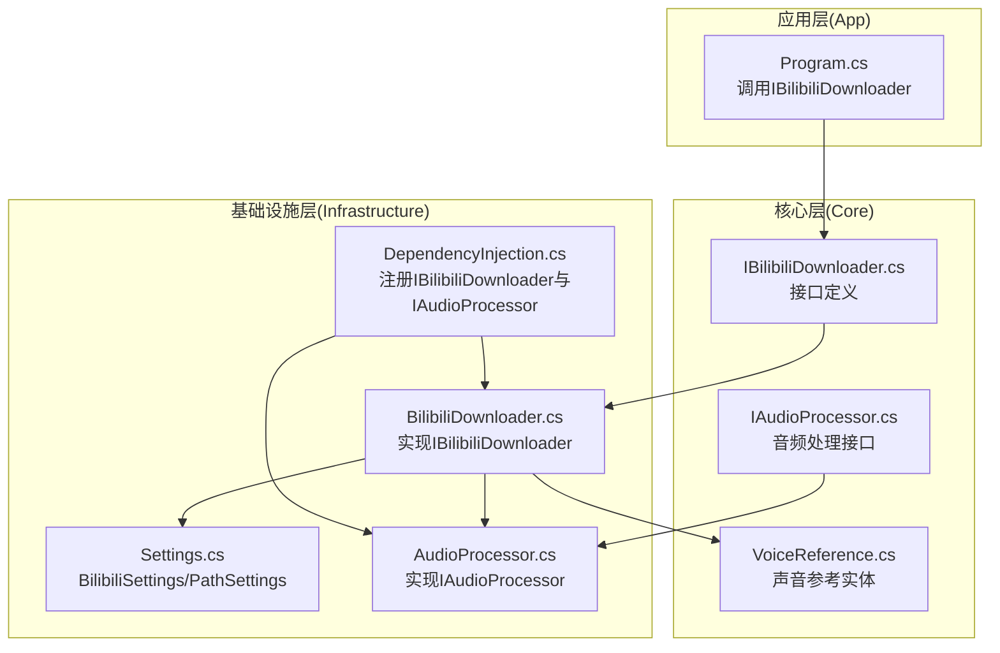
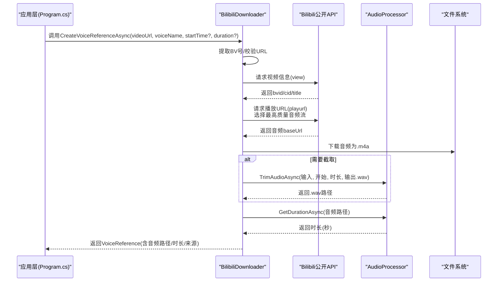
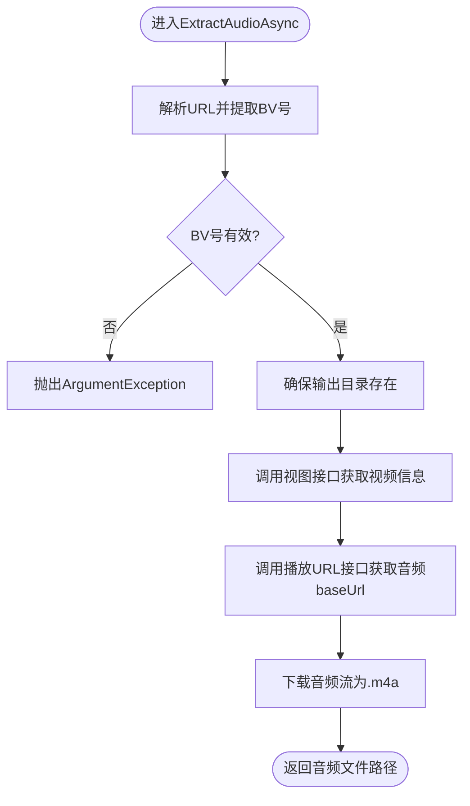
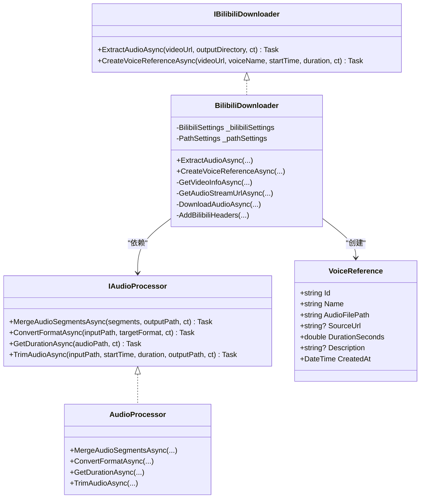
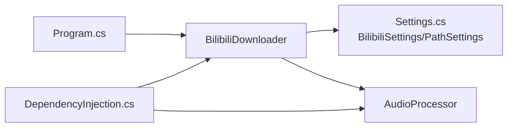

# Bilibili下载器

<cite>
**本文引用的文件**
- [IBilibiliDownloader.cs](file://src/Core/Interfaces/IBilibiliDownloader.cs)
- [BilibiliDownloader.cs](file://src/Infrastructure/Services/BilibiliDownloader.cs)
- [VoiceReference.cs](file://src/Core/Entities/VoiceReference.cs)
- [IAudioProcessor.cs](file://src/Core/Interfaces/IAudioProcessor.cs)
- [AudioProcessor.cs](file://src/Infrastructure/Services/AudioProcessor.cs)
- [Settings.cs](file://src/Infrastructure/Configuration/Settings.cs)
- [DependencyInjection.cs](file://src/Infrastructure/DependencyInjection.cs)
- [Program.cs](file://src/App/Program.cs)
</cite>

## 目录
1. [简介](#简介)
2. [项目结构](#项目结构)
3. [核心组件](#核心组件)
4. [架构总览](#架构总览)
5. [详细组件分析](#详细组件分析)
6. [依赖关系分析](#依赖关系分析)
7. [性能考量](#性能考量)
8. [故障排查指南](#故障排查指南)
9. [结论](#结论)
10. [附录](#附录)

## 简介
本文件系统性记录了 IBilibiliDownloader 接口与 BilibiliDownloader 实现的技术细节，重点说明其如何通过 Bilibili 公开 API 从指定视频链接提取纯净音频流，用于声音克隆参考。文档覆盖视频解析、音频下载、格式处理（当前为 m4a 存储，结合音频处理器可转换为 WAV）、以及与 VoiceReference 实体的关联，同时给出对 TTS 训练音频质量的要求建议、支持的视频类型范围与常见访问限制（如登录墙）的应对策略。

## 项目结构
该功能位于基础设施层（Infrastructure），通过接口隔离与依赖注入进行装配；核心实体 VoiceReference 定义在 Core 层，音频处理能力由 IAudioProcessor 抽象与 AudioProcessor 实现提供。

图表来源
- [Program.cs](file://src/App/Program.cs#L174-L212)
- [IBilibiliDownloader.cs](file://src/Core/Interfaces/IBilibiliDownloader.cs#L1-L25)
- [BilibiliDownloader.cs](file://src/Infrastructure/Services/BilibiliDownloader.cs#L1-L176)
- [VoiceReference.cs](file://src/Core/Entities/VoiceReference.cs#L1-L43)
- [IAudioProcessor.cs](file://src/Core/Interfaces/IAudioProcessor.cs#L1-L39)
- [AudioProcessor.cs](file://src/Infrastructure/Services/AudioProcessor.cs#L1-L231)
- [Settings.cs](file://src/Infrastructure/Configuration/Settings.cs#L1-L66)
- [DependencyInjection.cs](file://src/Infrastructure/DependencyInjection.cs#L1-L33)

章节来源
- [Program.cs](file://src/App/Program.cs#L174-L212)
- [DependencyInjection.cs](file://src/Infrastructure/DependencyInjection.cs#L1-L33)

## 核心组件
- 接口 IBilibiliDownloader：定义两类能力——直接提取音频文件路径、基于视频创建声音参考对象（可选截取片段并计算时长）。
- 实现 BilibiliDownloader：封装 Bilibili 公开 API 的调用流程，完成 BV 号提取、视频信息获取、音频流选择与下载，并将结果写入输出目录。
- 实体 VoiceReference：承载声音参考元数据（名称、音频文件路径、来源 URL、时长、描述等）。
- 接口 IAudioProcessor 与实现 AudioProcessor：提供合并、格式转换、时长查询、音频截取等能力；当前实现以 WAV 为主，支持按需转换与重采样。

章节来源
- [IBilibiliDownloader.cs](file://src/Core/Interfaces/IBilibiliDownloader.cs#L1-L25)
- [BilibiliDownloader.cs](file://src/Infrastructure/Services/BilibiliDownloader.cs#L1-L176)
- [VoiceReference.cs](file://src/Core/Entities/VoiceReference.cs#L1-L43)
- [IAudioProcessor.cs](file://src/Core/Interfaces/IAudioProcessor.cs#L1-L39)
- [AudioProcessor.cs](file://src/Infrastructure/Services/AudioProcessor.cs#L1-L231)

## 架构总览
Bilibili 下载器采用“接口 + 实现 + 配置 + 处理器”的分层设计：
- 通过 HttpClient 调用 Bilibili 公开 API 获取视频信息与 DASH 音频流；
- 下载得到的音频以 m4a 形式保存到指定输出目录；
- 若需要声音参考，可调用 IAudioProcessor 对音频进行截取与时长统计，最终生成 VoiceReference；
- 依赖注入统一注册 IBilibiliDownloader 与 IAudioProcessor，便于替换与测试。

图表来源
- [BilibiliDownloader.cs](file://src/Infrastructure/Services/BilibiliDownloader.cs#L17-L90)
- [AudioProcessor.cs](file://src/Infrastructure/Services/AudioProcessor.cs#L150-L198)
- [Program.cs](file://src/App/Program.cs#L183-L192)

## 详细组件分析

### 接口 IBilibiliDownloader
- 职责
  - ExtractAudioAsync：从指定视频 URL 提取音频，返回本地音频文件路径（默认 m4a）。
  - CreateVoiceReferenceAsync：在提取音频的基础上，可选截取片段并计算时长，生成 VoiceReference。
- 关键参数
  - videoUrl：支持包含 BV 号的 Bilibili 视频链接。
  - outputDirectory：输出目录（由调用方传入或使用 PathSettings 中的 ReferenceAudioFolder）。
  - voiceName：声音参考名称。
  - startTime/duration：可选，用于截取片段。
- 异常与边界
  - URL 不合法会抛出异常（BV 号匹配失败）。
  - API 返回失败会触发状态检查异常。

章节来源
- [IBilibiliDownloader.cs](file://src/Core/Interfaces/IBilibiliDownloader.cs#L1-L25)

### 实现 BilibiliDownloader
- 视频解析与音频下载
  - URL 解析：使用正则提取 BV 号，若失败则抛出异常。
  - 视频信息：调用“视图接口”获取 bvid、cid、标题等。
  - 音频流：调用“播放URL接口”，解析 DASH 数据，选择带宽最高的音频流 baseUrl。
  - 下载：设置必要的请求头（Referer、User-Agent），必要时携带 Cookie，将响应流写入 .m4a 文件。
- 声音参考创建
  - 先调用 ExtractAudioAsync 获取完整音频路径。
  - 若提供开始时间和时长，则调用 IAudioProcessor.TrimAudioAsync 进行截取，输出 .wav。
  - 再调用 IAudioProcessor.GetDurationAsync 获取时长，构造 VoiceReference 并返回。
- 配置与日志
  - 读取 BilibiliSettings.Cookie 与 PathSettings.ReferenceAudioFolder。
  - 使用 ILogger 记录关键步骤与错误。

图表来源
- [BilibiliDownloader.cs](file://src/Infrastructure/Services/BilibiliDownloader.cs#L17-L47)

章节来源
- [BilibiliDownloader.cs](file://src/Infrastructure/Services/BilibiliDownloader.cs#L1-L176)
- [Settings.cs](file://src/Infrastructure/Configuration/Settings.cs#L26-L66)

### 实体 VoiceReference
- 字段
  - Id、Name、AudioFilePath、SourceUrl、DurationSeconds、Description、CreatedAt。
- 用途
  - 作为声音克隆参考的数据载体，记录音频来源、时长与描述信息，便于后续 TTS 训练与管理。

章节来源
- [VoiceReference.cs](file://src/Core/Entities/VoiceReference.cs#L1-L43)

### 音频处理接口与实现 IAudioProcessor / AudioProcessor
- 能力
  - 合并音频片段（按序合并，目标格式为 WAV，自动重采样与单声道化）。
  - 格式转换（当前支持 WAV；MP3 需额外库，否则抛出不支持异常）。
  - 获取音频时长（秒）。
  - 截取音频片段（基于字节位置计算，输出 WAV）。
- 与下载器的关系
  - BilibiliDownloader 在创建声音参考时，可能调用 TrimAudioAsync 与 GetDurationAsync，以满足 TTS 训练对片段长度与时长统计的需求。

图表来源
- [IBilibiliDownloader.cs](file://src/Core/Interfaces/IBilibiliDownloader.cs#L1-L25)
- [BilibiliDownloader.cs](file://src/Infrastructure/Services/BilibiliDownloader.cs#L1-L176)
- [IAudioProcessor.cs](file://src/Core/Interfaces/IAudioProcessor.cs#L1-L39)
- [AudioProcessor.cs](file://src/Infrastructure/Services/AudioProcessor.cs#L1-L231)
- [VoiceReference.cs](file://src/Core/Entities/VoiceReference.cs#L1-L43)

章节来源
- [IAudioProcessor.cs](file://src/Core/Interfaces/IAudioProcessor.cs#L1-L39)
- [AudioProcessor.cs](file://src/Infrastructure/Services/AudioProcessor.cs#L1-L231)

## 依赖关系分析
- 依赖注入
  - 通过 AddHttpClient 将 IBilibiliDownloader 与 BilibiliDownloader 注册为 HTTP 客户端服务。
  - IAudioProcessor 与 AudioProcessor 以 AddScoped 方式注册。
  - 配置项 BilibiliSettings 与 PathSettings 通过 Configure 方法绑定到配置节点。
- 组件耦合
  - BilibiliDownloader 依赖 IAudioProcessor 与配置（PathSettings、BilibiliSettings）。
  - 应用层通过 DI 获取 IBilibiliDownloader 并调用 CreateVoiceReferenceAsync。

图表来源
- [DependencyInjection.cs](file://src/Infrastructure/DependencyInjection.cs#L1-L33)
- [Settings.cs](file://src/Infrastructure/Configuration/Settings.cs#L1-L66)
- [Program.cs](file://src/App/Program.cs#L174-L212)

章节来源
- [DependencyInjection.cs](file://src/Infrastructure/DependencyInjection.cs#L1-L33)
- [Settings.cs](file://src/Infrastructure/Configuration/Settings.cs#L1-L66)
- [Program.cs](file://src/App/Program.cs#L174-L212)

## 性能考量
- 下载阶段
  - 使用 HttpClient 发送请求并以流式方式写入文件，避免一次性加载至内存，适合大文件下载。
  - 设置响应头（Referer、User-Agent）与可选 Cookie，有助于提升成功率与获取更高质量音频。
- 处理阶段
  - 合并与截取均在同步线程中执行，内部使用 NAudio 的采样与重采样工具，保证输出一致的采样率与声道数。
  - 当前未实现并行合并，若音频片段数量较多，建议在上层控制分批处理或在合并逻辑中引入并行策略（需评估 I/O 与 CPU 负载）。
- I/O 与临时文件
  - 默认输出为 .m4a，若需 WAV，可在应用层调用 IAudioProcessor.ConvertFormatAsync 或在 CreateVoiceReferenceAsync 中先截取再转换。
  - 建议在 PathSettings 中合理配置 ReferenceAudioFolder 与 TempFolder，避免磁盘空间不足导致失败。

[本节为通用性能建议，不直接分析具体文件，故无章节来源]

## 故障排查指南
- URL 不合法
  - 现象：抛出 ArgumentException。
  - 排查：确认传入的是包含 BV 号的 Bilibili 视频链接。
  - 参考路径：[BilibiliDownloader.cs](file://src/Infrastructure/Services/BilibiliDownloader.cs#L24-L30)
- API 返回失败
  - 现象：EnsureSuccessStatusCode 抛出异常。
  - 排查：检查网络连通性、代理设置、Referer/User-Agent 是否正确；确认 Cookie 是否有效。
  - 参考路径：[BilibiliDownloader.cs](file://src/Infrastructure/Services/BilibiliDownloader.cs#L99-L100), [BilibiliDownloader.cs](file://src/Infrastructure/Services/BilibiliDownloader.cs#L122-L123)
- Cookie 与登录墙
  - 现象：无法获取高质量音频或访问受限。
  - 处理：在配置中填写 Cookie，以便获取更高清晰度音频流。
  - 参考路径：[Settings.cs](file://src/Infrastructure/Configuration/Settings.cs#L26-L40), [BilibiliDownloader.cs](file://src/Infrastructure/Services/BilibiliDownloader.cs#L155-L164)
- 音频格式问题
  - 现象：TTS 训练需要 WAV，当前下载为 m4a。
  - 处理：调用 IAudioProcessor.ConvertFormatAsync 或在 CreateVoiceReferenceAsync 中先截取再转换为 WAV。
  - 参考路径：[AudioProcessor.cs](file://src/Infrastructure/Services/AudioProcessor.cs#L110-L148), [BilibiliDownloader.cs](file://src/Infrastructure/Services/BilibiliDownloader.cs#L63-L75)
- 片段截取与时长统计
  - 现象：截取后时长与预期不符。
  - 处理：确认输入音频格式与采样率一致；检查 TrimAudioAsync 的起始与时长参数是否合理。
  - 参考路径：[AudioProcessor.cs](file://src/Infrastructure/Services/AudioProcessor.cs#L162-L198)

章节来源
- [BilibiliDownloader.cs](file://src/Infrastructure/Services/BilibiliDownloader.cs#L24-L30)
- [BilibiliDownloader.cs](file://src/Infrastructure/Services/BilibiliDownloader.cs#L99-L100)
- [BilibiliDownloader.cs](file://src/Infrastructure/Services/BilibiliDownloader.cs#L122-L123)
- [Settings.cs](file://src/Infrastructure/Configuration/Settings.cs#L26-L40)
- [AudioProcessor.cs](file://src/Infrastructure/Services/AudioProcessor.cs#L110-L148)
- [AudioProcessor.cs](file://src/Infrastructure/Services/AudioProcessor.cs#L162-L198)

## 结论
Bilibili 下载器通过公开 API 完成视频解析与音频流下载，结合音频处理器实现片段截取与时长统计，最终生成符合声音克隆需求的 VoiceReference。当前默认输出为 m4a，可通过音频处理器转换为 WAV 以满足 TTS 训练要求。通过配置 Cookie 可缓解登录墙带来的访问限制。整体设计遵循接口隔离与依赖注入原则，具备良好的可维护性与扩展性。

[本节为总结性内容，不直接分析具体文件，故无章节来源]

## 附录

### 支持的视频类型与访问限制
- 支持类型
  - 任何包含有效 BV 号的 Bilibili 视频链接。
- 登录墙与 Cookie
  - 通过配置 Cookie 可提升音频质量与访问稳定性。
  - 参考路径：[Settings.cs](file://src/Infrastructure/Configuration/Settings.cs#L26-L40), [BilibiliDownloader.cs](file://src/Infrastructure/Services/BilibiliDownloader.cs#L155-L164)

### 与 TTS 训练的质量要求
- 建议
  - 采样率统一为 44100 Hz，单声道，WAV 格式。
  - 片段长度建议适中（如 5–15 秒），避免过长导致训练不稳定。
  - 使用 CreateVoiceReferenceAsync 的 startTime/duration 参数进行精准截取。
- 参考路径
  - [AudioProcessor.cs](file://src/Infrastructure/Services/AudioProcessor.cs#L12-L48)
  - [BilibiliDownloader.cs](file://src/Infrastructure/Services/BilibiliDownloader.cs#L63-L75)

### 关键调用示例（路径）
- 应用层创建声音参考
  - [Program.cs](file://src/App/Program.cs#L183-L192)
- 接口定义
  - [IBilibiliDownloader.cs](file://src/Core/Interfaces/IBilibiliDownloader.cs#L1-L25)
- 实现类
  - [BilibiliDownloader.cs](file://src/Infrastructure/Services/BilibiliDownloader.cs#L1-L176)
- 实体
  - [VoiceReference.cs](file://src/Core/Entities/VoiceReference.cs#L1-L43)
- 音频处理接口与实现
  - [IAudioProcessor.cs](file://src/Core/Interfaces/IAudioProcessor.cs#L1-L39)
  - [AudioProcessor.cs](file://src/Infrastructure/Services/AudioProcessor.cs#L1-L231)
- 配置
  - [Settings.cs](file://src/Infrastructure/Configuration/Settings.cs#L1-L66)
- 依赖注入
  - [DependencyInjection.cs](file://src/Infrastructure/DependencyInjection.cs#L1-L33)