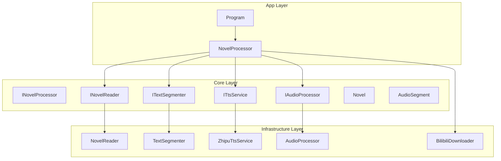
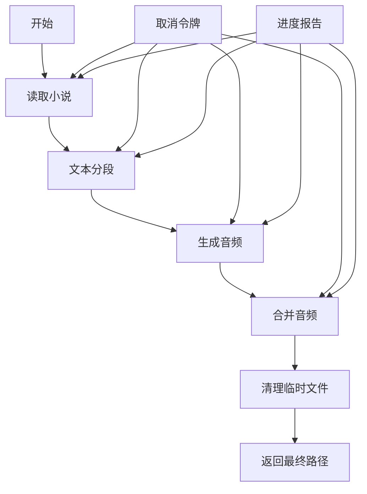
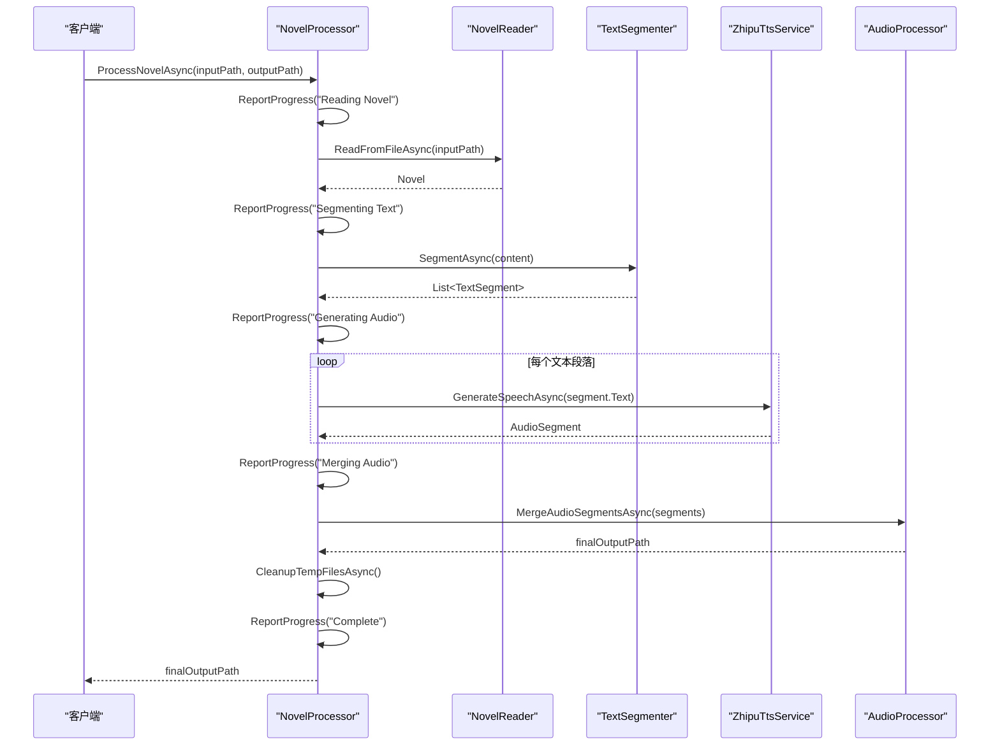
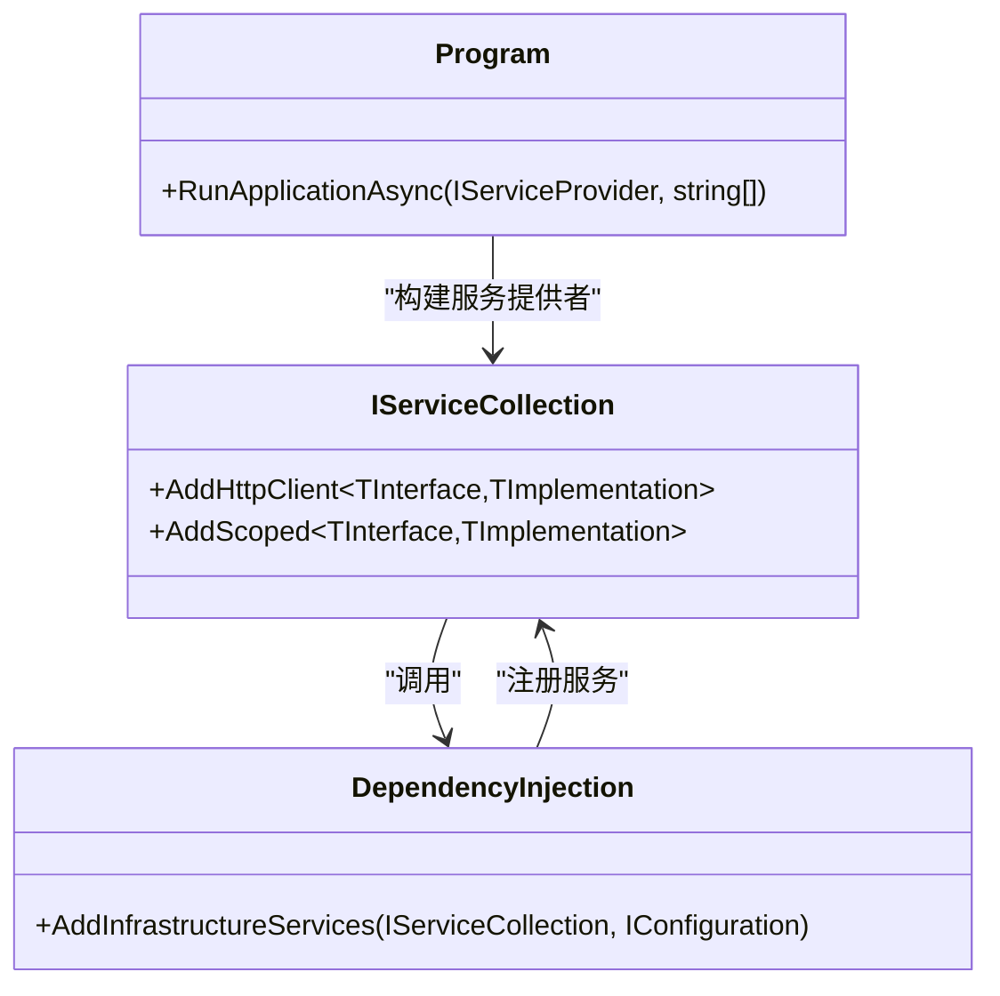
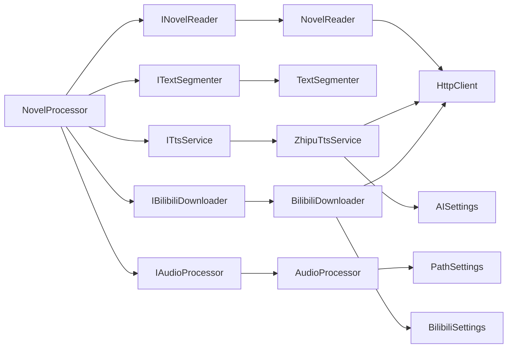

# 小说处理器

<cite>
**本文档引用的文件**  
- [INovelProcessor.cs](file://src/Core/Interfaces/INovelProcessor.cs)
- [NovelProcessor.cs](file://src/App/Services/NovelProcessor.cs)
- [Program.cs](file://src/App/Program.cs)
- [DependencyInjection.cs](file://src/Infrastructure/DependencyInjection.cs)
- [Novel.cs](file://src/Core/Entities/Novel.cs)
- [AudioSegment.cs](file://src/Core/Entities/AudioSegment.cs)
- [NovelReader.cs](file://src/Infrastructure/Services/NovelReader.cs)
- [TextSegmenter.cs](file://src/Infrastructure/Services/TextSegmenter.cs)
- [ZhipuTtsService.cs](file://src/Infrastructure/Services/ZhipuTtsService.cs)
- [AudioProcessor.cs](file://src/Infrastructure/Services/AudioProcessor.cs)
- [BilibiliDownloader.cs](file://src/Infrastructure/Services/BilibiliDownloader.cs)
</cite>

## 目录
1. [简介](#简介)
2. [项目结构](#项目结构)
3. [核心组件](#核心组件)
4. [架构概述](#架构概述)
5. [详细组件分析](#详细组件分析)
6. [依赖分析](#依赖分析)
7. [性能考虑](#性能考虑)
8. [故障排除指南](#故障排除指南)
9. [结论](#结论)

## 简介
本技术文档详细阐述了`INovelProcessor`接口及其具体实现`NovelProcessor`的设计与功能。该组件作为小说转有声书应用的核心业务流程编排器，负责协调小说读取、文本分段、TTS语音合成和音频处理等多个服务，将文本小说转换为高质量的音频文件。文档将深入解析其主要方法的执行流程、异常处理机制、进度报告系统，并说明其在依赖注入环境中的注册与调用方式。

## 项目结构
项目采用分层架构，主要分为`App`、`Core`和`Infrastructure`三个部分。`Core`层定义了核心业务逻辑的接口和实体，`Infrastructure`层提供了这些接口的具体实现，而`App`层则负责应用的启动和业务流程的编排。`NovelProcessor`位于`App/Services`目录下，是连接各层服务的关键枢纽。

**图表来源**
- [NovelProcessor.cs](file://src/App/Services/NovelProcessor.cs#L6-L11)
- [INovelProcessor.cs](file://src/Core/Interfaces/INovelProcessor.cs#L6-L27)
- [Program.cs](file://src/App/Program.cs#L41)
- [DependencyInjection.cs](file://src/Infrastructure/DependencyInjection.cs#L22-L28)

## 核心组件
`INovelProcessor`接口定义了处理小说的核心契约，其主要方法`ProcessNovelAsync`和`ProcessBatchAsync`构成了应用的主干流程。`NovelProcessor`类通过依赖注入获取`INovelReader`、`ITextSegmenter`、`ITtsService`和`IAudioProcessor`等服务，实现了从输入文件到最终音频输出的完整自动化流水线。

**章节来源**
- [INovelProcessor.cs](file://src/Core/Interfaces/INovelProcessor.cs#L11-L26)
- [NovelProcessor.cs](file://src/App/Services/NovelProcessor.cs#L14-L149)

## 架构概述
`NovelProcessor`作为应用的中央控制器，遵循清晰的四阶段处理流程：读取、分段、合成、合并。它不直接执行具体任务，而是协调底层服务完成工作，并通过`IProgress<ProcessingProgress>`接口向外部报告实时进度。

**图表来源**
- [NovelProcessor.cs](file://src/App/Services/NovelProcessor.cs#L25-L87)

## 详细组件分析

### `NovelProcessor` 类分析

#### `ProcessNovelAsync` 方法执行流程
该方法是整个应用的核心，其执行流程如下：

1.  **读取小说**：调用`INovelReader.ReadFromFileAsync`从指定路径加载小说文本，创建`Novel`实体。
2.  **文本分段**：调用`ITextSegmenter.SegmentAsync`将长篇小说内容分割成适合TTS处理的短段落（默认500字符）。
3.  **生成音频**：遍历每个文本段落，调用`ITtsService.GenerateSpeechAsync`生成对应的音频片段，并将结果存储在`AudioSegment`列表中。此阶段支持自定义音色。
4.  **合并音频**：调用`IAudioProcessor.MergeAudioSegmentsAsync`将所有成功的音频片段按顺序合并成一个完整的音频文件。
5.  **清理与返回**：删除生成的临时音频文件，更新小说状态，并返回最终音频文件的路径。

**图表来源**
- [NovelProcessor.cs](file://src/App/Services/NovelProcessor.cs#L14-L87)
- [NovelReader.cs](file://src/Infrastructure/Services/NovelReader.cs#L10-L32)
- [TextSegmenter.cs](file://src/Infrastructure/Services/TextSegmenter.cs#L9-L88)
- [ZhipuTtsService.cs](file://src/Infrastructure/Services/ZhipuTtsService.cs#L35-L81)
- [AudioProcessor.cs](file://src/Infrastructure/Services/AudioProcessor.cs#L13-L107)

#### 参数传递与异常处理
- **参数传递**：`ProcessNovelAsync`方法接收输入路径、输出路径、可选的`VoiceReference`（用于音色克隆）以及`IProgress<ProcessingProgress>`和`CancellationToken`。这些参数被直接传递给底层服务，确保了配置的一致性。
- **异常处理**：方法使用`try-catch`块捕获所有异常。`OperationCanceledException`被重新抛出以支持取消操作，其他异常则通过日志记录后重新抛出，确保调用方能感知到错误。

**章节来源**
- [NovelProcessor.cs](file://src/App/Services/NovelProcessor.cs#L23-L99)

#### 进度报告机制
`NovelProcessor`通过`IProgress<ProcessingProgress>`接口实现进度报告。`ProcessingProgress`类包含`Stage`（当前阶段）、`PercentComplete`（完成百分比）、`CurrentItem`和`TotalItems`（当前/总项数）等属性。`ReportProgress`私有方法封装了报告逻辑，各处理阶段会调用此方法更新进度。

**章节来源**
- [INovelProcessor.cs](file://src/Core/Interfaces/INovelProcessor.cs#L32-L58)
- [NovelProcessor.cs](file://src/App/Services/NovelProcessor.cs#L151-L167)

### 依赖注入与命令行集成

#### 依赖注入注册
在`DependencyInjection.cs`中，`AddInfrastructureServices`方法将`NovelReader`、`TextSegmenter`、`ZhipuTtsService`和`AudioProcessor`等服务注册到依赖注入容器。在`Program.cs`中，`NovelProcessor`被注册为`INovelProcessor`的实现。

**图表来源**
- [DependencyInjection.cs](file://src/Infrastructure/DependencyInjection.cs#L11-L31)
- [Program.cs](file://src/App/Program.cs#L38-L41)

#### 命令行参数解析
`Program.cs`中的`RunApplicationAsync`方法负责解析命令行参数。它支持`-i`（输入）、`-o`（输出）、`-v`（音色URL）等选项。当提供B站视频URL时，程序会通过`IBilibiliDownloader`下载音频并创建`VoiceReference`，然后将其传递给`NovelProcessor`。

**章节来源**
- [Program.cs](file://src/App/Program.cs#L77-L207)

## 依赖分析
`NovelProcessor`与多个服务存在直接依赖关系，形成了一个清晰的依赖链。它依赖于`INovelReader`、`ITextSegmenter`、`ITtsService`和`IAudioProcessor`，而这些接口的实现又可能依赖于`HttpClient`、配置选项等。这种基于接口的依赖关系确保了代码的松耦合和可测试性。

**图表来源**
- [NovelProcessor.cs](file://src/App/Services/NovelProcessor.cs#L8-L11)
- [DependencyInjection.cs](file://src/Infrastructure/DependencyInjection.cs#L22-L28)

## 性能考虑
- **异步处理**：所有核心方法均使用`async/await`，避免阻塞主线程，提高应用响应性。
- **内存管理**：大文件（如音频）的处理通过流式操作或分段处理，避免一次性加载到内存。
- **重试机制**：`ZhipuTtsService`内部集成了Polly重试策略，可应对网络波动导致的API调用失败。
- **并行处理**：虽然当前`ProcessNovelAsync`是串行处理段落，但未来可通过`Parallel.ForEachAsync`优化以提升速度。

## 故障排除指南
以下是一些常见问题及解决建议：

| 问题现象 | 可能原因 | 解决方案 |
| :--- | :--- | :--- |
| 处理过程中断，提示“OperationCanceledException” | 操作被用户或系统取消 | 检查是否按下了取消键，或上层调用传递了已取消的`CancellationToken` |
| TTS生成失败，日志显示429错误 | 智谱AI API请求过于频繁 | 等待一段时间后重试，或检查API配额 |
| 音频合并失败，提示“no valid audio segments” | 所有TTS段落生成均失败 | 检查`ZhipuTtsService`的API密钥和端点配置是否正确 |
| B站音频下载失败 | URL格式错误或网络问题 | 确认URL包含有效的BV号，检查网络连接和B站Cookie配置 |
| 输出音频文件为空或损坏 | `AudioProcessor`的NAudio库不支持MP3编码 | 确保输出路径为`.wav`格式，或安装`NAudio.Lame`库支持MP3 |

**章节来源**
- [NovelProcessor.cs](file://src/App/Services/NovelProcessor.cs#L69-L71)
- [ZhipuTtsService.cs](file://src/Infrastructure/Services/ZhipuTtsService.cs#L179-L183)
- [BilibiliDownloader.cs](file://src/Infrastructure/Services/BilibiliDownloader.cs#L25-L28)
- [AudioProcessor.cs](file://src/Infrastructure/Services/AudioProcessor.cs#L137-L139)

## 结论
`NovelProcessor`是一个设计良好、职责明确的核心业务编排器。它通过组合多个独立的服务，实现了从文本到有声书的自动化转换。其清晰的阶段划分、完善的进度报告和异常处理机制，使得整个流程既可靠又易于监控。结合依赖注入和命令行参数解析，该组件为应用提供了强大的灵活性和可扩展性，是整个小说转有声书系统成功的关键。