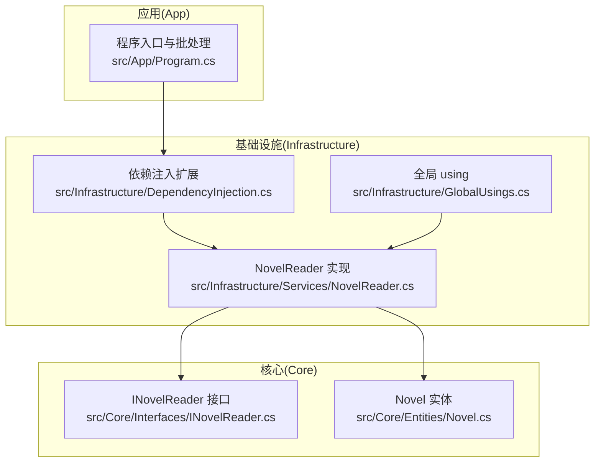
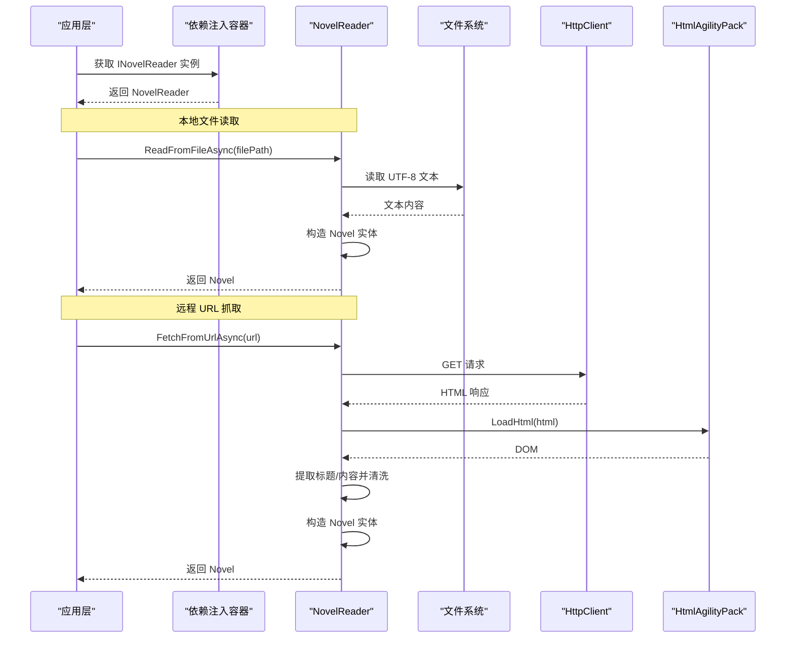
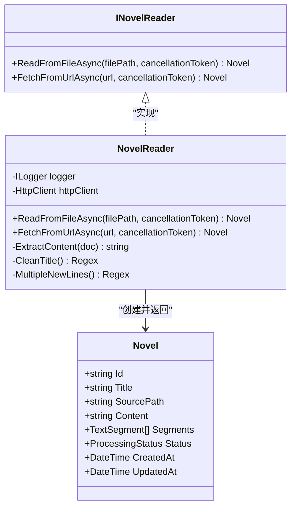
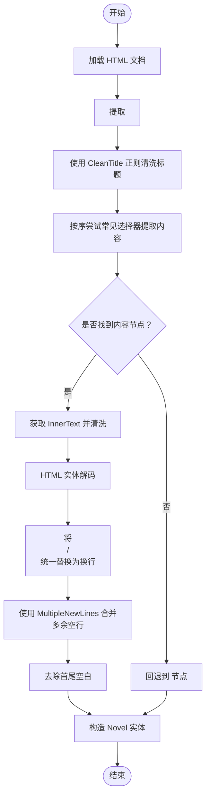
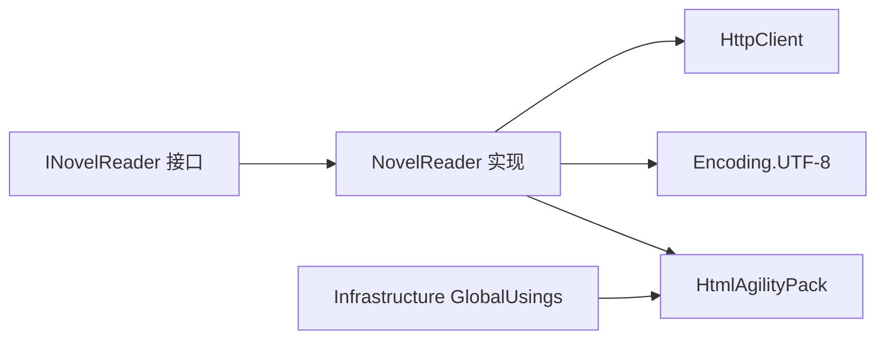

# 小说读取器

<cite>
**本文引用的文件**
- [src/Core/Interfaces/INovelReader.cs](file://src/Core/Interfaces/INovelReader.cs)
- [src/Infrastructure/Services/NovelReader.cs](file://src/Infrastructure/Services/NovelReader.cs)
- [src/Core/Entities/Novel.cs](file://src/Core/Entities/Novel.cs)
- [src/Infrastructure/DependencyInjection.cs](file://src/Infrastructure/DependencyInjection.cs)
- [src/Infrastructure/GlobalUsings.cs](file://src/Infrastructure/GlobalUsings.cs)
- [src/App/Program.cs](file://src/App/Program.cs)
</cite>

## 目录
1. [简介](#简介)
2. [项目结构](#项目结构)
3. [核心组件](#核心组件)
4. [架构总览](#架构总览)
5. [详细组件分析](#详细组件分析)
6. [依赖关系分析](#依赖关系分析)
7. [性能考虑](#性能考虑)
8. [故障排查指南](#故障排查指南)
9. [结论](#结论)
10. [附录](#附录)

## 简介
本文件系统性记录 INovelReader 接口及其具体实现 NovelReader 的技术细节，重点说明：
- 如何支持从本地 .txt 文件与远程 URL 读取小说内容；
- 编码格式（UTF-8）的处理；
- 使用 HtmlAgilityPack 对 HTML 内容进行解析与清洗；
- 标题提取与清洗、章节内容提取与清洗的流程；
- 与 Novel 实体模型的数据映射；
- 文件不存在与网络请求失败等异常处理；
- 异步读取方法的使用示例路径；
- 批量处理模式下的性能优化策略。

## 项目结构
该功能位于基础设施层（Infrastructure），通过依赖注入注册为 HttpClient 客户端，供应用层调用；核心实体定义在 Core 层，接口定义也在 Core 层。

图表来源
- [src/Core/Interfaces/INovelReader.cs](file://src/Core/Interfaces/INovelReader.cs#L1-L18)
- [src/Core/Entities/Novel.cs](file://src/Core/Entities/Novel.cs#L1-L80)
- [src/Infrastructure/DependencyInjection.cs](file://src/Infrastructure/DependencyInjection.cs#L1-L33)
- [src/Infrastructure/Services/NovelReader.cs](file://src/Infrastructure/Services/NovelReader.cs#L1-L104)
- [src/Infrastructure/GlobalUsings.cs](file://src/Infrastructure/GlobalUsings.cs#L1-L20)
- [src/App/Program.cs](file://src/App/Program.cs#L1-L291)

章节来源
- [src/Core/Interfaces/INovelReader.cs](file://src/Core/Interfaces/INovelReader.cs#L1-L18)
- [src/Core/Entities/Novel.cs](file://src/Core/Entities/Novel.cs#L1-L80)
- [src/Infrastructure/DependencyInjection.cs](file://src/Infrastructure/DependencyInjection.cs#L1-L33)
- [src/Infrastructure/Services/NovelReader.cs](file://src/Infrastructure/Services/NovelReader.cs#L1-L104)
- [src/Infrastructure/GlobalUsings.cs](file://src/Infrastructure/GlobalUsings.cs#L1-L20)
- [src/App/Program.cs](file://src/App/Program.cs#L1-L291)

## 核心组件
- INovelReader 接口：定义两个异步方法，分别用于从本地文件读取与从 URL 抓取小说内容。
- NovelReader 实现：完成文件读取（UTF-8 编码）、URL 请求与 HTML 解析（HtmlAgilityPack）、标题清洗、内容提取与清洗、并返回 Novel 实体。
- Novel 实体：承载小说标题、源路径、正文内容、分段列表、处理状态与时间戳等信息。
- 依赖注入：通过 AddHttpClient 将 INovelReader 注册为 NovelReader，便于在应用层以接口形式注入使用。

章节来源
- [src/Core/Interfaces/INovelReader.cs](file://src/Core/Interfaces/INovelReader.cs#L1-L18)
- [src/Infrastructure/Services/NovelReader.cs](file://src/Infrastructure/Services/NovelReader.cs#L1-L104)
- [src/Core/Entities/Novel.cs](file://src/Core/Entities/Novel.cs#L1-L80)
- [src/Infrastructure/DependencyInjection.cs](file://src/Infrastructure/DependencyInjection.cs#L1-L33)

## 架构总览
下面的序列图展示了应用层通过 INovelReader 读取小说的典型流程，包括本地文件与远程 URL 两种路径。

图表来源
- [src/Infrastructure/DependencyInjection.cs](file://src/Infrastructure/DependencyInjection.cs#L1-L33)
- [src/Infrastructure/Services/NovelReader.cs](file://src/Infrastructure/Services/NovelReader.cs#L1-L104)
- [src/App/Program.cs](file://src/App/Program.cs#L1-L291)

## 详细组件分析

### INovelReader 接口
- 职责：定义从文件读取与从 URL 抓取小说内容的异步接口。
- 方法：
  - ReadFromFileAsync：接收文件路径，返回 Novel。
  - FetchFromUrlAsync：接收 URL，返回 Novel。
- 参数与取消令牌：均支持 CancellationToken，默认值为默认参数。

章节来源
- [src/Core/Interfaces/INovelReader.cs](file://src/Core/Interfaces/INovelReader.cs#L1-L18)

### NovelReader 实现类
- 依赖注入：
  - ILogger<NovelReader>：用于记录日志。
  - HttpClient：用于远程 URL 请求。
- 本地文件读取（ReadFromFileAsync）
  - 文件存在性检查：若不存在则抛出 FileNotFoundException。
  - 编码：使用 UTF-8 读取文本。
  - 标题：从文件名（不含扩展名）生成。
  - Novel 映射：设置 Title、SourcePath、Content。
  - 日志：记录成功读取的标题与字符长度。
- 远程 URL 抓取（FetchFromUrlAsync）
  - 请求：GET 请求，确保状态码成功。
  - HTML 解析：使用 HtmlAgilityPack 加载文档。
  - 标题提取与清洗：
    - 从 <title> 节点提取文本，去空白。
    - 使用 CleanTitle 正则清洗标题尾部附加信息。
  - 内容提取与清洗：
    - 优先尝试多个常见选择器（如 id='content'、class='content'、article 等）。
    - 若未命中，回退到 body 节点。
    - 清洗步骤：HTML 实体解码、将  /  统一替换为换行、使用 MultipleNewLines 正则合并多余空行。
  - Novel 映射：设置 Title、SourcePath、Content。
  - 日志：记录成功抓取的标题与字符长度。
- 私有方法与正则
  - ExtractContent：按顺序尝试选择器并清洗。
  - CleanTitle：生成的正则，用于清洗标题尾部多余部分。
  - MultipleNewLines：生成的正则，用于合并多余空行。

图表来源
- [src/Core/Interfaces/INovelReader.cs](file://src/Core/Interfaces/INovelReader.cs#L1-L18)
- [src/Infrastructure/Services/NovelReader.cs](file://src/Infrastructure/Services/NovelReader.cs#L1-L104)
- [src/Core/Entities/Novel.cs](file://src/Core/Entities/Novel.cs#L1-L80)

章节来源
- [src/Infrastructure/Services/NovelReader.cs](file://src/Infrastructure/Services/NovelReader.cs#L1-L104)
- [src/Core/Entities/Novel.cs](file://src/Core/Entities/Novel.cs#L1-L80)

### HTML 内容清洗与章节提取流程
以下流程图展示了从 HTML 中提取并清洗内容的关键步骤：

图表来源
- [src/Infrastructure/Services/NovelReader.cs](file://src/Infrastructure/Services/NovelReader.cs#L34-L96)

章节来源
- [src/Infrastructure/Services/NovelReader.cs](file://src/Infrastructure/Services/NovelReader.cs#L34-L96)

### 与 Novel 实体模型的数据映射
- NovelReader 在读取完成后，将标题、源路径与内容映射到 Novel 实体中：
  - Title：本地文件读取时来自文件名（不含扩展名）；远程 URL 读取时来自清洗后的标题。
  - SourcePath：本地文件读取时为文件路径；远程 URL 读取时为 URL。
  - Content：本地文件读取时为完整文本；远程 URL 读取时为清洗后的正文。
- Novel 实体还包含分段列表、处理状态与时间戳等字段，供后续处理阶段使用。

章节来源
- [src/Infrastructure/Services/NovelReader.cs](file://src/Infrastructure/Services/NovelReader.cs#L11-L64)
- [src/Core/Entities/Novel.cs](file://src/Core/Entities/Novel.cs#L1-L80)

### 异常处理
- 文件不存在：当本地文件不存在时，抛出 FileNotFoundException。
- 网络请求失败：FetchFromUrlAsync 会先确保状态码成功，若失败将抛出异常（由响应对象保证）。
- HTML 解析与内容提取：未命中任何选择器时，回退到 body 节点；若仍为空，则返回空字符串，避免异常传播。

章节来源
- [src/Infrastructure/Services/NovelReader.cs](file://src/Infrastructure/Services/NovelReader.cs#L14-L20)
- [src/Infrastructure/Services/NovelReader.cs](file://src/Infrastructure/Services/NovelReader.cs#L38-L41)
- [src/Infrastructure/Services/NovelReader.cs](file://src/Infrastructure/Services/NovelReader.cs#L93-L96)

### 异步读取方法使用示例（代码片段路径）
- 本地文件读取：参见 [ReadFromFileAsync](file://src/Infrastructure/Services/NovelReader.cs#L11-L32)
- 远程 URL 抓取：参见 [FetchFromUrlAsync](file://src/Infrastructure/Services/NovelReader.cs#L34-L64)

章节来源
- [src/Infrastructure/Services/NovelReader.cs](file://src/Infrastructure/Services/NovelReader.cs#L11-L64)

### 批量处理模式下的性能优化策略
- 依赖注入注册：通过 AddHttpClient 将 INovelReader 注册为 NovelReader，使应用层以接口形式注入，便于替换与测试。
- 应用层批处理：在应用层通过 Program.cs 收集待处理的 .txt/.md 文件列表，调用处理器执行批量处理，从而减少重复初始化成本。
- 并发与取消：所有读取方法均支持 CancellationToken，可在批量处理中结合并发控制与取消机制提升吞吐。
- I/O 优化：
  - 本地读取采用 UTF-8 异步读取，避免阻塞。
  - 远程抓取复用 HttpClient，减少连接开销。
- 内容清洗：通过预置的选择器与正则清洗，减少后续处理的不确定性与额外开销。

章节来源
- [src/Infrastructure/DependencyInjection.cs](file://src/Infrastructure/DependencyInjection.cs#L1-L33)
- [src/App/Program.cs](file://src/App/Program.cs#L131-L174)

## 依赖关系分析
- 接口与实现：
  - INovelReader 是抽象接口，NovelReader 是其实现。
- 外部库：
  - HtmlAgilityPack：用于 HTML 解析与 DOM 访问。
  - System.Text.Encoding：用于 UTF-8 读取。
  - System.Net.Http：用于远程请求。
- 全局 using：
  - 在基础设施层统一引入 HtmlAgilityPack，简化命名空间使用。

图表来源
- [src/Core/Interfaces/INovelReader.cs](file://src/Core/Interfaces/INovelReader.cs#L1-L18)
- [src/Infrastructure/Services/NovelReader.cs](file://src/Infrastructure/Services/NovelReader.cs#L1-L104)
- [src/Infrastructure/GlobalUsings.cs](file://src/Infrastructure/GlobalUsings.cs#L1-L20)

章节来源
- [src/Core/Interfaces/INovelReader.cs](file://src/Core/Interfaces/INovelReader.cs#L1-L18)
- [src/Infrastructure/Services/NovelReader.cs](file://src/Infrastructure/Services/NovelReader.cs#L1-L104)
- [src/Infrastructure/GlobalUsings.cs](file://src/Infrastructure/GlobalUsings.cs#L1-L20)

## 性能考虑
- I/O 与编码：
  - 本地文件读取使用 UTF-8 异步读取，避免阻塞主线程。
- 网络请求：
  - 复用 HttpClient，减少连接建立与 TLS 握手开销。
  - 状态码校验前置，快速失败，避免无效解析。
- HTML 解析与清洗：
  - 选择器按优先级顺序尝试，命中即返回，减少不必要的遍历。
  - 清洗步骤集中于正则替换，避免多次 DOM 遍历。
- 批量处理：
  - 应用层收集文件列表后统一调度，减少重复初始化与上下文切换。
  - 可结合并发与取消令牌控制整体吞吐与资源占用。

## 故障排查指南
- 文件不存在：
  - 现象：抛出 FileNotFoundException。
  - 排查：确认文件路径正确且文件存在。
  - 参考：[ReadFromFileAsync 文件存在性检查](file://src/Infrastructure/Services/NovelReader.cs#L14-L20)
- 网络请求失败：
  - 现象：EnsureSuccessStatusCode 抛出异常。
  - 排查：检查 URL 是否可达、网络连通性、目标站点返回状态码。
  - 参考：[FetchFromUrlAsync 状态码校验](file://src/Infrastructure/Services/NovelReader.cs#L38-L41)
- HTML 内容为空：
  - 现象：未命中任何选择器，回退到 body，可能为空字符串。
  - 排查：确认页面结构或调整选择器策略。
  - 参考：[ExtractContent 回退逻辑](file://src/Infrastructure/Services/NovelReader.cs#L93-L96)
- 标题清洗不生效：
  - 现象：标题尾部仍有冗余信息。
  - 排查：检查 CleanTitle 正则是否符合目标站点标题格式。
  - 参考：[CleanTitle 正则](file://src/Infrastructure/Services/NovelReader.cs#L98-L100)
- 多余空行过多：
  - 现象：段落间空行过多影响阅读。
  - 排查：检查 MultipleNewLines 正则与清洗链路。
  - 参考：[MultipleNewLines 正则](file://src/Infrastructure/Services/NovelReader.cs#L100-L102)

章节来源
- [src/Infrastructure/Services/NovelReader.cs](file://src/Infrastructure/Services/NovelReader.cs#L14-L20)
- [src/Infrastructure/Services/NovelReader.cs](file://src/Infrastructure/Services/NovelReader.cs#L38-L41)
- [src/Infrastructure/Services/NovelReader.cs](file://src/Infrastructure/Services/NovelReader.cs#L93-L96)
- [src/Infrastructure/Services/NovelReader.cs](file://src/Infrastructure/Services/NovelReader.cs#L98-L102)

## 结论
NovelReader 通过清晰的接口设计与稳健的实现，实现了对本地 .txt 文件与远程 URL 的统一读取能力。其利用 HtmlAgilityPack 进行 HTML 解析与清洗，并以 Novel 实体作为数据载体，便于后续处理。配合依赖注入与应用层的批量处理策略，能够在保证可维护性的同时获得良好的性能表现。

## 附录
- 依赖注入注册位置：参见 [AddInfrastructureServices](file://src/Infrastructure/DependencyInjection.cs#L1-L33)
- 全局 using（HtmlAgilityPack）：参见 [GlobalUsings](file://src/Infrastructure/GlobalUsings.cs#L1-L20)
- 应用层批量处理入口：参见 [RunApplicationAsync](file://src/App/Program.cs#L58-L208)