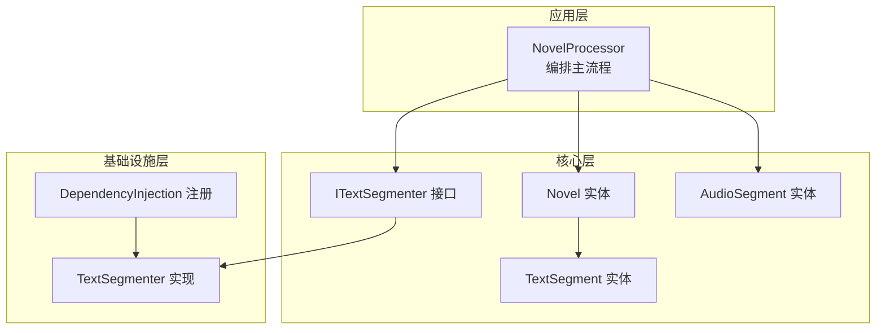
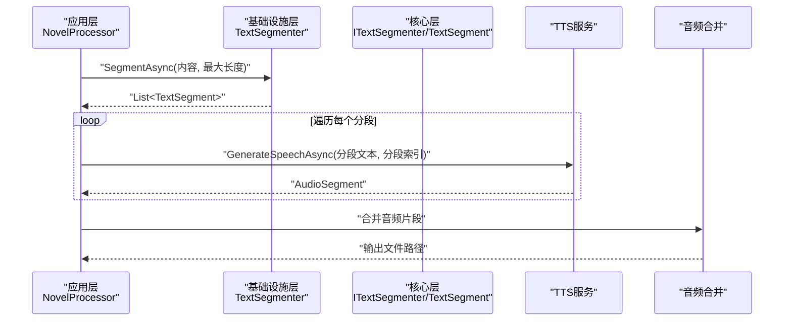
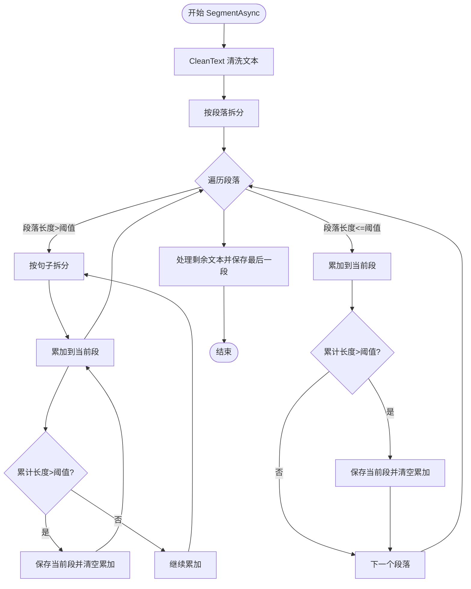
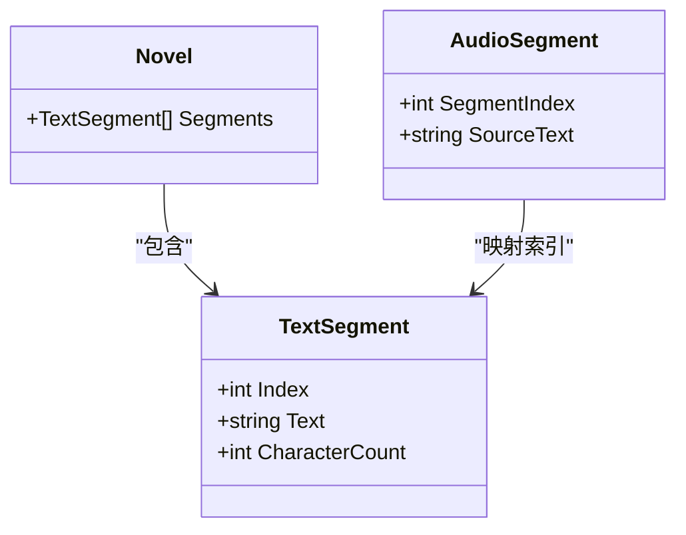
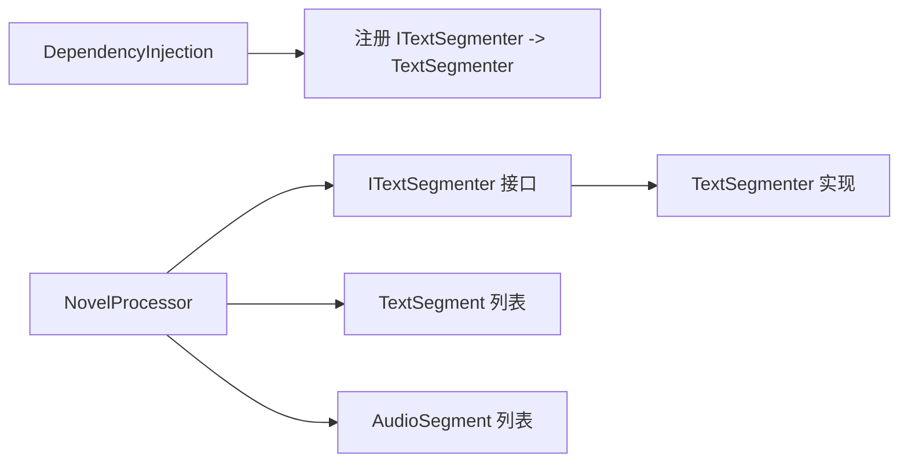

# 文本分段器

<cite>
**本文引用的文件**
- [ITextSegmenter.cs](file://src/Core/Interfaces/ITextSegmenter.cs)
- [TextSegmenter.cs](file://src/Infrastructure/Services/TextSegmenter.cs)
- [Novel.cs](file://src/Core/Entities/Novel.cs)
- [AudioSegment.cs](file://src/Core/Entities/AudioSegment.cs)
- [NovelProcessor.cs](file://src/App/Services/NovelProcessor.cs)
- [DependencyInjection.cs](file://src/Infrastructure/DependencyInjection.cs)
- [002.内容简介人是万物之灵，蛊是天地真精。三观不正，魔头重生。昔日旧梦，同名新作。一个穿越者不断重生的故事.txt](file://data/novels/蛊真人/01.第一章：前言/002.内容简介人是万物之灵，蛊是天地真精。三观不正，魔头重生。昔日旧梦，同名新作。一个穿越者不断重生的故事.txt)
</cite>

## 目录
1. [简介](#简介)
2. [项目结构](#项目结构)
3. [核心组件](#核心组件)
4. [架构总览](#架构总览)
5. [详细组件分析](#详细组件分析)
6. [依赖关系分析](#依赖关系分析)
7. [性能考量](#性能考量)
8. [故障排查指南](#故障排查指南)
9. [结论](#结论)
10. [附录](#附录)

## 简介
本文件围绕 ITextSegmenter 接口与其实现 TextSegmenter 的智能分段算法进行深入解析，重点说明其如何将长篇小说文本拆分为适合语音合成（TTS）的合理段落。内容涵盖：
- 基于段落与句子的双层切分策略
- 标点符号驱动的句子边界识别
- 句子长度与最大字符限制的平衡
- 避免在对话中间断句的逻辑
- 清洗文本（去除HTML、多余空白、特殊字符）以提升TTS质量
- 返回 TextSegment 列表的数据结构设计及其对TTS流程的影响

## 项目结构
该功能位于基础设施层（Infrastructure），通过依赖注入注册为服务，供应用层的 NovelProcessor 在处理小说时调用。

图表来源
- [NovelProcessor.cs](file://src/App/Services/NovelProcessor.cs#L1-L120)
- [ITextSegmenter.cs](file://src/Core/Interfaces/ITextSegmenter.cs#L1-L18)
- [TextSegmenter.cs](file://src/Infrastructure/Services/TextSegmenter.cs#L1-L128)
- [Novel.cs](file://src/Core/Entities/Novel.cs#L1-L80)
- [AudioSegment.cs](file://src/Core/Entities/AudioSegment.cs#L1-L74)
- [DependencyInjection.cs](file://src/Infrastructure/DependencyInjection.cs#L1-L33)

章节来源
- [DependencyInjection.cs](file://src/Infrastructure/DependencyInjection.cs#L1-L33)
- [NovelProcessor.cs](file://src/App/Services/NovelProcessor.cs#L1-L120)

## 核心组件
- ITextSegmenter 接口：定义分段与清洗文本的能力，支持可配置的最大段落长度与取消令牌。
- TextSegmenter 实现：按段落拆分，再按句子拆分长段，结合标点与长度阈值进行切分；提供文本清洗。
- TextSegment 实体：承载单个分段的索引与文本内容，便于后续TTS生成与合并。
- NovelProcessor：在读取小说后调用分段器，将结果写入 Novel.Segments，随后逐段生成音频并合并。

章节来源
- [ITextSegmenter.cs](file://src/Core/Interfaces/ITextSegmenter.cs#L1-L18)
- [TextSegmenter.cs](file://src/Infrastructure/Services/TextSegmenter.cs#L1-L128)
- [Novel.cs](file://src/Core/Entities/Novel.cs#L1-L80)
- [NovelProcessor.cs](file://src/App/Services/NovelProcessor.cs#L1-L120)

## 架构总览
下面的序列图展示了从应用层到基础设施层的调用链，以及分段与TTS生成的整体流程。

图表来源
- [NovelProcessor.cs](file://src/App/Services/NovelProcessor.cs#L1-L120)
- [TextSegmenter.cs](file://src/Infrastructure/Services/TextSegmenter.cs#L1-L128)
- [ITextSegmenter.cs](file://src/Core/Interfaces/ITextSegmenter.cs#L1-L18)
- [AudioSegment.cs](file://src/Core/Entities/AudioSegment.cs#L1-L74)

## 详细组件分析

### ITextSegmenter 接口
- 能力概述
  - 提供异步分段方法，支持最大字符限制与取消令牌。
  - 提供文本清洗方法，用于预处理输入文本。
- 设计意图
  - 将“分段策略”与“具体实现”解耦，便于替换或扩展算法。
  - 统一对外契约，保证上层调用的一致性。

章节来源
- [ITextSegmenter.cs](file://src/Core/Interfaces/ITextSegmenter.cs#L1-L18)

### TextSegmenter 实现
- 分段策略
  - 第一层：按段落拆分，过滤空白段。
  - 第二层：遍历段落，若段落长度超过阈值，则按句子拆分；否则直接累加到当前段。
  - 句子边界由标点符号识别（中文常见句号、感叹号、问号及英文对应标点）。
  - 当累加文本达到阈值时，先保存当前段，再继续累积。
- 长度控制
  - 通过参数 maxSegmentLength 控制每段最大字符数，默认值在调用处使用。
- 取消机制
  - 在关键循环中检查取消令牌，确保可中断。
- 文本清洗
  - 移除HTML标签，规范化空白（合并多余空格、规范换行），剔除可能影响TTS发音的特殊字符。
- 返回结构
  - 返回 List<TextSegment>，包含索引与文本，便于后续TTS生成与合并。

图表来源
- [TextSegmenter.cs](file://src/Infrastructure/Services/TextSegmenter.cs#L1-L128)

章节来源
- [TextSegmenter.cs](file://src/Infrastructure/Services/TextSegmenter.cs#L1-L128)

### TextSegment 数据结构
- 字段设计
  - Index：分段顺序索引，便于TTS生成与合并时保持顺序一致性。
  - Text：分段文本内容。
  - CharacterCount：只读属性，便于统计与监控。
- 设计意图
  - 简洁明确的分段载体，降低上下文耦合，利于并行与重试。
  - 与 Novel.Segments 关联，形成“小说-分段-音频”的清晰映射。

图表来源
- [Novel.cs](file://src/Core/Entities/Novel.cs#L1-L80)
- [AudioSegment.cs](file://src/Core/Entities/AudioSegment.cs#L1-L74)

章节来源
- [Novel.cs](file://src/Core/Entities/Novel.cs#L1-L80)
- [AudioSegment.cs](file://src/Core/Entities/AudioSegment.cs#L1-L74)

### 分段前后文本对比示例
以下示例展示分段前后的文本形态差异，帮助理解切分效果与边界选择。

- 示例来源文本（节选自样例小说文件）
  - 文件路径：[002.内容简介人是万物之灵，蛊是天地真精。三观不正，魔头重生。昔日旧梦，同名新作。一个穿越者不断重生的故事.txt](file://data/novels/蛊真人/01.第一章：前言/002.内容简介人是万物之灵，蛊是天地真精。三观不正，魔头重生。昔日旧梦，同名新作。一个穿越者不断重生的故事.txt#L1-L14)
- 分段前
  - 多段落、长段落混合，夹杂换行与空行。
- 分段后
  - 按段落与句子边界拆分，每段长度接近但不超过最大字符限制；避免在对话中间断句，保持语义连贯。

说明
- 具体分段结果取决于实际输入文本与标点分布，此处不展示具体代码片段，仅说明数据结构与流程。

章节来源
- [002.内容简介人是万物之灵，蛊是天地真精。三观不正，魔头重生。昔日旧梦，同名新作。一个穿越者不断重生的故事.txt](file://data/novels/蛊真人/01.第一章：前言/002.内容简介人是万物之灵，蛊是天地真精。三观不正，魔头重生。昔日旧梦，同名新作。一个穿越者不断重生的故事.txt#L1-L14)
- [TextSegmenter.cs](file://src/Infrastructure/Services/TextSegmenter.cs#L1-L128)

### 避免在不恰当位置断句的逻辑
- 句子边界识别
  - 使用标点符号作为句子终止标志，优先在句号、感叹号、问号等位置切分，减少在对话中间断句的概率。
- 长段落处理
  - 当单个段落超过阈值时，先按句子拆分，再逐句累加，从而避免强行在句子中间截断。
- 语义连贯性
  - 通过“先段落、后句子”的双层策略，优先保持段落完整性，其次在句子边界处切分，有助于维持语义连贯。

章节来源
- [TextSegmenter.cs](file://src/Infrastructure/Services/TextSegmenter.cs#L1-L128)

### 对TTS服务质量的影响
- 合理的段落长度
  - 过短的段落会增加TTS调用次数，带来额外开销与停顿；过长的段落可能导致TTS服务超时或发音不自然。
- 标点与语义
  - 基于标点的句子切分有助于TTS在自然停顿处换气，改善语音流畅度。
- 文本清洗
  - 去除HTML标签与特殊字符，减少TTS异常与口型错配，提升可懂度与稳定性。
- 索引与合并
  - 通过 TextSegment.Index 与 AudioSegment.SegmentIndex 的映射，确保音频合并顺序正确，避免错位。

章节来源
- [TextSegmenter.cs](file://src/Infrastructure/Services/TextSegmenter.cs#L1-L128)
- [Novel.cs](file://src/Core/Entities/Novel.cs#L1-L80)
- [AudioSegment.cs](file://src/Core/Entities/AudioSegment.cs#L1-L74)
- [NovelProcessor.cs](file://src/App/Services/NovelProcessor.cs#L1-L120)

## 依赖关系分析
- 依赖注入
  - TextSegmenter 通过依赖注入注册为 ITextSegmenter 的实现，供应用层统一调用。
- 调用链
  - NovelProcessor 在读取小说后调用 ITextSegmenter.SegmentAsync，得到 TextSegment 列表，随后逐段调用 TTS 服务生成音频。
- 解耦与扩展
  - 通过接口隔离，可在不修改上层逻辑的前提下替换分段策略或实现。

图表来源
- [DependencyInjection.cs](file://src/Infrastructure/DependencyInjection.cs#L1-L33)
- [NovelProcessor.cs](file://src/App/Services/NovelProcessor.cs#L1-L120)
- [ITextSegmenter.cs](file://src/Core/Interfaces/ITextSegmenter.cs#L1-L18)
- [TextSegmenter.cs](file://src/Infrastructure/Services/TextSegmenter.cs#L1-L128)

章节来源
- [DependencyInjection.cs](file://src/Infrastructure/DependencyInjection.cs#L1-L33)
- [NovelProcessor.cs](file://src/App/Services/NovelProcessor.cs#L1-L120)

## 性能考量
- 时间复杂度
  - 分段过程为线性扫描，整体近似 O(N)，其中 N 为文本字符数；句子拆分在长段落场景下可能引入额外开销，但通常可控。
- 空间复杂度
  - 使用 StringBuilder 累积文本，最终生成若干 TextSegment；空间开销与段落数量成正比。
- 可取消性
  - 在循环中检查取消令牌，避免长时间阻塞。
- 文本清洗
  - 正则替换与空白规范化在大数据量下仍保持良好性能，建议在批量处理时关注I/O瓶颈。

[本节为通用性能讨论，不直接分析具体文件]

## 故障排查指南
- 分段结果异常
  - 检查输入文本是否包含大量连续空白或特殊字符，必要时调整最大长度阈值。
  - 确认取消令牌未提前触发。
- TTS生成失败
  - 查看 AudioSegment 的错误信息字段，定位具体分段问题。
  - 若某一分段过长，考虑减小最大长度或优化段落边界。
- 文本清洗导致内容丢失
  - 如需保留特定格式，请在清洗规则中放宽限制或在上游预处理。

章节来源
- [TextSegmenter.cs](file://src/Infrastructure/Services/TextSegmenter.cs#L1-L128)
- [AudioSegment.cs](file://src/Core/Entities/AudioSegment.cs#L1-L74)

## 结论
TextSegmenter 通过“段落优先、句子次之”的双层切分策略，结合标点识别与最大字符限制，有效避免在对话中间断句，提升TTS的语义连贯性与可懂度。其简洁的数据结构与清晰的调用链，使分段结果易于与TTS与合并流程衔接，从而提高整体TTS服务质量与处理效率。

[本节为总结性内容，不直接分析具体文件]

## 附录
- 关键调用点参考
  - 应用层调用分段：[NovelProcessor.ProcessNovelAsync](file://src/App/Services/NovelProcessor.cs#L1-L120)
  - 分段实现入口：[TextSegmenter.SegmentAsync](file://src/Infrastructure/Services/TextSegmenter.cs#L1-L128)
  - 接口契约：[ITextSegmenter](file://src/Core/Interfaces/ITextSegmenter.cs#L1-L18)
  - 依赖注入注册：[DependencyInjection](file://src/Infrastructure/DependencyInjection.cs#L1-L33)