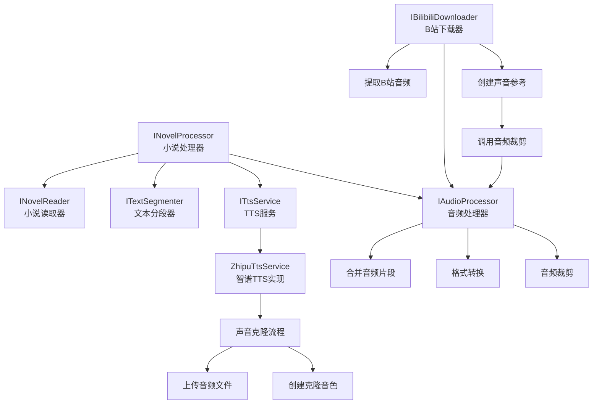

# 核心模块

<cite>
**本文档中引用的文件**  
- [INovelProcessor.cs](file://src/Core/Interfaces/INovelProcessor.cs)
- [NovelProcessor.cs](file://src/App/Services/NovelProcessor.cs)
- [INovelReader.cs](file://src/Core/Interfaces/INovelReader.cs)
- [NovelReader.cs](file://src/Infrastructure/Services/NovelReader.cs)
- [ITextSegmenter.cs](file://src/Core/Interfaces/ITextSegmenter.cs)
- [TextSegmenter.cs](file://src/Infrastructure/Services/TextSegmenter.cs)
- [ITtsService.cs](file://src/Core/Interfaces/ITtsService.cs)
- [ZhipuTtsService.cs](file://src/Infrastructure/Services/ZhipuTtsService.cs)
- [IAudioProcessor.cs](file://src/Core/Interfaces/IAudioProcessor.cs)
- [AudioProcessor.cs](file://src/Infrastructure/Services/AudioProcessor.cs)
- [IBilibiliDownloader.cs](file://src/Core/Interfaces/IBilibiliDownloader.cs)
- [BilibiliDownloader.cs](file://src/Infrastructure/Services/BilibiliDownloader.cs)
- [AudioSegment.cs](file://src/Core/Entities/AudioSegment.cs)
- [Novel.cs](file://src/Core/Entities/Novel.cs)
- [VoiceReference.cs](file://src/Core/Entities/VoiceReference.cs)
- [Settings.cs](file://src/Infrastructure/Configuration/Settings.cs)
- [DependencyInjection.cs](file://src/Infrastructure/DependencyInjection.cs)
</cite>

## 目录
1. [INovelProcessor：业务流程编排器](#inovelprocessor业务流程编排器)
2. [INovelReader：小说内容读取接口](#inovelreader小说内容读取接口)
3. [ITextSegmenter：智能文本分段算法](#itextsegmenter智能文本分段算法)
4. [ITtsService：文本转语音服务](#ittsservice文本转语音服务)
5. [IAudioProcessor：音频片段处理与合并](#iaudioprocessor音频片段处理与合并)
6. [IBilibiliDownloader：B站音频提取](#ibilibilidownloaderb站音频提取)
7. [模块调用关系图](#模块调用关系图)

## INovelProcessor：业务流程编排器

`INovelProcessor` 是整个有声书生成系统的核心业务流程编排接口，负责协调多个服务组件完成从文本输入到音频输出的完整处理流程。其实现类 `NovelProcessor` 通过依赖注入获取 `INovelReader`、`ITextSegmenter`、`ITtsService` 和 `IAudioProcessor` 四个关键服务，并按顺序执行以下四个阶段：

1. **读取小说内容**：调用 `INovelReader.ReadFromFileAsync` 加载原始文本。
2. **文本分段处理**：使用 `ITextSegmenter.SegmentAsync` 将长文本分割为适合TTS处理的段落。
3. **生成语音片段**：通过 `ITtsService.GenerateSpeechAsync` 为每个文本段落生成对应的音频文件。
4. **合并音频输出**：利用 `IAudioProcessor.MergeAudioSegmentsAsync` 将所有成功生成的音频片段合并为最终的有声书文件。

该模块还支持批量处理多个小说文件，并通过 `IProgress<ProcessingProgress>` 提供详细的进度反馈，包括当前阶段、完成百分比、当前处理项等信息。

**模块特点**：
- 支持取消操作（`CancellationToken`）
- 具备异常处理与日志记录机制
- 处理完成后自动清理临时音频文件
- 提供结构化的进度报告

**本节来源**  
- [INovelProcessor.cs](file://src/Core/Interfaces/INovelProcessor.cs#L1-L59)
- [NovelProcessor.cs](file://src/App/Services/NovelProcessor.cs#L1-L189)

## INovelReader：小说内容读取接口

`INovelReader` 定义了读取小说内容的契约，支持从本地文件和网络URL两种方式获取文本数据。其主要功能包括：

- `ReadFromFileAsync`：从指定路径的本地文件读取小说内容，支持UTF-8编码。
- `FetchFromUrlAsync`：从网页URL抓取小说内容，自动解析HTML并提取正文。

实现类 `NovelReader` 使用 `HttpClient` 进行网络请求，并借助 `HtmlAgilityPack` 解析HTML文档结构。它采用一组预定义的选择器（如 `#content`、`.chapter-content` 等）尝试定位正文区域，若均失败则回退到 `<body>` 标签内容。在提取过程中，会进行HTML实体解码、换行符标准化以及多余空白行清理。

该模块能够自动识别文件名作为小说标题，并将原始路径记录在 `Novel` 实体中，便于后续追踪来源。

**本节来源**  
- [INovelReader.cs](file://src/Core/Interfaces/INovelReader.cs#L1-L18)
- [NovelReader.cs](file://src/Infrastructure/Services/NovelReader.cs#L1-L104)

## ITextSegmenter：智能文本分段算法

`ITextSegmenter` 接口定义了文本清洗与分段的功能，旨在将长篇小说内容切分为适合TTS引擎处理的合理段落。其实现类 `TextSegmenter` 采用多层级分段策略：

1. **段落级分割**：首先按双换行符（`\n\n`）将文本划分为逻辑段落。
2. **句子级分割**：对于超过最大长度（默认500字符）的段落，进一步按中文句号（。）、感叹号（！）、问号（？）等标点进行句子拆分。
3. **动态拼接**：在保证单段不超过最大长度的前提下，尽可能将多个短句合并，以保持语义完整性。

此外，`CleanText` 方法会对输入文本进行预处理，包括：
- 移除HTML标签
- 合并连续空格与换行
- 过滤特殊符号（保留中文、英文、数字及常用标点）

该算法确保了生成的文本段落在长度可控的同时，尽量维持自然语言的流畅性与上下文连贯性。

**本节来源**  
- [ITextSegmenter.cs](file://src/Core/Interfaces/ITextSegmenter.cs#L1-L18)
- [TextSegmenter.cs](file://src/Infrastructure/Services/TextSegmenter.cs#L1-L128)

## ITtsService：文本转语音服务

`ITtsService` 是文本转语音服务的抽象接口，提供同步生成和流式生成两种模式。`ZhipuTtsService` 作为其实现，集成了智谱AI的GLM-4-Voice TTS API，具备以下核心能力：

- 调用 `audio/speech` 端点生成高质量语音
- 支持流式输出（`StreamSpeechAsync`），适用于实时播放场景
- 实现声音克隆（Voice Clone）功能，允许用户自定义发音人声线

### 声音克隆特殊逻辑

当传入 `VoiceReference` 参数且音频文件存在时，`ZhipuTtsService` 会执行以下流程：

1. **上传参考音频**：调用 `/files` 接口上传用户提供的音频样本，获取 `file_id`。
2. **创建克隆音色**：使用 `/voice/clone` 接口提交克隆请求，包含 `file_id` 和示例文本。
3. **缓存音色ID**：成功后缓存返回的 `voice_id`，避免重复克隆，提升后续处理效率。
4. **调用TTS生成**：在语音合成请求中指定 `voice_id`，使输出音频具有与参考样本相似的音色特征。

该服务还集成了Polly重试策略，针对网络波动或API限流（HTTP 429）自动进行指数退避重试，增强系统鲁棒性。

**本节来源**  
- [ITtsService.cs](file://src/Core/Interfaces/ITtsService.cs#L1-L25)
- [ZhipuTtsService.cs](file://src/Infrastructure/Services/ZhipuTtsService.cs#L1-L391)

## IAudioProcessor：音频片段处理与合并

`IAudioProcessor` 接口封装了音频文件的基本操作，包括合并、格式转换、时长获取和裁剪。其实现类 `AudioProcessor` 基于 NAudio 库实现，主要功能如下：

- **合并音频片段**：按 `SegmentIndex` 排序后，依次读取各WAV/MP3文件，统一重采样至44.1kHz、16bit、单声道格式，并写入最终的WAV文件。
- **格式转换**：支持WAV与MP3之间的转换（MP3编码需额外库支持）。
- **音频裁剪**：根据起始时间和持续时间精确截取音频片段。
- **时长获取**：通过 `AudioFileReader` 快速读取音频总时长。

在合并过程中，系统会跳过生成失败的片段，并在日志中记录警告信息。所有操作均支持异步执行与取消控制。

**本节来源**  
- [IAudioProcessor.cs](file://src/Core/Interfaces/IAudioProcessor.cs#L1-L39)
- [AudioProcessor.cs](file://src/Infrastructure/Services/AudioProcessor.cs#L1-L231)

## IBilibiliDownloader：B站音频提取

`IBilibiliDownloader` 提供从B站视频中提取音频的能力，主要用于创建声音克隆所需的参考音频。其核心功能包括：

- `ExtractAudioAsync`：从B站视频链接提取最高质量的音频流并保存为M4A文件。
- `CreateVoiceReferenceAsync`：基于视频音频创建 `VoiceReference` 对象，支持指定时间段裁剪。

实现流程如下：
1. 解析URL获取BV号
2. 调用B站开放API获取视频信息（CID）
3. 请求播放URL获取音频流地址
4. 下载音频并保存至指定目录
5. （可选）使用 `IAudioProcessor.TrimAudioAsync` 裁剪指定片段
6. 创建并返回 `VoiceReference` 实体

该模块通过添加Referer和User-Agent等请求头模拟浏览器行为，并支持通过Cookie获取高清音质资源。

**本节来源**  
- [IBilibiliDownloader.cs](file://src/Core/Interfaces/IBilibiliDownloader.cs#L1-L26)
- [BilibiliDownloader.cs](file://src/Infrastructure/Services/BilibiliDownloader.cs#L1-L176)

## 模块调用关系图

**图表来源**  
- [INovelProcessor.cs](file://src/Core/Interfaces/INovelProcessor.cs)
- [NovelProcessor.cs](file://src/App/Services/NovelProcessor.cs)
- [INovelReader.cs](file://src/Core/Interfaces/INovelReader.cs)
- [NovelReader.cs](file://src/Infrastructure/Services/NovelReader.cs)
- [ITextSegmenter.cs](file://src/Core/Interfaces/ITextSegmenter.cs)
- [TextSegmenter.cs](file://src/Infrastructure/Services/TextSegmenter.cs)
- [ITtsService.cs](file://src/Core/Interfaces/ITtsService.cs)
- [ZhipuTtsService.cs](file://src/Infrastructure/Services/ZhipuTtsService.cs)
- [IAudioProcessor.cs](file://src/Core/Interfaces/IAudioProcessor.cs)
- [AudioProcessor.cs](file://src/Infrastructure/Services/AudioProcessor.cs)
- [IBilibiliDownloader.cs](file://src/Core/Interfaces/IBilibiliDownloader.cs)
- [BilibiliDownloader.cs](file://src/Infrastructure/Services/BilibiliDownloader.cs)