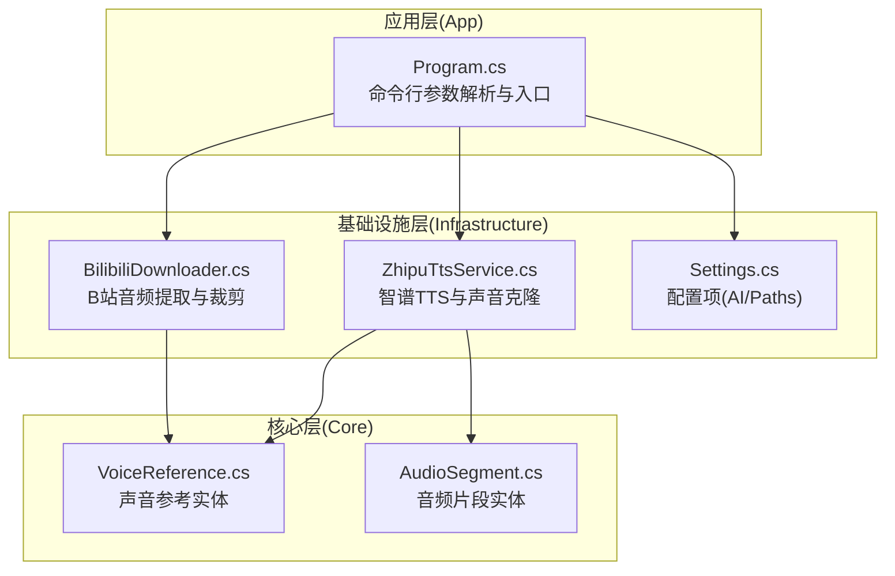
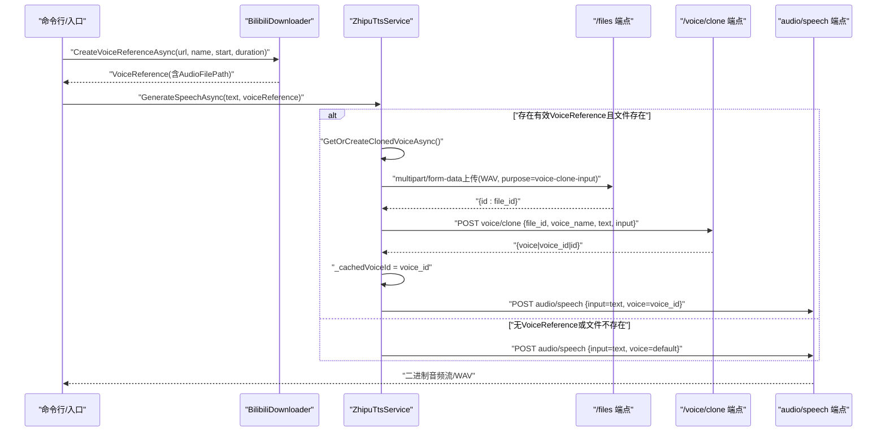
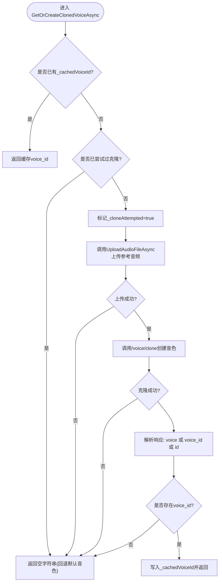
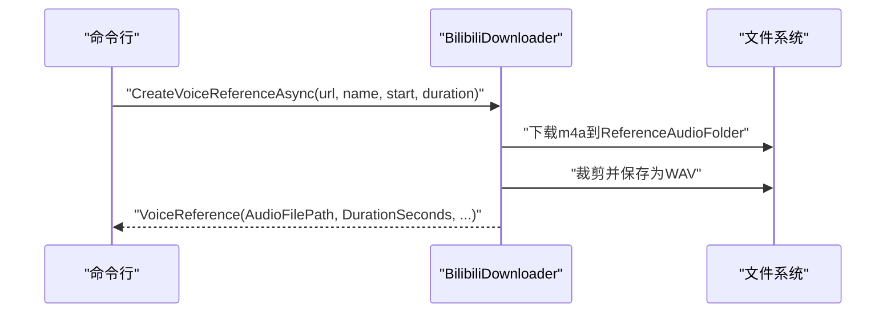
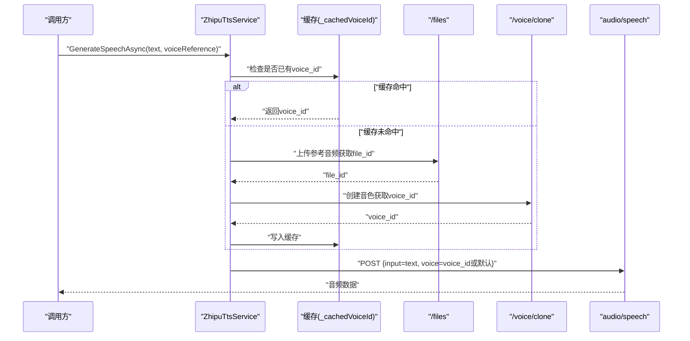
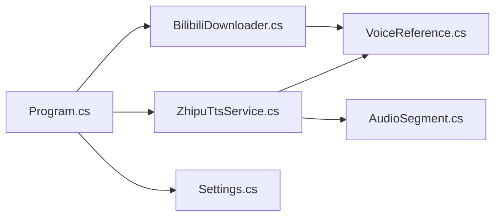

# 声音克隆功能

<cite>
**本文引用的文件列表**
- [README.md](file://README.md)
- [Program.cs](file://src/App/Program.cs)
- [BilibiliDownloader.cs](file://src/Infrastructure/Services/BilibiliDownloader.cs)
- [ZhipuTtsService.cs](file://src/Infrastructure/Services/ZhipuTtsService.cs)
- [VoiceReference.cs](file://src/Core/Entities/VoiceReference.cs)
- [AudioSegment.cs](file://src/Core/Entities/AudioSegment.cs)
- [Settings.cs](file://src/Infrastructure/Configuration/Settings.cs)
</cite>

## 目录
1. [简介](#简介)
2. [项目结构](#项目结构)
3. [核心组件](#核心组件)
4. [架构总览](#架构总览)
5. [详细组件分析](#详细组件分析)
6. [依赖关系分析](#依赖关系分析)
7. [性能考量](#性能考量)
8. [故障排查指南](#故障排查指南)
9. [结论](#结论)
10. [附录](#附录)

## 简介
本文件围绕“基于Bilibili音视频源的声音克隆”能力，系统化梳理从参考音频准备到个性化音色创建与TTS调用的完整链路。重点聚焦以下两个私有方法的协同工作机制：
- GetOrCreateClonedVoiceAsync：负责音色克隆的协调与缓存控制
- UploadAudioFileAsync：负责将参考音频以multipart/form-data形式上传至智谱AI的/files端点，获取file_id

同时，文档解释：
- 从VoiceReference模型提取音频文件路径的时机与条件
- multipart/form-data上传请求体中purpose字段的作用
- 通过/voice/clone端点创建音色并解析响应中的voice_id（兼容voiceId、Id等不同键名）
- 唯一性策略：基于时间戳+GUID的voice_name生成
- text与input字段在音色克隆请求中的语义作用
- 音色缓存机制（_cachedVoiceId）与失败回退逻辑（_cloneAttempted）如何避免重复克隆与API配额浪费
- 当GenerateSpeechAsync接收到非空voiceReference时，系统如何自动触发克隆并将生成的voice_id注入TTS请求的voice字段

## 项目结构
项目采用Clean Architecture分层组织，核心与基础设施分别位于Core与Infrastructure目录，应用入口位于App目录。与声音克隆相关的关键文件如下：
- 应用入口与命令行参数解析：Program.cs
- B站参考音频提取与VoiceReference构建：BilibiliDownloader.cs
- 智谱TTS服务与声音克隆实现：ZhipuTtsService.cs
- 领域实体：VoiceReference.cs、AudioSegment.cs
- 配置项：Settings.cs

图表来源
- [Program.cs](file://src/App/Program.cs#L147-L192)
- [BilibiliDownloader.cs](file://src/Infrastructure/Services/BilibiliDownloader.cs#L50-L90)
- [ZhipuTtsService.cs](file://src/Infrastructure/Services/ZhipuTtsService.cs#L36-L110)
- [VoiceReference.cs](file://src/Core/Entities/VoiceReference.cs#L1-L43)
- [AudioSegment.cs](file://src/Core/Entities/AudioSegment.cs#L1-L74)
- [Settings.cs](file://src/Infrastructure/Configuration/Settings.cs#L1-L66)

章节来源
- [README.md](file://README.md#L31-L68)
- [Program.cs](file://src/App/Program.cs#L147-L192)
- [BilibiliDownloader.cs](file://src/Infrastructure/Services/BilibiliDownloader.cs#L50-L90)
- [ZhipuTtsService.cs](file://src/Infrastructure/Services/ZhipuTtsService.cs#L36-L110)
- [VoiceReference.cs](file://src/Core/Entities/VoiceReference.cs#L1-L43)
- [AudioSegment.cs](file://src/Core/Entities/AudioSegment.cs#L1-L74)
- [Settings.cs](file://src/Infrastructure/Configuration/Settings.cs#L1-L66)

## 核心组件
- VoiceReference：封装声音参考的元数据，包括Id、Name、AudioFilePath、SourceUrl、DurationSeconds等，作为声音克隆的输入载体
- BilibiliDownloader：从B站视频提取音频并按指定时间段裁剪，输出WAV参考音频，构建VoiceReference
- ZhipuTtsService：提供TTS生成与声音克隆能力，内部包含GetOrCreateClonedVoiceAsync与UploadAudioFileAsync两个关键私有方法
- 配置Settings：包含AI端点、API Key、模型ID以及Paths（输入/输出/参考音频/临时目录）

章节来源
- [VoiceReference.cs](file://src/Core/Entities/VoiceReference.cs#L1-L43)
- [BilibiliDownloader.cs](file://src/Infrastructure/Services/BilibiliDownloader.cs#L50-L90)
- [ZhipuTtsService.cs](file://src/Infrastructure/Services/ZhipuTtsService.cs#L17-L33)
- [Settings.cs](file://src/Infrastructure/Configuration/Settings.cs#L1-L66)

## 架构总览
声音克隆的整体流程如下：
1. 从B站视频下载并裁剪参考音频，生成WAV文件并构建VoiceReference
2. 若调用TTS时传入了有效的VoiceReference且文件存在，则先执行声音克隆：
   - 通过UploadAudioFileAsync将参考音频以multipart/form-data上传至/files端点，设置purpose为voice-clone-input，获取file_id
   - 通过GetOrCreateClonedVoiceAsync调用/voice/clone端点，携带file_id与唯一voice_name，解析响应得到voice_id
3. 将voice_id注入后续TTS请求的voice字段，完成个性化语音合成

图表来源
- [Program.cs](file://src/App/Program.cs#L147-L192)
- [BilibiliDownloader.cs](file://src/Infrastructure/Services/BilibiliDownloader.cs#L50-L90)
- [ZhipuTtsService.cs](file://src/Infrastructure/Services/ZhipuTtsService.cs#L92-L110)
- [ZhipuTtsService.cs](file://src/Infrastructure/Services/ZhipuTtsService.cs#L193-L258)
- [ZhipuTtsService.cs](file://src/Infrastructure/Services/ZhipuTtsService.cs#L264-L292)

## 详细组件分析

### 组件A：ZhipuTtsService（声音克隆与TTS）
- 关键职责
  - 生成语音：支持普通与流式两种方式；当传入VoiceReference时优先尝试克隆音色
  - 声音克隆：协调上传与克隆流程，维护缓存与失败回退
- 私有方法协作
  - GetOrCreateClonedVoiceAsync：负责缓存命中、失败回退、调用UploadAudioFileAsync与/voice/clone
  - UploadAudioFileAsync：构造multipart/form-data上传请求，返回file_id
- 请求体字段说明
  - voice_name：唯一性策略为“前缀+v+UTC时间戳+GUID”，长度截断至30字符，确保在平台侧唯一
  - text：用于音色复刻的参考文本
  - input：TTS主请求中的输入文本（在本服务中用于audio/speech）
- 响应解析容错
  - 克隆响应可能返回voice、voice_id、id等不同键名，代码统一解析为voice_id
- 缓存与回退
  - _cachedVoiceId：命中后直接返回，避免重复克隆
  - _cloneAttempted：一旦尝试过克隆（无论成功与否），后续不再重试，失败时回退到默认音色

图表来源
- [ZhipuTtsService.cs](file://src/Infrastructure/Services/ZhipuTtsService.cs#L193-L258)
- [ZhipuTtsService.cs](file://src/Infrastructure/Services/ZhipuTtsService.cs#L264-L292)

章节来源
- [ZhipuTtsService.cs](file://src/Infrastructure/Services/ZhipuTtsService.cs#L17-L33)
- [ZhipuTtsService.cs](file://src/Infrastructure/Services/ZhipuTtsService.cs#L92-L110)
- [ZhipuTtsService.cs](file://src/Infrastructure/Services/ZhipuTtsService.cs#L193-L258)
- [ZhipuTtsService.cs](file://src/Infrastructure/Services/ZhipuTtsService.cs#L264-L292)

### 组件B：BilibiliDownloader（参考音频准备）
- 能力概述
  - 从B站视频URL提取音频，下载为m4a
  - 可按起止时间与时长裁剪为WAV，便于声音克隆
  - 构建VoiceReference对象，包含名称、音频路径、来源URL、时长等
- 与声音克隆的关系
  - 在入口处根据命令行参数调用CreateVoiceReferenceAsync，生成VoiceReference供TTS服务使用
  - 该对象的AudioFilePath即为GetOrCreateClonedVoiceAsync的输入

图表来源
- [Program.cs](file://src/App/Program.cs#L147-L192)
- [BilibiliDownloader.cs](file://src/Infrastructure/Services/BilibiliDownloader.cs#L50-L90)

章节来源
- [Program.cs](file://src/App/Program.cs#L147-L192)
- [BilibiliDownloader.cs](file://src/Infrastructure/Services/BilibiliDownloader.cs#L50-L90)

### 组件C：TTS调用链路（含自动触发克隆）
- 触发条件
  - GenerateSpeechAsync接收非空VoiceReference且其AudioFilePath对应的文件存在时，自动触发克隆流程
- 执行步骤
  - 先调用GetOrCreateClonedVoiceAsync获取voice_id（若未缓存则上传并克隆）
  - 再调用audio/speech端点，将voice字段设为voice_id（否则使用默认音色）
- 流式与非流式
  - StreamSpeechAsync同样遵循上述逻辑，但走audio/speech的流式接口

图表来源
- [ZhipuTtsService.cs](file://src/Infrastructure/Services/ZhipuTtsService.cs#L92-L110)
- [ZhipuTtsService.cs](file://src/Infrastructure/Services/ZhipuTtsService.cs#L144-L188)
- [ZhipuTtsService.cs](file://src/Infrastructure/Services/ZhipuTtsService.cs#L193-L258)
- [ZhipuTtsService.cs](file://src/Infrastructure/Services/ZhipuTtsService.cs#L264-L292)

章节来源
- [ZhipuTtsService.cs](file://src/Infrastructure/Services/ZhipuTtsService.cs#L92-L110)
- [ZhipuTtsService.cs](file://src/Infrastructure/Services/ZhipuTtsService.cs#L144-L188)

### 组件D：数据模型与配置
- VoiceReference
  - 字段：Id、Name、AudioFilePath、SourceUrl、DurationSeconds、Description、CreatedAt
  - 作用：承载声音克隆的输入音频路径与元信息
- AudioSegment
  - 字段：Id、SegmentIndex、SourceText、AudioFilePath、DurationSeconds、Format、Status、ErrorMessage、CreatedAt
  - 作用：记录每个TTS片段的生成状态与结果
- Settings
  - AISettings：Endpoint、ApiKey、ModelId
  - PathSettings：InputFolder、OutputFolder、ReferenceAudioFolder、TempFolder

章节来源
- [VoiceReference.cs](file://src/Core/Entities/VoiceReference.cs#L1-L43)
- [AudioSegment.cs](file://src/Core/Entities/AudioSegment.cs#L1-L74)
- [Settings.cs](file://src/Infrastructure/Configuration/Settings.cs#L1-L66)

## 依赖关系分析
- 组件耦合
  - Program.cs依赖BilibiliDownloader与ZhipuTtsService，负责入口级的参数解析与流程编排
  - BilibiliDownloader依赖IAudioProcessor（在当前仓库未展示具体实现）与配置项
  - ZhipuTtsService依赖HttpClient、ILogger、AISettings、PathSettings，内部通过私有方法解耦上传与克隆
- 外部依赖
  - 智谱AI API：/files、/voice/clone、audio/speech
  - B站API：获取视频信息与音频流URL
- 循环依赖
  - 未发现循环依赖迹象

图表来源
- [Program.cs](file://src/App/Program.cs#L147-L192)
- [BilibiliDownloader.cs](file://src/Infrastructure/Services/BilibiliDownloader.cs#L50-L90)
- [ZhipuTtsService.cs](file://src/Infrastructure/Services/ZhipuTtsService.cs#L36-L110)
- [VoiceReference.cs](file://src/Core/Entities/VoiceReference.cs#L1-L43)
- [AudioSegment.cs](file://src/Core/Entities/AudioSegment.cs#L1-L74)
- [Settings.cs](file://src/Infrastructure/Configuration/Settings.cs#L1-L66)

章节来源
- [Program.cs](file://src/App/Program.cs#L147-L192)
- [BilibiliDownloader.cs](file://src/Infrastructure/Services/BilibiliDownloader.cs#L50-L90)
- [ZhipuTtsService.cs](file://src/Infrastructure/Services/ZhipuTtsService.cs#L36-L110)

## 性能考量
- 缓存优化
  - _cachedVoiceId避免重复克隆，显著降低API调用次数与配额消耗
- 失败回退
  - _cloneAttempted防止多次失败重试导致的资源浪费
- 并发与重试
  - TTS主流程使用ResiliencePipeline进行重试（含指数退避），提升稳定性
- I/O与格式
  - 参考音频裁剪与WAV输出由IAudioProcessor负责，建议在批量处理时注意磁盘I/O与并发控制

章节来源
- [ZhipuTtsService.cs](file://src/Infrastructure/Services/ZhipuTtsService.cs#L17-L33)
- [ZhipuTtsService.cs](file://src/Infrastructure/Services/ZhipuTtsService.cs#L193-L258)

## 故障排查指南
- 上传失败
  - 现象：UploadAudioFileAsync返回null或抛出异常
  - 排查：检查网络连通性、API Key有效性、文件路径是否存在、文件类型是否为WAV
- 克隆失败
  - 现象：/voice/clone返回非2xx或响应中不含voice_id
  - 排查：确认file_id有效、voice_name唯一、text与input内容合理
- 回退到默认音色
  - 现象：GetOrCreateClonedVoiceAsync返回空字符串
  - 排查：确认上传与克隆流程是否曾尝试过且失败；检查日志中的警告信息
- TTS主请求失败
  - 现象：audio/speech返回错误码
  - 排查：核对Authorization头、Endpoint配置、voice字段值

章节来源
- [ZhipuTtsService.cs](file://src/Infrastructure/Services/ZhipuTtsService.cs#L264-L292)
- [ZhipuTtsService.cs](file://src/Infrastructure/Services/ZhipuTtsService.cs#L193-L258)
- [ZhipuTtsService.cs](file://src/Infrastructure/Services/ZhipuTtsService.cs#L144-L188)

## 结论
本实现通过清晰的分层与私有方法协作，将B站参考音频准备、智谱AI文件上传、音色克隆与TTS生成串联为一条稳定、可扩展的流水线。GetOrCreateClonedVoiceAsync与UploadAudioFileAsync的配合实现了：
- 唯一性策略保证音色命名不冲突
- 多键名兼容解析提升健壮性
- 缓存与失败回退减少API调用与配额消耗
- 自动触发与注入机制简化调用方逻辑

在实际使用中，建议：
- 确保参考音频质量与时长满足平台要求
- 合理设置voice_name唯一性策略，避免命名冲突
- 监控日志与错误码，及时定位上传与克隆阶段的问题

## 附录
- 唯一性策略：voice_name = 前缀 + UTC时间戳 + GUID，长度截断至30字符
- 请求体字段语义：
  - text：音色复刻参考文本
  - input：TTS主请求的输入文本
  - purpose：上传时固定为voice-clone-input
- 响应解析容错：优先取voice，其次voice_id，最后id

章节来源
- [ZhipuTtsService.cs](file://src/Infrastructure/Services/ZhipuTtsService.cs#L222-L230)
- [ZhipuTtsService.cs](file://src/Infrastructure/Services/ZhipuTtsService.cs#L246-L258)
- [ZhipuTtsService.cs](file://src/Infrastructure/Services/ZhipuTtsService.cs#L268-L274)