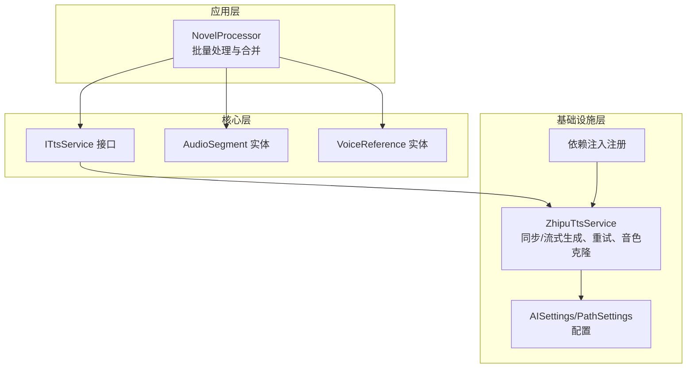
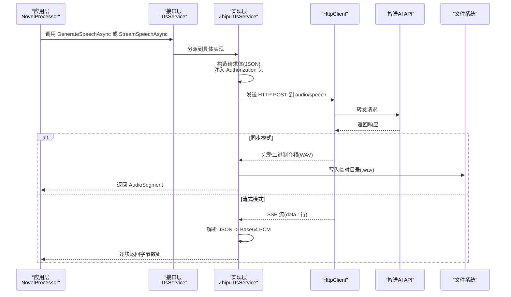
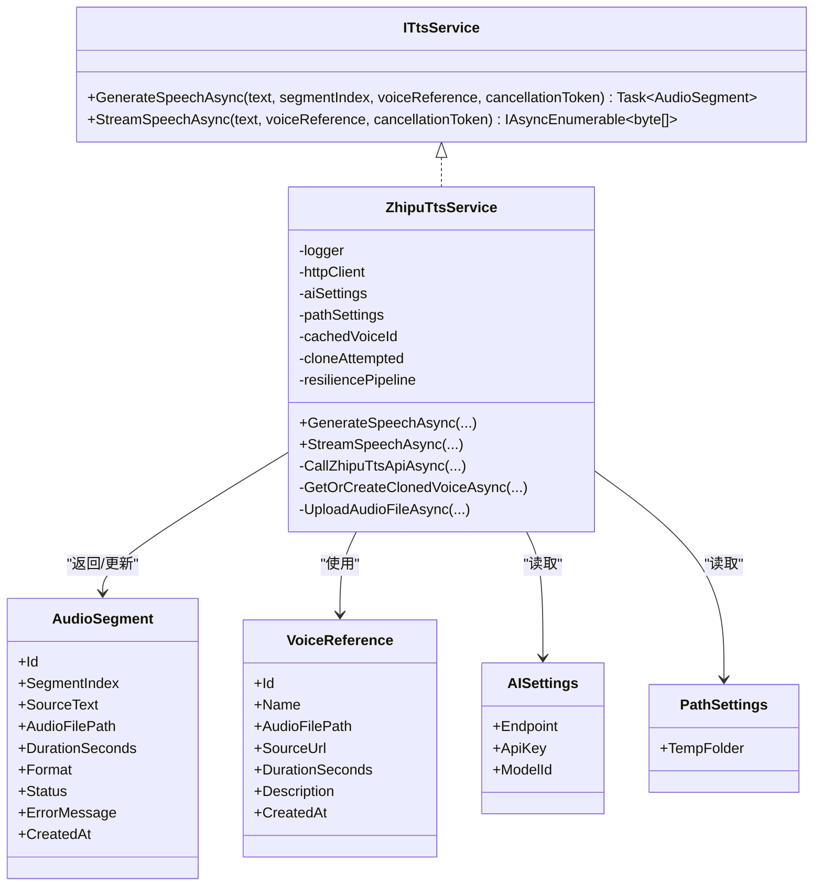

# 标准语音合成

<cite>
**本文引用的文件**
- [ZhipuTtsService.cs](file://src/Infrastructure/Services/ZhipuTtsService.cs)
- [ITtsService.cs](file://src/Core/Interfaces/ITtsService.cs)
- [AudioSegment.cs](file://src/Core/Entities/AudioSegment.cs)
- [VoiceReference.cs](file://src/Core/Entities/VoiceReference.cs)
- [Settings.cs](file://src/Infrastructure/Configuration/Settings.cs)
- [DependencyInjection.cs](file://src/Infrastructure/DependencyInjection.cs)
- [NovelProcessor.cs](file://src/App/Services/NovelProcessor.cs)
</cite>

## 目录
1. [简介](#简介)
2. [项目结构](#项目结构)
3. [核心组件](#核心组件)
4. [架构总览](#架构总览)
5. [详细组件分析](#详细组件分析)
6. [依赖关系分析](#依赖关系分析)
7. [性能考量](#性能考量)
8. [故障排查指南](#故障排查指南)
9. [结论](#结论)
10. [附录](#附录)

## 简介
本文件系统性文档化“标准语音合成”在本仓库中的实现，聚焦于 ZhipuTtsService 的两个核心方法：GenerateSpeechAsync（同步生成）与 StreamSpeechAsync（流式生成）。文档解释了如何通过 HTTP POST 请求调用智谱 AI 的 audio/speech 端点，构造包含 model、input、voice 等参数的 JSON 负载，并正确注入 Authorization 头（Bearer Token）。同时对比同步与流式的差异：同步模式返回完整 WAV 音频并持久化至临时目录；流式模式基于 SSE（Server-Sent Events）逐行解析，解码 Base64 PCM 数据以实现低延迟输出。文档还说明 Polly 重试策略如何应对网络波动与 HTTP 429 限流，以及错误处理中对 HttpRequestException 和 API 错误响应的捕获与日志记录。最后给出典型使用场景与并发控制建议及性能优化技巧。

## 项目结构
- 核心接口定义位于 Core 层，统一抽象 TTS 服务能力。
- 实现位于 Infrastructure 层，封装 HTTP 调用、鉴权、重试、音色克隆与流式解析。
- 应用层通过 NovelProcessor 协调分段文本的批量处理与合并。
- 配置项通过 Settings 类集中管理，依赖注入在 Infrastructure 中注册。

图表来源
- [DependencyInjection.cs](file://src/Infrastructure/DependencyInjection.cs#L1-L33)
- [ITtsService.cs](file://src/Core/Interfaces/ITtsService.cs#L1-L24)
- [ZhipuTtsService.cs](file://src/Infrastructure/Services/ZhipuTtsService.cs#L1-L300)
- [AudioSegment.cs](file://src/Core/Entities/AudioSegment.cs#L1-L74)
- [VoiceReference.cs](file://src/Core/Entities/VoiceReference.cs#L1-L42)
- [Settings.cs](file://src/Infrastructure/Configuration/Settings.cs#L1-L66)

章节来源
- [DependencyInjection.cs](file://src/Infrastructure/DependencyInjection.cs#L1-L33)
- [ITtsService.cs](file://src/Core/Interfaces/ITtsService.cs#L1-L24)
- [ZhipuTtsService.cs](file://src/Infrastructure/Services/ZhipuTtsService.cs#L1-L300)
- [AudioSegment.cs](file://src/Core/Entities/AudioSegment.cs#L1-L74)
- [VoiceReference.cs](file://src/Core/Entities/VoiceReference.cs#L1-L42)
- [Settings.cs](file://src/Infrastructure/Configuration/Settings.cs#L1-L66)

## 核心组件
- ITtsService：定义同步生成与流式生成两个契约方法，供上层调用。
- ZhipuTtsService：实现 ITtsService，负责：
  - 构造 audio/speech 请求，注入 Authorization 头；
  - 同步模式：下载完整 WAV 并保存到临时目录；
  - 流式模式：按行读取 SSE，解析 JSON，解码 Base64 PCM；
  - 音色克隆：上传参考音频、调用 voice/clone，缓存 voice_id；
  - Polly 重试：指数退避重试，处理 HttpRequestException/TaskCanceledException。
- AudioSegment：承载单段音频生成结果（路径、时长、状态、错误信息）。
- VoiceReference：描述音色克隆所需的参考音频路径等元数据。
- Settings：集中管理 AI 端点、API Key、模型 ID、路径等配置。

章节来源
- [ITtsService.cs](file://src/Core/Interfaces/ITtsService.cs#L1-L24)
- [ZhipuTtsService.cs](file://src/Infrastructure/Services/ZhipuTtsService.cs#L1-L300)
- [AudioSegment.cs](file://src/Core/Entities/AudioSegment.cs#L1-L74)
- [VoiceReference.cs](file://src/Core/Entities/VoiceReference.cs#L1-L42)
- [Settings.cs](file://src/Infrastructure/Configuration/Settings.cs#L1-L66)

## 架构总览
下图展示从应用层到基础设施层的调用链路与关键交互点。

图表来源
- [ITtsService.cs](file://src/Core/Interfaces/ITtsService.cs#L1-L24)
- [ZhipuTtsService.cs](file://src/Infrastructure/Services/ZhipuTtsService.cs#L34-L142)
- [AudioSegment.cs](file://src/Core/Entities/AudioSegment.cs#L1-L74)

## 详细组件分析

### 同步生成：GenerateSpeechAsync
- 工作流程要点
  - 初始化 AudioSegment，设置状态为 Generating。
  - 使用 Polly ResiliencePipeline 执行 CallZhipuTtsApiAsync，内置指数退避重试。
  - 将返回的 WAV 字节数组写入临时目录，命名规则包含分段索引与唯一标识。
  - 计算时长并更新状态为 Completed，记录日志。
  - 异常捕获后设置状态为 Failed，并记录错误消息。

- 关键实现位置
  - 同步主流程与持久化：[ZhipuTtsService.cs](file://src/Infrastructure/Services/ZhipuTtsService.cs#L34-L81)
  - Polly 重试策略构建与执行：[ZhipuTtsService.cs](file://src/Infrastructure/Services/ZhipuTtsService.cs#L21-L33)
  - 调用底层 API 的封装：[ZhipuTtsService.cs](file://src/Infrastructure/Services/ZhipuTtsService.cs#L144-L188)

- 参数与请求体
  - 请求体字段：model、input、voice、speed、volume、response_format（WAV）。
  - 授权头：Authorization: Bearer {ApiKey}。
  - 端点：Endpoint + audio/speech。

- 错误处理
  - 捕获异常并记录日志，设置失败状态与错误消息。
  - API 错误响应会抛出 HttpRequestException，由重试策略包裹。

- 性能与可靠性
  - 重试策略可缓解瞬时网络波动与 429 限流。
  - 一次性下载完整音频，适合后续合并与二次处理。

章节来源
- [ZhipuTtsService.cs](file://src/Infrastructure/Services/ZhipuTtsService.cs#L21-L33)
- [ZhipuTtsService.cs](file://src/Infrastructure/Services/ZhipuTtsService.cs#L34-L81)
- [ZhipuTtsService.cs](file://src/Infrastructure/Services/ZhipuTtsService.cs#L144-L188)
- [AudioSegment.cs](file://src/Core/Entities/AudioSegment.cs#L1-L74)

### 流式生成：StreamSpeechAsync
- 工作流程要点
  - 若提供 VoiceReference 且参考音频存在，则先尝试克隆音色并缓存 voice_id。
  - 构造流式请求体：model、input、voice、speed、volume、response_format（PCM）、encode_format（Base64）、stream=true。
  - 发送请求并以 ResponseHeadersRead 方式接收响应，便于尽早开始读取。
  - 逐行读取 SSE，过滤以 data: 开头的行，解析 JSON，提取 choices.delta.content（Base64 PCM）并解码为字节数组。
  - 当 finish_reason 为 stop 时终止流式输出。

- 关键实现位置
  - 流式主循环与解析：[ZhipuTtsService.cs](file://src/Infrastructure/Services/ZhipuTtsService.cs#L84-L142)
  - 流式响应模型定义：[ZhipuTtsService.cs](file://src/Infrastructure/Services/ZhipuTtsService.cs#L302-L343)

- 技术差异
  - 同步：一次性返回完整音频，适合离线处理与合并。
  - 流式：边生成边输出，降低首包延迟，适合实时播放或边播边写。

- 错误处理
  - 流式模式通过 EnsureSuccessStatusCode 快速失败，异常会被上层捕获与记录。
  - 建议在消费侧增加超时与取消令牌控制，避免长时间阻塞。

章节来源
- [ZhipuTtsService.cs](file://src/Infrastructure/Services/ZhipuTtsService.cs#L84-L142)
- [ZhipuTtsService.cs](file://src/Infrastructure/Services/ZhipuTtsService.cs#L302-L343)

### 音色克隆与参考音频
- 流程概述
  - 若提供 VoiceReference 且参考音频文件存在，则先上传参考音频获取 file_id。
  - 调用 voice/clone 接口创建音色，解析响应得到 voice_id，并缓存以复用。
  - 若任一步骤失败，回退到默认音色（female）。

- 关键实现位置
  - 克隆音色与缓存逻辑：[ZhipuTtsService.cs](file://src/Infrastructure/Services/ZhipuTtsService.cs#L190-L259)
  - 上传参考音频：[ZhipuTtsService.cs](file://src/Infrastructure/Services/ZhipuTtsService.cs#L261-L293)
  - 响应模型定义：[ZhipuTtsService.cs](file://src/Infrastructure/Services/ZhipuTtsService.cs#L344-L391)

- 注意事项
  - 上传与克隆均需 Authorization 头。
  - 缓存 voice_id 以减少重复克隆开销。
  - 克隆失败时自动降级为默认音色。

章节来源
- [ZhipuTtsService.cs](file://src/Infrastructure/Services/ZhipuTtsService.cs#L190-L259)
- [ZhipuTtsService.cs](file://src/Infrastructure/Services/ZhipuTtsService.cs#L261-L293)
- [ZhipuTtsService.cs](file://src/Infrastructure/Services/ZhipuTtsService.cs#L344-L391)

### Polly 重试策略与限流应对
- 策略配置
  - 最大重试次数：3 次
  - 初始延迟：2 秒
  - 退避类型：指数退避
  - 触发条件：HttpRequestException、TaskCanceledException

- 应用方式
  - 在 GenerateSpeechAsync 中，通过 _resiliencePipeline.ExecuteAsync 包裹 CallZhipuTtsApiAsync，从而自动重试。

- 对 HTTP 429 的处理
  - 该策略未显式包含 429，但可通过异常类型触发重试；若需要更精细的 429 控制，可在上层增加基于响应码的分支处理。

- 日志与可观测性
  - 重试过程与异常均被记录，便于定位问题。

章节来源
- [ZhipuTtsService.cs](file://src/Infrastructure/Services/ZhipuTtsService.cs#L21-L33)
- [ZhipuTtsService.cs](file://src/Infrastructure/Services/ZhipuTtsService.cs#L55-L58)

### 错误处理与日志记录
- 同步模式
  - 捕获异常并设置状态为 Failed，记录错误消息。
  - API 错误响应会抛出 HttpRequestException，包含状态码与内容。

- 流式模式
  - 通过 EnsureSuccessStatusCode 快速失败，异常由上层处理。
  - 建议在消费侧增加取消令牌与超时控制，避免无限等待。

- 日志
  - 关键步骤均有日志记录，包括成功与失败场景。

章节来源
- [ZhipuTtsService.cs](file://src/Infrastructure/Services/ZhipuTtsService.cs#L73-L81)
- [ZhipuTtsService.cs](file://src/Infrastructure/Services/ZhipuTtsService.cs#L176-L188)

### 数据模型与实体
- AudioSegment
  - 字段：Id、SegmentIndex、SourceText、AudioFilePath、DurationSeconds、Format、Status、ErrorMessage、CreatedAt。
  - 用途：承载单段音频生成结果，便于后续合并与清理。

- VoiceReference
  - 字段：Id、Name、AudioFilePath、SourceUrl、DurationSeconds、Description、CreatedAt。
  - 用途：描述音色克隆所需的参考音频与元信息。

章节来源
- [AudioSegment.cs](file://src/Core/Entities/AudioSegment.cs#L1-L74)
- [VoiceReference.cs](file://src/Core/Entities/VoiceReference.cs#L1-L42)

## 依赖关系分析
- 接口与实现
  - ITtsService 是上层依赖的稳定契约，ZhipuTtsService 提供具体实现。
- 依赖注入
  - 通过 AddHttpClient 将 ITtsService 注册为 ZhipuTtsService，便于在应用层以接口形式注入。
- 配置
  - AISettings 提供 Endpoint 与 ApiKey；PathSettings 提供 TempFolder 等路径配置。
- 外部集成
  - 通过 HttpClient 调用智谱 AI 的 audio/speech、voice/clone、files 端点。
- 上下游协作
  - NovelProcessor 调用 ITtsService，聚合多个 AudioSegment 并进行合并与清理。

图表来源
- [ITtsService.cs](file://src/Core/Interfaces/ITtsService.cs#L1-L24)
- [ZhipuTtsService.cs](file://src/Infrastructure/Services/ZhipuTtsService.cs#L1-L300)
- [AudioSegment.cs](file://src/Core/Entities/AudioSegment.cs#L1-L74)
- [VoiceReference.cs](file://src/Core/Entities/VoiceReference.cs#L1-L42)
- [Settings.cs](file://src/Infrastructure/Configuration/Settings.cs#L1-L66)

章节来源
- [ITtsService.cs](file://src/Core/Interfaces/ITtsService.cs#L1-L24)
- [ZhipuTtsService.cs](file://src/Infrastructure/Services/ZhipuTtsService.cs#L1-L300)
- [AudioSegment.cs](file://src/Core/Entities/AudioSegment.cs#L1-L74)
- [VoiceReference.cs](file://src/Core/Entities/VoiceReference.cs#L1-L42)
- [Settings.cs](file://src/Infrastructure/Configuration/Settings.cs#L1-L66)

## 性能考量
- 同步模式
  - 优点：一次性生成完整音频，便于后续处理与合并。
  - 优化：合理设置重试参数，避免频繁重试导致整体耗时上升。
- 流式模式
  - 优点：低延迟输出，适合实时播放或边播边写。
  - 优化：在消费侧设置合理的超时与取消令牌，避免长时间阻塞；根据网络状况调整重试策略。
- 音色克隆
  - 优点：提升个性化与一致性。
  - 优化：缓存 voice_id，避免重复克隆；参考音频质量与长度直接影响效果。
- 并发与批量
  - 建议：在批量章节处理时，限制并发度以避免 API 限流与资源争用；可采用队列或信号量控制并发。
  - 合并阶段：仅合并成功生成的片段，失败片段单独记录以便重试或人工干预。

章节来源
- [ZhipuTtsService.cs](file://src/Infrastructure/Services/ZhipuTtsService.cs#L21-L33)
- [ZhipuTtsService.cs](file://src/Infrastructure/Services/ZhipuTtsService.cs#L84-L142)
- [NovelProcessor.cs](file://src/App/Services/NovelProcessor.cs#L50-L90)

## 故障排查指南
- 常见问题
  - 401/403：检查 ApiKey 是否正确配置，Authorization 头是否注入。
  - 400：检查请求体字段是否完整，model/input/voice/response_format 等是否符合要求。
  - 429：观察重试策略是否生效；必要时降低并发或增加延迟。
  - 网络异常：确认网络连通性与代理设置；查看重试日志。
  - 文件写入失败：检查 TempFolder 是否存在且有写权限。
- 定位手段
  - 查看日志：关注 GenerateSpeechAsync/StreamSpeechAsync 的成功与失败日志。
  - 检查返回状态码与错误内容：API 错误响应会被记录并抛出异常。
  - 验证配置：确认 AISettings.Endpoint 与 ApiKey 正确。
- 建议
  - 在消费流式输出时增加超时与取消控制。
  - 对批量任务设置最大并发数，避免触发限流。
  - 对失败片段进行重试或人工干预。

章节来源
- [ZhipuTtsService.cs](file://src/Infrastructure/Services/ZhipuTtsService.cs#L73-L81)
- [ZhipuTtsService.cs](file://src/Infrastructure/Services/ZhipuTtsService.cs#L176-L188)
- [Settings.cs](file://src/Infrastructure/Configuration/Settings.cs#L1-L66)

## 结论
本实现以 ITtsService 为契约，ZhipuTtsService 为核心实现，提供了稳定的同步与流式语音合成能力。通过 Polly 重试策略与完善的错误处理，系统能够在网络波动与限流情况下保持稳健。音色克隆功能进一步提升了个性化体验。结合批量处理与合并流程，可高效完成小说章节的自动化配音。

## 附录

### API 请求体字段说明
- 同步模式
  - model：模型标识（如 glm-tts）
  - input：待合成文本
  - voice：音色标识（默认 female 或克隆后的 voice_id）
  - speed：语速
  - volume：音量
  - response_format：音频格式（WAV）
- 流式模式
  - 在同步基础上增加：
    - response_format：PCM
    - encode_format：Base64
    - stream：true

章节来源
- [ZhipuTtsService.cs](file://src/Infrastructure/Services/ZhipuTtsService.cs#L99-L109)
- [ZhipuTtsService.cs](file://src/Infrastructure/Services/ZhipuTtsService.cs#L156-L165)

### 典型使用场景与建议
- 批量章节处理
  - 建议限制并发度，避免触发 API 限流；对失败片段单独记录与重试。
  - 合并阶段仅合并成功生成的片段，失败片段单独处理。
- 实时播放
  - 使用 StreamSpeechAsync，消费侧设置超时与取消令牌，确保稳定性。
- 音色克隆
  - 准备高质量参考音频，确保克隆成功；缓存 voice_id 以减少重复开销。

章节来源
- [NovelProcessor.cs](file://src/App/Services/NovelProcessor.cs#L50-L90)
- [ZhipuTtsService.cs](file://src/Infrastructure/Services/ZhipuTtsService.cs#L190-L259)