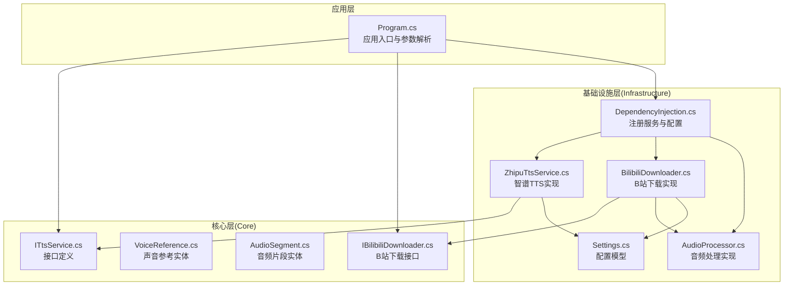
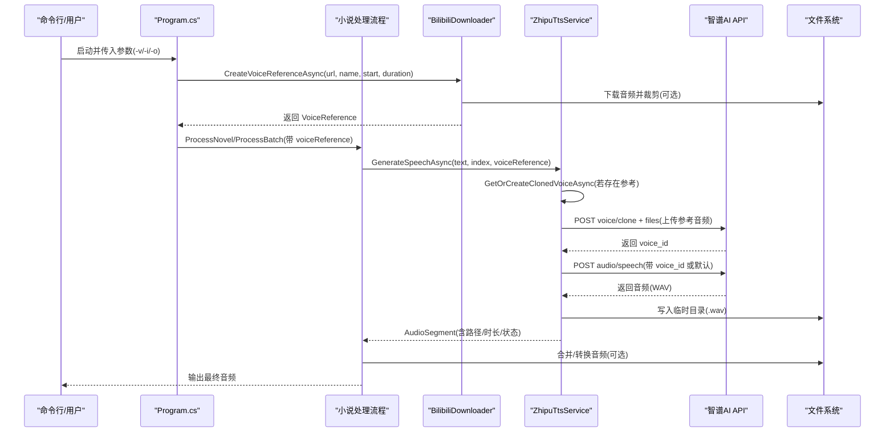
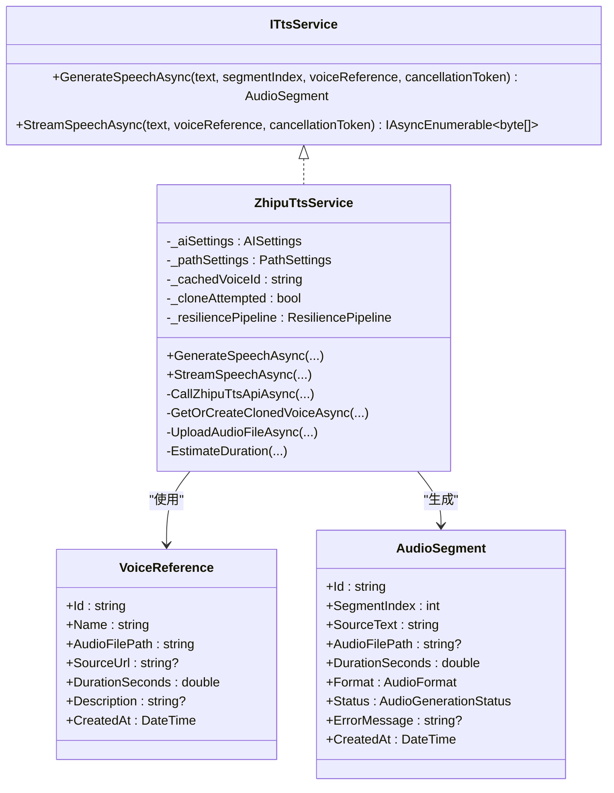
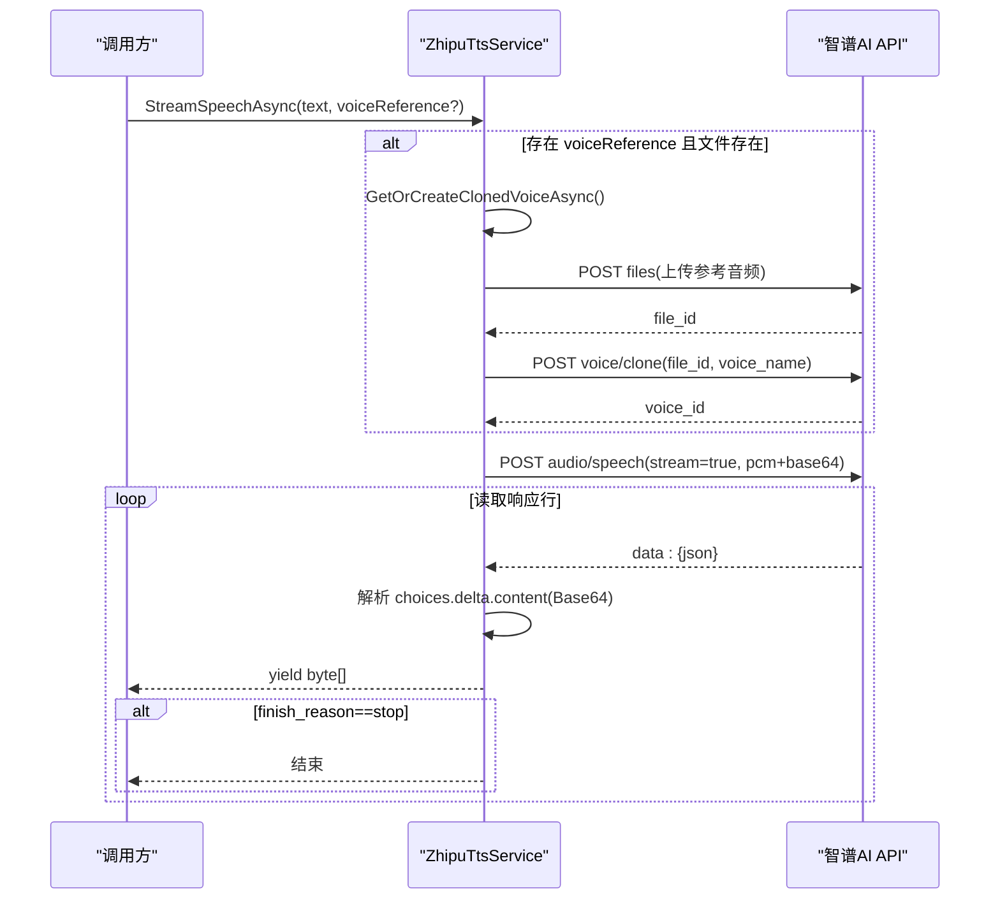
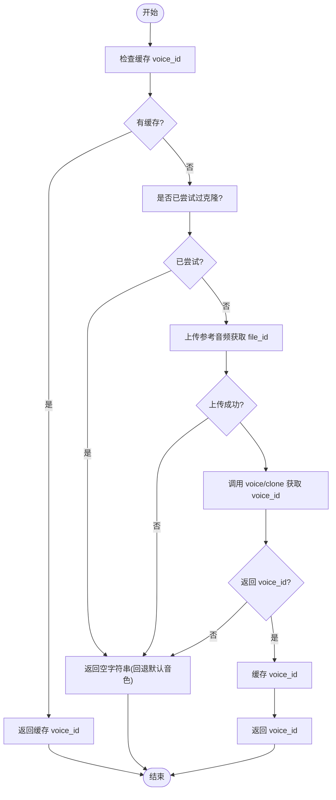
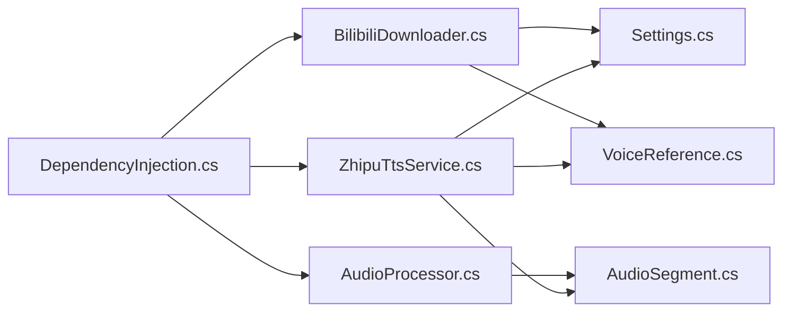

# 语音合成服务

<cite>
**本文引用的文件**
- [ITtsService.cs](file://src/Core/Interfaces/ITtsService.cs)
- [ZhipuTtsService.cs](file://src/Infrastructure/Services/ZhipuTtsService.cs)
- [VoiceReference.cs](file://src/Core/Entities/VoiceReference.cs)
- [AudioSegment.cs](file://src/Core/Entities/AudioSegment.cs)
- [DependencyInjection.cs](file://src/Infrastructure/DependencyInjection.cs)
- [Settings.cs](file://src/Infrastructure/Configuration/Settings.cs)
- [BilibiliDownloader.cs](file://src/Infrastructure/Services/BilibiliDownloader.cs)
- [IBilibiliDownloader.cs](file://src/Core/Interfaces/IBilibiliDownloader.cs)
- [AudioProcessor.cs](file://src/Infrastructure/Services/AudioProcessor.cs)
- [Program.cs](file://src/App/Program.cs)
- [appsettings.json](file://src/App/appsettings.json)
</cite>

## 目录
1. [简介](#简介)
2. [项目结构](#项目结构)
3. [核心组件](#核心组件)
4. [架构总览](#架构总览)
5. [详细组件分析](#详细组件分析)
6. [依赖关系分析](#依赖关系分析)
7. [性能考虑](#性能考虑)
8. [故障排查指南](#故障排查指南)
9. [结论](#结论)
10. [附录](#附录)

## 简介
本文件面向“语音合成服务”的全面文档化目标，聚焦于 ITtsService 接口与 ZhipuTtsService 实现，系统阐述其与智谱 AI GLM-TTS API 的集成机制。文档覆盖以下要点：
- API 认证（API Key）
- 请求构造（JSON payload）
- 流式响应处理与音频数据保存
- 声音克隆模式的实现路径：如何结合 VoiceReference 模型将 Bilibili 提取的音色特征应用于 TTS 请求
- 重试策略（使用 Polly）
- 错误码处理（如配额超限）
- 性能调优建议（并发控制）

## 项目结构
该应用采用分层架构，核心接口位于 Core 层，具体实现位于 Infrastructure 层，应用入口在 App 层。与语音合成直接相关的模块包括：
- 核心接口与实体：ITtsService、VoiceReference、AudioSegment
- 服务实现：ZhipuTtsService（智谱 GLM-4-Voice TTS）
- 配置：AISettings、PathSettings
- 依赖注入：Infrastructure.DependencyInjection
- B站音色来源：BilibiliDownloader（IBilibiliDownloader），配合 AudioProcessor 进行音频裁剪与合并

图表来源
- [Program.cs](file://src/App/Program.cs#L1-L291)
- [DependencyInjection.cs](file://src/Infrastructure/DependencyInjection.cs#L1-L33)
- [ITtsService.cs](file://src/Core/Interfaces/ITtsService.cs#L1-L25)
- [ZhipuTtsService.cs](file://src/Infrastructure/Services/ZhipuTtsService.cs#L1-L391)
- [IBilibiliDownloader.cs](file://src/Core/Interfaces/IBilibiliDownloader.cs#L1-L26)
- [BilibiliDownloader.cs](file://src/Infrastructure/Services/BilibiliDownloader.cs#L1-L176)
- [AudioProcessor.cs](file://src/Infrastructure/Services/AudioProcessor.cs#L1-L231)
- [Settings.cs](file://src/Infrastructure/Configuration/Settings.cs#L1-L66)

章节来源
- [Program.cs](file://src/App/Program.cs#L1-L291)
- [DependencyInjection.cs](file://src/Infrastructure/DependencyInjection.cs#L1-L33)

## 核心组件
- ITtsService：定义文本转语音的同步与流式接口，支持可选的声音参考参数。
- ZhipuTtsService：ITtsService 的具体实现，负责与智谱 GLM-TTS API 交互，包含声音克隆、重试策略、音频保存与流式输出。
- VoiceReference：封装声音参考元数据（名称、音频路径、来源 URL、时长等）。
- AudioSegment：封装单个文本片段的音频生成结果（文件路径、时长、状态、错误信息等）。
- AISettings/PathSettings：提供 API 端点、API Key、模型 ID、路径等配置。
- BilibiliDownloader：从 Bilibili 视频提取音频并生成 VoiceReference；可按指定时间段裁剪参考音频。
- AudioProcessor：提供音频合并、格式转换、时长查询、裁剪等能力。

章节来源
- [ITtsService.cs](file://src/Core/Interfaces/ITtsService.cs#L1-L25)
- [ZhipuTtsService.cs](file://src/Infrastructure/Services/ZhipuTtsService.cs#L1-L391)
- [VoiceReference.cs](file://src/Core/Entities/VoiceReference.cs#L1-L43)
- [AudioSegment.cs](file://src/Core/Entities/AudioSegment.cs#L1-L74)
- [Settings.cs](file://src/Infrastructure/Configuration/Settings.cs#L1-L66)
- [BilibiliDownloader.cs](file://src/Infrastructure/Services/BilibiliDownloader.cs#L1-L176)
- [AudioProcessor.cs](file://src/Infrastructure/Services/AudioProcessor.cs#L1-L231)

## 架构总览
下图展示从应用入口到 TTS 服务与 B站下载的整体调用链路，以及配置注入与实体流转。

图表来源
- [Program.cs](file://src/App/Program.cs#L140-L208)
- [BilibiliDownloader.cs](file://src/Infrastructure/Services/BilibiliDownloader.cs#L49-L90)
- [ZhipuTtsService.cs](file://src/Infrastructure/Services/ZhipuTtsService.cs#L144-L188)
- [ZhipuTtsService.cs](file://src/Infrastructure/Services/ZhipuTtsService.cs#L190-L259)
- [ZhipuTtsService.cs](file://src/Infrastructure/Services/ZhipuTtsService.cs#L261-L293)
- [AudioProcessor.cs](file://src/Infrastructure/Services/AudioProcessor.cs#L13-L40)

## 详细组件分析

### ITtsService 接口
- 定义两个核心方法：
  - GenerateSpeechAsync：同步生成音频并返回 AudioSegment，支持声音参考与取消令牌。
  - StreamSpeechAsync：流式生成音频，逐块返回字节数组，适合边生成边播放或写入。
- 参数设计：
  - text：待合成文本
  - segmentIndex：文本段索引，便于后续合并与定位
  - voiceReference：声音参考（可空），用于声音克隆
  - cancellationToken：取消令牌
- 返回值：
  - GenerateSpeechAsync：AudioSegment，包含状态、时长、文件路径、错误信息等
  - StreamSpeechAsync：IAsyncEnumerable<byte[]>，逐块输出 PCM/PCM+Base64 数据

章节来源
- [ITtsService.cs](file://src/Core/Interfaces/ITtsService.cs#L1-L25)
- [AudioSegment.cs](file://src/Core/Entities/AudioSegment.cs#L1-L74)

### ZhipuTtsService 实现
- 关键职责：
  - 与智谱 GLM-TTS API 交互（audio/speech、voice/clone、files）
  - 声音克隆：上传参考音频 -> 克隆音色 -> 缓存 voice_id
  - 同步与流式两种生成方式
  - 重试策略（Polly）与错误处理
  - 音频保存与时长估算

- 认证与配置：
  - 通过 IOptions<AISettings> 读取 Endpoint 与 ApiKey，并在请求头添加 Authorization: Bearer {ApiKey}

- 请求构造：
  - audio/speech：包含 model、input、voice、speed、volume、response_format 等字段
  - voice/clone：包含 model、voice_name、file_id、text、input
  - files：multipart/form-data，上传参考音频文件，purpose=voice-clone-input

- 流式响应处理：
  - 通过 HTTP 流式读取响应行，过滤 data: 前缀，解析 JSON，提取 choices.delta.content（Base64）并解码为字节
  - 当 finish_reason==stop 时结束

- 音频数据保存：
  - 同步模式：将二进制音频写入临时目录，文件名为 segment_{index}_guid.wav
  - 时长估算：基于 WAV 字节大小除以采样率常量

- 声音克隆实现路径：
  - 若传入 VoiceReference 且音频文件存在，则先执行 GetOrCreateClonedVoiceAsync：
    - 缓存命中则直接返回 voice_id
    - 未尝试过克隆时，先上传参考音频获取 file_id，再调用 voice/clone 获取 voice_id 并缓存
    - 失败或无 voice_id 时回退到默认音色
  - 在 audio/speech 请求中使用 voice=voice_id 或默认音色

- 重试策略（Polly）：
  - 最大重试次数、指数退避延迟、对 HttpRequestException 和 TaskCanceledException 的处理
  - 仅对同步生成路径 CallZhipuTtsApiAsync 使用该管道

- 错误处理：
  - 非成功状态码抛出异常并记录日志
  - 流式读取中忽略空行与非 data: 行
  - 全局 try/catch 将 AudioSegment 状态标记为 Failed 并记录错误消息

图表来源
- [ITtsService.cs](file://src/Core/Interfaces/ITtsService.cs#L1-L25)
- [ZhipuTtsService.cs](file://src/Infrastructure/Services/ZhipuTtsService.cs#L1-L391)
- [VoiceReference.cs](file://src/Core/Entities/VoiceReference.cs#L1-L43)
- [AudioSegment.cs](file://src/Core/Entities/AudioSegment.cs#L1-L74)

章节来源
- [ZhipuTtsService.cs](file://src/Infrastructure/Services/ZhipuTtsService.cs#L1-L391)
- [Settings.cs](file://src/Infrastructure/Configuration/Settings.cs#L1-L66)

### 流式生成序列（StreamSpeechAsync）

图表来源
- [ZhipuTtsService.cs](file://src/Infrastructure/Services/ZhipuTtsService.cs#L83-L142)
- [ZhipuTtsService.cs](file://src/Infrastructure/Services/ZhipuTtsService.cs#L190-L259)
- [ZhipuTtsService.cs](file://src/Infrastructure/Services/ZhipuTtsService.cs#L261-L293)

章节来源
- [ZhipuTtsService.cs](file://src/Infrastructure/Services/ZhipuTtsService.cs#L83-L142)

### 声音克隆流程（GetOrCreateClonedVoiceAsync）

图表来源
- [ZhipuTtsService.cs](file://src/Infrastructure/Services/ZhipuTtsService.cs#L190-L259)
- [ZhipuTtsService.cs](file://src/Infrastructure/Services/ZhipuTtsService.cs#L261-L293)

章节来源
- [ZhipuTtsService.cs](file://src/Infrastructure/Services/ZhipuTtsService.cs#L190-L259)

### Bilibili 音色来源与 VoiceReference
- BilibiliDownloader.CreateVoiceReferenceAsync：
  - 从 B站视频提取音频并保存至参考音频目录
  - 可选裁剪起止时间与时长，生成 WAV 文件
  - 调用 AudioProcessor.GetDurationAsync 获取时长
  - 构造 VoiceReference 返回给调用方
- 程序入口 Program 在启动时可接收 -v/--voice 参数，自动创建 VoiceReference 并传递给处理流程

章节来源
- [BilibiliDownloader.cs](file://src/Infrastructure/Services/BilibiliDownloader.cs#L49-L90)
- [Program.cs](file://src/App/Program.cs#L147-L159)
- [Program.cs](file://src/App/Program.cs#L180-L193)

### 音频保存与合并
- 同步生成：ZhipuTtsService 将返回的二进制音频写入临时目录，文件名为 segment_{index}_guid.wav，并设置 AudioSegment 的文件路径与时长
- 合并：AudioProcessor.MergeAudioSegmentsAsync 按 SegmentIndex 顺序合并多个片段，统一采样率与声道后输出 WAV
- 转换：AudioProcessor.ConvertFormatAsync 支持 WAV 转换；当前 MP3 需要额外库，否则抛出不支持异常

章节来源
- [ZhipuTtsService.cs](file://src/Infrastructure/Services/ZhipuTtsService.cs#L34-L81)
- [AudioProcessor.cs](file://src/Infrastructure/Services/AudioProcessor.cs#L13-L40)
- [AudioProcessor.cs](file://src/Infrastructure/Services/AudioProcessor.cs#L110-L148)

## 依赖关系分析
- 依赖注入：
  - 通过 AddInfrastructureServices 注册配置（AISettings、BilibiliSettings、PathSettings）
  - 注册 HttpClient 与 ITtsService、IBilibiliDownloader 等服务
- 组件耦合：
  - ZhipuTtsService 依赖 AISettings（Endpoint/ApiKey）、PathSettings（TempFolder）、ILogger、HttpClient
  - BilibiliDownloader 依赖 BilibiliSettings、PathSettings、IAudioProcessor、ILogger、HttpClient
  - AudioProcessor 依赖 PathSettings、ILogger
- 外部依赖：
  - 智谱 AI API（audio/speech、voice/clone、files）
  - Bilibili API（视频信息与音频流获取）

图表来源
- [DependencyInjection.cs](file://src/Infrastructure/DependencyInjection.cs#L1-L33)
- [ZhipuTtsService.cs](file://src/Infrastructure/Services/ZhipuTtsService.cs#L1-L391)
- [BilibiliDownloader.cs](file://src/Infrastructure/Services/BilibiliDownloader.cs#L1-L176)
- [AudioProcessor.cs](file://src/Infrastructure/Services/AudioProcessor.cs#L1-L231)
- [Settings.cs](file://src/Infrastructure/Configuration/Settings.cs#L1-L66)
- [VoiceReference.cs](file://src/Core/Entities/VoiceReference.cs#L1-L43)
- [AudioSegment.cs](file://src/Core/Entities/AudioSegment.cs#L1-L74)

章节来源
- [DependencyInjection.cs](file://src/Infrastructure/DependencyInjection.cs#L1-L33)

## 性能考虑
- 并发控制：
  - 当前实现未显式限制并发，请在调用方合理控制并发度，避免触发 API 限流或本地资源瓶颈
- 流式生成：
  - StreamSpeechAsync 逐块输出，适合边生成边写入或播放，降低内存占用
- 重试策略：
  - Polly Retry 已内置，建议根据业务场景调整最大重试次数与退避策略
- I/O 优化：
  - 临时目录与输出目录需具备足够磁盘空间；合并音频时建议预估总时长并预留缓冲
- 音频格式：
  - 默认生成 WAV；如需 MP3，需引入相应编码库并在 AudioProcessor 中完善逻辑

[本节为通用建议，无需特定文件引用]

## 故障排查指南
- 配额超限/429：
  - Polly 会自动重试，但请关注日志中的 HTTP 429 与重试次数上限
  - 建议在调用方增加指数退避与熔断策略
- 认证失败：
  - 确认 appsettings.json 中 AI:ApiKey 是否正确
  - 确认 Endpoint 地址与网络可达性
- 声音克隆失败：
  - 检查参考音频文件是否存在且可读
  - 查看 voice/clone 与 files 接口返回内容，确认 file_id 与 voice_id 是否存在
- 流式读取异常：
  - 确保响应行以 data: 开头，JSON 解析字段 choices.delta.content 是否存在
- 合并/转换失败：
  - 检查输入音频路径是否存在、格式是否受支持
  - MP3 转换需安装 NAudio.Lame 库

章节来源
- [ZhipuTtsService.cs](file://src/Infrastructure/Services/ZhipuTtsService.cs#L21-L33)
- [ZhipuTtsService.cs](file://src/Infrastructure/Services/ZhipuTtsService.cs#L172-L188)
- [ZhipuTtsService.cs](file://src/Infrastructure/Services/ZhipuTtsService.cs#L236-L244)
- [AudioProcessor.cs](file://src/Infrastructure/Services/AudioProcessor.cs#L110-L148)
- [appsettings.json](file://src/App/appsettings.json#L1-L24)

## 结论
ZhipuTtsService 通过清晰的接口抽象与完善的实现，实现了与智谱 GLM-TTS API 的深度集成，覆盖了同步与流式两种生成模式、声音克隆、重试与错误处理、音频保存与合并等关键能力。结合 BilibiliDownloader 与 VoiceReference，用户可以便捷地从 B站视频提取音色特征并应用于 TTS 请求。建议在生产环境中配合合理的并发控制与监控告警，确保稳定性与性能。

[本节为总结性内容，无需特定文件引用]

## 附录
- 配置项说明：
  - AI:Endpoint：智谱 API 端点
  - AI:ApiKey：API 密钥
  - AI:ModelId：模型标识（默认 glm-4-voice）
  - Paths:InputFolder/OutputFolder/ReferenceAudioFolder/TempFolder：输入、输出、参考音频与临时文件夹路径
- 命令行参数：
  - -i/--input：输入小说文件路径
  - -o/--output：输出音频文件路径
  - -c/--chapter：按章节名筛选处理
  - -l/--list：列出可用章节
  - -v/--voice：B站视频 URL，用于声音克隆
  - -h/--help：显示帮助

章节来源
- [Settings.cs](file://src/Infrastructure/Configuration/Settings.cs#L1-L66)
- [Program.cs](file://src/App/Program.cs#L210-L246)
- [appsettings.json](file://src/App/appsettings.json#L1-L24)