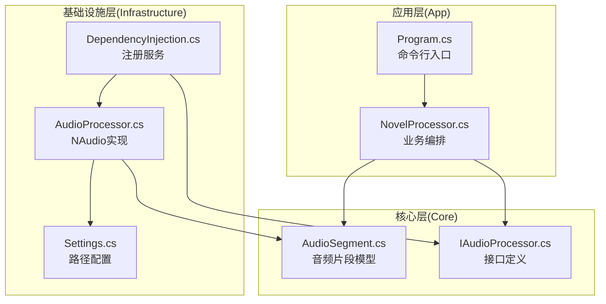
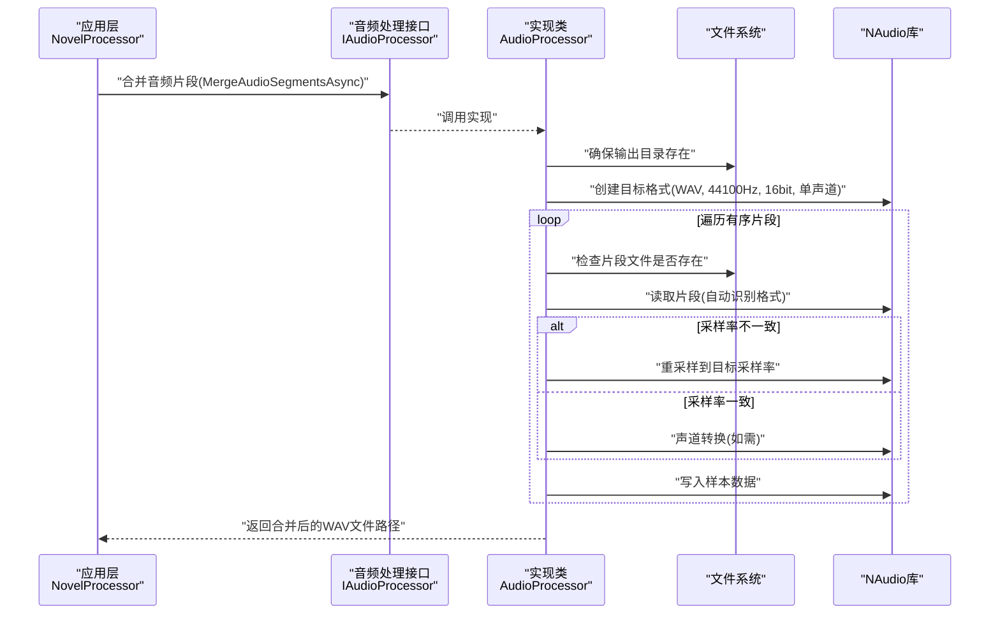
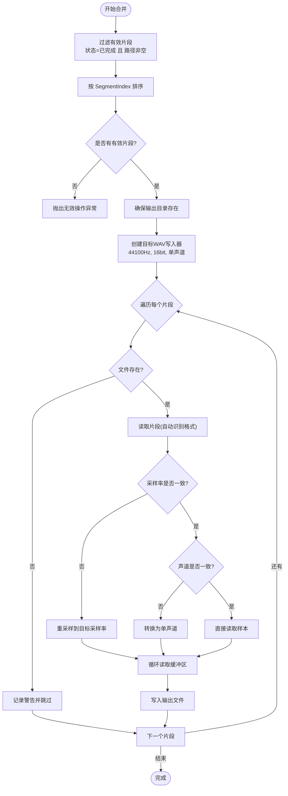
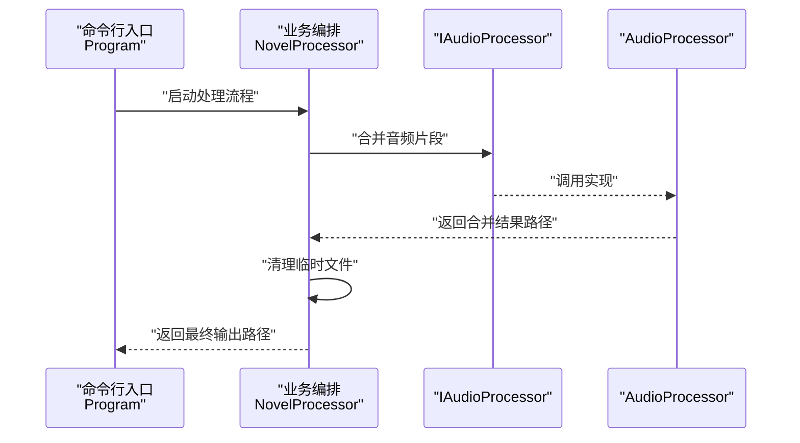
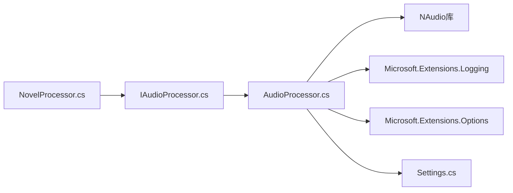

# 音频处理器

<cite>
**本文引用的文件**
- [IAudioProcessor.cs](file://src/Core/Interfaces/IAudioProcessor.cs)
- [AudioProcessor.cs](file://src/Infrastructure/Services/AudioProcessor.cs)
- [AudioSegment.cs](file://src/Core/Entities/AudioSegment.cs)
- [DependencyInjection.cs](file://src/Infrastructure/DependencyInjection.cs)
- [NovelProcessor.cs](file://src/App/Services/NovelProcessor.cs)
- [Settings.cs](file://src/Infrastructure/Configuration/Settings.cs)
- [Program.cs](file://src/App/Program.cs)
</cite>

## 目录
1. [简介](#简介)
2. [项目结构](#项目结构)
3. [核心组件](#核心组件)
4. [架构总览](#架构总览)
5. [详细组件分析](#详细组件分析)
6. [依赖关系分析](#依赖关系分析)
7. [性能与内存管理](#性能与内存管理)
8. [故障排查指南](#故障排查指南)
9. [结论](#结论)
10. [附录](#附录)

## 简介
本文件系统化阐述 IAudioProcessor 接口与 AudioProcessor 类在本项目中的职责与实现方式，重点覆盖以下方面：
- 如何接收多个 TTS 生成的音频片段（AudioSegment），使用 NAudio 库将它们合并为连续的完整音频文件；
- 支持格式转换（例如从 WAV 转 MP3）的现状与限制；
- 处理音频元数据（如章节标记）与音量标准化、静音间隔插入的能力现状与建议；
- 提供音频合并流程的时序图；
- 讨论大文件处理时的内存管理策略与潜在性能瓶颈。

## 项目结构
本项目采用分层架构，音频处理能力位于基础设施层（Infrastructure），通过接口 IAudioProcessor 暴露能力，由 AudioProcessor 具体实现；应用层（App）的业务编排类 NovelProcessor 调用该接口完成小说到音频的全流程。

图表来源
- [IAudioProcessor.cs](file://src/Core/Interfaces/IAudioProcessor.cs#L1-L38)
- [AudioProcessor.cs](file://src/Infrastructure/Services/AudioProcessor.cs#L1-L230)
- [AudioSegment.cs](file://src/Core/Entities/AudioSegment.cs#L1-L74)
- [DependencyInjection.cs](file://src/Infrastructure/DependencyInjection.cs#L1-L33)
- [NovelProcessor.cs](file://src/App/Services/NovelProcessor.cs#L1-L189)
- [Settings.cs](file://src/Infrastructure/Configuration/Settings.cs#L1-L66)
- [Program.cs](file://src/App/Program.cs#L72-L115)

章节来源
- [IAudioProcessor.cs](file://src/Core/Interfaces/IAudioProcessor.cs#L1-L38)
- [AudioProcessor.cs](file://src/Infrastructure/Services/AudioProcessor.cs#L1-L230)
- [AudioSegment.cs](file://src/Core/Entities/AudioSegment.cs#L1-L74)
- [DependencyInjection.cs](file://src/Infrastructure/DependencyInjection.cs#L1-L33)
- [NovelProcessor.cs](file://src/App/Services/NovelProcessor.cs#L1-L189)
- [Settings.cs](file://src/Infrastructure/Configuration/Settings.cs#L1-L66)
- [Program.cs](file://src/App/Program.cs#L72-L115)

## 核心组件
- IAudioProcessor 接口：定义合并音频片段、格式转换、获取时长、截取音频等能力，统一了音频处理的契约。
- AudioProcessor 实现：基于 NAudio 的具体实现，负责将多个 AudioSegment 按顺序合并为单个输出文件，必要时进行重采样与声道转换；提供格式转换与截取能力。
- AudioSegment 实体：承载每个 TTS 片段的元数据（索引、路径、时长、格式、状态等），作为合并输入的基本单元。
- 依赖注入：在基础设施层注册 IAudioProcessor 到 AudioProcessor 的映射，便于应用层解耦调用。

章节来源
- [IAudioProcessor.cs](file://src/Core/Interfaces/IAudioProcessor.cs#L1-L38)
- [AudioProcessor.cs](file://src/Infrastructure/Services/AudioProcessor.cs#L1-L230)
- [AudioSegment.cs](file://src/Core/Entities/AudioSegment.cs#L1-L74)
- [DependencyInjection.cs](file://src/Infrastructure/DependencyInjection.cs#L1-L33)

## 架构总览
音频处理在本项目中遵循“接口抽象 + 具体实现 + 应用编排”的模式：
- 应用层（NovelProcessor）负责读取文本、切分段落、调用 TTS 生成音频片段，并最终调用 IAudioProcessor 合并输出；
- 基础设施层（AudioProcessor）通过 NAudio 完成实际的音频读写、重采样、格式转换与截取；
- 配置层（PathSettings）提供输入/输出/临时目录等路径参数，影响文件落地位置。

图表来源
- [NovelProcessor.cs](file://src/App/Services/NovelProcessor.cs#L64-L87)
- [IAudioProcessor.cs](file://src/Core/Interfaces/IAudioProcessor.cs#L10-L14)
- [AudioProcessor.cs](file://src/Infrastructure/Services/AudioProcessor.cs#L12-L108)

## 详细组件分析

### IAudioProcessor 接口
- 合并音频片段：接收一组 AudioSegment，按 SegmentIndex 排序后合并为单一输出文件。
- 格式转换：将输入音频转换为目标格式（WAV/MP3/Ogg），当前实现仅支持 WAV 写出与 MP3 复制（无编码器）。
- 获取时长：返回音频总时长（秒）。
- 截取音频：根据起始时间和时长截取指定片段并写出。

章节来源
- [IAudioProcessor.cs](file://src/Core/Interfaces/IAudioProcessor.cs#L1-L38)

### AudioProcessor 实现
- 合并逻辑要点
  - 过滤条件：仅处理状态为已完成且音频路径非空的片段。
  - 排序依据：按 SegmentIndex 升序排列。
  - 输出格式：当前默认输出为 WAV（.wav 扩展名），以便后续可再转换。
  - 重采样与声道转换：若源采样率与目标不一致，则使用高质量重采样；若声道数不一致则转换为单声道。
  - 写入策略：逐块读取重采样或转换后的样本，写入目标 Wave 文件。
- 格式转换
  - WAV：直接写出。
  - MP3：当前实现要求具备 NAudio.Lame 编码库，否则抛出不支持异常；若输入已是 MP3 则复制。
  - 其他格式：抛出不支持异常。
- 截取音频
  - 基于字节速率计算起止位置，使用自定义 IWaveProvider 包装器限制读取长度，避免一次性加载全量数据。
- 取时长
  - 通过 AudioFileReader 读取总时长。

图表来源
- [AudioProcessor.cs](file://src/Infrastructure/Services/AudioProcessor.cs#L12-L108)

章节来源
- [AudioProcessor.cs](file://src/Infrastructure/Services/AudioProcessor.cs#L12-L198)

### AudioSegment 数据模型
- 关键字段：Id、SegmentIndex、SourceText、AudioFilePath、DurationSeconds、Format、Status、ErrorMessage、CreatedAt。
- 用途：作为 TTS 生成的音频片段载体，参与合并排序与状态判断。

章节来源
- [AudioSegment.cs](file://src/Core/Entities/AudioSegment.cs#L1-L74)

### 应用层编排与集成
- NovelProcessor 在完成 TTS 生成后，调用 IAudioProcessor.MergeAudioSegmentsAsync 合并所有成功片段，并清理临时文件。
- 依赖注入：通过 DependencyInjection 将 IAudioProcessor 注册为 AudioProcessor，便于替换实现或测试。

图表来源
- [Program.cs](file://src/App/Program.cs#L72-L115)
- [NovelProcessor.cs](file://src/App/Services/NovelProcessor.cs#L64-L87)
- [IAudioProcessor.cs](file://src/Core/Interfaces/IAudioProcessor.cs#L10-L14)
- [AudioProcessor.cs](file://src/Infrastructure/Services/AudioProcessor.cs#L12-L108)

章节来源
- [DependencyInjection.cs](file://src/Infrastructure/DependencyInjection.cs#L1-L33)
- [NovelProcessor.cs](file://src/App/Services/NovelProcessor.cs#L64-L87)
- [Program.cs](file://src/App/Program.cs#L72-L115)

## 依赖关系分析
- 组件耦合
  - 应用层仅依赖接口 IAudioProcessor，降低对具体实现的耦合。
  - 基础设施层实现依赖 NAudio 库，承担音频读写与变换的具体工作。
- 外部依赖
  - NAudio：提供音频读取、写入、重采样、格式转换等能力。
  - Microsoft.Extensions.Logging：日志记录。
  - Microsoft.Extensions.Options：读取 PathSettings 配置。
- 潜在循环依赖
  - 当前未发现循环依赖；接口与实现分离清晰。

图表来源
- [NovelProcessor.cs](file://src/App/Services/NovelProcessor.cs#L1-L189)
- [IAudioProcessor.cs](file://src/Core/Interfaces/IAudioProcessor.cs#L1-L38)
- [AudioProcessor.cs](file://src/Infrastructure/Services/AudioProcessor.cs#L1-L230)
- [Settings.cs](file://src/Infrastructure/Configuration/Settings.cs#L1-L66)

章节来源
- [DependencyInjection.cs](file://src/Infrastructure/DependencyInjection.cs#L1-L33)
- [AudioProcessor.cs](file://src/Infrastructure/Services/AudioProcessor.cs#L1-L230)

## 性能与内存管理
- 合并流程的内存占用
  - 采用流式读取与写入：每次从源片段读取固定大小的缓冲区，减少峰值内存占用。
  - 重采样与声道转换均在内存中进行，但通过分块读取控制单次分配规模。
- 大文件处理策略
  - 分块处理：缓冲区大小适中，避免一次性加载整个音频。
  - 及时释放资源：使用 using 语句确保 Reader/Writers 在每个片段处理完毕后及时释放。
  - 取时长与截取：通过 AudioFileReader 的属性与自定义 IWaveProvider 限制读取范围，避免全量加载。
- 潜在性能瓶颈
  - 重采样质量与速度权衡：当前设置为较高质量，可能增加 CPU 时间。
  - I/O 吞吐：磁盘写入速度可能成为瓶颈，建议使用高性能存储与合适的输出目录。
  - 并发与取消：合并过程已支持 CancellationToken，可在批量处理时合理中断。
- 建议优化方向
  - 引入异步写入与背压机制，进一步降低内存峰值。
  - 对于 MP3 输出，引入 NAudio.Lame 编码器，避免仅复制的限制。
  - 在合并前对片段进行预处理（如静音检测与裁剪），减少无效数据写入。

[本节为通用性能讨论，不直接分析具体代码文件]

## 故障排查指南
- 合并失败
  - 现象：抛出“没有可用片段”异常。
  - 排查：确认所有片段的状态均为已完成且路径非空；检查 SegmentIndex 是否正确。
- 文件不存在
  - 现象：警告日志提示某片段文件缺失。
  - 排查：确认 TTS 生成阶段未失败；检查输出路径与权限。
- 格式转换异常
  - 现象：请求 MP3 转换时报“需要 NAudio.Lame”异常。
  - 排查：安装 NAudio.Lame 或改为 WAV 输出；若输入已是 MP3，可直接复制。
- 截取异常
  - 现象：截取后音频异常或无声。
  - 排查：确认起始时间与时长参数合法；检查目标采样率与声道一致性。
- 日志定位
  - 合并、转换、截取、取时长均有相应日志记录，可通过日志级别定位问题。

章节来源
- [AudioProcessor.cs](file://src/Infrastructure/Services/AudioProcessor.cs#L12-L198)

## 结论
- IAudioProcessor 与 AudioProcessor 的设计实现了清晰的职责分离与良好的可扩展性。
- AudioProcessor 已满足多片段合并、格式转换（WAV/MP3复制）、截取与取时长等核心需求，且通过流式处理与资源释放保障了较好的内存与性能表现。
- 当前未内置音量标准化与静音间隔插入功能，建议在业务层或新增处理步骤中补充；同时建议引入 MP3 编码器以完善格式转换能力。

[本节为总结性内容，不直接分析具体代码文件]

## 附录

### 音频元数据与章节标记
- 现状：AudioSegment 中包含 SegmentIndex、DurationSeconds 等信息，可用于章节级统计与进度展示；未内置 ID3/RIFF 等元数据写入逻辑。
- 建议：在合并完成后，结合外部工具或扩展 AudioProcessor 的导出能力，添加章节标记、专辑封面、作者等元数据。

[本节为概念性建议，不直接分析具体代码文件]

### 音量标准化与静音间隔插入
- 现状：未实现音量标准化与静音间隔插入。
- 建议：在合并前对每个片段进行 RMS/峰值归一化；在相邻片段间插入固定时长的静音片段，提升可读性与自然度。

[本节为概念性建议，不直接分析具体代码文件]