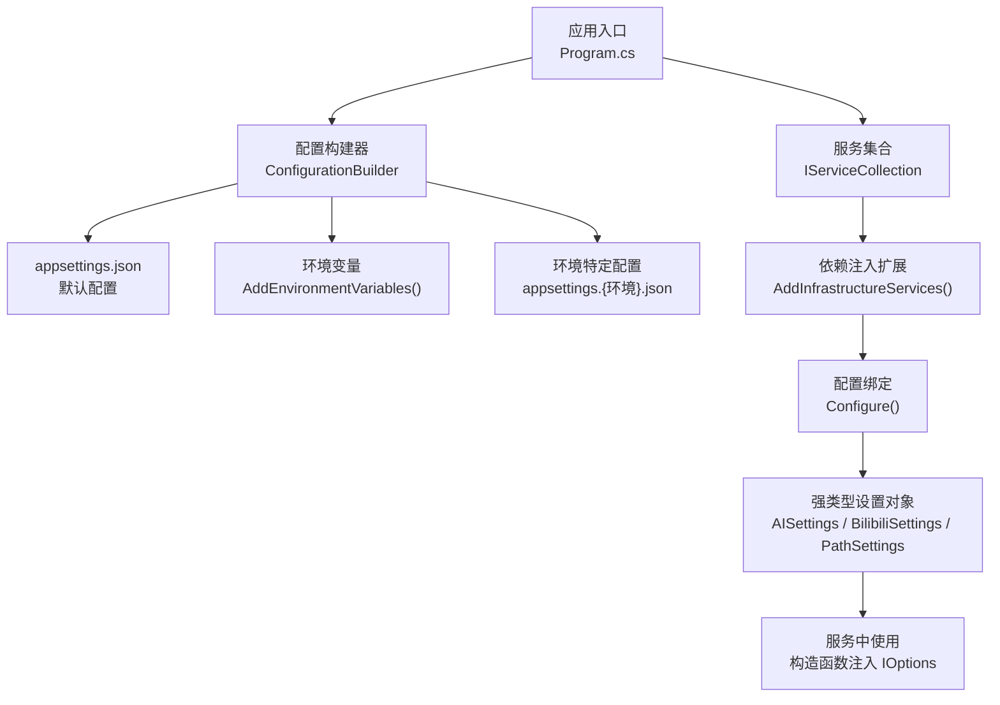
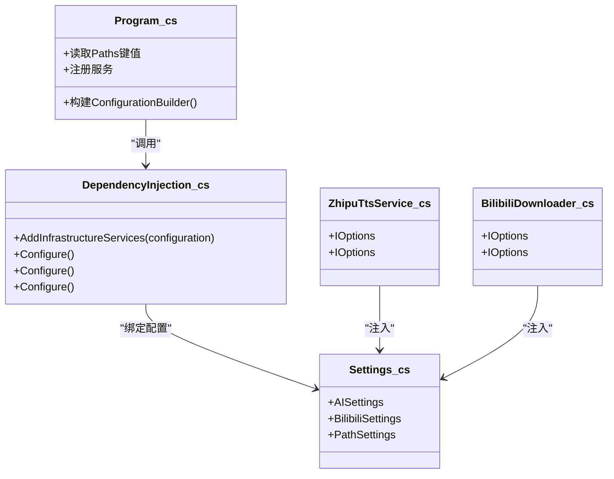

# 配置管理

<cite>
**本文引用的文件**
- [src/App/appsettings.json](file://src/App/appsettings.json)
- [src/Infrastructure/Configuration/Settings.cs](file://src/Infrastructure/Configuration/Settings.cs)
- [src/Infrastructure/DependencyInjection.cs](file://src/Infrastructure/DependencyInjection.cs)
- [src/App/Program.cs](file://src/App/Program.cs)
- [src/Infrastructure/Services/ZhipuTtsService.cs](file://src/Infrastructure/Services/ZhipuTtsService.cs)
- [src/Infrastructure/Services/BilibiliDownloader.cs](file://src/Infrastructure/Services/BilibiliDownloader.cs)
- [src/App/Services/NovelProcessor.cs](file://src/App/Services/NovelProcessor.cs)
- [src/App/NovelTTSApp.App.csproj](file://src/App/NovelTTSApp.App.csproj)
</cite>

## 目录
1. [简介](#简介)
2. [项目结构](#项目结构)
3. [核心组件](#核心组件)
4. [架构总览](#架构总览)
5. [详细组件分析](#详细组件分析)
6. [依赖关系分析](#依赖关系分析)
7. [性能考虑](#性能考虑)
8. [故障排查指南](#故障排查指南)
9. [结论](#结论)
10. [附录](#附录)

## 简介
本文件系统性说明应用程序的配置管理体系，重点围绕以下方面：
- appsettings.json 中各配置项的含义与用途（AI服务端点、API密钥、模型ID；输入、输出、参考音频与临时文件夹路径；日志级别等）
- Settings.cs 类如何将 JSON 配置映射为强类型 C# 对象
- 通过依赖注入在应用启动时注册与提供配置对象
- 如何根据不同运行环境修改配置（开发、生产、测试等）

## 项目结构
配置体系由三层协同构成：
- 配置源：位于应用层的 appsettings.json（包含默认值与环境覆盖）
- 强类型映射：Infrastructure 层的 Settings.cs 定义 AISettings、BilibiliSettings、PathSettings
- 依赖注入：Infrastructure 的 DependencyInjection 扩展方法将配置绑定到强类型对象并注册为服务



图表来源
- [src/App/Program.cs](file://src/App/Program.cs#L20-L36)
- [src/Infrastructure/DependencyInjection.cs](file://src/Infrastructure/DependencyInjection.cs#L11-L20)
- [src/Infrastructure/Configuration/Settings.cs](file://src/Infrastructure/Configuration/Settings.cs#L6-L65)
- [src/App/NovelTTSApp.App.csproj](file://src/App/NovelTTSApp.App.csproj#L24-L31)

章节来源
- [src/App/Program.cs](file://src/App/Program.cs#L20-L36)
- [src/Infrastructure/DependencyInjection.cs](file://src/Infrastructure/DependencyInjection.cs#L11-L20)
- [src/Infrastructure/Configuration/Settings.cs](file://src/Infrastructure/Configuration/Settings.cs#L6-L65)
- [src/App/NovelTTSApp.App.csproj](file://src/App/NovelTTSApp.App.csproj#L24-L31)

## 核心组件
- AISettings：封装 AI 服务端点、API 密钥、模型 ID
- BilibiliSettings：封装 Bilibili Cookie（用于下载高清音频）
- PathSettings：封装输入、输出、参考音频与临时文件夹路径
- 依赖注入扩展：将上述 Settings 类与 IConfiguration 绑定，注册为单例或作用域服务

章节来源
- [src/Infrastructure/Configuration/Settings.cs](file://src/Infrastructure/Configuration/Settings.cs#L6-L65)
- [src/Infrastructure/DependencyInjection.cs](file://src/Infrastructure/DependencyInjection.cs#L11-L20)

## 架构总览
配置从文件到代码的流转如下：
- 启动时由 Program.cs 构建 ConfigurationBuilder，加载 appsettings.json、环境特定配置与环境变量
- 通过 AddInfrastructureServices 将配置 Section 绑定到强类型 Settings 类
- 在服务构造函数中以 IOptions<T> 形式注入 Settings，供服务读取配置

```mermaid
sequenceDiagram
participant P as "Program.cs"
participant CB as "ConfigurationBuilder"
participant CFG as "IConfiguration"
participant DI as "DependencyInjection"
participant SC as "IServiceCollection"
participant S as "服务(如 ZhipuTtsService)"
participant OPT as "IOptions<T>"
participant SET as "Settings(T)"
P->>CB : "构建配置(加载 appsettings.json / 环境特定 / 环境变量)"
CB-->>P : "IConfiguration"
P->>SC : "AddSingleton(IConfiguration)"
P->>DI : "AddInfrastructureServices(configuration)"
DI->>SC : "Configure<Settings>(Section)"
DI-->>SC : "返回服务集合"
P->>SC : "BuildServiceProvider()"
SC-->>P : "IServiceProvider"
P->>S : "解析服务"
S->>OPT : "构造函数注入 IOptions<Settings>"
OPT-->>SET : "Value 属性提供强类型配置"
```

图表来源
- [src/App/Program.cs](file://src/App/Program.cs#L20-L36)
- [src/Infrastructure/DependencyInjection.cs](file://src/Infrastructure/DependencyInjection.cs#L11-L20)
- [src/Infrastructure/Services/ZhipuTtsService.cs](file://src/Infrastructure/Services/ZhipuTtsService.cs#L8-L13)

章节来源
- [src/App/Program.cs](file://src/App/Program.cs#L20-L36)
- [src/Infrastructure/DependencyInjection.cs](file://src/Infrastructure/DependencyInjection.cs#L11-L20)
- [src/Infrastructure/Services/ZhipuTtsService.cs](file://src/Infrastructure/Services/ZhipuTtsService.cs#L8-L13)

## 详细组件分析

### appsettings.json 配置项说明
- AI
  - Endpoint：AI 服务的 API 端点地址
  - ApiKey：访问 AI 服务所需的密钥
  - ModelId：使用的模型标识
- Bilibili
  - Cookie：用于访问 Bilibili 高清音频资源的 Cookie（可选）
- Paths
  - InputFolder：小说输入目录
  - OutputFolder：生成的有声书输出目录
  - ReferenceAudioFolder：参考音频（用于音色克隆）目录
  - TempFolder：临时文件目录（语音生成中间产物存放）
- Logging
  - LogLevel：日志级别控制（默认、Microsoft、System）

章节来源
- [src/App/appsettings.json](file://src/App/appsettings.json#L1-L24)

### Settings.cs 强类型映射
- AISettings
  - SectionName："AI"
  - Endpoint：AI 端点
  - ApiKey：API 密钥
  - ModelId：模型标识
- BilibiliSettings
  - SectionName："Bilibili"
  - Cookie：可空的 Cookie 字段
- PathSettings
  - SectionName："Paths"
  - InputFolder、OutputFolder、ReferenceAudioFolder、TempFolder：对应路径

章节来源
- [src/Infrastructure/Configuration/Settings.cs](file://src/Infrastructure/Configuration/Settings.cs#L6-L65)

### 依赖注入与配置绑定
- 在 AddInfrastructureServices 中：
  - 使用 configuration.GetSection(...) 获取指定 Section
  - 使用 services.Configure<T>(...) 将配置绑定到强类型 Settings
  - 注册 IConfiguration 单例以便直接读取键值
- 服务通过 IOptions<T> 在构造函数中注入 Settings，实现强类型读取

章节来源
- [src/Infrastructure/DependencyInjection.cs](file://src/Infrastructure/DependencyInjection.cs#L11-L20)

### 服务中的配置使用示例
- ZhipuTtsService
  - 通过 IOptions<AISettings> 读取 Endpoint、ApiKey、ModelId
  - 通过 IOptions<PathSettings> 读取 TempFolder 并确保其存在
- BilibiliDownloader
  - 通过 IOptions<BilibiliSettings> 读取 Cookie
  - 通过 IOptions<PathSettings> 读取 ReferenceAudioFolder
- NovelProcessor
  - 在 Program.cs 中直接从 IConfiguration["Paths:*"] 读取输入/输出路径
  - 确保输入/输出目录存在

章节来源
- [src/Infrastructure/Services/ZhipuTtsService.cs](file://src/Infrastructure/Services/ZhipuTtsService.cs#L8-L13)
- [src/Infrastructure/Services/ZhipuTtsService.cs](file://src/Infrastructure/Services/ZhipuTtsService.cs#L52-L64)
- [src/Infrastructure/Services/BilibiliDownloader.cs](file://src/Infrastructure/Services/BilibiliDownloader.cs#L1-L12)
- [src/Infrastructure/Services/BilibiliDownloader.cs](file://src/Infrastructure/Services/BilibiliDownloader.cs#L155-L164)
- [src/App/Program.cs](file://src/App/Program.cs#L63-L69)

### 配置加载顺序与环境覆盖
- 加载顺序（优先级从低到高）：
  1) appsettings.json（默认）
  2) appsettings.{Environment}.json（按 DOTNET_ENVIRONMENT 环境变量选择）
  3) 环境变量（AddEnvironmentVariables）
- 环境变量键名建议采用大写、冒号分隔（例如：AI__Endpoint），与 ConfigurationBinder 兼容
- appsettings.json 中包含 Logging 配置，Program.cs 已启用 Serilog 日志

章节来源
- [src/App/Program.cs](file://src/App/Program.cs#L20-L36)
- [src/App/NovelTTSApp.App.csproj](file://src/App/NovelTTSApp.App.csproj#L24-L31)

### 配置修改与运行环境适配指南
- 修改 AI 服务配置
  - 在 appsettings.json 中更新 AI:Endpoint、AI:ApiKey、AI:ModelId
  - 或通过环境变量覆盖（如：AI__Endpoint、AI__ApiKey、AI__ModelId）
- 修改路径配置
  - 在 appsettings.json 中更新 Paths:InputFolder、Paths:OutputFolder、Paths:ReferenceAudioFolder、Paths:TempFolder
  - 确保目标路径存在且具有读写权限
- 修改 Bilibili Cookie
  - 在 appsettings.json 中填写 Bilibili:Cookie，以便下载高清音频
- 切换运行环境
  - 设置 DOTNET_ENVIRONMENT（如 Development、Staging、Production）
  - 准备 appsettings.{Environment}.json 进行差异化覆盖
- 日志级别调整
  - 在 appsettings.json 的 Logging:LogLevel 中调整默认级别与第三方框架级别

章节来源
- [src/App/appsettings.json](file://src/App/appsettings.json#L1-L24)
- [src/App/Program.cs](file://src/App/Program.cs#L20-L36)
- [src/Infrastructure/Configuration/Settings.cs](file://src/Infrastructure/Configuration/Settings.cs#L6-L65)

## 依赖关系分析
- 组件耦合
  - 服务通过 IOptions<T> 间接依赖 Settings，降低直接依赖 IConfiguration 的耦合度
  - Program.cs 直接读取部分 Paths 键值，便于早期目录准备
- 外部依赖
  - Microsoft.Extensions.Configuration（文件与环境变量加载）
  - Microsoft.Extensions.Options（强类型配置绑定）
  - Serilog（日志记录）



图表来源
- [src/App/Program.cs](file://src/App/Program.cs#L20-L36)
- [src/Infrastructure/DependencyInjection.cs](file://src/Infrastructure/DependencyInjection.cs#L11-L20)
- [src/Infrastructure/Configuration/Settings.cs](file://src/Infrastructure/Configuration/Settings.cs#L6-L65)
- [src/Infrastructure/Services/ZhipuTtsService.cs](file://src/Infrastructure/Services/ZhipuTtsService.cs#L8-L13)
- [src/Infrastructure/Services/BilibiliDownloader.cs](file://src/Infrastructure/Services/BilibiliDownloader.cs#L1-L12)

章节来源
- [src/App/Program.cs](file://src/App/Program.cs#L20-L36)
- [src/Infrastructure/DependencyInjection.cs](file://src/Infrastructure/DependencyInjection.cs#L11-L20)
- [src/Infrastructure/Configuration/Settings.cs](file://src/Infrastructure/Configuration/Settings.cs#L6-L65)
- [src/Infrastructure/Services/ZhipuTtsService.cs](file://src/Infrastructure/Services/ZhipuTtsService.cs#L8-L13)
- [src/Infrastructure/Services/BilibiliDownloader.cs](file://src/Infrastructure/Services/BilibiliDownloader.cs#L1-L12)

## 性能考虑
- 配置读取
  - 使用 IOptions<T> 一次性读取配置，避免频繁访问 IConfiguration
  - 在服务构造函数中缓存 Settings.Value，减少多次解析
- 文件路径
  - 确保输入/输出/参考音频/临时目录存在，避免运行时反复创建目录导致 IO 开销
- 网络请求
  - AI 服务与 Bilibili 下载均涉及网络请求，建议在网络层增加合理的超时与重试策略（已在服务内部实现）

## 故障排查指南
- AI 配置错误
  - 症状：调用 AI 接口失败、返回鉴权错误
  - 排查：确认 AI:ApiKey 是否正确；检查 Endpoint 是否可达；确认 ModelId 是否有效
- 路径不存在或无权限
  - 症状：生成音频失败、无法保存临时文件
  - 排查：确认 Paths:TempFolder、Paths:OutputFolder 存在且可写；必要时在 Program.cs 中手动创建
- Bilibili Cookie 无效
  - 症状：无法下载高清音频或下载失败
  - 排查：确认 Bilibili:Cookie 是否正确；检查 Referer/User-Agent 是否符合要求
- 环境变量未生效
  - 症状：配置未按预期覆盖
  - 排查：确认环境变量命名是否为大写并使用双下划线替换冒号（如 AI__Endpoint）

章节来源
- [src/Infrastructure/Services/ZhipuTtsService.cs](file://src/Infrastructure/Services/ZhipuTtsService.cs#L172-L187)
- [src/Infrastructure/Services/BilibiliDownloader.cs](file://src/Infrastructure/Services/BilibiliDownloader.cs#L155-L164)
- [src/App/Program.cs](file://src/App/Program.cs#L63-L69)

## 结论
本项目的配置体系采用“JSON 配置 + 强类型映射 + 依赖注入”的标准模式，具备良好的可维护性与可扩展性。通过 Settings.cs 将配置结构化，配合 IOptions<T> 注入，既保证了类型安全，又便于在不同环境中灵活覆盖。建议在团队协作中统一约定环境变量命名规范，并在 CI/CD 中通过 appsettings.{Environment}.json 实现环境隔离。

## 附录

### 配置项一览表
- AI
  - Endpoint：AI 服务端点
  - ApiKey：API 密钥
  - ModelId：模型标识
- Bilibili
  - Cookie：Cookie（可选）
- Paths
  - InputFolder：输入目录
  - OutputFolder：输出目录
  - ReferenceAudioFolder：参考音频目录
  - TempFolder：临时文件目录
- Logging
  - LogLevel：日志级别

章节来源
- [src/App/appsettings.json](file://src/App/appsettings.json#L1-L24)