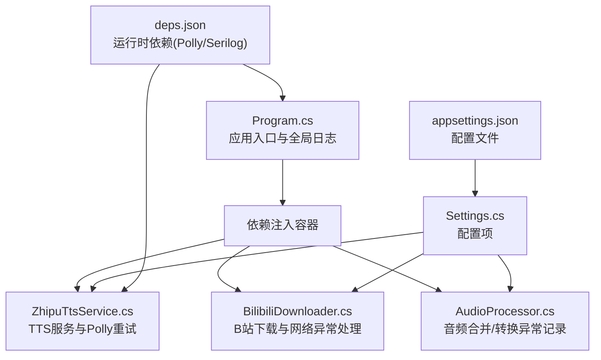
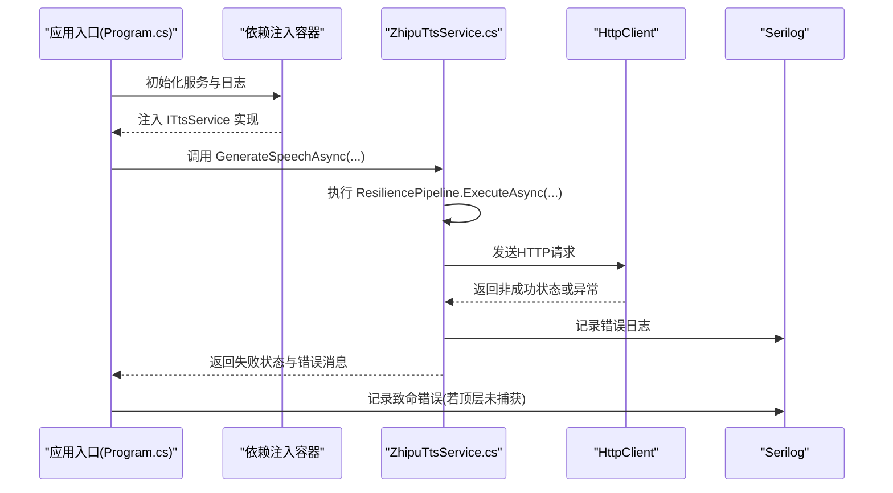
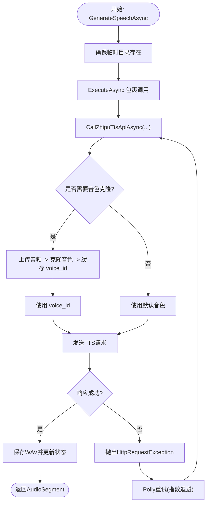
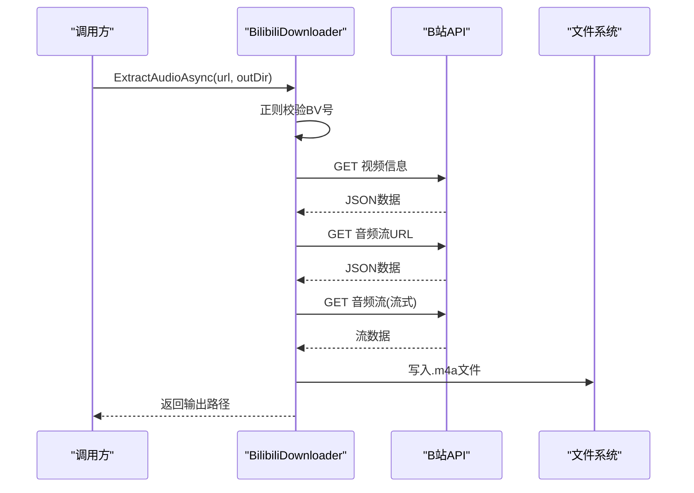
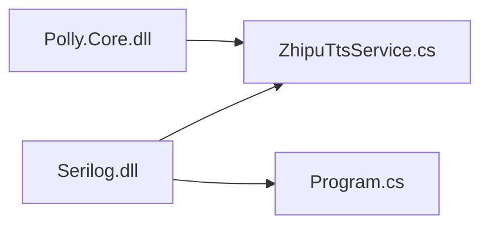

# 错误处理

<cite>
**本文引用的文件**
- [Program.cs](file://src/App/Program.cs)
- [ZhipuTtsService.cs](file://src/Infrastructure/Services/ZhipuTtsService.cs)
- [BilibiliDownloader.cs](file://src/Infrastructure/Services/BilibiliDownloader.cs)
- [Settings.cs](file://src/Infrastructure/Configuration/Settings.cs)
- [appsettings.json](file://src/App/appsettings.json)
- [ITtsService.cs](file://src/Core/Interfaces/ITtsService.cs)
- [IBilibiliDownloader.cs](file://src/Core/Interfaces/IBilibiliDownloader.cs)
- [AudioProcessor.cs](file://src/Infrastructure/Services/AudioProcessor.cs)
- [deps.json](file://src/App/bin/Release/net10.0/NovelTTSApp.App.deps.json)
</cite>

## 目录
1. [简介](#简介)
2. [项目结构](#项目结构)
3. [核心组件](#核心组件)
4. [架构总览](#架构总览)
5. [详细组件分析](#详细组件分析)
6. [依赖关系分析](#依赖关系分析)
7. [性能考量](#性能考量)
8. [故障排查指南](#故障排查指南)
9. [结论](#结论)

## 简介
本文件聚焦于系统的错误处理与重试机制，涵盖以下要点：
- 全局异常处理：在应用入口处使用 Serilog 记录致命错误，并优雅退出。
- 智能重试策略：基于 Polly 的重试管道，针对网络异常进行指数退避重试，提升对外部 API 的鲁棒性。
- 网络异常处理：在 Bilibili 下载器中对网络请求失败、URL 校验失败等进行明确处理。
- 常见错误排查：API 密钥无效、文件路径错误等常见问题及定位方法。
- 日志与恢复：通过日志记录与重试策略共同提升系统的可观测性与稳定性。

## 项目结构
围绕错误处理与重试的关键文件分布如下：
- 应用入口与全局日志：Program.cs
- TTS 服务与重试：ZhipuTtsService.cs
- Bilibili 下载器与网络异常处理：BilibiliDownloader.cs
- 配置项与默认路径：Settings.cs、appsettings.json
- 接口契约：ITtsService.cs、IBilibiliDownloader.cs
- 合成与格式转换过程中的异常记录：AudioProcessor.cs
- 外部依赖：Polly、Serilog 在运行时清单中可见

图表来源
- [Program.cs](file://src/App/Program.cs#L1-L60)
- [ZhipuTtsService.cs](file://src/Infrastructure/Services/ZhipuTtsService.cs#L1-L40)
- [BilibiliDownloader.cs](file://src/Infrastructure/Services/BilibiliDownloader.cs#L1-L40)
- [Settings.cs](file://src/Infrastructure/Configuration/Settings.cs#L1-L66)
- [appsettings.json](file://src/App/appsettings.json#L1-L24)
- [deps.json](file://src/App/bin/Release/net10.0/NovelTTSApp.App.deps.json#L363-L412)

章节来源
- [Program.cs](file://src/App/Program.cs#L1-L60)
- [ZhipuTtsService.cs](file://src/Infrastructure/Services/ZhipuTtsService.cs#L1-L40)
- [BilibiliDownloader.cs](file://src/Infrastructure/Services/BilibiliDownloader.cs#L1-L40)
- [Settings.cs](file://src/Infrastructure/Configuration/Settings.cs#L1-L66)
- [appsettings.json](file://src/App/appsettings.json#L1-L24)
- [deps.json](file://src/App/bin/Release/net10.0/NovelTTSApp.App.deps.json#L363-L412)

## 核心组件
- 全局异常捕获与致命日志
  - 应用启动阶段使用 try/catch 捕获未处理异常，记录致命错误并设置退出码，随后刷新并关闭日志。
  - 关键路径：[Program.cs](file://src/App/Program.cs#L48-L56)

- Serilog 日志配置
  - 设置最小日志级别、覆盖 Microsoft/System 默认级别、控制台输出模板包含异常信息。
  - 关键路径：[Program.cs](file://src/App/Program.cs#L1-L10)

- Polly 重试策略
  - 在 TTS 服务中定义重试管道，处理 HttpRequestException 与 TaskCanceledException，最大重试次数、初始延迟与指数退避。
  - 关键路径：[ZhipuTtsService.cs](file://src/Infrastructure/Services/ZhipuTtsService.cs#L21-L33)

- Bilibili 下载器网络异常处理
  - URL 校验失败抛出参数异常；网络请求失败通过 EnsureSuccessStatusCode 抛出异常；下载阶段同样保证状态码成功。
  - 关键路径：[BilibiliDownloader.cs](file://src/Infrastructure/Services/BilibiliDownloader.cs#L24-L31)，[BilibiliDownloader.cs](file://src/Infrastructure/Services/BilibiliDownloader.cs#L92-L103)，[BilibiliDownloader.cs](file://src/Infrastructure/Services/BilibiliDownloader.cs#L115-L138)，[BilibiliDownloader.cs](file://src/Infrastructure/Services/BilibiliDownloader.cs#L140-L153)

- 配置与路径
  - AI 端点、API Key、模型 ID；B站 Cookie；输入/输出/参考/临时目录。
  - 关键路径：[Settings.cs](file://src/Infrastructure/Configuration/Settings.cs#L1-L66)，[appsettings.json](file://src/App/appsettings.json#L1-L24)

章节来源
- [Program.cs](file://src/App/Program.cs#L1-L60)
- [ZhipuTtsService.cs](file://src/Infrastructure/Services/ZhipuTtsService.cs#L21-L33)
- [BilibiliDownloader.cs](file://src/Infrastructure/Services/BilibiliDownloader.cs#L24-L31)
- [Settings.cs](file://src/Infrastructure/Configuration/Settings.cs#L1-L66)
- [appsettings.json](file://src/App/appsettings.json#L1-L24)

## 架构总览
整体错误处理与重试流程如下：

图表来源
- [Program.cs](file://src/App/Program.cs#L48-L56)
- [ZhipuTtsService.cs](file://src/Infrastructure/Services/ZhipuTtsService.cs#L55-L78)

## 详细组件分析

### ZhipuTtsService 错误处理与重试
- 重试策略
  - 最大重试次数：3 次
  - 初始延迟：2 秒
  - 退避类型：指数退避
  - 触发条件：HttpRequestException、TaskCanceledException
  - 关键路径：[ZhipuTtsService.cs](file://src/Infrastructure/Services/ZhipuTtsService.cs#L21-L33)

- 调用链与异常传播
  - ExecuteAsync 包裹实际 API 调用，内部在非成功状态时抛出 HttpRequestException，由重试策略捕获并自动重试。
  - 关键路径：[ZhipuTtsService.cs](file://src/Infrastructure/Services/ZhipuTtsService.cs#L55-L78)，[ZhipuTtsService.cs](file://src/Infrastructure/Services/ZhipuTtsService.cs#L176-L187)

- 音色克隆与文件上传
  - 若上传失败或克隆失败，记录警告并回退到默认音色；后续调用直接使用缓存的 voice_id，避免重复克隆。
  - 关键路径：[ZhipuTtsService.cs](file://src/Infrastructure/Services/ZhipuTtsService.cs#L213-L293)，[ZhipuTtsService.cs](file://src/Infrastructure/Services/ZhipuTtsService.cs#L190-L259)

- 流式语音生成
  - 使用流式接口时，确保响应头读取完成后再进入流式解析，遇到结束标记停止。
  - 关键路径：[ZhipuTtsService.cs](file://src/Infrastructure/Services/ZhipuTtsService.cs#L84-L142)

图表来源
- [ZhipuTtsService.cs](file://src/Infrastructure/Services/ZhipuTtsService.cs#L35-L81)
- [ZhipuTtsService.cs](file://src/Infrastructure/Services/ZhipuTtsService.cs#L144-L188)
- [ZhipuTtsService.cs](file://src/Infrastructure/Services/ZhipuTtsService.cs#L190-L259)
- [ZhipuTtsService.cs](file://src/Infrastructure/Services/ZhipuTtsService.cs#L261-L293)

章节来源
- [ZhipuTtsService.cs](file://src/Infrastructure/Services/ZhipuTtsService.cs#L21-L33)
- [ZhipuTtsService.cs](file://src/Infrastructure/Services/ZhipuTtsService.cs#L35-L81)
- [ZhipuTtsService.cs](file://src/Infrastructure/Services/ZhipuTtsService.cs#L144-L188)
- [ZhipuTtsService.cs](file://src/Infrastructure/Services/ZhipuTtsService.cs#L190-L259)
- [ZhipuTtsService.cs](file://src/Infrastructure/Services/ZhipuTtsService.cs#L261-L293)

### BilibiliDownloader 网络异常处理
- URL 校验
  - 使用正则匹配 BV 号，不匹配时抛出参数异常，阻止后续网络请求。
  - 关键路径：[BilibiliDownloader.cs](file://src/Infrastructure/Services/BilibiliDownloader.cs#L24-L31)

- 视频信息与音频流获取
  - 分别调用 B站 API 获取视频信息与音频流 URL，均使用 EnsureSuccessStatusCode，失败即抛出异常。
  - 关键路径：[BilibiliDownloader.cs](file://src/Infrastructure/Services/BilibiliDownloader.cs#L92-L103)，[BilibiliDownloader.cs](file://src/Infrastructure/Services/BilibiliDownloader.cs#L115-L138)

- 音频下载
  - 设置必要的请求头（Referer/User-Agent），下载完成后写入文件。
  - 关键路径：[BilibiliDownloader.cs](file://src/Infrastructure/Services/BilibiliDownloader.cs#L140-L153)

图表来源
- [BilibiliDownloader.cs](file://src/Infrastructure/Services/BilibiliDownloader.cs#L17-L47)
- [BilibiliDownloader.cs](file://src/Infrastructure/Services/BilibiliDownloader.cs#L92-L138)
- [BilibiliDownloader.cs](file://src/Infrastructure/Services/BilibiliDownloader.cs#L140-L153)

章节来源
- [BilibiliDownloader.cs](file://src/Infrastructure/Services/BilibiliDownloader.cs#L24-L31)
- [BilibiliDownloader.cs](file://src/Infrastructure/Services/BilibiliDownloader.cs#L92-L103)
- [BilibiliDownloader.cs](file://src/Infrastructure/Services/BilibiliDownloader.cs#L115-L138)
- [BilibiliDownloader.cs](file://src/Infrastructure/Services/BilibiliDownloader.cs#L140-L153)

### 全局异常处理与日志记录
- 应用入口捕获顶层异常，记录致命错误并设置退出码，最后刷新并关闭日志。
- 关键路径：[Program.cs](file://src/App/Program.cs#L48-L56)

- Serilog 配置
  - 最小日志级别、覆盖 Microsoft/System、控制台输出模板包含异常。
  - 关键路径：[Program.cs](file://src/App/Program.cs#L1-L10)

- 运行时依赖
  - Polly 与 Serilog 在运行时清单中可见，确保重试与日志可用。
  - 关键路径：[deps.json](file://src/App/bin/Release/net10.0/NovelTTSApp.App.deps.json#L363-L412)

章节来源
- [Program.cs](file://src/App/Program.cs#L1-L10)
- [Program.cs](file://src/App/Program.cs#L48-L56)
- [deps.json](file://src/App/bin/Release/net10.0/NovelTTSApp.App.deps.json#L363-L412)

### 音频处理过程中的异常记录
- 合并音频时对缺失文件进行告警并跳过，避免中断整个流程。
- 关键路径：[AudioProcessor.cs](file://src/Infrastructure/Services/AudioProcessor.cs#L48-L56)

- 转换格式时对不支持格式抛出异常，便于快速定位问题。
- 关键路径：[AudioProcessor.cs](file://src/Infrastructure/Services/AudioProcessor.cs#L129-L143)

章节来源
- [AudioProcessor.cs](file://src/Infrastructure/Services/AudioProcessor.cs#L48-L56)
- [AudioProcessor.cs](file://src/Infrastructure/Services/AudioProcessor.cs#L129-L143)

## 依赖关系分析
- 外部库
  - Polly：提供重试、熔断、超时等弹性能力。
  - Serilog：结构化日志，配合控制台输出与异常模板。
- 运行时依赖清单显示两者版本，确保与项目兼容。
- 关键路径：[deps.json](file://src/App/bin/Release/net10.0/NovelTTSApp.App.deps.json#L363-L412)

图表来源
- [deps.json](file://src/App/bin/Release/net10.0/NovelTTSApp.App.deps.json#L363-L412)
- [Program.cs](file://src/App/Program.cs#L1-L10)
- [ZhipuTtsService.cs](file://src/Infrastructure/Services/ZhipuTtsService.cs#L21-L33)

章节来源
- [deps.json](file://src/App/bin/Release/net10.0/NovelTTSApp.App.deps.json#L363-L412)

## 性能考量
- 重试策略采用指数退避，有助于缓解瞬时网络抖动与服务端限流压力，但会增加总耗时。可根据外部服务 SLA 调整最大重试次数与初始延迟。
- 流式下载与流式解析减少内存占用，适合大文件场景。
- 合并音频时对缺失文件进行跳过与日志记录，避免单点失败导致整体阻塞。

## 故障排查指南
- API 密钥无效
  - 现象：TTS 请求返回非成功状态，日志中出现错误码与内容。
  - 排查步骤：
    - 检查配置文件中的 API Key 是否正确填写。
    - 确认端点地址与模型 ID 与服务端一致。
  - 关联路径：
    - [appsettings.json](file://src/App/appsettings.json#L1-L24)
    - [Settings.cs](file://src/Infrastructure/Configuration/Settings.cs#L1-L24)
    - [ZhipuTtsService.cs](file://src/Infrastructure/Services/ZhipuTtsService.cs#L176-L187)

- 文件路径错误
  - 现象：音频合并阶段提示文件不存在或转换格式不支持。
  - 排查步骤：
    - 检查输入/输出/参考/临时目录是否存在且可写。
    - 确认目标格式是否受支持（当前实现对 MP3 需要额外库）。
  - 关联路径：
    - [Settings.cs](file://src/Infrastructure/Configuration/Settings.cs#L42-L66)
    - [appsettings.json](file://src/App/appsettings.json#L10-L15)
    - [AudioProcessor.cs](file://src/Infrastructure/Services/AudioProcessor.cs#L48-L56)
    - [AudioProcessor.cs](file://src/Infrastructure/Services/AudioProcessor.cs#L129-L143)

- B站 URL 无效
  - 现象：抛出参数异常，无法提取 BV 号。
  - 排查步骤：
    - 确认传入链接是否为合法的 B站视频页 URL。
  - 关联路径：
    - [BilibiliDownloader.cs](file://src/Infrastructure/Services/BilibiliDownloader.cs#L24-L31)

- 网络请求失败
  - 现象：视频信息/音频流获取或下载阶段抛出异常。
  - 排查步骤：
    - 检查网络连通性与代理设置。
    - 确认 Referer/User-Agent 是否按要求设置。
    - 如需高清音频，检查 B站 Cookie 配置。
  - 关联路径：
    - [BilibiliDownloader.cs](file://src/Infrastructure/Services/BilibiliDownloader.cs#L92-L103)
    - [BilibiliDownloader.cs](file://src/Infrastructure/Services/BilibiliDownloader.cs#L115-L138)
    - [BilibiliDownloader.cs](file://src/Infrastructure/Services/BilibiliDownloader.cs#L140-L153)
    - [Settings.cs](file://src/Infrastructure/Configuration/Settings.cs#L26-L37)

- 重试未生效
  - 现象：外部服务返回 429 或瞬时网络异常后未触发重试。
  - 排查步骤：
    - 确认重试策略已启用（Polly 已安装）。
    - 检查异常类型是否被 ShouldHandle 匹配。
  - 关联路径：
    - [ZhipuTtsService.cs](file://src/Infrastructure/Services/ZhipuTtsService.cs#L21-L33)
    - [deps.json](file://src/App/bin/Release/net10.0/NovelTTSApp.App.deps.json#L363-L412)

## 结论
- 通过全局异常捕获与 Serilog 日志，系统在致命错误时能够及时记录并退出，保障可观测性。
- Polly 重试策略有效提升了对外部 API 的鲁棒性，结合指数退避降低抖动影响。
- Bilibili 下载器对 URL 校验与网络请求状态进行了显式处理，避免无效请求与静默失败。
- 配置项集中管理，便于在不同环境快速定位与修正问题。
- 建议在生产环境中进一步完善：
  - 对 429/限流场景补充超时与熔断策略；
  - 增加对更多网络异常类型的识别与重试；
  - 对关键路径增加更细粒度的日志上下文与追踪标识。