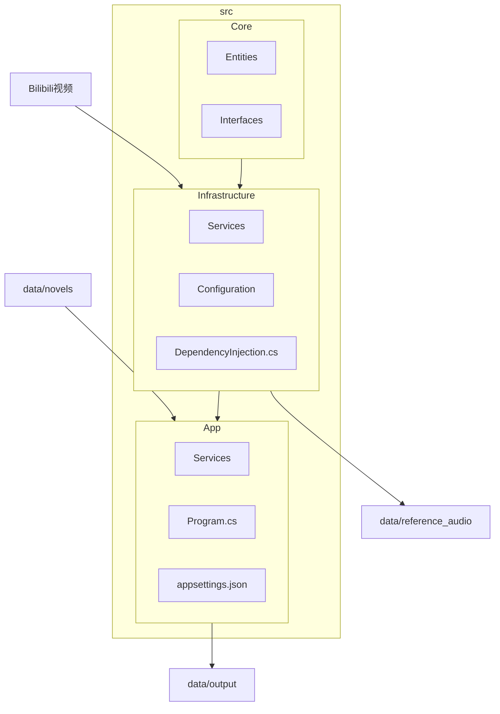
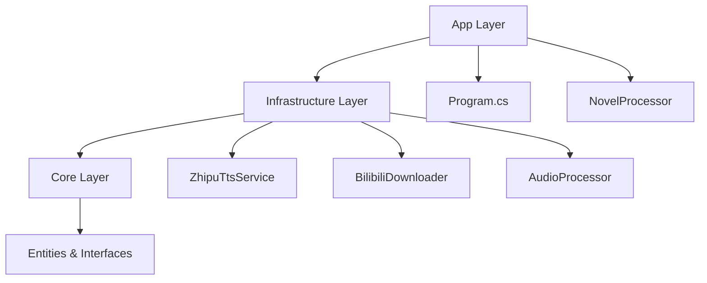
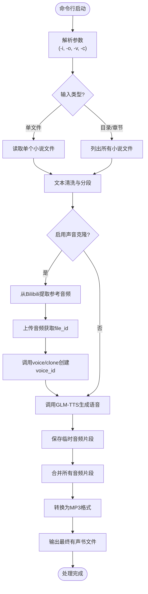

# 项目概述

<cite>
**本文档引用的文件**  
- [README.md](file://README.md)
- [Program.cs](file://src/App/Program.cs)
- [NovelProcessor.cs](file://src/App/Services/NovelProcessor.cs)
- [INovelProcessor.cs](file://src/Core/Interfaces/INovelProcessor.cs)
- [ZhipuTtsService.cs](file://src/Infrastructure/Services/ZhipuTtsService.cs)
- [BilibiliDownloader.cs](file://src/Infrastructure/Services/BilibiliDownloader.cs)
- [Novel.cs](file://src/Core/Entities/Novel.cs)
- [AudioSegment.cs](file://src/Core/Entities/AudioSegment.cs)
- [Settings.cs](file://src/Infrastructure/Configuration/Settings.cs)
- [DependencyInjection.cs](file://src/Infrastructure/DependencyInjection.cs)
</cite>

## 目录
1. [简介](#简介)
2. [项目结构](#项目结构)
3. [核心功能](#核心功能)
4. [架构设计](#架构设计)
5. [数据流与处理流程](#数据流与处理流程)
6. [技术选型说明](#技术选型说明)
7. [典型使用场景](#典型使用场景)

## 简介

NovelTTSApp 是一款基于命令行的AI驱动工具，旨在将小说文本自动转换为高质量的有声书。项目通过集成智谱AI的GLM-TTS语音合成技术与Bilibili平台的声音克隆功能，实现了自然流畅的语音输出和个性化音色复刻。系统采用清洁架构（Clean Architecture）设计，确保了高内聚、低耦合的模块化结构，便于维护与扩展。无论是单个文本文件处理还是批量小说转换，该工具均能提供稳定高效的自动化解决方案。

**Section sources**
- [README.md](file://README.md#L1-L227)

## 项目结构

项目采用分层架构，主要分为三个核心目录：`Core`、`Infrastructure` 和 `App`。`Core` 层包含领域实体与接口定义，是业务逻辑的核心抽象；`Infrastructure` 层实现具体服务，如文件读取、音频处理和API调用；`App` 层作为应用入口，负责流程编排与依赖注入。此外，`data` 目录用于存放小说源文件、参考音频及输出结果，而 `docs` 和根目录下的 `README.md` 提供了开发记录与使用说明。

**Diagram sources**
- [README.md](file://README.md#L31-L68)
- [Settings.cs](file://src/Infrastructure/Configuration/Settings.cs#L39-L65)

## 核心功能

NovelTTSApp 提供了一系列面向小说转语音的核心功能。支持从本地 `.txt` 或 `.md` 文件读取文本内容，也可通过URL抓取网页小说。系统具备智能文本分段能力，能够将长篇内容自动分割为适合TTS处理的片段。语音合成基于智谱AI的GLM-TTS模型，支持标准语音生成与个性化声音克隆。音频处理模块使用NAudio库完成片段合并与格式转换。系统还集成了Polly重试机制以增强API调用稳定性，并通过Serilog提供详细的进度追踪与日志记录。

**Section sources**
- [README.md](file://README.md#L19-L28)

## 架构设计

本项目采用清洁架构（Clean Architecture）设计理念，明确划分了三层职责：`Core`、`Infrastructure` 和 `App`。`Core` 层位于最内层，仅包含领域实体（如 `Novel`、`AudioSegment`）和接口定义（如 `INovelReader`、`ITtsService`），不依赖任何外部框架或服务。`Infrastructure` 层实现 `Core` 中定义的接口，具体包括小说读取、文本分段、TTS服务调用、Bilibili音频下载和音频处理等。`App` 层作为最外层，通过依赖注入协调各服务，执行主业务流程。这种设计确保了核心逻辑的独立性与可测试性，同时便于未来替换底层实现。

**Diagram sources**
- [README.md](file://README.md#L31-L68)
- [DependencyInjection.cs](file://src/Infrastructure/DependencyInjection.cs#L11-L32)
- [Program.cs](file://src/App/Program.cs#L29-L43)

## 数据流与处理流程

系统的整体数据流始于命令行参数解析，随后根据输入路径读取小说文本。文本经过清洗与智能分段后，被送入TTS服务进行语音合成。若启用了声音克隆功能，系统会先从指定的Bilibili视频中提取音频，上传至智谱AI平台生成 `voice_id`，再用于后续语音生成。每个文本片段生成的音频以WAV格式暂存于临时目录，最终由音频处理器合并为完整的有声书文件（MP3格式），并输出至指定目录。整个过程通过 `IProgress<ProcessingProgress>` 实时反馈进度，确保用户可监控处理状态。

**Diagram sources**
- [Program.cs](file://src/App/Program.cs#L58-L208)
- [NovelProcessor.cs](file://src/App/Services/NovelProcessor.cs#L14-L149)
- [ZhipuTtsService.cs](file://src/Infrastructure/Services/ZhipuTtsService.cs#L35-L259)
- [BilibiliDownloader.cs](file://src/Infrastructure/Services/BilibiliDownloader.cs#L17-L90)

## 技术选型说明

项目基于 .NET 10.0 构建，充分利用了其高性能运行时与现代化语言特性。使用 `Microsoft.Extensions.AI` 统一抽象层，为未来集成其他AI模型提供了灵活性。HTTP通信通过 `HttpClient` 实现，并结合Polly库提供弹性重试策略，有效应对网络波动与API限流。音频处理依赖 `NAudio` 库，支持多种格式的读取、剪辑与合并。文本解析使用 `HtmlAgilityPack`，确保能准确抓取网页小说内容。配置管理采用 `Microsoft.Extensions.Configuration`，支持JSON文件与环境变量。日志系统基于 `Serilog`，提供结构化输出与丰富的上下文信息。这些技术的组合确保了系统的稳定性、可维护性与扩展性。

**Section sources**
- [README.md](file://README.md#L183-L191)
- [Program.cs](file://src/App/Program.cs#L1-L56)

## 典型使用场景

NovelTTSApp 适用于多种实际场景。个人用户可将喜爱的小说批量转换为有声书，便于通勤或休息时收听。内容创作者能利用Bilibili声音克隆功能，生成与特定主播音色一致的解说音频，提升内容个性化程度。教育领域可用于将教材文本转化为语音，辅助视障学生学习。开发者可基于此架构扩展支持更多TTS引擎或音频平台。典型使用方式包括：处理默认目录下的所有小说、指定章节进行局部转换、通过 `-i` 和 `-o` 参数处理单个文件，以及结合 `-v` 参数启用声音克隆功能。

**Section sources**
- [README.md](file://README.md#L118-L147)
- [Program.cs](file://src/App/Program.cs#L77-L107)